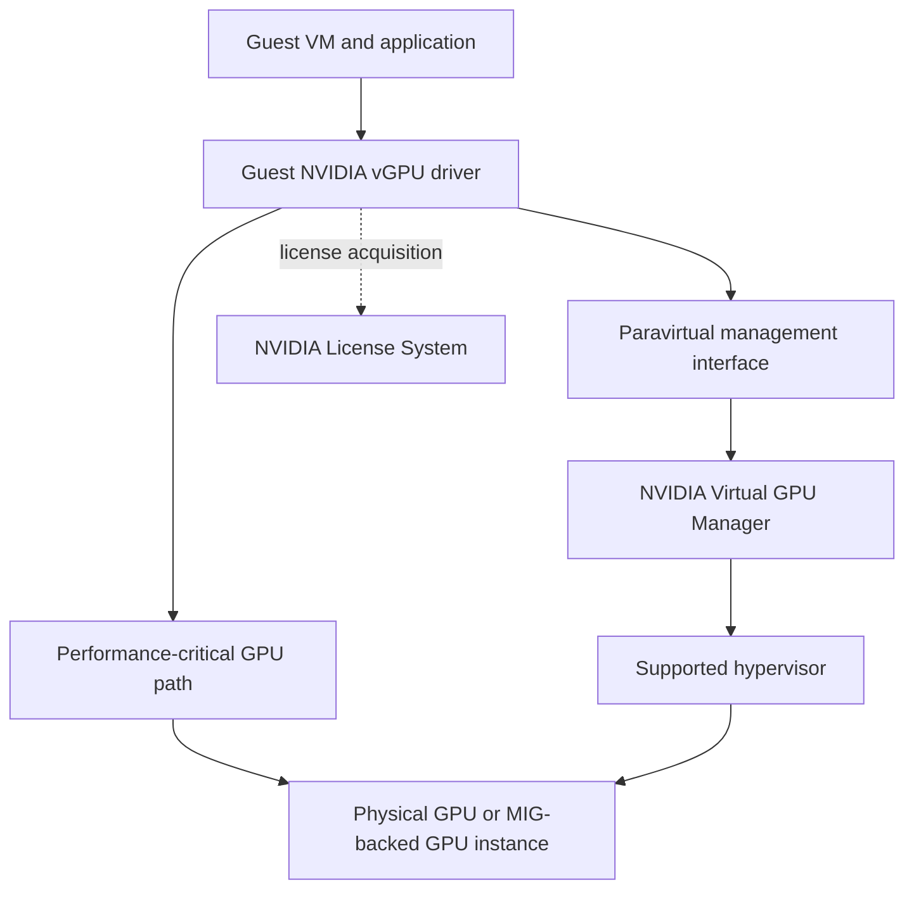
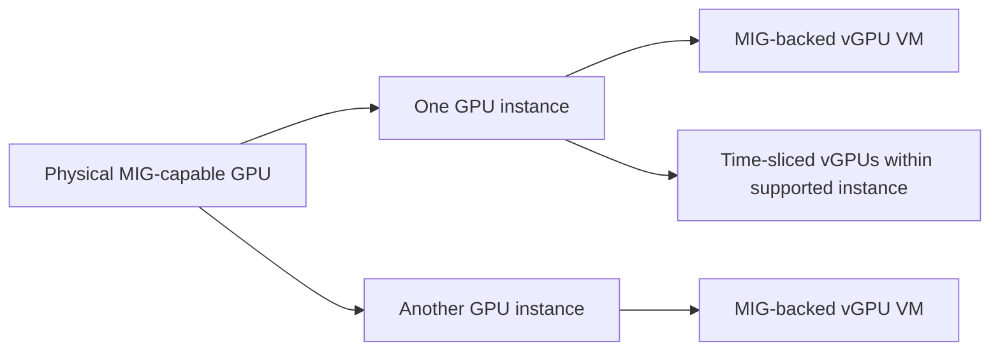
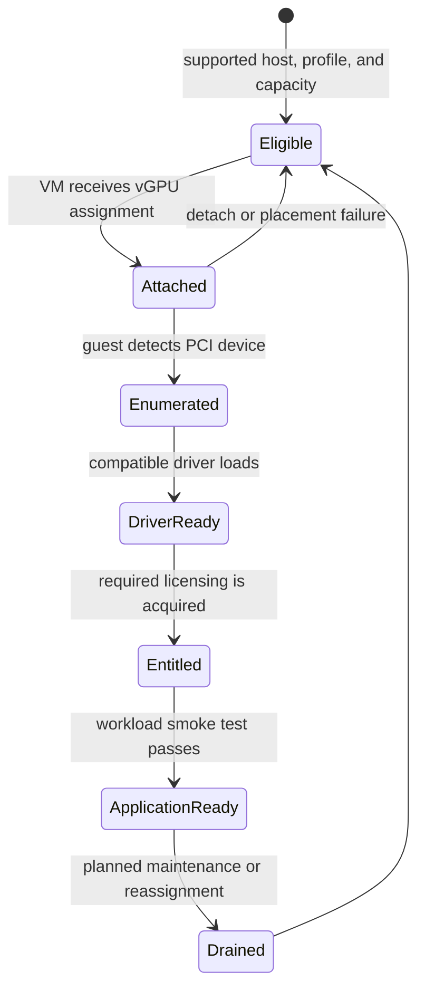

# vGPU Architecture and Enterprise Virtualization

A platform team inherits a virtual-desktop estate and is asked to add GPU-backed engineering desktops and Linux compute VMs. The easy answer is to attach a GPU to every VM. The durable answer is to decide where the virtual-machine boundary belongs, which resource guarantee a profile represents, and who owns compatibility when the hypervisor, host driver, guest driver, and license service change independently.

vGPU is a virtualization platform, not merely another Kubernetes resource name. It is the right abstraction when the VM is the tenant, lifecycle, security, and operational unit. It adds a stack of dependencies that a bare-metal or container-only GPU pool does not have.

| Chapter profile | Value |
|---|---|
| Difficulty | Advanced |
| Reading time | 35–45 minutes |
| Prerequisites | [MIG Architecture](./chapter-02-mig-architecture-and-isolation), virtualization operations, and basic GPU telemetry |
| Production outcome | A versioned, supportable VM GPU service with a tested rollback boundary |

## Learning objectives

After this chapter, you will be able to:

- describe the host-to-guest vGPU data and control paths;
- distinguish time-sliced vGPU from MIG-backed vGPU;
- build a supportable compatibility and licensing operating model; and
- diagnose failures without treating every missing guest GPU as a guest-driver problem.

## The architecture has two paths



**Figure 11.5.1 — A vGPU deployment is a coordinated host, guest, and entitlement system.** NVIDIA documents that the guest driver uses direct GPU access for performance-critical paths and a paravirtualized interface to the Virtual GPU Manager for management operations. [NVIDIA vGPU Software User Guide](https://docs.nvidia.com/vgpu/latest/grid-vgpu-user-guide/index.html)

The hypervisor exposes a virtual GPU device to the guest. The guest sees a GPU through its NVIDIA driver, while the Virtual GPU Manager on the host controls the physical GPU and its virtual-device assignments. This separation explains a common operational fact: a guest can be correctly configured and still have no usable vGPU because the host, profile inventory, or licensing service is unhealthy.

**Diagnostic commands — host-side view (before entering guest):**

```bash
# Verify vGPU host software is healthy
/opt/grid/nvidia-smi  # vGPU manager's system-management interface
# Output:
# | vGPU Manager Version: 535.104.06
# | Device UUID: GPU-12345678-abcd-ef00
# | VM UUID                                           | vGPU ID | Device UUID         | Profile
# | 550e8400-e29b-41d4-a716-446655440000             |    0    | GPU-12345678.../0   | a100-20gb

# Verify profiles available on this GPU
/opt/grid/nvidia-smi -lsp  # List supported profiles
# Output:
# | Device 0  NVIDIA A100-20Q (UUID: GPU-12345678...)
# | [0]  a100-4q  4GB framebuffer
# | [1]  a100-10q 10GB framebuffer
# | [2]  a100-20q 20GB framebuffer (full device)

# Check license service connectivity
# Query the license server—missing connection stops VM boot
/opt/grid/nvidia-smi -llic
# Output:
# | License Status: OK
# | Expiry: 2026-12-31

# List active vGPU assignments
/opt/grid/nvidia-smi -lvi  # List virtual instances
# Output: Shows each VM's vGPU UUID, assigned profile, status
```

**Diagnostic commands — guest-side view (inside the VM):**

```bash
# Guest sees the vGPU device
nvidia-smi
# Output (guest does NOT see the host's A100 directly):
# | NVIDIA GRID A100-20Q
# | Temp: 45C  Power: 18W / 400W (within guest's assigned limit)
# | Memory: 2000MiB / 20000MiB

# Verify guest vGPU driver is installed and connected
nvidia-smi --query-gpu=driver_version,vbios_version --format=csv
# Output: 535.104.06, grid-vgpu-535.104.06

# GPU UUID in guest is different from host
nvidia-smi --query-gpu=gpu_uuid --format=csv
# Output: GPU-aaaaaaaa-bbbb-cccc... (not the host's GPU-12345678...)
# This is expected—it's the virtual device's UUID
```

If a guest shows no GPU:
1. Check host: `/opt/grid/nvidia-smi -lvi` lists the VM's vGPU assignment
2. Check guest: `lspci | grep NVIDIA` should show NVIDIA VGA device
3. Check license: host `/opt/grid/nvidia-smi -llic` must be OK
4. Check VM XML: `virsh dumpxml <vm-name> | grep vgpu`—profile must exist

This three-tier check (host license, host vGPU assignment, guest PCIe device) quickly rules out host vs. guest configuration problems.

## Profiles are service contracts, not fractions on a spreadsheet

A vGPU profile selects a supported virtual-device type for a supported GPU and software release. Profile availability, allowed density, framebuffer allocation, display capabilities, and scheduling behavior are release- and platform-specific. Do not infer them from a profile name or from an older release matrix; use the documentation and release notes for the installed vGPU release and hypervisor.

Each vGPU retains its assigned framebuffer until it is destroyed, according to the vGPU user guide. That makes framebuffer allocation materially different from Kubernetes time-slicing: a VM can have a defined memory assignment while compute execution can still be subject to the selected virtualization model and workload contention. [vGPU architecture and vGPU types](https://docs.nvidia.com/vgpu/latest/grid-vgpu-user-guide/index.html)

| Question | vGPU design response | Operational implication |
|---|---|---|
| Is the VM the required tenant boundary? | Use a supported vGPU stack when VM isolation and lifecycle are requirements. | Patch, image, and inventory the guest as a first-class asset. |
| Is predictable memory capacity required? | Select a supported profile that meets the application’s documented need. | Track allocated framebuffer and profile fragmentation. |
| Is compute predictability required? | Benchmark the specific profile, GPU, scheduler mode, and workload. | Do not promise deterministic throughput from profile size alone. |
| Does the workload need hardware partitioning too? | Evaluate supported MIG-backed vGPU where the exact platform supports it. | Validate the full hardware, vGPU release, and hypervisor combination. |

## Time-sliced and MIG-backed vGPU

NVIDIA documents time-sliced vGPUs on a single GPU instance and, on supported MIG-capable systems, MIG-backed vGPUs. A MIG-backed vGPU can occupy an entire GPU instance or be time-sliced within a GPU instance; exact availability depends on hardware, vGPU release, and hypervisor. [NVIDIA vGPU Software User Guide](https://docs.nvidia.com/vgpu/latest/grid-vgpu-user-guide/index.html)

MIG changes the hardware partitioning beneath the virtual device. It assigns dedicated compute and memory resources to GPU instances, with isolated memory-system paths. It is not an entitlement to skip the vGPU compatibility matrix; it is another supported deployment mode with more lifecycle states. [NVIDIA MIG User Guide](https://docs.nvidia.com/datacenter/tesla/mig-user-guide/latest/introduction.html)



**Figure 11.5.2 — MIG and vGPU address different layers.** MIG partitions supported GPU hardware; vGPU presents supported virtual devices to VMs. Combining them requires an explicitly supported configuration.

## Lifecycle: treat the stack as a qualified unit

The minimum change unit is larger than a guest package. Record at least the GPU model, server firmware baseline, hypervisor release, Virtual GPU Manager version, guest OS, guest vGPU driver, profile type, license configuration, and application image. Add the underlying Kubernetes or cloud layer if VM workloads are scheduled through it.

| Change | Safe operating sequence | Evidence to retain |
|---|---|---|
| New VM image | Test a guest image against a representative profile in a non-production pool. | Guest driver status, application smoke test, license state. |
| Host/vGPU release update | Read the release-specific support matrix; canary a drained host and compatible guests. | Host manager state, VM boot and migration behavior where applicable, workload benchmark. |
| Profile change | Stop or evacuate the VM according to platform procedure; verify physical capacity first. | Requested and assigned profile, application memory headroom. |
| License service change | Test resolution, trust, reachability, and acquisition from an isolated canary VM. | License client log and post-acquisition application test. |

Avoid broad upgrades that simultaneously change hypervisor, host manager, guest image, and application runtime. A single rollback boundary is more useful than a fast rollout with no diagnostic control.

## Design review checklist

Before accepting a vGPU platform into production, ask for evidence rather than architecture diagrams alone. The owner should be able to produce the release-specific compatibility reference, an inventory of profile-to-GPU capacity, a tested guest image, a license-service failure test, and a documented host drain/rollback procedure. Validate both a newly created VM and an existing VM across a planned maintenance event.

Also test the operational edges. Can monitoring distinguish a physical GPU fault from a guest-driver fault? Can the help desk identify the assigned profile without broad host access? Can a tenant receive an approved image without gaining the ability to alter a vGPU assignment? These questions uncover gaps that a successful benchmark misses.

## Production patterns

Separate interactive graphics, persistent engineering workstations, short-lived batch VMs, and latency-sensitive compute VMs into service classes. The classes may share a fleet only when their maintenance window, profile, security, and SLO requirements genuinely align. A general-purpose virtual desktop pool should not be the capacity reserve for an incident-sensitive inference VM.

For a regulated environment, make the VM template the security and audit boundary: signed image provenance, guest patch posture, role-based console access, tenant network segmentation, centralized logs, and a documented break-glass process. The vGPU device does not replace those controls. See [Chapter 08](./chapter-08-tenant-isolation-security-and-fairness) for the layered tenant model.

For Kubernetes-native workloads, prefer the native GPU resource model when a VM boundary adds no product or compliance value. See [Chapter 07](./chapter-07-kubernetes-scheduling-for-shared-gpus). vGPU is a deliberate operational choice, not a default response to every multi-tenant requirement.

## Troubleshooting scenario 1: VM boots but no usable GPU appears

**Symptom.** The VM powers on, but the guest driver reports no supported device or the application cannot initialize CUDA.

**Evidence path.** Start at the host: confirm that the physical GPU is healthy, the Virtual GPU Manager is loaded, the requested profile is available, and the VM is assigned the intended vGPU. Then inspect guest PCI enumeration, the guest driver log, and driver-version compatibility. Finally verify that the profile and guest OS are supported by the release in use.

**Likely causes.** A host/guest version mismatch, a changed VM profile, an exhausted or incompatible profile inventory, or a host-manager failure can all surface as a guest-level failure.

**Recovery.** Restore a tested host/guest pairing or move the VM to a validated host class. Do not force-install a driver solely because it is newer. Preserve host and guest logs before changing the assignment; they are essential evidence for a support case.

## Troubleshooting scenario 2: GPU exists but the application is degraded after startup

**Symptom.** The guest sees the vGPU, but a CUDA workload has reduced capability or fails after an initial grace period.

**Evidence path.** Inspect the license client configuration and logs in the guest, DNS and network reachability to the license service, certificate or time prerequisites required by the deployment, and the license edition appropriate to the assigned vGPU type. Validate by acquiring a license from one controlled canary before touching a pool.

**Likely causes.** License-service reachability, an incorrect client configuration, expired or unavailable entitlement, or a mismatch between the assigned profile and entitlement can cause reduced behavior. Licensing behavior is release-specific; use the current guide for the installed product and confirm its release notes. [NVIDIA vGPU Client Licensing Guide](https://docs.nvidia.com/vgpu/latest/grid-licensing-user-guide/index.html)

**Recovery.** Repair the service path or configuration, verify acquisition, and run an application-level validation. Do not treat a green VM power state as a license-health signal.

## Host, guest, and control-plane responsibilities

The host owns physical-device health, the Virtual GPU Manager, hypervisor integration, and the inventory from which vGPU profiles are assigned. The guest owns its OS, guest driver, workload configuration, and connectivity required to obtain an entitlement. The virtualization control plane owns VM placement, virtual-device attachment, image lifecycle, and—depending on the platform—migration and maintenance orchestration. A license service is a separate dependency with its own availability and trust boundary.

| Layer | Primary responsibility | Useful evidence | Unsafe shortcut |
|---|---|---|---|
| Physical host | make a supported GPU and manager available | host logs, GPU health, assigned profiles | reinstalling a guest driver before checking the host |
| Hypervisor | attach the requested virtual device to the correct VM | VM hardware configuration, host placement | assuming VM power-on proves device attachment |
| Guest | load a compatible driver and run the application | PCI enumeration, driver state, application log | using an arbitrary newer driver |
| License path | provide the required entitlement where applicable | client logs, resolution and reachability evidence | treating an open TCP port as license acquisition |
| Operations plane | approve, observe, and roll back change | version inventory, change record, canary results | upgrading every layer in one maintenance window |

This responsibility split is valuable during incident response. It reduces the temptation to give guest administrators broad host access “just to check the GPU.” Instead, give each role the minimum telemetry needed to establish whether the next evidence belongs in the guest, on the host, or in the control plane.

## Device lifecycle and state transitions

The usable lifecycle is not merely create VM, start VM, stop VM. Capacity is first reserved by selecting a compatible host and profile. The control plane attaches the virtual device. The guest enumerates it and loads its driver. The guest acquires whatever entitlement the configured deployment requires. Only then can the application prove that the device is useful through an application-level workload.



**Figure 11.5.3 — Each transition has a different owner and evidence source.** Collapsing them into “the VM has a GPU” makes support cases unnecessarily slow.

At every state transition, capture the immutable identifiers needed to correlate evidence: VM ID, host ID, GPU identifier, vGPU profile, host-manager release, guest-driver release, guest image version, and change record. Do not rely on a human-readable VM name as the only join key; names are routinely reused.

## Capacity and placement mechanics

vGPU placement is constrained by more than free framebuffer. A host must expose the intended physical GPU and compatible profile, satisfy hypervisor scheduling constraints, and have a valid licensing and software posture. If the deployment uses MIG-backed vGPU, the required GPU-instance geometry must also exist before the VM can receive a compatible virtual device. The correct unit of capacity is therefore a supported profile on an eligible host, not “some free GPU memory somewhere.”

This becomes visible during maintenance. Draining a host can strand a profile class even when aggregate GPU memory is free elsewhere. Capacity planning must track profile-shaped free capacity, maintenance reserve, and the largest accepted placement, not just total allocated framebuffer. Chapter 09 develops the corresponding chargeback and headroom model.

## Security boundaries in a VM-oriented GPU service

vGPU can strengthen a VM-centric operating model, but it does not eliminate the need for standard virtualization and tenant controls. Separate management-plane authorization from guest access. Restrict who can attach or detach virtual devices, inspect host-level telemetry, change profiles, or access a console. Scope guest credentials to the application’s data path; a vGPU assignment should not imply access to a shared dataset or license administration.

For regulated tenants, document the administrative boundary explicitly. A hypervisor administrator may have operational power over the host even if the guest is assigned a virtual device. A security review should therefore include management-plane MFA, break-glass logging, hypervisor patching, secure boot or driver-signing policy where applicable, and the data-retention rules for host diagnostics.

## Incident playbook: incompatible lifecycle combination

**Symptoms.** A new guest image works on one host pool but fails to initialize its GPU after a fleet rollout. VMs may boot normally, while guest logs report a driver initialization error or the expected device is absent.

**Evidence.** Record the exact host-manager version, hypervisor version, physical GPU model, vGPU profile, guest OS release, guest-driver version, and VM placement for a failing and a working VM. Collect the host-manager and guest-driver logs before changing either layer. Compare those facts with the release-specific NVIDIA support documentation.

**Diagnosis.** Determine whether the failure follows the guest image, host pool, or profile. A failure that follows the guest image suggests a guest driver or OS compatibility issue; one that follows the host points to manager or hypervisor state. Do not infer support from a similar GPU or a prior major release.

**Remediation.** Return the affected VM to the validated guest image or move it to a host pool validated for that image. If an upgrade is intended, build a canary matrix: one host, one representative VM per critical profile, and an application smoke test. Promote only after that matrix remains healthy for the agreed observation period.

**Verification.** Confirm device enumeration, guest-driver health, entitlement state, and an application operation that uses the device. Verify the VM remains usable after a guest reboot, because some configuration defects surface only during initialization.

**Prevention.** Maintain a machine-readable compatibility inventory and prevent unqualified images from being assigned to protected GPU pools. Require a rollback image and a tested host drain procedure in the change record.

## Incident playbook: profile capacity appears available but VM placement fails

**Symptoms.** An administrator sees idle GPU capacity but a VM requesting a particular vGPU profile cannot start or is placed outside the intended pool.

**Evidence.** Capture the requested profile, profile inventory on each eligible host, host eligibility constraints, VM affinity rules, current assignments, and any relevant vGPU/MIG geometry. Compare the requested profile to actual supported, available profile slots—not just free framebuffer.

**Diagnosis.** Distinguish genuine capacity exhaustion from profile fragmentation, policy restriction, or a stale inventory view. On MIG-backed configurations, free capacity in a different GPU-instance shape cannot satisfy a request for the desired profile.

**Remediation.** Place the VM in a pool that exposes the validated profile, reclaim unused reservations according to policy, or perform a controlled geometry/profile reconfiguration after draining affected consumers. Never change a production host layout solely to satisfy one request without checking the workloads whose profiles would disappear.

**Verification.** Confirm the VM receives the requested profile on an approved host and run its application smoke test. Recheck that existing VMs on the changed host retained their intended assignments and application health.

**Prevention.** Report profile-shaped capacity and fragmentation separately from aggregate GPU memory. Maintain a protected reserve for the largest contractual profile and rehearse the change path on a canary host.

## Revision checklist

Before approving a vGPU design, be able to answer all of these questions:

- Which team owns the host manager, guest image, license path, and application smoke test?
- What exact support matrix proves the chosen host and guest combination is valid?
- What is the service’s capacity unit: physical GPU, profile, MIG-backed profile, or VM class?
- How will a tenant be prevented from changing profile or host-level GPU policy?
- What test proves a scheduled and powered-on VM is actually useful to the application?
- Which change can be rolled back independently, and what evidence establishes the rollback succeeded?

## Observability model for vGPU operations

Observe both the service and its dependency chain. A guest-only dashboard can miss host capacity loss; a host-only dashboard can miss a guest image failure. Correlate health by VM, host, profile, and release, while respecting tenant visibility boundaries.

| Signal | Why it matters | Escalation owner |
|---|---|---|
| Eligible profile slots | reveals shaped capacity before VM start failures | virtualization platform |
| Host GPU health | distinguishes physical fault from guest issue | infrastructure operations |
| Virtual GPU Manager health | validates host control path | virtualization platform |
| Guest driver state | proves guest can initialize the virtual device | image/workload owner |
| License acquisition state | identifies entitlement path failures | licensing service owner |
| Application smoke/SLI | proves delivered service, not just attachment | application owner |

Alert on change as well as absolute failure. A sudden decrease in available profile slots, a host moved out of the qualified pool, or a new guest-image version correlated with initialization errors may matter before an individual threshold is breached. Retain a change timeline alongside metrics so an incident responder can compare failure onset with an upgrade, license renewal, or host drain.

## Maintenance runbook outline

1. Confirm the host, profiles, dependent VMs, and business service classes in scope.
2. Verify maintenance reserve and destination compatibility before draining any host.
3. Announce the window and identify workloads that cannot be moved or interrupted.
4. Drain or evacuate through the supported virtualization workflow; do not detach devices manually from active tenants.
5. Apply one qualified change set and record its versions.
6. Validate host manager, profile inventory, a representative guest, licensing, and an application operation.
7. Keep the canary under observation before continuing to the next host batch.
8. If a gate fails, stop expansion, preserve evidence, and use the tested rollback boundary.

The runbook is deliberately boring. Its value is that every maintenance event creates comparable evidence and does not depend on one administrator’s memory of a previous release.

## Further design trade-offs

Persistent VMs simplify user experience but retain profile assignments and consume capacity between active work periods. Ephemeral VMs improve fleet elasticity but make image, driver, entitlement, and data-bootstrap reliability more important. Decide which model the application can support before sizing the vGPU estate.

High availability does not mean that a VM can migrate freely across every host. It means the service has a tested recovery behavior for a host or GPU failure, using a compatible destination pool and application state that can tolerate restart. State that recovery objective in the service catalog rather than implying it from the word “virtual.”

## Support-case preparation

When a vendor-supported vGPU incident requires escalation, evidence quality determines whether the investigation starts quickly. Prepare a sanitized bundle with host and guest versions, exact vGPU profile, GPU model, hypervisor release, Virtual GPU Manager state, guest-driver state, licensing state, timestamps with time zone, and a concise reproduction path. Include what changed, what was expected, and what was observed.

Do not attach secrets, customer prompts, complete datasets, or broad system dumps by default. If a diagnostic artifact contains tenant context, apply the organization’s secure-transfer and data-handling process. A good support package is precise and minimal, not indiscriminate.

| Question | Good support evidence |
|---|---|
| Is the deployment supported? | exact release and platform matrix entry |
| Which layer first failed? | ordered host/control-plane/guest timestamps |
| Is it reproducible? | a controlled VM/profile and repeatable steps |
| Did a change trigger it? | before/after version and configuration inventory |
| Is service restored? | application-level validation after recovery |

## Architecture review scenario

An engineering group requests pooled vGPU workstations for graphics, CUDA development, and occasional model experiments. The correct review does not begin by choosing the largest density. It separates graphics responsiveness from compute throughput, identifies which users require persistent desktops, validates the licensed and supported profile types, and measures startup and interactive behavior under representative contention.

The team may conclude that engineering desktops belong in a vGPU profile pool, while short-lived model experiments belong in a Kubernetes or batch platform with a different sharing contract. This is not architectural inconsistency. It is a recognition that VM lifecycle and application lifecycle are different systems.

## Chapter review exercises

1. Draw the host, guest, management, and license path for your current VM GPU service.
2. Identify one metric and one log source for each lifecycle transition in Figure 11.5.3.
3. For a requested profile, calculate availability in profile slots rather than raw framebuffer.
4. Write the rollback plan for a guest-driver update without changing the host manager.
5. Simulate loss of license reachability in a non-production canary and record the application behavior.

Each exercise should produce evidence that another operator can review. A successful command is not enough; the result must show that the intended service contract remains true.

## Practical design decisions

**Profile standardization versus flexibility.** Standardizing a small set of profiles simplifies image testing, capacity forecasting, and operator training. Allowing every supported profile may improve fit for an individual request while making fragmentation and support materially harder. Start with the few profiles justified by workload evidence and add one only with an owner and a capacity plan.

**Host homogeneity versus broad placement.** A homogeneous host class makes support evidence and recovery simpler. Broad placement can improve short-term utilization, but it expands the matrix that every guest image and incident procedure must cover. Choose broad placement only when the organization can validate and operate the larger matrix.

**License resilience versus operational simplicity.** A license dependency needs monitored reachability and a tested failure mode. The design should document what a new VM, a running VM, and a rebooted VM do during a license-service incident. Avoid discovering that behavior through a production outage.

**Tenant self-service versus controlled change.** Users can safely self-service VM creation within approved profiles and images. Host-manager updates, profile changes, and licensing changes are fleet-impacting operations and belong to a restricted workflow. This boundary keeps request velocity from becoming allocator drift.

## Common misconceptions

- A VM seeing a virtual GPU does not prove the application can initialize or use it.
- More vGPU density is not necessarily more delivered value if support, latency, or restart failures rise.
- A guest-driver update is not isolated from host-manager and hypervisor compatibility.
- A license server being reachable does not prove a guest acquired the correct entitlement.
- Free aggregate memory does not prove a requested profile can be placed on an eligible host.

## Final operational questions

Can the team restore a service after loss of one host without improvising a profile assignment?

Can it prove that the guest image and host manager were validated together, not merely installed together?

Can a customer understand whether their VM is reserved, reclaimable, or best-effort capacity?

Can an operator collect enough support evidence without receiving customer data or unrestricted tenant access?

If any answer is no, the vGPU design is still an integration project rather than a finished service.

The next action is not a broader rollout. It is a scoped canary that closes the unanswered question with recorded evidence.

That evidence should be retained with the release record.

It should identify the tested profile and host class.

## Customer architecture discussion

A financial-services team may require long-lived analyst desktops with controlled images, audit retention, and VM-oriented operations. vGPU can align cleanly with that operating model. The same organization may run containerized model serving on bare metal because service deployment, autoscaling, and failure recovery happen in Kubernetes. A shared-GPU program succeeds when it allows both contracts rather than forcing every workload into the virtualization estate.

The design review should explicitly name the failure domains: physical GPU, host, Virtual GPU Manager, VM, guest driver, license service, control plane, and network. It should also name the recovery owner for each one. “The virtualization team owns it” is not a runbook.

## Interview preparation

**Why is vGPU compatibility a system property?**

The host manager, hypervisor, physical GPU, guest driver, vGPU type, guest OS, and licensing path must form a supported combination. A correct component in an unsupported pairing is still an operational risk.

**Does a vGPU profile guarantee application performance?**

No. It defines a supported virtual-device allocation and behavior, but application performance depends on the profile, physical GPU, scheduling mode, application concurrency, CPU and I/O paths, and the rest of the VM.

## Key takeaways

- vGPU provides a virtual-device model for VM-centric platforms; it is not a generic replacement for native container scheduling.
- The data path and the management path are different, so diagnose host, guest, and entitlement layers independently.
- Profiles, compatibility, and licensing are release-specific operating contracts.
- MIG-backed vGPU can combine hardware partitioning with virtualization, but only on verified supported stacks.
- Canary the complete lifecycle, not just the guest driver.

## Cross references and further reading

- [Comparing MIG, Time-Slicing, and vGPU](./chapter-06-comparing-mig-time-slicing-and-vgpu)
- [Kubernetes Scheduling for Shared GPUs](./chapter-07-kubernetes-scheduling-for-shared-gpus)
- [Tenant Isolation, Security, and Fairness](./chapter-08-tenant-isolation-security-and-fairness)
- [NVIDIA vGPU Software User Guide](https://docs.nvidia.com/vgpu/latest/grid-vgpu-user-guide/index.html)
- [NVIDIA MIG User Guide: Virtualization](https://docs.nvidia.com/datacenter/tesla/mig-user-guide/latest/virtualization.html)
