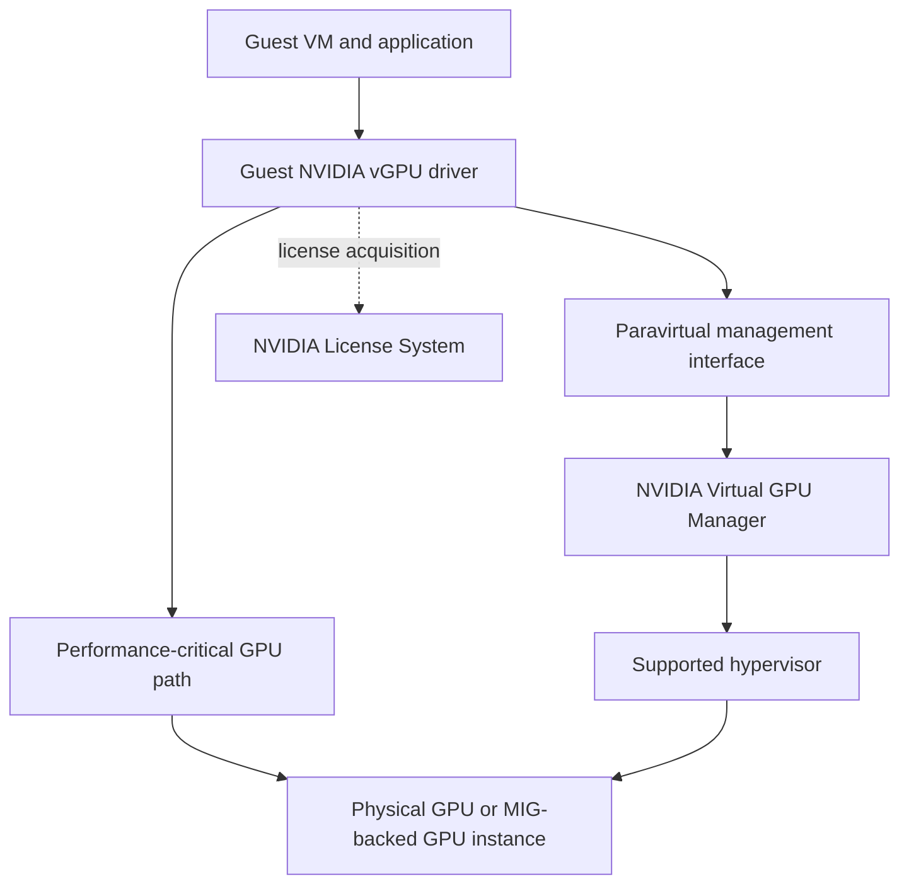
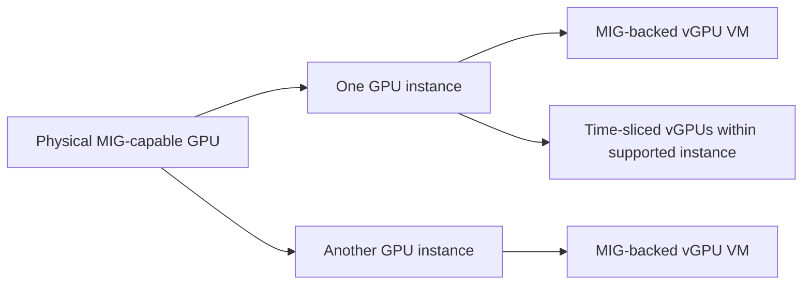

# vGPU Architecture and Enterprise Virtualization

A platform team inherits a virtual-desktop estate and is asked to add GPU-backed engineering desktops and Linux compute VMs. The easy answer is to attach a GPU to every VM. The durable answer is to decide where the virtual-machine boundary belongs, which resource guarantee a profile represents, and who owns compatibility when the hypervisor, host driver, guest driver, and license service change independently.

vGPU is a virtualization platform, not merely another Kubernetes resource name. It is the right abstraction when the VM is the tenant, lifecycle, security, and operational unit. It adds a stack of dependencies that a bare-metal or container-only GPU pool does not have.

| Chapter profile | Value |
|---|---|
| Difficulty | Advanced |
| Reading time | 35–45 minutes |
| Prerequisites | [MIG Architecture](./chapter-02-mig-architecture-and-isolation), virtualization operations, and basic GPU telemetry |
| Production outcome | A versioned, supportable VM GPU service with a tested rollback boundary |

## Learning objectives

After this chapter, you will be able to:

- describe the host-to-guest vGPU data and control paths;
- distinguish time-sliced vGPU from MIG-backed vGPU;
- build a supportable compatibility and licensing operating model; and
- diagnose failures without treating every missing guest GPU as a guest-driver problem.

## The architecture has two paths

**Figure 11.5.1 — A vGPU deployment is a coordinated host, guest, and entitlement system.** NVIDIA documents that the guest driver uses direct GPU access for performance-critical paths and a paravirtualized interface to the Virtual GPU Manager for management operations. [NVIDIA vGPU Software User Guide](https://docs.nvidia.com/vgpu/latest/grid-vgpu-user-guide/index.html)

The hypervisor exposes a virtual GPU device to the guest. The guest sees a GPU through its NVIDIA driver, while the Virtual GPU Manager on the host controls the physical GPU and its virtual-device assignments. This separation explains a common operational fact: a guest can be correctly configured and still have no usable vGPU because the host, profile inventory, or licensing service is unhealthy.

## Profiles are service contracts, not fractions on a spreadsheet

A vGPU profile selects a supported virtual-device type for a supported GPU and software release. Profile availability, allowed density, framebuffer allocation, display capabilities, and scheduling behavior are release- and platform-specific. Do not infer them from a profile name or from an older release matrix; use the documentation and release notes for the installed vGPU release and hypervisor.

Each vGPU retains its assigned framebuffer until it is destroyed, according to the vGPU user guide. That makes framebuffer allocation materially different from Kubernetes time-slicing: a VM can have a defined memory assignment while compute execution can still be subject to the selected virtualization model and workload contention. [vGPU architecture and vGPU types](https://docs.nvidia.com/vgpu/latest/grid-vgpu-user-guide/index.html)

| Question | vGPU design response | Operational implication |
|---|---|---|
| Is the VM the required tenant boundary? | Use a supported vGPU stack when VM isolation and lifecycle are requirements. | Patch, image, and inventory the guest as a first-class asset. |
| Is predictable memory capacity required? | Select a supported profile that meets the application’s documented need. | Track allocated framebuffer and profile fragmentation. |
| Is compute predictability required? | Benchmark the specific profile, GPU, scheduler mode, and workload. | Do not promise deterministic throughput from profile size alone. |
| Does the workload need hardware partitioning too? | Evaluate supported MIG-backed vGPU where the exact platform supports it. | Validate the full hardware, vGPU release, and hypervisor combination. |

## Time-sliced and MIG-backed vGPU

NVIDIA documents time-sliced vGPUs on a single GPU instance and, on supported MIG-capable systems, MIG-backed vGPUs. A MIG-backed vGPU can occupy an entire GPU instance or be time-sliced within a GPU instance; exact availability depends on hardware, vGPU release, and hypervisor. [NVIDIA vGPU Software User Guide](https://docs.nvidia.com/vgpu/latest/grid-vgpu-user-guide/index.html)

MIG changes the hardware partitioning beneath the virtual device. It assigns dedicated compute and memory resources to GPU instances, with isolated memory-system paths. It is not an entitlement to skip the vGPU compatibility matrix; it is another supported deployment mode with more lifecycle states. [NVIDIA MIG User Guide](https://docs.nvidia.com/datacenter/tesla/mig-user-guide/latest/introduction.html)

**Figure 11.5.2 — MIG and vGPU address different layers.** MIG partitions supported GPU hardware; vGPU presents supported virtual devices to VMs. Combining them requires an explicitly supported configuration.

## Lifecycle: treat the stack as a qualified unit

The minimum change unit is larger than a guest package. Record at least the GPU model, server firmware baseline, hypervisor release, Virtual GPU Manager version, guest OS, guest vGPU driver, profile type, license configuration, and application image. Add the underlying Kubernetes or cloud layer if VM workloads are scheduled through it.

| Change | Safe operating sequence | Evidence to retain |
|---|---|---|
| New VM image | Test a guest image against a representative profile in a non-production pool. | Guest driver status, application smoke test, license state. |
| Host/vGPU release update | Read the release-specific support matrix; canary a drained host and compatible guests. | Host manager state, VM boot and migration behavior where applicable, workload benchmark. |
| Profile change | Stop or evacuate the VM according to platform procedure; verify physical capacity first. | Requested and assigned profile, application memory headroom. |
| License service change | Test resolution, trust, reachability, and acquisition from an isolated canary VM. | License client log and post-acquisition application test. |

Avoid broad upgrades that simultaneously change hypervisor, host manager, guest image, and application runtime. A single rollback boundary is more useful than a fast rollout with no diagnostic control.

## Design review checklist

Before accepting a vGPU platform into production, ask for evidence rather than architecture diagrams alone. The owner should be able to produce the release-specific compatibility reference, an inventory of profile-to-GPU capacity, a tested guest image, a license-service failure test, and a documented host drain/rollback procedure. Validate both a newly created VM and an existing VM across a planned maintenance event.

Also test the operational edges. Can monitoring distinguish a physical GPU fault from a guest-driver fault? Can the help desk identify the assigned profile without broad host access? Can a tenant receive an approved image without gaining the ability to alter a vGPU assignment? These questions uncover gaps that a successful benchmark misses.

## Production patterns

Separate interactive graphics, persistent engineering workstations, short-lived batch VMs, and latency-sensitive compute VMs into service classes. The classes may share a fleet only when their maintenance window, profile, security, and SLO requirements genuinely align. A general-purpose virtual desktop pool should not be the capacity reserve for an incident-sensitive inference VM.

For a regulated environment, make the VM template the security and audit boundary: signed image provenance, guest patch posture, role-based console access, tenant network segmentation, centralized logs, and a documented break-glass process. The vGPU device does not replace those controls. See [Chapter 08](./chapter-08-tenant-isolation-security-and-fairness) for the layered tenant model.

For Kubernetes-native workloads, prefer the native GPU resource model when a VM boundary adds no product or compliance value. See [Chapter 07](./chapter-07-kubernetes-scheduling-for-shared-gpus). vGPU is a deliberate operational choice, not a default response to every multi-tenant requirement.

## Troubleshooting scenario 1: VM boots but no usable GPU appears

**Symptom.** The VM powers on, but the guest driver reports no supported device or the application cannot initialize CUDA.

**Evidence path.** Start at the host: confirm that the physical GPU is healthy, the Virtual GPU Manager is loaded, the requested profile is available, and the VM is assigned the intended vGPU. Then inspect guest PCI enumeration, the guest driver log, and driver-version compatibility. Finally verify that the profile and guest OS are supported by the release in use.

**Likely causes.** A host/guest version mismatch, a changed VM profile, an exhausted or incompatible profile inventory, or a host-manager failure can all surface as a guest-level failure.

**Recovery.** Restore a tested host/guest pairing or move the VM to a validated host class. Do not force-install a driver solely because it is newer. Preserve host and guest logs before changing the assignment; they are essential evidence for a support case.

## Troubleshooting scenario 2: GPU exists but the application is degraded after startup

**Symptom.** The guest sees the vGPU, but a CUDA workload has reduced capability or fails after an initial grace period.

**Evidence path.** Inspect the license client configuration and logs in the guest, DNS and network reachability to the license service, certificate or time prerequisites required by the deployment, and the license edition appropriate to the assigned vGPU type. Validate by acquiring a license from one controlled canary before touching a pool.

**Likely causes.** License-service reachability, an incorrect client configuration, expired or unavailable entitlement, or a mismatch between the assigned profile and entitlement can cause reduced behavior. Licensing behavior is release-specific; use the current license guide for the installed product. [NVIDIA vGPU Client Licensing Guide](https://docs.nvidia.com/vgpu/15.0/grid-licensing-user-guide/index.html)

**Recovery.** Repair the service path or configuration, verify acquisition, and run an application-level validation. Do not treat a green VM power state as a license-health signal.

## Customer architecture discussion

A financial-services team may require long-lived analyst desktops with controlled images, audit retention, and VM-oriented operations. vGPU can align cleanly with that operating model. The same organization may run containerized model serving on bare metal because service deployment, autoscaling, and failure recovery happen in Kubernetes. A shared-GPU program succeeds when it allows both contracts rather than forcing every workload into the virtualization estate.

The design review should explicitly name the failure domains: physical GPU, host, Virtual GPU Manager, VM, guest driver, license service, control plane, and network. It should also name the recovery owner for each one. “The virtualization team owns it” is not a runbook.

## Interview preparation

**Why is vGPU compatibility a system property?**

The host manager, hypervisor, physical GPU, guest driver, vGPU type, guest OS, and licensing path must form a supported combination. A correct component in an unsupported pairing is still an operational risk.

**Does a vGPU profile guarantee application performance?**

No. It defines a supported virtual-device allocation and behavior, but application performance depends on the profile, physical GPU, scheduling mode, application concurrency, CPU and I/O paths, and the rest of the VM.

## Key takeaways

- vGPU provides a virtual-device model for VM-centric platforms; it is not a generic replacement for native container scheduling.
- The data path and the management path are different, so diagnose host, guest, and entitlement layers independently.
- Profiles, compatibility, and licensing are release-specific operating contracts.
- MIG-backed vGPU can combine hardware partitioning with virtualization, but only on verified supported stacks.
- Canary the complete lifecycle, not just the guest driver.

## Cross references and further reading

- [Comparing MIG, Time-Slicing, and vGPU](./chapter-06-comparing-mig-time-slicing-and-vgpu)
- [Kubernetes Scheduling for Shared GPUs](./chapter-07-kubernetes-scheduling-for-shared-gpus)
- [Tenant Isolation, Security, and Fairness](./chapter-08-tenant-isolation-security-and-fairness)
- [NVIDIA vGPU Software User Guide](https://docs.nvidia.com/vgpu/latest/grid-vgpu-user-guide/index.html)
- [NVIDIA MIG User Guide: Virtualization](https://docs.nvidia.com/datacenter/tesla/mig-user-guide/latest/virtualization.html)
