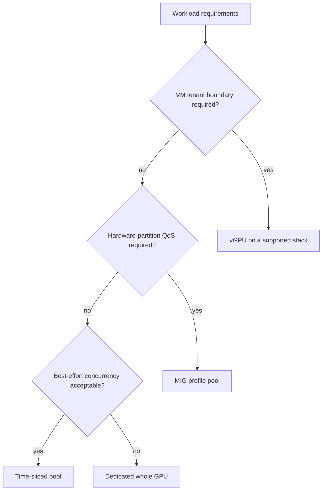
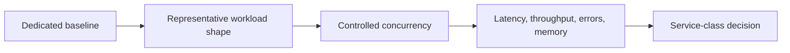

# Comparing MIG, Time-Slicing, and vGPU

GPU sharing decisions fail when the platform begins with a mechanism: “we have MIG,” “we can advertise replicas,” or “the virtualization team already has vGPU.” The first design question is instead: what resource contract does this workload need, and what failure, security, and lifecycle boundary can the organization operate?

Whole-GPU allocation remains a valid fourth choice. It is often the least surprising option for a large, topology-sensitive, or untrusted workload. Sharing is not automatically an efficiency improvement if it creates retries, queueing, debugging cost, or missed objectives.

| Chapter profile | Value |
|---|---|
| Difficulty | Advanced |
| Reading time | 30–40 minutes |
| Prerequisites | [MIG Profiles and Placement](./chapter-03-mig-profiles-and-placement) and [Time-Slicing](./chapter-04-time-slicing-and-oversubscription) |
| Production outcome | A measured pool-selection policy rather than a product-default decision |

## Learning objectives

After this chapter, you will be able to:

- compare the resource boundaries and failure modes of the sharing models;
- turn workload SLOs into an evidence-based pool-selection decision;
- recognize fragmentation and lifecycle costs before deployment; and
- design a multi-pool service catalog rather than one universal sharing policy.

## The decision begins with the contract

**Figure 11.6.1 — This is a starting decision tree, not an automatic placement algorithm.** Supportability, workload measurements, and tenant trust can override a seemingly simple path.

| Model | Primary resource boundary | What it is good at | What it does not promise |
|---|---|---|---|
| Dedicated GPU | physical device | simple fault attribution, large jobs, no sharing ambiguity | efficient use by small or bursty workloads |
| MIG | supported hardware GPU instance | defined compute and memory resource partitioning, predictable isolation properties | arbitrary profile geometry, zero fragmentation, or a complete tenant security model |
| Time-slicing | software-advertised logical replica / process access | increasing access for bursty, tolerant workloads | dedicated memory, fixed compute share, or strict tail latency |
| vGPU | virtual device assigned to a VM | VM-centric tenancy, lifecycle, and supported profile management | a simpler operational stack or performance guarantees independent of workload |

NVIDIA describes MIG as partitioning supported GPUs into isolated instances with dedicated compute and memory resources. In contrast, NVIDIA’s Kubernetes device-plugin time-slicing documentation explicitly says that a requested replica does not equal a proportional share of memory or compute. [MIG User Guide](https://docs.nvidia.com/datacenter/tesla/mig-user-guide/latest/introduction.html) and [device-plugin sharing documentation](https://github.com/NVIDIA/k8s-device-plugin#shared-access-to-gpus).

## What is actually isolated?

MIG exposes a hardware partitioning model. GPU instances receive dedicated memory-system resources and defined compute resources on supported devices; within a GPU instance, compute instances can further divide SM resources while sharing the parent GPU instance’s memory and engines. That internal distinction matters when interpreting a profile or debugging interference. [MIG concepts](https://docs.nvidia.com/datacenter/tesla/mig-user-guide/latest/concepts.html)

Time-slicing allows multiple workloads to access a physical GPU through the driver scheduling model. It can improve access and aggregate utilization when work is intermittent, but a logical Kubernetes replica is a scheduler token. It must not be sold as a hardware slice, memory reservation, or security isolation boundary.

vGPU creates a virtual device for a guest VM under the hypervisor’s Virtual GPU Manager. Depending on the supported configuration it may be time-sliced or MIG-backed; it adds VM image, host manager, hypervisor, guest driver, profile, and license lifecycle responsibilities. [NVIDIA vGPU Software User Guide](https://docs.nvidia.com/vgpu/latest/grid-vgpu-user-guide/index.html)

## Compare the operational cost, not just the hardware behavior

| Dimension | Dedicated GPU | MIG | Time-slicing | vGPU |
|---|---|---|---|---|
| Capacity unit | device | supported profile | logical replica plus physical GPU headroom | supported virtual profile |
| Reconfiguration | drain / reassign device | change geometry and reconcile consumers | adjust replica policy and validate contention | VM/profile and host lifecycle |
| Fragmentation risk | lower for homogeneous jobs | profile geometry can strand usable capacity | physical saturation can hide behind many replicas | profile inventory and VM placement can fragment |
| Primary observability | device and application | per-instance plus device | physical device and per-process/application | host, guest, profile, and license layers |
| Suitable default | large or sensitive jobs | measured partitionable workloads | best-effort, bursty use | VM-centric service catalog |

The comparisons should not be reduced to “MIG is secure” or “time-slicing is cheaper.” Security depends on the entire tenant boundary; cost includes stranded capacity, support entitlement, personnel, and the price of missed SLOs. See [Chapter 08](./chapter-08-tenant-isolation-security-and-fairness) and [Chapter 09](./chapter-09-capacity-planning-and-chargeback).

## A benchmark is the admission test

Before classifying a workload, capture a baseline on a dedicated GPU. Then test the intended sharing model with realistic concurrency, input distributions, GPU memory pressure, CPU and network contention, and failure recovery. Define success in the application’s language: request rate and p99 latency for online serving, completion time and error rate for batch work, or notebook startup and interactive responsiveness for development.

Do not publish a universal “safe replica count.” The answer changes with model size, batch behavior, memory allocation, process count, CPU feed rate, driver release, and neighboring work. A platform may publish a tested envelope for one service class, with a dated benchmark and a clear statement that workloads outside it need requalification.

## Decision record for a sharing class

Every new GPU service class should have a short decision record. Capture the workload shape, tenant boundary, selected mechanism, supported hardware/software scope, benchmark method, SLO, quota unit, observability signals, failure behavior, and exit criteria. Include why the rejected alternatives were unsuitable. This turns a future incident from a debate about product features into a review of an explicit contract.

Review the record after a hardware refresh or application-model change. A model that fit a small MIG profile last quarter may change its memory or batching behavior. The sharing decision is therefore a controlled lifecycle artifact, not a one-time procurement choice.

## Production patterns

Use separate node pools and resource identities for distinct contracts. A practical catalog might provide:

- a dedicated or topology-qualified pool for tightly coupled jobs and high-sensitivity services;
- one or more stable MIG-profile pools for approved inference or development shapes;
- a bounded time-sliced pool for interactive, best-effort, or low-duty-cycle work; and
- a vGPU estate where the VM is the managed tenant boundary.

The platform should show users the meaningful consequences: eligibility, expected scheduling delay, availability target, preemption policy, and chargeback unit. “Shared GPU” is too ambiguous for a request form.

## Troubleshooting scenario 1: a supposedly isolated service has erratic latency

**Symptom.** A service that requests a generic GPU has high tail latency only during busy periods.

**Diagnosis.** Identify the resource name, node-pool sharing configuration, actual device allocation, and neighboring processes. Compare application latency, queue depth, and memory use with a controlled dedicated or MIG baseline. A generic resource label may have landed the service on a time-sliced pool.

**Resolution.** Move the service to a measured contract—dedicated or an appropriate MIG profile—and use distinct resource names, labels, taints, and admission rules so the scheduler cannot silently substitute best-effort capacity. Chapter 07 describes how to express that policy.

## Troubleshooting scenario 2: MIG capacity exists, but requests wait indefinitely

**Symptom.** Operators see unused portions of a MIG-capable GPU while a workload requesting a particular profile stays Pending.

**Diagnosis.** Compare requested profile resource name with discovered allocatable resources and the configured MIG geometry. Free capacity expressed as the wrong profile shape is not schedulable capacity for the request. Check node labels, taints, quotas, and device-plugin state before changing the geometry.

**Resolution.** Either place the workload in a pool that exposes its validated profile, or change the geometry through a controlled drain/reconciliation process. Do not repartition a production node reactively without considering the workloads that consume the existing geometry.

## Customer architecture discussion

Consider a research organization with three needs: student notebooks, a regulated VM-based analytics group, and a model-serving team with a tail-latency objective. A time-sliced notebook pool can optimize access. The analytics group can use a supported vGPU service with VM controls. The serving team can use dedicated or MIG-profile pools validated against its own SLO. The architecture is intentionally plural because the business contracts are different.

The platform owner should review utilization and wait time per class monthly. A pool that is “efficient” only because it hides customer retries is not efficient. Conversely, a dedicated pool that permanently idles may need a reservation policy or a different capacity commitment.

## Interview preparation

**Why is time-slicing not equivalent to MIG?**

Time-slicing multiplexes access to a physical GPU; MIG partitions supported GPU resources into hardware instances with defined memory and compute isolation characteristics. Their scheduling tokens, interference behavior, and operational lifecycle are different.

**When is a whole GPU still the best answer?**

When the job needs the complete device, has a stringent or unknown performance envelope, requires simple incident attribution, or would lose more value to contention and operational complexity than sharing would save.

## Key takeaways

- Start from the workload’s tenant, performance, and lifecycle contract.
- A logical time-slice replica is not a proportional hardware allocation.
- MIG and vGPU solve different layers and can be combined only in supported configurations.
- Service classes should expose guarantees and trade-offs, not hide them.
- Benchmarking under representative concurrency is the only defensible capacity promise.

## Cross references and further reading

- [Time-Slicing and Oversubscription](./chapter-04-time-slicing-and-oversubscription)
- [vGPU Architecture and Enterprise Virtualization](./chapter-05-vgpu-architecture-and-enterprise-virtualization)
- [Kubernetes Scheduling for Shared GPUs](./chapter-07-kubernetes-scheduling-for-shared-gpus)
- [NVIDIA MIG User Guide](https://docs.nvidia.com/datacenter/tesla/mig-user-guide/latest/index.html)
- [NVIDIA k8s-device-plugin sharing documentation](https://github.com/NVIDIA/k8s-device-plugin#shared-access-to-gpus)
