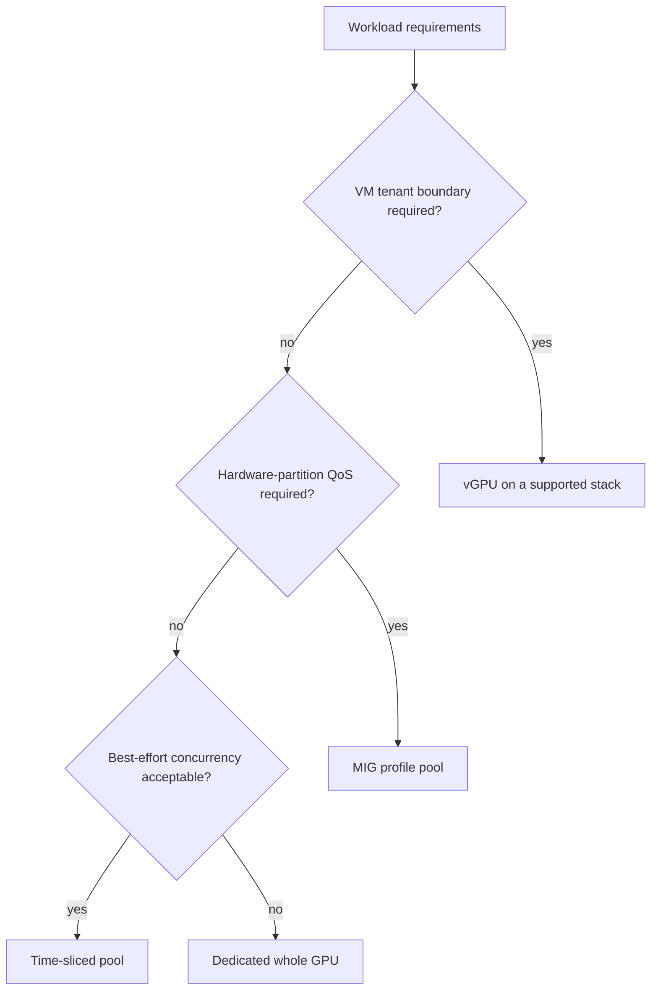
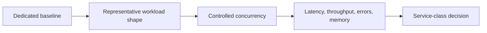
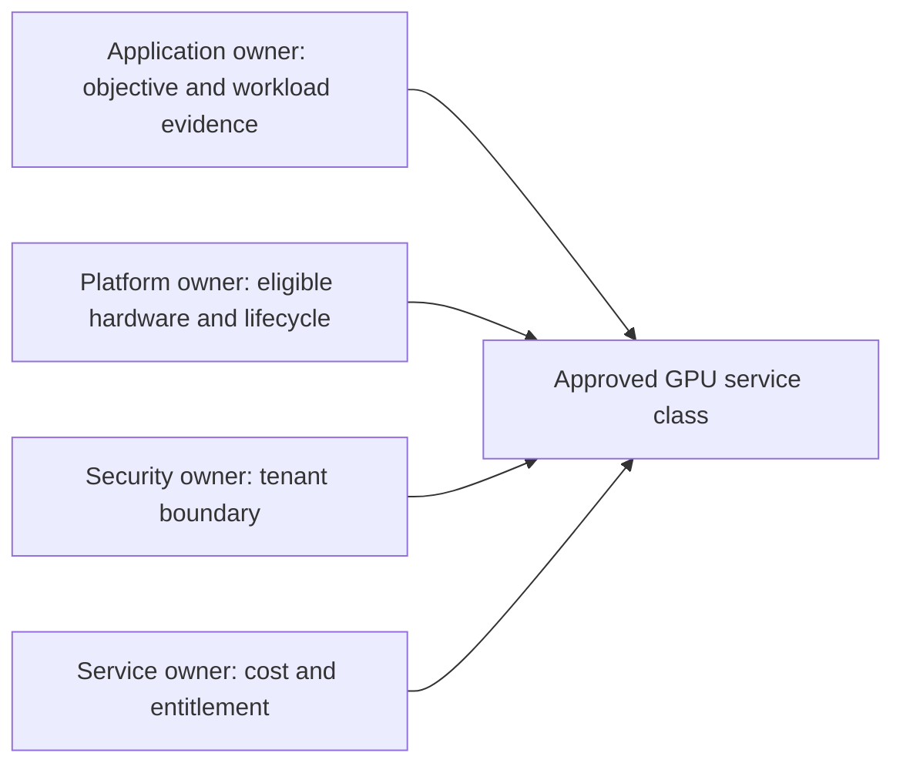

# Comparing MIG, Time-Slicing, and vGPU

GPU sharing decisions fail when the platform begins with a mechanism: “we have MIG,” “we can advertise replicas,” or “the virtualization team already has vGPU.” The first design question is instead: what resource contract does this workload need, and what failure, security, and lifecycle boundary can the organization operate?

Whole-GPU allocation remains a valid fourth choice. It is often the least surprising option for a large, topology-sensitive, or untrusted workload. Sharing is not automatically an efficiency improvement if it creates retries, queueing, debugging cost, or missed objectives.

| Chapter profile | Value |
|---|---|
| Difficulty | Advanced |
| Reading time | 30–40 minutes |
| Prerequisites | [MIG Profiles and Placement](./chapter-03-mig-profiles-and-placement) and [Time-Slicing](./chapter-04-time-slicing-and-oversubscription) |
| Production outcome | A measured pool-selection policy rather than a product-default decision |

## Learning objectives

After this chapter, you will be able to:

- compare the resource boundaries and failure modes of the sharing models;
- turn workload SLOs into an evidence-based pool-selection decision;
- recognize fragmentation and lifecycle costs before deployment; and
- design a multi-pool service catalog rather than one universal sharing policy.

## The decision begins with the contract

**Figure 11.6.1 — This is a starting decision tree, not an automatic placement algorithm.** Supportability, workload measurements, and tenant trust can override a seemingly simple path.

| Model | Primary resource boundary | What it is good at | What it does not promise |
|---|---|---|---|
| Dedicated GPU | physical device | simple fault attribution, large jobs, no sharing ambiguity | efficient use by small or bursty workloads |
| MIG | supported hardware GPU instance | defined compute and memory resource partitioning, predictable isolation properties | arbitrary profile geometry, zero fragmentation, or a complete tenant security model |
| Time-slicing | software-advertised logical replica / process access | increasing access for bursty, tolerant workloads | dedicated memory, fixed compute share, or strict tail latency |
| vGPU | virtual device assigned to a VM | VM-centric tenancy, lifecycle, and supported profile management | a simpler operational stack or performance guarantees independent of workload |

NVIDIA describes MIG as partitioning supported GPUs into isolated instances with dedicated compute and memory resources. In contrast, NVIDIA’s Kubernetes device-plugin time-slicing documentation explicitly says that a requested replica does not equal a proportional share of memory or compute. [MIG User Guide](https://docs.nvidia.com/datacenter/tesla/mig-user-guide/latest/introduction.html) and [device-plugin sharing documentation](https://github.com/NVIDIA/k8s-device-plugin#shared-access-to-gpus).

## What is actually isolated?

MIG exposes a hardware partitioning model. GPU instances receive dedicated memory-system resources and defined compute resources on supported devices; within a GPU instance, compute instances can further divide SM resources while sharing the parent GPU instance’s memory and engines. That internal distinction matters when interpreting a profile or debugging interference. [MIG concepts](https://docs.nvidia.com/datacenter/tesla/mig-user-guide/latest/concepts.html)

Time-slicing allows multiple workloads to access a physical GPU through the driver scheduling model. It can improve access and aggregate utilization when work is intermittent, but a logical Kubernetes replica is a scheduler token. It must not be sold as a hardware slice, memory reservation, or security isolation boundary.

vGPU creates a virtual device for a guest VM under the hypervisor’s Virtual GPU Manager. Depending on the supported configuration it may be time-sliced or MIG-backed; it adds VM image, host manager, hypervisor, guest driver, profile, and license lifecycle responsibilities. [NVIDIA vGPU Software User Guide](https://docs.nvidia.com/vgpu/latest/grid-vgpu-user-guide/index.html)

## Compare the operational cost, not just the hardware behavior

| Dimension | Dedicated GPU | MIG | Time-slicing | vGPU |
|---|---|---|---|---|
| Capacity unit | device | supported profile | logical replica plus physical GPU headroom | supported virtual profile |
| Reconfiguration | drain / reassign device | change geometry and reconcile consumers | adjust replica policy and validate contention | VM/profile and host lifecycle |
| Fragmentation risk | lower for homogeneous jobs | profile geometry can strand usable capacity | physical saturation can hide behind many replicas | profile inventory and VM placement can fragment |
| Primary observability | device and application | per-instance plus device | physical device and per-process/application | host, guest, profile, and license layers |
| Suitable default | large or sensitive jobs | measured partitionable workloads | best-effort, bursty use | VM-centric service catalog |

The comparisons should not be reduced to “MIG is secure” or “time-slicing is cheaper.” Security depends on the entire tenant boundary; cost includes stranded capacity, support entitlement, personnel, and the price of missed SLOs. See [Chapter 08](./chapter-08-tenant-isolation-security-and-fairness) and [Chapter 09](./chapter-09-capacity-planning-and-chargeback).

## A benchmark is the admission test

Before classifying a workload, capture a baseline on a dedicated GPU. Then test the intended sharing model with realistic concurrency, input distributions, GPU memory pressure, CPU and network contention, and failure recovery. Define success in the application’s language: request rate and p99 latency for online serving, completion time and error rate for batch work, or notebook startup and interactive responsiveness for development.

Do not publish a universal “safe replica count.” The answer changes with model size, batch behavior, memory allocation, process count, CPU feed rate, driver release, and neighboring work. A platform may publish a tested envelope for one service class, with a dated benchmark and a clear statement that workloads outside it need requalification.

## Decision record for a sharing class

Every new GPU service class should have a short decision record. Capture the workload shape, tenant boundary, selected mechanism, supported hardware/software scope, benchmark method, SLO, quota unit, observability signals, failure behavior, and exit criteria. Include why the rejected alternatives were unsuitable. This turns a future incident from a debate about product features into a review of an explicit contract.

Review the record after a hardware refresh or application-model change. A model that fit a small MIG profile last quarter may change its memory or batching behavior. The sharing decision is therefore a controlled lifecycle artifact, not a one-time procurement choice.

## Production patterns

Use separate node pools and resource identities for distinct contracts. A practical catalog might provide:

- a dedicated or topology-qualified pool for tightly coupled jobs and high-sensitivity services;
- one or more stable MIG-profile pools for approved inference or development shapes;
- a bounded time-sliced pool for interactive, best-effort, or low-duty-cycle work; and
- a vGPU estate where the VM is the managed tenant boundary.

The platform should show users the meaningful consequences: eligibility, expected scheduling delay, availability target, preemption policy, and chargeback unit. “Shared GPU” is too ambiguous for a request form.

## Troubleshooting scenario 1: a supposedly isolated service has erratic latency

**Symptom.** A service that requests a generic GPU has high tail latency only during busy periods.

**Diagnosis.** Identify the resource name, node-pool sharing configuration, actual device allocation, and neighboring processes. Compare application latency, queue depth, and memory use with a controlled dedicated or MIG baseline. A generic resource label may have landed the service on a time-sliced pool.

**Resolution.** Move the service to a measured contract—dedicated or an appropriate MIG profile—and use distinct resource names, labels, taints, and admission rules so the scheduler cannot silently substitute best-effort capacity. Chapter 07 describes how to express that policy.

## Troubleshooting scenario 2: MIG capacity exists, but requests wait indefinitely

**Symptom.** Operators see unused portions of a MIG-capable GPU while a workload requesting a particular profile stays Pending.

**Diagnosis.** Compare requested profile resource name with discovered allocatable resources and the configured MIG geometry. Free capacity expressed as the wrong profile shape is not schedulable capacity for the request. Check node labels, taints, quotas, and device-plugin state before changing the geometry.

**Resolution.** Either place the workload in a pool that exposes its validated profile, or change the geometry through a controlled drain/reconciliation process. Do not repartition a production node reactively without considering the workloads that consume the existing geometry.

## Model selection by workload behavior

Classify a workload before choosing an allocator. Capture its peak and steady-state memory, batch or request shape, CPU feed sensitivity, failure-recovery behavior, tenant trust level, and objective. A small GPU memory footprint does not automatically mean a workload belongs in a small partition: it may have bursty allocation, require a particular engine, or be sensitive to shared CPU, storage, or network paths.

| Workload behavior | Questions to measure | Likely starting point |
|---|---|---|
| Interactive notebook | startup delay, peak memory, user concurrency, acceptable slowdown | bounded time-slicing or a small validated MIG class |
| Online inference | p50/p99 latency, queue depth, batch policy, model memory | protected MIG or dedicated capacity after benchmark |
| Batch inference | completion time, retry cost, queue tolerance, data-feed rate | flexible MIG or dedicated pool depending on shape |
| Distributed training | device count, topology, checkpoint recovery, collective sensitivity | dedicated/topology-qualified capacity |
| VM-resident engineering | guest lifecycle, graphics/compute need, tenant boundary | vGPU on a supported virtual platform |

These are starting hypotheses, not automatic assignments. A team must demonstrate that its selected class meets the stated objective at expected concurrency. Record the workload version and test method; otherwise a later model, driver, or batching change can silently invalidate the conclusion.

## The hidden costs of each model

MIG reduces some forms of contention through hardware partitioning, but it introduces profile geometry and lifecycle management. A fleet with many profile shapes can have excellent aggregate utilization and still fail a request because the free slices cannot form the requested profile. Operationally, that means geometry changes, discovery reconciliation, and maintenance reserve are part of the cost model.

Time-slicing reduces the admission barrier, but it moves much of the quality decision into workload governance. The platform must observe physical utilization, memory pressure, process behavior, application queueing, and tail latency. Counting logical replicas alone can produce an attractive capacity report while users experience a saturated physical device.

vGPU can fit a mature VM service, but it adds release compatibility, guest-image, license, host-manager, and hypervisor dependencies. It should be evaluated against the organization’s existing virtualization operations rather than judged only on its GPU isolation characteristics.

Dedicated allocation leaves capacity idle when workloads are small or intermittent, but it has an important benefit: its resource contract and incident attribution are comparatively simple. That simplicity is often worth buying for a high-impact service.

## Operational decision workshop

Use a cross-functional design review before creating a new sharing class. The application owner supplies workload evidence and a recovery objective. The platform owner supplies hardware and scheduler constraints. The security owner defines the tenant boundary. Finance or service management defines the chargeback unit. The output is a documented class, not a promise made in a chat.

The review should reject unsupported combinations early. For example, a request for a vGPU on a host not in the qualified matrix is not a capacity request; it is an unapproved design. Similarly, a request to place an untrusted, latency-sensitive service into a general time-sliced pool is a mismatch of threat model and performance contract.

## Incident playbook: sharing method is correct but the service objective fails

**Symptoms.** The deployment is healthy and the assigned resource matches policy, but application p99 latency, job completion time, or interactive responsiveness deteriorates under normal tenant load.

**Evidence.** Compare affected workload metrics with a dedicated baseline: application queueing, request or batch distribution, GPU utilization, memory use, CPU saturation, input I/O, and neighboring workload activity. Confirm the exact sharing mode and profile rather than assuming it from the node name.

**Diagnosis.** Decide whether the observed bottleneck is GPU contention, memory headroom, CPU/data-feed limitation, a workload-specific batching behavior, or an SLO that the class was never benchmarked to meet. A low average GPU utilization does not disprove a latency problem; serialization and bursts can dominate tail behavior.

**Remediation.** Adjust the service contract: move to a protected or dedicated class, reduce allowed concurrency, revise batch policy, or correct the non-GPU bottleneck. Do not simply increase time-slice replicas or request a larger profile without evidence that it addresses the limiting resource.

**Verification.** Repeat the original workload shape and concurrency test, compare the same percentiles or completion criteria against the baseline, and observe through a representative busy period.

**Prevention.** Publish a qualification envelope with workload type, input range, concurrency, and SLO. Requalify after meaningful changes to model, runtime, driver, GPU type, or capacity policy.

## Incident playbook: fragmentation blocks a high-value request

**Symptoms.** Fleet dashboards show free capacity, but a high-value workload cannot receive its required MIG profile or vGPU profile before its service deadline.

**Evidence.** Inventory allocatable profiles and geometry per node, current allocations, idle reservations, expected maintenance reserve, and the requested service class. Inspect scheduler events and discovery output; do not rely on aggregate memory charts.

**Diagnosis.** Determine whether the shortage is demand, shape fragmentation, stale discovery, or a quota/policy restriction. Different profile shapes are not fungible merely because their arithmetic sum looks sufficient.

**Remediation.** Use a pre-approved reserve, reclaim expired reservations, place the workload in a compatible alternate class only if its objective permits it, or schedule a controlled reconfiguration. Escalate if the business contract requires capacity that the catalog does not provide.

**Verification.** Confirm the request is fulfilled with the approved profile and that the corrective action did not violate other protected reservations. Update utilization and fragmentation reporting.

**Prevention.** Set service-specific reserve and fragmentation thresholds. Review profile demand distribution and retire rarely used classes that create operational cost without a demonstrated customer need.

## Senior review questions

**What is the difference between allocation efficiency and delivered efficiency?**

Allocation efficiency is the percentage of a resource that appears assigned. Delivered efficiency reflects useful application work within its objective. High logical allocation with long queues, retries, or missed latency targets is not delivered efficiency.

**Why should a platform offer fewer sharing classes than it technically can?**

Every class adds capacity forecasting, documentation, admission, observability, support, and upgrade surface. A class should exist because it has a measured workload or governance requirement, not because the hardware can expose another profile.

**How does an operator decide whether to move a service from time-slicing to MIG?**

Use observed interference, memory behavior, and SLO evidence. MIG is justified when a supported profile can provide the required resource contract and the benefit exceeds geometry and lifecycle cost; it is not a universal upgrade.

## Capacity evaluation worksheet

Before purchasing or reconfiguring capacity, calculate the demand in the service unit, then translate it to physical devices with a deliberately stated reserve. Keep the calculation separate for each class: a time-sliced logical allocation, a MIG profile, a full GPU, and a vGPU profile are not exchangeable inventory units.

| Input | Example question | Reason to track it |
|---|---|---|
| Arrival pattern | When do users or requests need the class? | average demand hides peaks |
| Concurrent demand | How many qualified consumers overlap? | determines admission headroom |
| Workload envelope | What memory/throughput range was benchmarked? | prevents unsafe substitution |
| Failure reserve | What must remain after node loss or maintenance? | turns availability into capacity |
| Geometry reserve | Which profile shapes must remain placeable? | prevents profile fragmentation surprise |
| Reclaimability | Which reservations may safely be borrowed? | bounds stranded capacity |

Review these inputs with a real incident and maintenance scenario. If a plan cannot place the largest protected profile after a host failure, its average utilization is irrelevant to the availability contract.

## Migration between sharing classes

Move workloads only through a qualification step. First establish a baseline and success criteria. Then deploy the candidate class in parallel or to a small canary, compare the same workload and concurrency, and test rollback. A migration from time-slicing to MIG can improve resource isolation but may expose a profile-memory mismatch. A migration from dedicated GPUs to time-slicing can lower idle cost while invalidating latency objectives.

Treat class migration as an application release: preserve version, input shape, configuration, and benchmark evidence. The operator must be able to explain whether a regression came from the allocator, a runtime update, a changed model, or a different request pattern.

## Selection anti-patterns

- Selecting MIG solely because it is available, without verifying supported profiles and workload fit.
- Selecting time-slicing because a dashboard reports idle utilization, without measuring concurrent tail behavior.
- Selecting vGPU solely because workloads are virtual machines, without owning the compatibility and licensing lifecycle.
- Selecting a whole GPU as permanent policy when a measured, supportable class could safely improve access.
- Selecting any class from average memory use while ignoring allocation bursts, model load, and recovery behavior.

Each anti-pattern replaces a decision record with a slogan. The correction is not more configuration; it is evidence tied to a service objective.

## Service-catalog example

An organization can offer four deliberately distinct services: interactive best-effort access, fixed-profile inference capacity, dedicated accelerator capacity, and regulated VM compute. The goal is not to expose every underlying hardware possibility; it is to make request, scheduling, support, and billing behavior understandable.

| Service | Mechanism | Admission posture | Failure/maintenance behavior |
|---|---|---|---|
| Interactive sandbox | time-sliced | bounded quota and queue | slowdown or recall is acceptable |
| Protected inference | MIG profile | qualification and protected reserve | controlled failover or queueing |
| Large job | dedicated GPU | capacity reservation / coordinated start | checkpoint-aware maintenance |
| Regulated VM | vGPU | VM and identity controls | host/guest lifecycle procedure |

The labels can differ, but the operational clarity should not. If a user cannot decide which service applies from the description, the catalog has hidden an important architectural trade-off.

## Review cadence

Review classes when demand shifts, a new GPU generation arrives, runtime behavior changes, or incidents reveal a hidden assumption. Retire a class when its workload population disappears or its operational burden exceeds its benefit. Preserve historical decisions so utilization and chargeback trends remain interpretable after a migration.

Avoid changing a class definition in place without versioning. A resource that once meant a particular MIG profile or best-effort policy should not silently receive new semantics. Introduce a successor, qualify consumers, migrate them, and then deprecate the old class.

## Chapter review exercises

1. Choose a real workload and document its tenant boundary, SLO, memory pattern, and recovery behavior.
2. Compare its dedicated baseline with one candidate sharing class under representative concurrency.
3. Identify the largest profile request that must remain placeable after a node failure.
4. Define the user-visible difference between a best-effort and protected service.
5. Write a rollback plan for moving the workload back to its prior class.

The useful output is a decision record with measurements, not a preference for a particular feature.

## Decision-review prompts

**What changes if the workload becomes critical?** A class chosen for best-effort access should not automatically become production serving capacity when its business importance increases. Revisit the threat model, availability objective, performance evidence, recovery plan, and support ownership.

**What changes if the model or dataset grows?** Memory and batching behavior may invalidate a previous profile choice. Establish an admission test that catches the new shape before a rollout exhausts a shared pool.

**What changes if a node fails?** Verify the service can still place its required profile or device class with the planned reserve. A fleet can look healthy in steady state and still violate its availability contract after one failure.

**What changes if the platform team cannot operate the new mechanism?** Operational complexity is a real cost. A simpler dedicated class can be the correct decision until monitoring, capacity management, and support procedures exist for a finer-grained alternative.

## Common misconceptions

- GPU memory usage alone is not a sufficient sharing-class selector.
- MIG profiles are not interchangeable fractions of a generic capacity pool.
- Time-slicing is not an entitlement to a predictable fraction of performance.
- vGPU is not a substitute for tenant identity, data, and operational controls.
- Dedicated allocation is not a failure of platform maturity; it is often the measured safe choice.

## Final selection questions

What is the user buying: access, a hardware partition, a VM device, or an end-to-end performance objective?

Which mechanism supports that promise on the actual hardware and software release?

What is the measured failure behavior when another tenant becomes active or a node leaves service?

What capacity is unavailable because it is reserved for recovery, profile geometry, or maintenance?

Who accepts the operational cost of the selected mechanism?

These questions turn an allocator choice into an accountable service decision.

## Exit criteria for a new class

A class is ready only when its supported scope is published, its admission policy is tested, its capacity unit is reportable, its benchmark evidence is reproducible, and its failure/rollback behavior is owned. If these criteria are missing, keep the workload in an existing qualified class while the platform work continues.

The decision record should name the next review date.

It should also name the owner who accepts the class’s operating cost.

It should state which workloads are explicitly out of scope.

It should document the required recovery reserve.

## Customer architecture discussion

Consider a research organization with three needs: student notebooks, a regulated VM-based analytics group, and a model-serving team with a tail-latency objective. A time-sliced notebook pool can optimize access. The analytics group can use a supported vGPU service with VM controls. The serving team can use dedicated or MIG-profile pools validated against its own SLO. The architecture is intentionally plural because the business contracts are different.

The platform owner should review utilization and wait time per class monthly. A pool that is “efficient” only because it hides customer retries is not efficient. Conversely, a dedicated pool that permanently idles may need a reservation policy or a different capacity commitment.

## Interview preparation

**Why is time-slicing not equivalent to MIG?**

Time-slicing multiplexes access to a physical GPU; MIG partitions supported GPU resources into hardware instances with defined memory and compute isolation characteristics. Their scheduling tokens, interference behavior, and operational lifecycle are different.

**When is a whole GPU still the best answer?**

When the job needs the complete device, has a stringent or unknown performance envelope, requires simple incident attribution, or would lose more value to contention and operational complexity than sharing would save.

## Key takeaways

- Start from the workload’s tenant, performance, and lifecycle contract.
- A logical time-slice replica is not a proportional hardware allocation.
- MIG and vGPU solve different layers and can be combined only in supported configurations.
- Service classes should expose guarantees and trade-offs, not hide them.
- Benchmarking under representative concurrency is the only defensible capacity promise.

## Cross references and further reading

- [Time-Slicing and Oversubscription](./chapter-04-time-slicing-and-oversubscription)
- [vGPU Architecture and Enterprise Virtualization](./chapter-05-vgpu-architecture-and-enterprise-virtualization)
- [Kubernetes Scheduling for Shared GPUs](./chapter-07-kubernetes-scheduling-for-shared-gpus)
- [NVIDIA MIG User Guide](https://docs.nvidia.com/datacenter/tesla/mig-user-guide/latest/index.html)
- [NVIDIA k8s-device-plugin sharing documentation](https://github.com/NVIDIA/k8s-device-plugin#shared-access-to-gpus)
