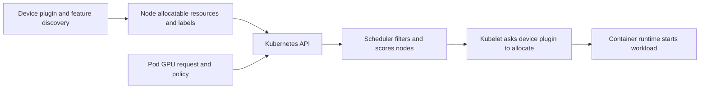

# Kubernetes Scheduling for Shared GPUs

Kubernetes schedules declared resources on eligible nodes. It does not know that one generic GPU request represents a whole device, a MIG profile, a time-sliced logical replica, or a vGPU-backed worker unless the platform exposes those differences as resources and policy.

That distinction is where many shared-GPU platforms fail. A Pod that is Running has passed a placement decision; it has not necessarily received the performance, isolation, or cost contract that its owner expected.

| Chapter profile | Value |
|---|---|
| Difficulty | Advanced |
| Reading time | 35–45 minutes |
| Prerequisites | [Volume 10, Chapter 04](../volume-10/chapter-04-device-plugin-and-kubernetes-resource-model) and the Volume 11 sharing chapters |
| Production outcome | An explicit, auditable mapping from workload request to GPU service class |

## Learning objectives

After this chapter, you will be able to:

- model distinct GPU sharing contracts in Kubernetes without ambiguous resource requests;
- combine device discovery with labels, taints, quotas, and admission controls;
- explain the limits of the default scheduler and device allocation; and
- diagnose Pending and misclassified GPU workloads systematically.

## What Kubernetes decides, and what it delegates



**Figure 11.7.1 — Node selection and device allocation are related but separate.** Resource requests establish schedulability; the device plugin performs device allocation after the Pod is bound. A request alone does not describe latency tolerance, profile intent, tenant class, or topology.

Kubernetes extended resources such as GPU resources are integer quantities. A container must request a whole unit of an extended resource; it cannot request a fractional GPU through the standard resource model. [Kubernetes extended resources](https://kubernetes.io/docs/concepts/configuration/manage-resources-containers/#extended-resources) The resource unit must therefore carry an unambiguous operational meaning.

## Design the resource catalog before workloads arrive

Do not expose all GPU access through `nvidia.com/gpu` if that name is used for materially different contracts. Use the NVIDIA device-plugin’s supported configuration and discovery tooling to publish the appropriate resource names, then bind each resource to a documented service class. Exact resource names and discovery behavior depend on the selected MIG strategy and plugin configuration. [NVIDIA MIG support in Kubernetes](https://docs.nvidia.com/datacenter/cloud-native/kubernetes/latest/index.html)

| Service class | Typical resource expression | Eligibility controls | User-visible contract |
|---|---|---|---|
| Dedicated accelerator | generic full-GPU resource in a dedicated pool | taint, node affinity, quota | full device and controlled maintenance policy |
| Fixed MIG shape | discovered profile-specific resource | profile labels, pool taint, quota | documented profile capacity and supported workload envelope |
| Best-effort shared access | explicitly named or separately governed time-sliced class | pool taint, strict namespace quota, admission | access, not a memory/compute or latency guarantee |
| VM-backed compute | a virtual-machine platform API rather than a misleading native GPU claim | VM scheduling and vGPU policy | VM lifecycle, supported vGPU profile, license state |

The precise implementation can differ, but the principle does not: a user must not be able to request a generic resource and silently receive a weaker class than the service objective requires.

## MIG strategy changes what the scheduler can see

NVIDIA’s device-plugin documentation describes `none`, `single`, and `mixed` MIG strategies. In `mixed`, different resource types can be advertised. NVIDIA also documents an important default behavior: a container should not request multiple different device types together because the specific device received is undefined; multiple instances of the same resource type are allowed. Review the installed release’s documentation before setting policy. [NVIDIA MIG Support in Kubernetes](https://docs.nvidia.com/datacenter/cloud-native/kubernetes/latest/index.html)

This makes request validation an admission concern. A policy can reject unsupported combinations before they create a confusing runtime allocation. It should also reject a time-sliced request where the namespace or workload class requires a protected resource, rather than relying on users to memorize the difference.

## Layer scheduling controls deliberately

| Control | Use it for | It cannot prove |
|---|---|---|
| GPU resource request | quantity and resource type | application readiness or expected latency |
| Node labels / affinity | validated hardware and sharing class | an entitlement to bypass capacity constraints |
| Taints / tolerations | reserving a pool for authorized workloads | device-level performance isolation |
| ResourceQuota | per-namespace capacity governance | fairness across namespaces by itself |
| LimitRange | default or bounded requests in a namespace | that every workload is suitable for sharing |
| PriorityClass | declared business importance | availability of a suitable device |
| Admission policy | enforce service-catalog rules | application correctness |

Use required node affinity only for hard compatibility or SLO constraints. Overly specific required rules create fragmentation, long Pending queues, and difficult hardware refreshes. For workload optimization, preferred affinity may preserve an acceptable fallback—but only if the fallback contract is actually acceptable.

## Quota and fairness begin with namespace boundaries

ResourceQuota can cap aggregate extended-resource consumption in a namespace. It should be paired with a namespace onboarding process: an owner, workload class, quota rationale, and escalation path. A quota that allows one team to consume every advertised time-slice can be technically valid and still violate the platform’s fairness policy.

For important interactive capacity, consider a queue or admission service outside the basic scheduler model. For large coordinated jobs, validate gang or queue behavior separately rather than assuming independent Pod scheduling protects partial starts. See [Volume 10, Chapter 08](../volume-10/chapter-08-gpu-scheduling-and-topology) for the distinction between capacity, eligibility, locality, and coordinated admission.

## Change management for scheduling policy

Treat labels, taints, resource names, and admission rules as an API. Version changes, test them against representative manifests, and announce deprecations before removing an eligible pool. A label typo can deny service; an overly broad toleration can route protected work to the wrong class. Both are production incidents, not cosmetic configuration errors.

When changing MIG geometry or time-slicing settings, drain and validate a canary node according to the platform runbook. Reconfirm device discovery, allocatable resources, labels, a representative protected workload, and a representative best-effort workload before expanding the change. The critical evidence is what the scheduler sees after reconciliation, not only a successful host-level command.

## A production Pod contract

The following is illustrative only. Labels, resource names, and quotas must match the cluster’s approved catalog.

```yaml
apiVersion: v1
kind: Pod
metadata:
  name: profile-qualified-serving
  labels:
    platform.example.com/gpu-service-class: protected-mig
spec:
  tolerations:
    - key: nvidia.com/gpu-service-class
      operator: Equal
      value: protected-mig
      effect: NoSchedule
  affinity:
    nodeAffinity:
      requiredDuringSchedulingIgnoredDuringExecution:
        nodeSelectorTerms:
          - matchExpressions:
              - key: platform.example.com/gpu-sharing
                operator: In
                values: [mig]
  containers:
    - name: service
      image: registry.example.invalid/approved-service:tag
      resources:
        limits:
          nvidia.com/mig-3g.20gb: 1
```

**Illustrative manifest.** It shows the relationship among a resource type, pool taint, and node label. It is not a portable profile recommendation, and it intentionally uses an invalid registry host.

**Validation checklist — before submitting this Pod:**

```bash
# 1. Does the cluster advertise this resource?
kubectl get nodes -o custom-columns=NAME:.metadata.name,MIG_3G_20GB:.status.allocatable.nvidia\\.com/mig-3g\\.20gb
# Expected: at least one node has > 0 allocatable mig-3g.20gb

# 2. Does the namespace have quota remaining?
kubectl get resourcequota -n default -o custom-columns=NAME:.metadata.name,USED:.status.used.nvidia\\.com/mig-3g\\.20gb,HARD:.status.hard.nvidia\\.com/mig-3g\\.20gb
# Expected: USED < HARD

# 3. Does this namespace have the tolerations policy?
kubectl get ns default -o jsonpath='{.metadata.labels}' | grep -i "gpu-service-class"
# Expected: shows the policy label

# 4. After submitting, trace the scheduling decision:
kubectl get pod profile-qualified-serving -o jsonpath='{.status.conditions[?(@.type=="PodScheduled")]}'
# Expected: status=True; if False, check the message for reason (Insufficient resource, Toleration failed, etc.)

# 5. If scheduled, verify device was allocated:
kubectl describe pod profile-qualified-serving | grep -A5 "nvidia.com"
# Expected: shows the allocated device index or MIG instance UUID
```

## Troubleshooting scenario 1: a valid Pod remains Pending

**Symptom.** A Pod requests a published GPU resource but is never scheduled.

**Evidence path.** Read the Pod events first. Then compare the request with allocatable resources on eligible nodes, the namespace quota, taints/tolerations, node-affinity expressions, and the GPU feature-discovery labels. For MIG, verify that the required profile resource is actually exposed by the current geometry and device-plugin strategy.

**Common root causes.** The cluster has a different resource name than the manifest requests; capacity is present but in the wrong profile shape; a required label is stale; quota is exhausted; or the Pod lacks the pool toleration.

**Recovery.** Correct the contract mismatch or wait for genuinely eligible capacity. Avoid removing taints or relaxing affinity as a first response: that can place the workload into a pool that does not meet its stated requirement.

## Troubleshooting scenario 2: a latency-sensitive Pod is Running on shared capacity

**Symptom.** The Pod is Running and sees a GPU, but latency becomes erratic during multi-tenant demand.

**Evidence path.** Determine the node’s sharing class, assigned resource name, device-plugin time-slicing configuration, neighboring workload activity, and application latency. A generic GPU request may have allowed the Pod onto a best-effort node. Compare against a known-good protected pool.

**Recovery.** Amend the service class, not only the replica count. Use an explicit protected resource/pool and an admission policy that rejects the generic request for that workload label. Monitor queueing and fragmentation after the migration.

## Resource publication and allocation mechanics

The device plugin reports allocatable device resources to the kubelet, which are then visible through the node API. The scheduler filters and scores nodes against Pod requests and placement policy. After a node is selected, kubelet asks the plugin to allocate devices for that Pod. This sequencing has two practical consequences: scheduler events explain why a Pod cannot reach a node, while device-plugin and runtime evidence explain why a bound Pod cannot use its allocated device.

Feature discovery is similarly a source of scheduling facts, not an SLO engine. Labels can identify a governed node class, GPU product, or configured sharing mode. They must be treated as configuration data with an owner and reconciliation check. A stale or manually changed label can be more dangerous than a missing label because it sends workloads to the wrong class with apparent scheduler success.

| Question | Primary evidence | Owner typically accountable |
|---|---|---|
| Does a compatible resource exist? | node allocatable resource and device-plugin status | GPU platform team |
| Is the node eligible? | labels, affinity, taints/tolerations | platform policy owner |
| Is the tenant allowed to consume it? | namespace quota and admission result | service/platform owner |
| Which device was assigned? | kubelet/device-plugin allocation evidence | node operator |
| Did the application meet its objective? | application and GPU telemetry | workload owner with platform support |

## Admission policy is the translation layer

Users should not have to encode every hardware constraint in a manifest. An admission policy can translate a declared workload class into enforceable requirements: allowed resource names, required tolerations, node affinity, namespaces, priority, and limits on unsafe combinations. It can also reject a request that asks for a profile absent from the tenant’s contract.

Keep the policy explainable. A rejected workload should report which contract rule failed and how the owner can request an exception. Hidden mutation that silently adds a generic GPU request is especially risky: it obscures the real resource class and makes billing and incident response unreliable.

One useful pattern is to define a platform-specific class label, then validate it against the resource request. For example, `protected-mig` might allow only approved MIG resources in approved namespaces and require a protected pool toleration. The exact implementation is organization-specific; the principle is that application intent and scheduler-visible constraints must agree.

## Namespace onboarding and quota design

Onboard a namespace as a service relationship. Record a technical owner, cost owner, data classification, approved workload classes, maximum allocation, priority rules, and support contact. Apply ResourceQuota to the approved extended resources rather than only to generic GPU units. If a cluster exposes dedicated, MIG, and shared classes, quotas should preserve those differences.

LimitRange can provide defaults or bounds, but it should not be used to disguise a sharing decision. Defaulting every Pod to a GPU request can exhaust scarce capacity; defaulting a workload into a time-sliced class can misrepresent its requirement. Require explicit declarations for high-cost or protected classes.

## Scheduling patterns and anti-patterns

| Pattern | Why it works | Anti-pattern to avoid |
|---|---|---|
| Tainted dedicated pool | preserves scarce protected capacity | granting broad tolerations to every namespace |
| Profile-specific resource request | communicates a validated MIG shape | mapping every profile request to a generic GPU label |
| Quota per service class | makes entitlement visible | one combined quota that lets best-effort work consume protected capacity |
| Preferred affinity for optimization | permits a safe fallback | required affinity for a merely optional SKU preference |
| Admission rejection of mixed unsupported requests | fails early with a clear reason | letting allocation behavior be undefined at runtime |
| Canary policy rollout | validates discovery and scheduler effects | changing labels and plugin configuration across the fleet at once |

Kubernetes policies can compose in surprising ways. A Pod may be eligible by affinity but blocked by quota; it may tolerate a node but fail a required label; it may bind successfully while an application later discovers its requested service class is wrong. Teach operators to diagnose in this order: API validation, admission, quota, scheduling events, allocation, runtime, application behavior.

## Incident playbook: discovery says capacity changed unexpectedly

**Symptoms.** A node’s GPU resource count or MIG profile resources change after a reboot, driver upgrade, plugin rollout, or hardware event. Workloads that were previously schedulable begin to wait.

**Evidence.** Capture the node’s allocatable resources, labels, device-plugin configuration and logs, GPU/MIG state, driver version, and recent node changes. Compare against the intended node-class declaration and a known-good canary. Include the time at which Kubernetes observed the new state.

**Diagnosis.** Determine whether the underlying hardware configuration changed, discovery failed to reconcile, the plugin strategy changed, or an operator expectation was based on a nonpersistent configuration. For MIG-capable hardware, geometry lifecycle and software configuration must be evaluated together.

**Remediation.** Cordon the node if it advertises an unsafe or unexpected class, restore the approved configuration through the controlled node procedure, and verify discovery before uncordoning. Avoid manually editing labels to conceal a device-plugin or configuration failure.

**Verification.** Confirm allocatable resources and labels match the node-class contract, then schedule one scoped validation workload for each approved class. Check that existing workloads remain healthy.

**Prevention.** Reconcile node class from declared configuration, alert on unexpected resource or label drift, and test reboots/upgrade recovery in a non-production pool.

## Incident playbook: quota is bypassed in practice or capacity is unfairly consumed

**Symptoms.** One tenant repeatedly consumes shared GPU capacity while other approved tenants wait, or usage exceeds the intended policy despite apparently correct namespace quotas.

**Evidence.** Collect quota objects and status, Pod requests and limits, admitted workload classes, priority, namespace ownership, and actual physical saturation data. Distinguish requested logical replicas from physical GPU utilization and application value.

**Diagnosis.** Look for quotas that cover the wrong resource name, missing limits, privileged namespaces excluded from policy, or a service class that permits a tenant to create many best-effort replicas. Also check whether the fairness problem is queue order rather than quota enforcement.

**Remediation.** Correct the quota to cover the intended class, cap allowed concurrency through admission policy, and reclaim capacity through the published operational process. Avoid deleting another tenant’s workloads without the policy authority and recovery plan to do so.

**Verification.** Create a controlled request from two authorized test namespaces and confirm both the rejection boundary and the intended allocation behavior. Monitor physical saturation and wait time after policy change.

**Prevention.** Report allocation, queue time, and idle reservation age by tenant and class. Review privileged namespace exemptions and require an explicit expiry for temporary capacity overrides.

## Incident playbook: Pod binds but the container cannot access the assigned GPU

**Symptoms.** Kubernetes shows the Pod as scheduled or Running, but the workload reports no GPU, initialization failure, or a runtime library error.

**Evidence.** Preserve the Pod spec, node assignment, container runtime events, kubelet and device-plugin logs, runtime-class configuration where used, and the container’s relevant diagnostic output. Verify whether the failure affects every GPU Pod on the node or only one image.

**Diagnosis.** Separate a scheduling problem from allocation/runtime integration. A node-level failure usually affects multiple workloads and points to plugin, runtime, driver, or device health. A single-image failure can indicate an incompatible application environment or an unsupported request pattern.

**Remediation.** Drain or cordon a node only when node evidence supports that action; otherwise correct the workload image or manifest using a controlled replacement. Do not grant privileged access to a Pod merely to make a device visible.

**Verification.** Use a minimal approved validation workload and the affected workload’s own health signal. Confirm that the correct resource class, not merely any GPU, was allocated.

**Prevention.** Include allocation and application smoke tests in every node-class rollout, and retain the exact device-plugin/runtime configuration that produced a known-good result.

## Revision checklist

- Can a user tell the difference between dedicated, MIG, and time-sliced capacity from the request interface?
- Does each resource name have one documented operational meaning?
- Which policies prevent a protected workload from landing in a best-effort pool?
- What happens when discovery after reboot reports a different capacity shape?
- How will an operator distinguish Pending, allocation, runtime, and SLO failures?
- Which metric proves that fairness policy is working for real users, not merely for API objects?

## Operational telemetry and service objectives

Track the path from request to useful work. Scheduler Pending duration exposes admission and eligibility pressure. Bound Pods with allocation failures expose node/runtime integration. Running Pods with poor application latency expose a resource-class or workload problem. Aggregate all three by service class, namespace, node pool, and change version.

| Service signal | Interpretation | Response trigger |
|---|---|---|
| Pending time rises | insufficient eligible capacity or overconstraint | inspect events and class inventory |
| Allocation failures rise | plugin/runtime/node issue | isolate node class and compare canary |
| Logical allocation rises while physical saturation rises | shared class may be overcommitted | cap concurrency or add capacity |
| Protected-class requests land in fallback pool | admission contract is ineffective | stop rollout and correct policy |
| Successful placement but SLO fails | requested class is wrong or application changed | requalify workload |

Report capacity to customers in the service unit they consume, while platform operators also retain physical-device telemetry. Both perspectives are required: customers need predictability; operators need to know when many logical successes hide one physical bottleneck.

## Policy testing strategy

Treat manifests and admission policies as testable interfaces. Keep fixtures for every service class, every denied combination, a quota-exhaustion case, a taint/toleration case, and a node-label drift case. Run them against a non-production or canary environment when plugin, driver, label, or policy code changes.

The test should assert the intended outcome, not merely that the API accepts YAML. For an allowed workload, assert resource name, selected node class, and application-level device access. For a denied workload, assert the rejection reason is actionable. For a quota case, assert the second request is rejected without displacing an unrelated protected workload.

## Customer operating agreement

Publish a short agreement for each class: request syntax, allowed workload types, quota unit, expected scheduling behavior, maintenance policy, metrics, support path, and conditions under which the platform may reclaim or preempt work. This prevents teams from reverse-engineering scheduling behavior through failed deployments.

An agreement also controls change. If a class is retired or its resource name changes, users need a migration window, validation environment, and a clear replacement. Silent resource-name changes turn a platform upgrade into an application outage.

## Scheduler evidence walkthrough

When a request fails, begin with the object the scheduler evaluated rather than a node shell. Inspect the Pod’s final request, admission mutations, events, and namespace quota. Then enumerate only nodes that match required affinity and tolerations, and compare their allocatable resource names and counts. This workflow proves whether the problem is policy, inventory, or capacity before anyone alters a node.

For a Running Pod, invert the investigation. Establish the node, resource name, device allocation, and runtime state. Then measure whether the application objective is achieved. This avoids the common mistake of treating a performance incident as a scheduler incident merely because it involves a GPU.

## Migration checklist for a class change

- Create the new class and policy in a canary scope.
- Validate discovery, labels, resource names, quota, and an approved workload.
- Publish a manifest migration guide and deprecation date.
- Qualify high-impact workloads against the new class.
- Migrate by tenant or namespace with observable rollback.
- Remove the old class only after its allocations and references are zero.

This process preserves routes and request semantics long enough for customers to adapt. It also gives incident responders a clean answer when a manifest requests a class that no longer exists.

## Chapter review exercises

1. Map a protected workload from declared class through admission, node eligibility, allocation, and application validation.
2. Create a test case that must be denied because it requests an unsupported resource combination.
3. Simulate a stale node label and describe how policy and monitoring should detect it.
4. Explain why a quota report and a physical GPU saturation report can disagree.
5. Draft an actionable Pending-Pod incident update that does not promise capacity that is not eligible.

## Design decisions that deserve review

**Resource names.** Changing a resource name changes the workload API. Version it, document it, and provide a migration path.

**Node labels.** A label should represent an asserted, reconciled property. Do not use unowned, manually maintained labels as a production eligibility signal.

**Tolerations.** A toleration permits entry to a tainted pool; it is not a performance guarantee. Pair it with the correct resource request and admission validation.

**Quota scope.** Put quotas on the actual resource class. A quota for generic GPUs cannot safely govern a profile-specific or best-effort class that uses a different resource identity.

**Fallbacks.** Make fallback behavior explicit. A protected class may wait rather than silently fall back to a class with weaker performance or isolation semantics.

## Common misconceptions

- The scheduler does not infer an SLO from a generic GPU resource request.
- A GPU node label does not guarantee the device assignment inside the node.
- A Running Pod is not proof that the runtime and application use the intended GPU class.
- Removing a taint is not a safe solution to a capacity shortage.
- More logical replicas do not create more physical GPU throughput.

## Final scheduling questions

Which resource name expresses the requested service contract?

Which policy proves the workload is eligible for its intended pool?

Which event and metric prove whether failure occurred before placement, during allocation, or in the application?

Which safe fallback, if any, is permitted by the service contract?

## Customer architecture discussion

An internal platform should publish a small menu, not a hardware scavenger hunt: “best-effort interactive,” “profile-qualified serving,” “dedicated accelerator,” and “VM-backed compute” are understandable service contracts. Each has a request method, quota, SLO posture, maintenance behavior, and support owner. Teams should choose among those contracts, while the platform remains free to evolve hardware beneath the documented boundaries.

That design is more resilient than exposing raw node labels to every team. It makes capacity reporting and chargeback possible because a resource request maps to a service class rather than an undocumented accident of node placement.

## Interview preparation

**Why are distinct resource names important in a shared GPU cluster?**

They make the requested capacity unit explicit. A full GPU, a MIG profile, and a time-sliced logical replica have different isolation and performance semantics, so one generic request cannot truthfully represent all three.

**Why is a Running Pod not proof of a successful platform outcome?**

Running proves that the scheduler and kubelet completed placement and startup. It says nothing about SLO compliance, resource-class correctness, interference, license health, or application readiness.

## Key takeaways

- Kubernetes schedules resource names and policy constraints, not an implicit sharing promise.
- Design a service catalog whose resource units have one documented meaning.
- Pair discovery with labels, taints, quota, and admission policy.
- Treat MIG geometry and plugin strategy as schedulability inputs.
- Diagnose events and eligibility before weakening placement rules.

## Cross references and further reading

- [Comparing MIG, Time-Slicing, and vGPU](./chapter-06-comparing-mig-time-slicing-and-vgpu)
- [Tenant Isolation, Security, and Fairness](./chapter-08-tenant-isolation-security-and-fairness)
- [Capacity Planning and Chargeback](./chapter-09-capacity-planning-and-chargeback)
- [Kubernetes: Extended Resources](https://kubernetes.io/docs/concepts/configuration/manage-resources-containers/#extended-resources)
- [NVIDIA: MIG Support in Kubernetes](https://docs.nvidia.com/datacenter/cloud-native/kubernetes/latest/index.html)
