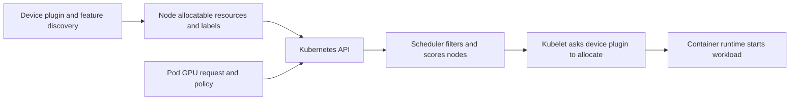

# Kubernetes Scheduling for Shared GPUs

Kubernetes schedules declared resources on eligible nodes. It does not know that one generic GPU request represents a whole device, a MIG profile, a time-sliced logical replica, or a vGPU-backed worker unless the platform exposes those differences as resources and policy.

That distinction is where many shared-GPU platforms fail. A Pod that is Running has passed a placement decision; it has not necessarily received the performance, isolation, or cost contract that its owner expected.

| Chapter profile | Value |
|---|---|
| Difficulty | Advanced |
| Reading time | 35–45 minutes |
| Prerequisites | [Volume 10, Chapter 04](../volume-10/chapter-04-device-plugin-and-kubernetes-resource-model) and the Volume 11 sharing chapters |
| Production outcome | An explicit, auditable mapping from workload request to GPU service class |

## Learning objectives

After this chapter, you will be able to:

- model distinct GPU sharing contracts in Kubernetes without ambiguous resource requests;
- combine device discovery with labels, taints, quotas, and admission controls;
- explain the limits of the default scheduler and device allocation; and
- diagnose Pending and misclassified GPU workloads systematically.

## What Kubernetes decides, and what it delegates



**Figure 11.7.1 — Node selection and device allocation are related but separate.** Resource requests establish schedulability; the device plugin performs device allocation after the Pod is bound. A request alone does not describe latency tolerance, profile intent, tenant class, or topology.

Kubernetes extended resources such as GPU resources are integer quantities. A container must request a whole unit of an extended resource; it cannot request a fractional GPU through the standard resource model. [Kubernetes extended resources](https://kubernetes.io/docs/concepts/configuration/manage-resources-containers/#extended-resources) The resource unit must therefore carry an unambiguous operational meaning.

## Design the resource catalog before workloads arrive

Do not expose all GPU access through `nvidia.com/gpu` if that name is used for materially different contracts. Use the NVIDIA device-plugin’s supported configuration and discovery tooling to publish the appropriate resource names, then bind each resource to a documented service class. Exact resource names and discovery behavior depend on the selected MIG strategy and plugin configuration. [NVIDIA MIG support in Kubernetes](https://docs.nvidia.com/datacenter/cloud-native/kubernetes/latest/index.html)

| Service class | Typical resource expression | Eligibility controls | User-visible contract |
|---|---|---|---|
| Dedicated accelerator | generic full-GPU resource in a dedicated pool | taint, node affinity, quota | full device and controlled maintenance policy |
| Fixed MIG shape | discovered profile-specific resource | profile labels, pool taint, quota | documented profile capacity and supported workload envelope |
| Best-effort shared access | explicitly named or separately governed time-sliced class | pool taint, strict namespace quota, admission | access, not a memory/compute or latency guarantee |
| VM-backed compute | a virtual-machine platform API rather than a misleading native GPU claim | VM scheduling and vGPU policy | VM lifecycle, supported vGPU profile, license state |

The precise implementation can differ, but the principle does not: a user must not be able to request a generic resource and silently receive a weaker class than the service objective requires.

## MIG strategy changes what the scheduler can see

NVIDIA’s device-plugin documentation describes `none`, `single`, and `mixed` MIG strategies. In `mixed`, different resource types can be advertised. NVIDIA also documents an important default behavior: a container should not request multiple different device types together because the specific device received is undefined; multiple instances of the same resource type are allowed. Review the installed release’s documentation before setting policy. [NVIDIA MIG Support in Kubernetes](https://docs.nvidia.com/datacenter/cloud-native/kubernetes/latest/index.html)

This makes request validation an admission concern. A policy can reject unsupported combinations before they create a confusing runtime allocation. It should also reject a time-sliced request where the namespace or workload class requires a protected resource, rather than relying on users to memorize the difference.

## Layer scheduling controls deliberately

| Control | Use it for | It cannot prove |
|---|---|---|
| GPU resource request | quantity and resource type | application readiness or expected latency |
| Node labels / affinity | validated hardware and sharing class | an entitlement to bypass capacity constraints |
| Taints / tolerations | reserving a pool for authorized workloads | device-level performance isolation |
| ResourceQuota | per-namespace capacity governance | fairness across namespaces by itself |
| LimitRange | default or bounded requests in a namespace | that every workload is suitable for sharing |
| PriorityClass | declared business importance | availability of a suitable device |
| Admission policy | enforce service-catalog rules | application correctness |

Use required node affinity only for hard compatibility or SLO constraints. Overly specific required rules create fragmentation, long Pending queues, and difficult hardware refreshes. For workload optimization, preferred affinity may preserve an acceptable fallback—but only if the fallback contract is actually acceptable.

## Quota and fairness begin with namespace boundaries

ResourceQuota can cap aggregate extended-resource consumption in a namespace. It should be paired with a namespace onboarding process: an owner, workload class, quota rationale, and escalation path. A quota that allows one team to consume every advertised time-slice can be technically valid and still violate the platform’s fairness policy.

For important interactive capacity, consider a queue or admission service outside the basic scheduler model. For large coordinated jobs, validate gang or queue behavior separately rather than assuming independent Pod scheduling protects partial starts. See [Volume 10, Chapter 08](../volume-10/chapter-08-gpu-scheduling-and-topology) for the distinction between capacity, eligibility, locality, and coordinated admission.

## Change management for scheduling policy

Treat labels, taints, resource names, and admission rules as an API. Version changes, test them against representative manifests, and announce deprecations before removing an eligible pool. A label typo can deny service; an overly broad toleration can route protected work to the wrong class. Both are production incidents, not cosmetic configuration errors.

When changing MIG geometry or time-slicing settings, drain and validate a canary node according to the platform runbook. Reconfirm device discovery, allocatable resources, labels, a representative protected workload, and a representative best-effort workload before expanding the change. The critical evidence is what the scheduler sees after reconciliation, not only a successful host-level command.

## A production Pod contract

The following is illustrative only. Labels, resource names, and quotas must match the cluster’s approved catalog.

```yaml
apiVersion: v1
kind: Pod
metadata:
  name: profile-qualified-serving
  labels:
    platform.example.com/gpu-service-class: protected-mig
spec:
  tolerations:
    - key: nvidia.com/gpu-service-class
      operator: Equal
      value: protected-mig
      effect: NoSchedule
  affinity:
    nodeAffinity:
      requiredDuringSchedulingIgnoredDuringExecution:
        nodeSelectorTerms:
          - matchExpressions:
              - key: platform.example.com/gpu-sharing
                operator: In
                values: [mig]
  containers:
    - name: service
      image: registry.example.invalid/approved-service:tag
      resources:
        limits:
          nvidia.com/mig-3g.20gb: 1
```

**Illustrative manifest.** It shows the relationship among a resource type, pool taint, and node label. It is not a portable profile recommendation, and it intentionally uses an invalid registry host.

## Troubleshooting scenario 1: a valid Pod remains Pending

**Symptom.** A Pod requests a published GPU resource but is never scheduled.

**Evidence path.** Read the Pod events first. Then compare the request with allocatable resources on eligible nodes, the namespace quota, taints/tolerations, node-affinity expressions, and the GPU feature-discovery labels. For MIG, verify that the required profile resource is actually exposed by the current geometry and device-plugin strategy.

**Common root causes.** The cluster has a different resource name than the manifest requests; capacity is present but in the wrong profile shape; a required label is stale; quota is exhausted; or the Pod lacks the pool toleration.

**Recovery.** Correct the contract mismatch or wait for genuinely eligible capacity. Avoid removing taints or relaxing affinity as a first response: that can place the workload into a pool that does not meet its stated requirement.

## Troubleshooting scenario 2: a latency-sensitive Pod is Running on shared capacity

**Symptom.** The Pod is Running and sees a GPU, but latency becomes erratic during multi-tenant demand.

**Evidence path.** Determine the node’s sharing class, assigned resource name, device-plugin time-slicing configuration, neighboring workload activity, and application latency. A generic GPU request may have allowed the Pod onto a best-effort node. Compare against a known-good protected pool.

**Recovery.** Amend the service class, not only the replica count. Use an explicit protected resource/pool and an admission policy that rejects the generic request for that workload label. Monitor queueing and fragmentation after the migration.

## Customer architecture discussion

An internal platform should publish a small menu, not a hardware scavenger hunt: “best-effort interactive,” “profile-qualified serving,” “dedicated accelerator,” and “VM-backed compute” are understandable service contracts. Each has a request method, quota, SLO posture, maintenance behavior, and support owner. Teams should choose among those contracts, while the platform remains free to evolve hardware beneath the documented boundaries.

That design is more resilient than exposing raw node labels to every team. It makes capacity reporting and chargeback possible because a resource request maps to a service class rather than an undocumented accident of node placement.

## Interview preparation

**Why are distinct resource names important in a shared GPU cluster?**

They make the requested capacity unit explicit. A full GPU, a MIG profile, and a time-sliced logical replica have different isolation and performance semantics, so one generic request cannot truthfully represent all three.

**Why is a Running Pod not proof of a successful platform outcome?**

Running proves that the scheduler and kubelet completed placement and startup. It says nothing about SLO compliance, resource-class correctness, interference, license health, or application readiness.

## Key takeaways

- Kubernetes schedules resource names and policy constraints, not an implicit sharing promise.
- Design a service catalog whose resource units have one documented meaning.
- Pair discovery with labels, taints, quota, and admission policy.
- Treat MIG geometry and plugin strategy as schedulability inputs.
- Diagnose events and eligibility before weakening placement rules.

## Cross references and further reading

- [Comparing MIG, Time-Slicing, and vGPU](./chapter-06-comparing-mig-time-slicing-and-vgpu)
- [Tenant Isolation, Security, and Fairness](./chapter-08-tenant-isolation-security-and-fairness)
- [Capacity Planning and Chargeback](./chapter-09-capacity-planning-and-chargeback)
- [Kubernetes: Extended Resources](https://kubernetes.io/docs/concepts/configuration/manage-resources-containers/#extended-resources)
- [NVIDIA: MIG Support in Kubernetes](https://docs.nvidia.com/datacenter/cloud-native/kubernetes/latest/index.html)
