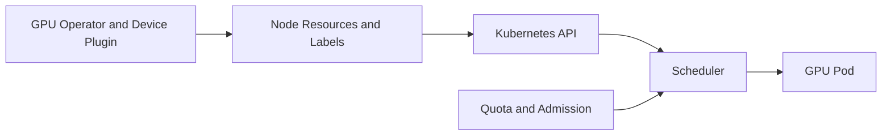

# Kubernetes Scheduling for Shared GPUs

Kubernetes schedules resource names and policy constraints. It does not understand the performance semantics of a sharing model unless the platform expresses them through distinct resources, labels, taints, quotas, and admission policy.

## Architecture

## Resource Design

Use separate node pools and resource identities where guarantees differ. Avoid presenting time-sliced access as equivalent to a MIG profile or full GPU.

## Scheduling Controls

- node labels for model, profile, and sharing mode;
- taints and tolerations for dedicated pools;
- ResourceQuota and LimitRange for tenant governance;
- priority classes for business criticality;
- topology-aware placement for multi-GPU work;
- admission checks for unsupported requests.

## Production Failure

**Symptom:** a latency-sensitive service lands on a time-sliced node.

**Root cause:** the workload requested a generic GPU resource without a policy that encoded its SLO.

**Resolution:** create explicit classes, labels, and admission rules; then migrate the workload.

## Interview Question

How would you prevent a best-effort tenant from consuming all logical GPU replicas in a namespace?
