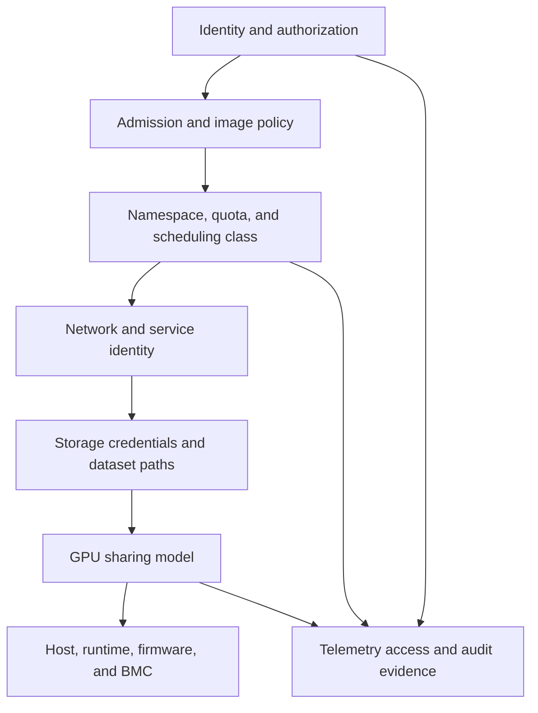

# Tenant Isolation, Security, and Fairness

Two teams can receive different GPU devices and still not be isolated. They may share a Kubernetes control plane, container registry, node operating system, network path, storage credential, telemetry backend, or a physical failure domain. GPU allocation is one layer of a tenant boundary, not the boundary itself.

This chapter treats sharing policy as an architecture decision: define who can run what, where their data flows, what they can observe, how contention is handled, and what happens when a higher-priority workload arrives. The result should be an enforceable service contract rather than a collection of optimistic conventions.

| Chapter profile | Value |
|---|---|
| Difficulty | Advanced |
| Reading time | 35–45 minutes |
| Prerequisites | Kubernetes identity and policy controls, plus [Chapter 06](./chapter-06-comparing-mig-time-slicing-and-vgpu) |
| Production outcome | A threat-modelled and measurable multi-tenant GPU service catalog |

## Learning objectives

After this chapter, you will be able to:

- map a workload’s threat model to layered tenant controls;
- state clearly what MIG, time-slicing, and vGPU do and do not isolate;
- design a fair-use policy that is observable and enforceable; and
- respond to cross-tenant interference without weakening security controls.

## A tenant boundary is an end-to-end path

**Figure 11.8.1 — The weakest relevant control determines the practical boundary.** A hardened GPU partition cannot protect a dataset mounted with another tenant’s credentials, and a namespace quota cannot protect a node exposed through an overly broad privileged workload policy.

## Start with a written threat model

For each service class, state whether tenants are mutually untrusted, whether administrators are in scope, which data is sensitive, and what disruption is unacceptable. Record the required blast-radius limit: process, GPU instance, VM, node, namespace, cluster, or account. Then verify that the selected controls actually operate at that boundary.

| Layer | Example controls | Question the design must answer |
|---|---|---|
| Identity | workload identity, RBAC, short-lived credentials | Who may request each GPU class and read operational data? |
| Admission | signed/approved images, policy checks, restricted privilege | Can a tenant escape into host-level device or runtime control? |
| Kubernetes | namespace, ResourceQuota, LimitRange, NetworkPolicy, Pod Security admission | Can one tenant consume or reach another tenant’s workload? |
| Data | separate credentials, scoped object prefixes, encrypted paths | Can the workload read only the datasets and checkpoints it owns? |
| GPU | dedicated device, MIG, time-slicing, vGPU | What hardware or VM boundary is required, and what remains shared? |
| Host | secure configuration, restricted node access, patching, device-plugin controls | Who can change the allocator or inspect host-level state? |
| Observability | tenant-scoped dashboards and audit logs | Does monitoring expose another tenant’s model names, prompts, paths, or usage? |

Kubernetes RBAC governs API authorization; it is not a substitute for network isolation, credential scope, or node hardening. Kubernetes NetworkPolicy governs traffic for implementations that support it, but it does not establish a GPU security boundary. [Kubernetes RBAC](https://kubernetes.io/docs/reference/access-authn-authz/rbac/) and [Network Policies](https://kubernetes.io/docs/concepts/services-networking/network-policies/)

## What sharing mechanisms contribute

MIG partitions supported GPU hardware into GPU instances with dedicated memory and compute resources, and NVIDIA documents isolated memory paths that help provide predictable QoS. It is a meaningful resource-isolation primitive, but applications still share the host, orchestrator, images, and often external services. [NVIDIA MIG introduction](https://docs.nvidia.com/datacenter/tesla/mig-user-guide/latest/introduction.html)

Time-slicing multiplexes workloads on a physical GPU. NVIDIA’s device-plugin documentation warns that a time-sliced replica does not receive a proportional share of memory or compute. It should be treated as a capacity-access mechanism for compatible workloads, not as a hard isolation or fairness guarantee. [NVIDIA k8s-device-plugin sharing](https://github.com/NVIDIA/k8s-device-plugin#shared-access-to-gpus)

vGPU provides a virtual device to a guest VM and supports VM-oriented operations. Its boundary is useful when the VM is the tenant contract, but the host manager, hypervisor, guest driver, license service, storage, and network remain part of the security review. See [Chapter 05](./chapter-05-vgpu-architecture-and-enterprise-virtualization).

## Fairness is a policy, not an equal split

Equal allocation can be unfair if an emergency model service, a training deadline, and a student notebook all receive the same treatment. Conversely, an unrestricted priority policy can make a shared platform unusable for everyone except the loudest tenant. Define fairness through a small set of observable rules:

| Policy element | Decision to make | Evidence to review |
|---|---|---|
| Entitlement | baseline quota per tenant or project | requested, allocated, and idle capacity hours |
| Priority | which service classes may preempt or borrow | queue time, interruption count, approved reason |
| Borrowing | when unused reserved capacity is reclaimable | owner notification, recall time, workload checkpoint state |
| Limits | maximum concurrent shared allocations | rejection events and physical saturation metrics |
| Cost | showback/chargeback unit and guarantee level | usage record, reservation age, profile fragmentation |
| Appeals | who resolves a policy conflict | decision log and remediation date |

Quota alone controls an aggregate ceiling. It does not coordinate first-come behavior, prevent a noisy workload from causing latency variance on a time-sliced GPU, or decide whether a lower-priority training task can be disrupted safely. Pair quota with service classes, application-aware SLO monitoring, and a documented preemption or queueing mechanism where the business requires it.

## Production pattern: isolate the control plane from the data plane

Give users the minimum interface required to consume a GPU service. An application team may need a namespace, approved image source, service account, storage credential, and an allowed GPU class. It should not need host SSH, access to the device-plugin configuration, cluster-wide node lists, or other tenants’ GPU telemetry.

Keep node-level operations in a restricted platform-admin path. Device-plugin configuration, MIG geometry, driver state, and host diagnostics affect every tenant on a node. Changes to them should use change control, a drained or canary node, and an evidence trail. This is especially important for time-sliced pools, where a policy error can increase the logical allocation count while leaving a single physical bottleneck.

## Preemption and maintenance require workload consent

Before allowing lower-priority GPU work to be preempted, establish whether it can checkpoint, how long it needs to terminate safely, where the checkpoint goes, and how restart is tracked. A training job without verified checkpoint recovery is not meaningfully preemptible; it is simply interruptible.

## Evidence and audit design

Capture enough evidence to reconstruct a capacity or security decision without collecting application payloads by default. Useful records include workload identity, approved service class, request and allocation timestamps, policy decision, node pool, resource type, quota state, and a tenant-safe outcome code. Decide who can view each record and how long it is retained before the first incident demands it.

Audit data must itself honor tenancy. A centralized dashboard that exposes another team’s model identifiers, dataset names, or failure messages can undo the isolation controls at the workload layer. Build role-scoped views and make exceptional access visible in the audit trail.

For non-preemptible online services, reserve capacity and test failover. For interactive best-effort work, publish that sessions can slow down or be reclaimed. Making these rules explicit is kinder to users and safer for operators than pretending every tenant receives the same availability.

## Troubleshooting scenario 1: one tenant causes another tenant’s OOM or latency collapse

**Symptom.** A protected workload shares a node with a new workload and begins failing or missing its latency target.

**Evidence path.** Confirm the sharing model and resource class each workload received; inspect GPU memory, active processes, application queueing, and node events. Determine whether the incident is memory exhaustion inside one workload, physical contention in a time-sliced class, or an admission-policy failure that put incompatible workloads together. Preserve tenant-safe evidence: usage aggregates and identifiers, not unnecessary customer inputs.

**Recovery.** Move the sensitive workload to dedicated or appropriate MIG capacity, cap or pause the offending best-effort class according to policy, and correct the admission rule. Do not expose another tenant’s logs or data while diagnosing the incident.

## Troubleshooting scenario 2: a namespace can consume GPU capacity but cannot reach its model data

**Symptom.** Scheduling succeeds, but the application returns permission errors or repeatedly restarts while loading a model or checkpoint.

**Evidence path.** Confirm the Pod’s service account, mounted or injected credential, destination policy, storage identity, and relevant audit logs. Verify that the image and workload are in the intended namespace and that the requested data path belongs to the tenant. A GPU request and a valid RBAC permission to create Pods do not grant storage access.

**Recovery.** Repair the least-privileged data credential or path policy, then validate with a scoped read. Do not solve the incident by mounting a shared administrative credential into the workload.

## Customer architecture discussion

A central platform group can offer three contracts: a restricted best-effort development pool, a protected production-serving pool, and a VM-backed regulated environment. Each contract should list its identity requirements, sharing method, quota, performance posture, maintenance behavior, telemetry visibility, and incident owner. The key decision is not whether all users are “trusted”; it is whether their failure, data, and operational responsibilities are allowed to overlap.

This also makes chargeback honest. A tenant paying for protected capacity is paying for policy, headroom, and operational restraint—not only a fraction of silicon. Chapter 09 translates that contract into capacity and cost units.

## Interview preparation

**Why is time-slicing not a security boundary?**

It increases concurrent access to a physical GPU but does not create dedicated hardware memory and compute partitions or replace the broader identity, host, network, and data controls required by a tenant threat model.

**What must be true before GPU preemption is safe?**

The workload class must explicitly permit disruption; state recovery and checkpoint paths must be tested; termination behavior, priority, owner notification, and restart responsibility must be documented; and the replacement workload must have a valid service need.

## Key takeaways

- A secure shared-GPU platform is a layered system, not a device-plugin configuration.
- Match the sharing mechanism to the required boundary, then secure everything around it.
- Fairness means published, observable rules for entitlement, borrowing, priority, and recovery.
- Protect operational telemetry and diagnostic evidence as tenant data.
- Treat node and allocator changes as high-blast-radius operations.

## Cross references and further reading

- [vGPU Architecture and Enterprise Virtualization](./chapter-05-vgpu-architecture-and-enterprise-virtualization)
- [Kubernetes Scheduling for Shared GPUs](./chapter-07-kubernetes-scheduling-for-shared-gpus)
- [Capacity Planning and Chargeback](./chapter-09-capacity-planning-and-chargeback)
- [Kubernetes RBAC documentation](https://kubernetes.io/docs/reference/access-authn-authz/rbac/)
- [Kubernetes NetworkPolicy documentation](https://kubernetes.io/docs/concepts/services-networking/network-policies/)
