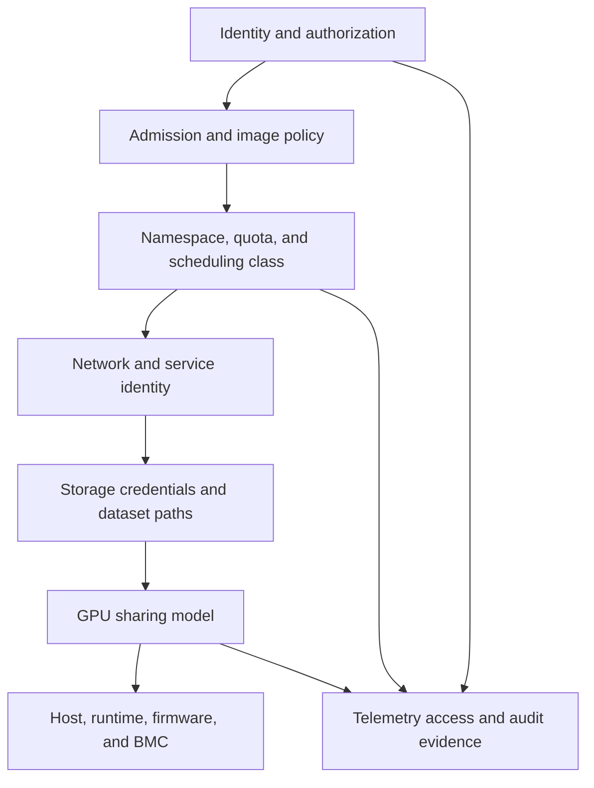

# Tenant Isolation, Security, and Fairness

Two teams can receive different GPU devices and still not be isolated. They may share a Kubernetes control plane, container registry, node operating system, network path, storage credential, telemetry backend, or a physical failure domain. GPU allocation is one layer of a tenant boundary, not the boundary itself.

This chapter treats sharing policy as an architecture decision: define who can run what, where their data flows, what they can observe, how contention is handled, and what happens when a higher-priority workload arrives. The result should be an enforceable service contract rather than a collection of optimistic conventions.

| Chapter profile | Value |
|---|---|
| Difficulty | Advanced |
| Reading time | 35–45 minutes |
| Prerequisites | Kubernetes identity and policy controls, plus [Chapter 06](./chapter-06-comparing-mig-time-slicing-and-vgpu) |
| Production outcome | A threat-modelled and measurable multi-tenant GPU service catalog |

## Learning objectives

After this chapter, you will be able to:

- map a workload’s threat model to layered tenant controls;
- state clearly what MIG, time-slicing, and vGPU do and do not isolate;
- design a fair-use policy that is observable and enforceable; and
- respond to cross-tenant interference without weakening security controls.

## A tenant boundary is an end-to-end path

**Figure 11.8.1 — The weakest relevant control determines the practical boundary.** A hardened GPU partition cannot protect a dataset mounted with another tenant’s credentials, and a namespace quota cannot protect a node exposed through an overly broad privileged workload policy.

## Start with a written threat model

For each service class, state whether tenants are mutually untrusted, whether administrators are in scope, which data is sensitive, and what disruption is unacceptable. Record the required blast-radius limit: process, GPU instance, VM, node, namespace, cluster, or account. Then verify that the selected controls actually operate at that boundary.

| Layer | Example controls | Question the design must answer |
|---|---|---|
| Identity | workload identity, RBAC, short-lived credentials | Who may request each GPU class and read operational data? |
| Admission | signed/approved images, policy checks, restricted privilege | Can a tenant escape into host-level device or runtime control? |
| Kubernetes | namespace, ResourceQuota, LimitRange, NetworkPolicy, Pod Security admission | Can one tenant consume or reach another tenant’s workload? |
| Data | separate credentials, scoped object prefixes, encrypted paths | Can the workload read only the datasets and checkpoints it owns? |
| GPU | dedicated device, MIG, time-slicing, vGPU | What hardware or VM boundary is required, and what remains shared? |
| Host | secure configuration, restricted node access, patching, device-plugin controls | Who can change the allocator or inspect host-level state? |
| Observability | tenant-scoped dashboards and audit logs | Does monitoring expose another tenant’s model names, prompts, paths, or usage? |

Kubernetes RBAC governs API authorization; it is not a substitute for network isolation, credential scope, or node hardening. Kubernetes NetworkPolicy governs traffic for implementations that support it, but it does not establish a GPU security boundary. [Kubernetes RBAC](https://kubernetes.io/docs/reference/access-authn-authz/rbac/) and [Network Policies](https://kubernetes.io/docs/concepts/services-networking/network-policies/)

## What sharing mechanisms contribute

MIG partitions supported GPU hardware into GPU instances with dedicated memory and compute resources, and NVIDIA documents isolated memory paths that help provide predictable QoS. It is a meaningful resource-isolation primitive, but applications still share the host, orchestrator, images, and often external services. [NVIDIA MIG introduction](https://docs.nvidia.com/datacenter/tesla/mig-user-guide/latest/introduction.html)

Time-slicing multiplexes workloads on a physical GPU. NVIDIA’s device-plugin documentation warns that a time-sliced replica does not receive a proportional share of memory or compute. It should be treated as a capacity-access mechanism for compatible workloads, not as a hard isolation or fairness guarantee. [NVIDIA k8s-device-plugin sharing](https://github.com/NVIDIA/k8s-device-plugin#shared-access-to-gpus)

vGPU provides a virtual device to a guest VM and supports VM-oriented operations. Its boundary is useful when the VM is the tenant contract, but the host manager, hypervisor, guest driver, license service, storage, and network remain part of the security review. See [Chapter 05](./chapter-05-vgpu-architecture-and-enterprise-virtualization).

## Fairness is a policy, not an equal split

Equal allocation can be unfair if an emergency model service, a training deadline, and a student notebook all receive the same treatment. Conversely, an unrestricted priority policy can make a shared platform unusable for everyone except the loudest tenant. Define fairness through a small set of observable rules:

| Policy element | Decision to make | Evidence to review |
|---|---|---|
| Entitlement | baseline quota per tenant or project | requested, allocated, and idle capacity hours |
| Priority | which service classes may preempt or borrow | queue time, interruption count, approved reason |
| Borrowing | when unused reserved capacity is reclaimable | owner notification, recall time, workload checkpoint state |
| Limits | maximum concurrent shared allocations | rejection events and physical saturation metrics |
| Cost | showback/chargeback unit and guarantee level | usage record, reservation age, profile fragmentation |
| Appeals | who resolves a policy conflict | decision log and remediation date |

Quota alone controls an aggregate ceiling. It does not coordinate first-come behavior, prevent a noisy workload from causing latency variance on a time-sliced GPU, or decide whether a lower-priority training task can be disrupted safely. Pair quota with service classes, application-aware SLO monitoring, and a documented preemption or queueing mechanism where the business requires it.

## Production pattern: isolate the control plane from the data plane

Give users the minimum interface required to consume a GPU service. An application team may need a namespace, approved image source, service account, storage credential, and an allowed GPU class. It should not need host SSH, access to the device-plugin configuration, cluster-wide node lists, or other tenants’ GPU telemetry.

Keep node-level operations in a restricted platform-admin path. Device-plugin configuration, MIG geometry, driver state, and host diagnostics affect every tenant on a node. Changes to them should use change control, a drained or canary node, and an evidence trail. This is especially important for time-sliced pools, where a policy error can increase the logical allocation count while leaving a single physical bottleneck.

## Preemption and maintenance require workload consent

Before allowing lower-priority GPU work to be preempted, establish whether it can checkpoint, how long it needs to terminate safely, where the checkpoint goes, and how restart is tracked. A training job without verified checkpoint recovery is not meaningfully preemptible; it is simply interruptible.

## Evidence and audit design

Capture enough evidence to reconstruct a capacity or security decision without collecting application payloads by default. Useful records include workload identity, approved service class, request and allocation timestamps, policy decision, node pool, resource type, quota state, and a tenant-safe outcome code. Decide who can view each record and how long it is retained before the first incident demands it.

Audit data must itself honor tenancy. A centralized dashboard that exposes another team’s model identifiers, dataset names, or failure messages can undo the isolation controls at the workload layer. Build role-scoped views and make exceptional access visible in the audit trail.

For non-preemptible online services, reserve capacity and test failover. For interactive best-effort work, publish that sessions can slow down or be reclaimed. Making these rules explicit is kinder to users and safer for operators than pretending every tenant receives the same availability.

## Troubleshooting scenario 1: one tenant causes another tenant’s OOM or latency collapse

**Symptom.** A protected workload shares a node with a new workload and begins failing or missing its latency target.

**Evidence path.** Confirm the sharing model and resource class each workload received; inspect GPU memory, active processes, application queueing, and node events. Determine whether the incident is memory exhaustion inside one workload, physical contention in a time-sliced class, or an admission-policy failure that put incompatible workloads together. Preserve tenant-safe evidence: usage aggregates and identifiers, not unnecessary customer inputs.

**Recovery.** Move the sensitive workload to dedicated or appropriate MIG capacity, cap or pause the offending best-effort class according to policy, and correct the admission rule. Do not expose another tenant’s logs or data while diagnosing the incident.

## Troubleshooting scenario 2: a namespace can consume GPU capacity but cannot reach its model data

**Symptom.** Scheduling succeeds, but the application returns permission errors or repeatedly restarts while loading a model or checkpoint.

**Evidence path.** Confirm the Pod’s service account, mounted or injected credential, destination policy, storage identity, and relevant audit logs. Verify that the image and workload are in the intended namespace and that the requested data path belongs to the tenant. A GPU request and a valid RBAC permission to create Pods do not grant storage access.

**Recovery.** Repair the least-privileged data credential or path policy, then validate with a scoped read. Do not solve the incident by mounting a shared administrative credential into the workload.

## Scope controls by administrative plane

Separate controls by the plane they govern. The workload plane contains Pods, VMs, service accounts, images, and data access. The node plane contains the host OS, device plugin, runtime configuration, GPU driver, and physical device state. The management plane contains cluster administration, virtualization administration, licensing, registry administration, and out-of-band hardware control. A workload namespace must not become a path to node or management-plane authority.

| Plane | Typical threat | Control direction | Audit question |
|---|---|---|---|
| Workload | one tenant reads another tenant’s data | scoped identity, network and storage policy | Which identity accessed which path? |
| Node | a workload changes device/runtime state | restricted privilege, hardened node access | Who changed allocator or driver state? |
| Management | broad admin access changes tenant service | separate roles, MFA, change controls | Was the change approved and attributable? |
| Observability | dashboards expose tenant context | role-scoped views and retention policy | Who could see model, path, or usage metadata? |

This division also improves incident response. A platform engineer can investigate node state without gaining customer-data access; an application owner can inspect service metrics without receiving other tenants’ allocation records; a security reviewer can reconstruct administrative change without reading prompts or datasets.

## Image and runtime trust

GPU sharing does not make container supply-chain risk disappear. An image can request a GPU while carrying vulnerable libraries, unexpected network clients, or code that attempts to discover host behavior. Establish an approved registry path, image provenance and scanning policy, and an exception process. Keep the controls proportionate: a training image may legitimately include development tools that a production inference image must not.

Runtime policy should restrict unnecessary host namespaces, privileged containers, hostPath mounts, and direct access to node-level configuration. The exact controls depend on the Kubernetes distribution and organizational baseline, but the objective is stable: a tenant should receive the device service it requested, not an administrative path to the node that supplies it.

## Data, model, and telemetry boundaries

Model artifacts and checkpoints are often the most valuable tenant data in a GPU environment. Give each workload an identity that can read only the required artifact prefixes or volumes. Rotate credentials, make writes attributable, and test revocation. A broad shared bucket credential may reduce onboarding friction while turning one compromised notebook into a cross-tenant incident.

Telemetry needs equivalent discipline. Per-process GPU metrics, Pod labels, command lines, object names, and error strings can reveal business context. Offer tenants the metrics needed to operate their service—latency, utilization, errors, allocations—while reserving fleet-wide diagnostic data for authorized platform roles. Document whether metrics are aggregated, redacted, or retained.

## Fairness controls at three time scales

At admission time, quota and policy determine who may start work. During execution, concurrency limits and resource classes limit harmful contention. Over weeks or months, showback, reservation expiry, and capacity planning correct hoarding and reveal whether an entitlement matches demand. A fair system needs all three; a daily report cannot repair a real-time saturation event.

| Time scale | Control | Failure if absent |
|---|---|---|
| Admission | class eligibility, quota, approval | unauthorized or unbounded requests start |
| Execution | concurrency, protected pools, priority rules | noisy workloads degrade others |
| Lifecycle | reservation review, showback, demand forecast | idle claims and fragmentation become permanent |

Borrowing must have a recall policy. If a tenant may borrow idle protected capacity, define how much warning it receives, whether its job must checkpoint, and when the original owner can reclaim. Without that contract, “idle” capacity becomes a recurring conflict between teams.

## Security and performance are connected

It is tempting to relax tenant policy during an availability incident: add a broad toleration, give a Pod a privileged mode, or mount a shared credential so work can continue. These shortcuts create a second incident with a larger blast radius. Instead, predefine degraded modes. A service may fall back from a protected MIG pool to a lower-throughput dedicated pool, or a best-effort job may pause; it should not fall back to weaker identity or host security.

The same principle applies to diagnostics. Collect minimum necessary evidence, redact application payloads, and preserve the chain of custody for host logs. An operations team that can solve a GPU fault only by copying customer data into a ticket lacks an adequate observability design.

## Incident playbook: unauthorized GPU class or privilege escalation attempt

**Symptoms.** An admission denial shows an unauthorized resource class, or security monitoring detects a workload requesting privileged settings, host mounts, or broad device access inconsistent with its service class.

**Evidence.** Preserve the submitted manifest, identity, namespace, admission decision, image reference/digest, relevant policy result, and a timestamped audit record. Do not run the untrusted workload on a production GPU node merely to observe its behavior.

**Diagnosis.** Determine whether the request is an onboarding error, an outdated deployment template, or an intentional attempt to cross the workload-to-node boundary. Compare the requested permissions and resource class with the tenant’s documented contract.

**Remediation.** Correct the manifest or provide an approved class through the documented exception process. For suspicious activity, contain access under the security incident process and review related credential and image provenance evidence.

**Verification.** Confirm a revised, least-privileged manifest is admitted and receives only its approved resource class. Verify the tenant can still perform the legitimate workload operation.

**Prevention.** Maintain versioned templates, policy tests in CI, clear rejection messages, and periodic reviews of exemptions. Every temporary exception needs an owner and expiry.

## Incident playbook: cross-tenant information exposure through telemetry

**Symptoms.** A tenant dashboard or support export exposes another tenant’s namespace, model identifier, dataset path, allocation history, or error context.

**Evidence.** Record the view, viewer identity, role bindings, query or dashboard configuration, data-source permissions, retention policy, and access logs. Minimize additional exposure while preserving enough evidence for the security review.

**Diagnosis.** Identify whether the root cause is an overly broad data-source credential, missing tenant filter, an inherited role, or an export process that bypasses the dashboard’s intended scoping.

**Remediation.** Revoke or narrow the data-source permission, repair the role/view filter, invalidate shared exports where necessary, and notify the appropriate security and privacy owners according to policy. Do not merely hide the widget while leaving the underlying query broadly accessible.

**Verification.** Test with two controlled tenant identities: each must see its permitted aggregate information and be denied the other tenant’s data. Review audit logs for any continued broad access.

**Prevention.** Treat observability assets as production access-controlled resources. Review dashboards, alerts, exports, and saved queries alongside RBAC changes and perform tenant-scope tests before rollout.

## Incident playbook: priority conflict disrupts a recoverable workload

**Symptoms.** A lower-priority job is displaced to admit protected work, but it fails to resume, loses progress, or its owner disputes the action.

**Evidence.** Capture priority class, policy decision, termination signal timing, checkpoint location and success evidence, restart event, workload owner, and capacity condition that triggered the action.

**Diagnosis.** Determine whether the workload was correctly classified as preemptible and whether it had a verified checkpoint/restart path. Distinguish a policy decision from a platform failure; both require different corrective actions.

**Remediation.** Restore from the last valid checkpoint or provide capacity through the documented exception path. If the workload was misclassified, suspend further automated disruption until its recovery contract is corrected.

**Verification.** Run a scoped preemption drill or restart test that proves the job resumes with acceptable data integrity and reports its progress correctly.

**Prevention.** Require recovery testing before placing a class in a preemptible tier. Publish maximum interruption frequency, notification behavior, and service-owner responsibilities.

## Revision checklist

- What is the required tenant boundary: process, GPU instance, VM, node, namespace, or cluster?
- Which identities may request each class, change allocator state, and inspect fleet telemetry?
- What data path proves a workload can access only its permitted artifacts?
- How does a borrowed allocation return to its owner without an ad hoc conflict?
- Which degraded modes preserve security while meeting the most important service objective?
- Can two controlled tenant identities prove that dashboards and diagnostics are properly scoped?

## Tenant onboarding control points

Make tenant onboarding a controlled sequence rather than an RBAC ticket. Identify the business owner, technical owner, data classification, approved GPU classes, expected capacity, network dependencies, model/data locations, and incident contact. Use that information to create scoped identities, quota, policy bindings, telemetry views, and a documented exit path.

| Onboarding stage | Gate | Evidence |
|---|---|---|
| Identity | tenant roles and service account are scoped | role binding review |
| Workload | approved image and manifest class | admission test |
| Network | only required peers are reachable | policy validation |
| Data | artifact and checkpoint access is least privilege | scoped read/write test |
| Capacity | quota and priority match contract | controlled allocation test |
| Observability | dashboard and logs are tenant-safe | two-identity scope test |

Offboarding matters equally. Revoke identities and credentials, remove quotas and policy exceptions, archive or delete data according to retention policy, and verify that saved dashboards or alerts do not continue to expose context to former members.

## Incident communications by audience

During a shared-platform incident, report the service effect without disclosing other tenants’ details. A tenant needs to know whether its class is constrained, whether it should retry, and the approved workaround. A platform operator needs host and allocator evidence. Security owners need identity, access, and exposure facts. A single unrestricted incident channel is not an access-control model.

Prewrite customer-facing status templates for capacity saturation, node-class maintenance, and policy denial. They should communicate the contract and next action without blaming another tenant or revealing their workload. This improves fairness because every customer receives the same clear operational boundary.

## Measuring fairness outcomes

Measure more than resource allocation. Compare wait time, rejection rate, allocation duration, interruption count, and delivered SLO across tenants and classes. Investigate persistent outliers, but interpret them in the context of entitlement: a protected service may legitimately receive a different result than a best-effort service.

If a best-effort class becomes permanently saturated, the answer may be more capacity, a lower concurrency policy, a queue, or a different service expectation. It is not automatically appropriate to borrow protected capacity without recall and recovery controls.

## Security review prompts

- Which actor can change GPU geometry, plugin settings, vGPU profiles, or node labels?
- Can an application image request host-level privilege or discover another tenant’s data path?
- Do telemetry labels, traces, and support bundles contain sensitive model or data identifiers?
- What prevents a temporary policy exception from becoming permanent?
- How is a tenant’s credential revoked during an incident without disrupting unrelated tenants?
- Which logs prove the decision to preempt, borrow, or deny capacity was authorized?

## Architecture review scenario

A university shares GPUs among students, research groups, and a small production team. Students need broad access but can tolerate delay. Research groups need occasional high-capacity runs and checkpoint recovery. The production team needs predictable serving behavior and no access to student data. A single open GPU pool would mix incompatible risk and service objectives.

The platform can therefore use an explicitly best-effort student class with bounded identity and quota, a research class with scheduled access and verified storage paths, and a protected production class with distinct node/policy controls. The important outcome is not perfect utilization on every day; it is an understandable boundary that prevents low-risk demand from silently changing production risk.

## Exception management

Every security or capacity exception should name its requester, approver, scope, reason, compensating controls, start time, and expiry. Examples include temporary access to a protected class, an increased quota during an incident, or a diagnostic permission to view node evidence. Review expiry automatically; permanent exceptions are policy changes and need the same design review as a new service class.

Avoid broad “admin for troubleshooting” roles. Instead provide narrowly scoped, time-bound access and preserve the audit record. The operator receiving an exception should still have a procedure that protects other tenants’ data and capacity.

## Chapter review exercises

1. Create a tenant-boundary map for a workload from user identity to dataset, GPU, telemetry, and incident evidence.
2. Identify which controls protect against capacity abuse and which protect against information exposure.
3. Design a borrowing policy with a recall time and checkpoint requirement.
4. Test a dashboard with two tenant identities and document both allowed and denied views.
5. Write an exception record for a temporary protected-capacity request and include its expiry.

The aim is to make multi-tenancy reviewable. If a control cannot be tested by a scoped identity or an auditable event, it is probably a convention rather than a control.

## Design decisions that deserve review

**Trust classification.** Decide whether tenants are mutually untrusted, administratively separate, or merely different cost centers. The answer changes the required controls.

**Data classification.** A public model with private prompts and a private model with public test data have different exposure paths. Scope artifacts, logs, and diagnostics accordingly.

**Fairness objective.** Equal resource count, equal wait time, guaranteed reservations, and priority service are different policies. Select one deliberately for each class.

**Preemption authority.** Name who can displace work, what evidence is required, and how the affected owner is notified and recovered.

**Telemetry access.** Treat dashboards and alerts as data products with roles, retention, and export controls—not as universally safe operational tools.

## Common misconceptions

- A namespace is not by itself a complete tenant boundary.
- Quota cannot guarantee latency or protect a workload from time-sliced contention.
- MIG does not remove host, image, network, or storage security responsibilities.
- A temporary broad credential is not a harmless troubleshooting workaround.
- Fairness cannot be inferred from total fleet utilization alone.

## Final tenant-boundary questions

Can each tenant be identified, authorized, metered, and offboarded without using a shared administrative identity?

Can the platform show why a capacity request was admitted, denied, borrowed, or displaced?

Can a security incident be investigated without exposing another tenant’s workload data?

Can a degraded-mode decision preserve least privilege rather than granting emergency broad access?

If the answer is unclear, the sharing mechanism is ahead of the multi-tenant operating model.

## Exit criteria for a tenant class

Before publishing a tenant class, validate role scope, data-path scope, policy enforcement, quota behavior, telemetry scoping, incident communication, and offboarding. An approved GPU profile without these tests is a capacity feature, not a multi-tenant service.

Repeat these tests after policy, identity-provider, or telemetry changes.

Record their results with the class approval.

Test both normal operation and the approved degraded mode.

Review exceptions before the class renewal date.

Retest after every material platform change.

## Customer architecture discussion

A central platform group can offer three contracts: a restricted best-effort development pool, a protected production-serving pool, and a VM-backed regulated environment. Each contract should list its identity requirements, sharing method, quota, performance posture, maintenance behavior, telemetry visibility, and incident owner. The key decision is not whether all users are “trusted”; it is whether their failure, data, and operational responsibilities are allowed to overlap.

This also makes chargeback honest. A tenant paying for protected capacity is paying for policy, headroom, and operational restraint—not only a fraction of silicon. Chapter 09 translates that contract into capacity and cost units.

## Interview preparation

**Why is time-slicing not a security boundary?**

It increases concurrent access to a physical GPU but does not create dedicated hardware memory and compute partitions or replace the broader identity, host, network, and data controls required by a tenant threat model.

**What must be true before GPU preemption is safe?**

The workload class must explicitly permit disruption; state recovery and checkpoint paths must be tested; termination behavior, priority, owner notification, and restart responsibility must be documented; and the replacement workload must have a valid service need.

## Key takeaways

- A secure shared-GPU platform is a layered system, not a device-plugin configuration.
- Match the sharing mechanism to the required boundary, then secure everything around it.
- Fairness means published, observable rules for entitlement, borrowing, priority, and recovery.
- Protect operational telemetry and diagnostic evidence as tenant data.
- Treat node and allocator changes as high-blast-radius operations.

## Cross references and further reading

- [vGPU Architecture and Enterprise Virtualization](./chapter-05-vgpu-architecture-and-enterprise-virtualization)
- [Kubernetes Scheduling for Shared GPUs](./chapter-07-kubernetes-scheduling-for-shared-gpus)
- [Capacity Planning and Chargeback](./chapter-09-capacity-planning-and-chargeback)
- [Kubernetes RBAC documentation](https://kubernetes.io/docs/reference/access-authn-authz/rbac/)
- [Kubernetes NetworkPolicy documentation](https://kubernetes.io/docs/concepts/services-networking/network-policies/)
