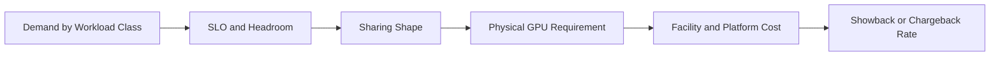

# Capacity Planning and Chargeback

Logical replicas, MIG instances, vGPU profiles, and whole GPUs are different capacity units. A financial model that treats them as equivalent will misprice the service.

## Capacity Model

Track physical GPU hours, allocated profile hours, memory occupancy, delivered throughput, queue time, power, and failure reserve.

## Headroom

Capacity must include maintenance, node failure, upgrade canaries, demand spikes, and profile fragmentation. Planning to 100 percent theoretical allocation creates an unavailable service.

## Chargeback Principles

- bill by a clearly defined service unit;
- include the guarantee level;
- separate reserved and best-effort capacity;
- expose idle reservations;
- avoid rewarding unstable oversubscription.

## Customer Question

Why does a small isolated profile cost more than its arithmetic fraction of a GPU? Because the service price includes stranded geometry, reliability reserve, operations, support, and the guarantee provided.
