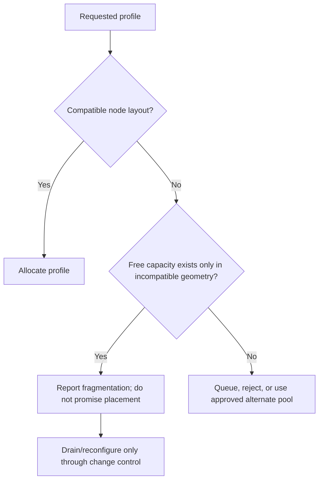

# Capacity Planning and Chargeback

A shared GPU platform fails commercially before it fails technically when its published capacity unit does not match what the hardware can actually deliver. A team can request ten logical time-sliced replicas, three MIG profiles, or a virtual GPU, but those requests consume different combinations of physical memory, compute partitioning, scheduler opportunity, operational effort, and failure reserve. Counting all of them as “one GPU” obscures the constraint that will strand capacity or break an SLO.

This chapter builds a planning model that starts with workload demand and ends with an explicit service promise. It deliberately avoids a universal utilization target or a synthetic performance multiplier. Those values are workload-, hardware-, configuration-, and service-level-specific; they must be measured in the platform that will carry the service.

## Learning objectives

After this chapter, you should be able to:

- distinguish physical inventory, allocatable inventory, and sellable capacity;
- model a service class using demand, performance evidence, availability reserve, and placement constraints;
- recognize MIG geometry fragmentation and time-slicing contention as different planning risks;
- construct showback or chargeback units that communicate the guarantee being purchased; and
- use capacity signals to choose between standardization, new hardware, a different sharing model, or demand controls.

## A planning incident: the cluster that looked half empty

An internal platform team reported 48 percent fleet utilization and deferred a purchase. Two weeks later, a new inference tenant could not obtain its requested MIG profile, while batch teams waited behind a maintenance drain. The dashboard was not wrong; it was incomplete. It averaged device activity across incompatible profile layouts, included temporarily unavailable nodes as if they were usable, and ignored the spare capacity reserved for the team’s latency objective.

The correction was not to inflate every rate. The team separated inventory from service capacity, recorded the approved layouts per node pool, and measured demand by workload class. The visible result was a smaller number called *available capacity*, but it was the number the scheduler and service owners could use.

## Capacity is a chain of constraints

```mermaid
flowchart LR
    Demand[Demand by workload class] --> Promise[Latency, throughput, or completion promise]
    Promise --> Shape[Whole GPU, MIG profile, time-sliced replica, or vGPU]
    Shape --> Placement[Compatible layout and node pool]
    Placement --> Reserve[Failure, maintenance, and rollout reserve]
    Reserve --> Sellable[Sellable capacity]
    Sellable --> Policy[Admission, quota, reservation, and rate]
    Telemetry[Usage, queueing, errors, and performance] --> Demand
    Telemetry --> Promise
```



**Figure 11.9.1 — A logical allocation becomes a service only after a compatible physical shape and resilience reserve exist.** A rate card is the final expression of that operational model, not a substitute for it.

Every link can constrain capacity:

| Capacity layer | Question | Common planning error |
|---|---|---|
| Physical inventory | Which installed GPUs are healthy and support the intended mode? | Counting a failed, drained, unsupported, or maintenance-bound device |
| Configured inventory | Which MIG layouts, vGPU profiles, or replica policies are actually configured? | Assuming a supported profile is immediately schedulable |
| Allocatable inventory | What does Kubernetes or the virtualization platform advertise now? | Treating advertised replicas as independent physical GPUs |
| Service capacity | What can meet the documented performance and availability promise? | Equating scheduler placement with delivered service |
| Sellable capacity | What remains after reserve, fragmentation, and committed demand? | Selling all theoretical capacity and calling reserve “utilization” |

The [Kubernetes scheduling chapter](./chapter-07-kubernetes-scheduling-for-shared-gpus) explains how resource advertisements influence placement. This chapter adds the operating model: capacity is useful only when the requested shape can be placed *and* the remaining platform can keep its commitment during ordinary failures and maintenance.

## Start with workload classes, not devices

Device-centric planning begins with a GPU model and asks how many users can be put on it. Service-centric planning begins with a workload and asks what it needs from the platform. A useful workload class describes the dimensions that change the sharing decision.

| Workload class | Demand pattern | Primary service outcome | Typical starting allocation | Planning evidence |
|---|---|---|---|---|
| Interactive development | Bursty, interruptible | Time to access; bounded disruption | Best-effort time-sliced or shared development pool | Queue-time distribution, memory failures, active-user overlap |
| Latency-sensitive inference | Variable request rate | Tail latency and error rate | Dedicated or validated MIG profile | Arrival rate, batching behavior, p95/p99 latency, memory headroom |
| Batch inference | Queueable, throughput-oriented | Completion window and cost | Whole GPU, MIG, or controlled sharing | Throughput, queue delay, retry behavior, input availability |
| Distributed training | Long-running, topology-sensitive | Step time, completion, recoverability | Whole GPUs with placement controls | Scaling efficiency, checkpoint time, network/storage constraints |
| Virtual workstation | Session-oriented | Session availability and interactive experience | vGPU where the validated stack requires it | Concurrent sessions, graphics behavior, entitlement and host capacity |

The table is not a product-selection matrix. It makes assumptions inspectable. A “GPU hour” for a best-effort notebook does not promise the same performance as a reserved MIG profile hour. If the platform sells both under the same name, users will discover the difference during an incident.

## A simple, auditable capacity model

For one service class, begin with demand expressed in a service unit: concurrent requests, jobs completed in a window, active sessions, or required reserved allocations. Convert it to a required allocation count only with measured service evidence.

Let:

- `D` = required concurrent allocations or measured demand-equivalent;
- `H` = planned non-sellable headroom fraction for failure, maintenance, rollout, and demand uncertainty;
- `A` = usable allocations provided by one standardized node after its approved layout is applied;
- `F` = expected loss from geometry fragmentation or placement constraints, expressed as allocations; and
- `N` = required nodes.

One conservative planning expression is:

```text
N = ceil((D + F) / (A × (1 - H)))
```

This is deliberately a capacity calculation, not a performance claim. It does not state that a profile always produces a fixed fraction of whole-GPU throughput, nor that time-sliced replicas receive equal service. Use benchmark results from the actual workload class to decide what `D` means and whether the selected shape can honor the promise.

### Define reserve by failure domain

Headroom is often written as a single percentage because it is easy to put in a spreadsheet. Operate it as named reserves so its purpose survives a budget conversation:

| Reserve | Protects against | Evidence that it is sufficient |
|---|---|---|
| Node-failure reserve | One node or another declared failure domain becoming unavailable | Admission simulation can still place protected workloads after that loss |
| Maintenance reserve | Draining a pool for planned host, driver, or layout work | A maintenance rehearsal completes without violating protected commitments |
| Rollout reserve | Canary and staged upgrades | A healthy comparison pool remains available during the rollout |
| Demand-variance reserve | Forecast error, burst windows, and seasonal demand | Queue-time and rejection trends remain inside the service objective |
| Fragmentation reserve | Unplaceable but physically unused profile geometry | Placement simulation and observed stranded inventory are tracked separately |

If a platform cannot afford a full redundancy model, state the limitation in the service definition. Quietly borrowing reserved capacity may be acceptable for a best-effort pool; it is not a harmless optimization for a service advertised as reserved.

## MIG planning: shape matters as much as count

MIG makes hardware partitions visible as resource shapes on supported GPUs. Its partitioning model and supported profiles are hardware- and software-dependent. Consult the current [NVIDIA MIG User Guide](https://docs.nvidia.com/datacenter/tesla/mig-user-guide/) for the target hardware and driver rather than carrying profile assumptions from another platform.

The crucial planning property is that profiles have placement geometry. A node may have unused capacity in an arithmetic sense while lacking a legal placement for the next requested profile. That is fragmentation, and it should appear as a first-class inventory state rather than as unexplained scheduler failures.



**Figure 11.9.2 — Fragmentation is a layout and lifecycle issue, not an invitation to mutate an active node.** Reconfiguration can affect running workloads and device discovery; it belongs to an approved maintenance procedure.

### Standardize layouts before pricing them

An unconstrained catalog of profile combinations maximizes theoretical choice but drives up inventory complexity, scheduler uncertainty, and support cost. Most platform teams should start with a small number of node-pool layouts matched to validated workload classes. For each layout, document:

1. the eligible hardware and software compatibility set;
2. the exact profile types that are offered;
3. the resource names that the cluster advertises;
4. the disruption and validation steps for a layout change;
5. which workloads may share a node; and
6. the fallback when a profile is unavailable.

This is where capacity planning meets governance. The customer-facing catalog can say “small isolated inference partition” while the internal runbook names the exact profile and layout. The former is stable enough for a service conversation; the latter is specific enough for change control.

### Fragmentation indicators worth reviewing

Do not infer fragmentation from average utilization alone. Review:

- pending requests by profile type and reason;
- free profile inventory by node pool and layout;
- requests that can only be placed after a layout change;
- fraction of nodes in each approved layout;
- time spent with stranded compatible capacity; and
- reconfiguration requests, drains, and failed recovery attempts.

A growing backlog for one shape while another shape remains idle is a signal to adjust the catalog, separate pools, or use reservations. It is not proof that the workload should be forced into an incompatible profile.

## Time-slicing: plan for contention, not partitions

NVIDIA’s Kubernetes device-plugin documentation describes time-slicing as an oversubscription mechanism; it does not create memory isolation between clients. Logical replicas increase the number of schedulable requests, while the physical GPU remains the shared execution and memory environment. Review the deployed [NVIDIA k8s-device-plugin time-slicing documentation](https://github.com/NVIDIA/k8s-device-plugin#shared-access-to-gpus) with the plugin version in use.

That distinction changes the model:

| Question | MIG-style planning | Time-slicing planning |
|---|---|---|
| What is sold? | A specific isolated partition shape | A controlled share of access, usually with a best-effort or explicitly tested promise |
| Main capacity risk | Profile geometry and reconfiguration | Concurrent demand, memory pressure, latency variance, and noisy neighbors |
| What must be measured? | Per-profile demand and placement | Performance curve as concurrency increases for each workload class |
| Why can a Pod schedule but fail the service objective? | Wrong profile, layout, or surrounding topology | Logical replica exists but contention breaks latency or memory assumptions |

The correct replica count is not a number copied from another cluster. Establish it with a controlled test that holds the model, image, precision, input, and background activity constant. Measure the service outcome as concurrent load increases, then choose an admission limit that leaves an operational margin. Re-run the test after material driver, runtime, workload, or hardware changes.

## vGPU and VM-centric capacity

vGPU capacity combines host hardware, vGPU profile availability, hypervisor configuration, guest-driver compatibility, licensing or entitlement state where applicable, and VM scheduling. It is therefore a service that must be modeled end to end. The [NVIDIA vGPU documentation portal](https://docs.nvidia.com/vgpu/) is the authoritative source for the release-specific support and compatibility information; do not infer a supported combination from a profile name alone.

For a desktop or VM service, count at least three things separately:

- available vGPU profiles on healthy hosts;
- VM placement capacity after CPU, memory, network, and host-maintenance constraints; and
- service capacity after session behavior and support reserve are included.

A host can show free vGPU profile inventory while VM placement is blocked by another resource. Chargeback should not make the GPU team accountable for a scheduling constraint that the service catalog never disclosed.

## From measurement to forecast

Forecasts are hypotheses. Make them testable by tracking both leading and lagging indicators.

| Signal | What it predicts | Limit |
|---|---|---|
| Reservation pipeline and project roadmap | Committed future demand | May be optimistic or missing self-service growth |
| Queue time by class | Demand exceeding currently usable capacity | Can also reflect quotas, affinity, or a broken node pool |
| Rejected or pending requests | Unsatisfied shape demand | Must be classified by scheduler reason |
| Active allocation hours | Consumption trend | Does not prove application value or performance sufficiency |
| Workload throughput and latency | Whether capacity meets the service outcome | Requires a workload-level instrument, not only GPU metrics |
| Maintenance and failure events | Real reserve consumption | Historical rate does not eliminate the need for a defined failure model |

Segment the forecast by workload class and requested shape. A single fleet trend conceals a shortage of isolated partitions behind spare best-effort replicas. When data is sparse, use scenarios—base, committed, and high-demand—rather than presenting a precise-looking point forecast.

## Showback before chargeback

Showback reports consumption and cost attribution without an internal bill. It is often the fastest way to discover whether the proposed unit is understandable, whether tenant mappings are correct, and whether a team’s “utilization” interpretation differs from the platform’s. Chargeback adds financial consequences; establish the measurement and dispute process first.

### Choose a billable unit that matches the promise

| Service model | Defensible primary unit | Supplementary evidence | Avoid |
|---|---|---|---|
| Reserved whole GPU | Reserved GPU-hour or committed capacity period | Availability, idle reservation, maintenance exceptions | Billing a fluctuating utilization sample as though it were a reservation |
| Standard MIG profile | Allocated profile-hour with named profile and service tier | Placement availability, health, optional delivered-work metric | Calling every profile a fixed fraction of a GPU without layout context |
| Best-effort time-sliced pool | Access-hour, queue class, or workload outcome agreed with users | Concurrency, memory pressure, latency, queue time | Promising deterministic compute share from logical replicas |
| vGPU service | Assigned vGPU/VM-hour or named session tier | Host availability, entitlement state, session metrics | Separating the GPU from mandatory VM platform costs without explaining the split |

The price can include more than the accelerator: host, storage, network, platform engineering, support, software entitlement, facilities, and reserve capacity may be part of the service. Publish which costs are included. A transparent rate is more useful than a false claim that an allocated profile represents only a physical fraction of a device.

### Attribute consumption carefully

Attribution needs stable identities. Join allocation data to namespace, project, account, reservation, or VM owner using a controlled source of truth. Avoid relying on an ephemeral process name or a sampled GPU process list as the financial record. Preserve the allocation interval, requested resource shape, service tier, node pool, and the policy version that governed the allocation.

For Kubernetes, include a reconciliation process for terminated Pods, retries, and controller-created workloads. For virtual machines, include the ownership and lifecycle records from the virtualization platform. In both cases, define what happens when labels are absent, ownership changes mid-period, or a platform fault interrupts service.

## A rate-card review checklist

Before publishing a service tier, ask:

1. What workload outcome does the tier seek to protect?
2. Is the allocation dedicated, partitioned, oversubscribed, or virtualized?
3. What physical and scheduler constraints limit it?
4. What reserve is included, and who may consume it?
5. Which events earn a service credit or an incident review?
6. What data establishes consumption, and how can an owner dispute it?
7. Which upgrades or layout changes can disrupt it?
8. What is explicitly not guaranteed?

This list is useful in customer architecture discussions because it prevents an implementation detail from being mistaken for a contract. It also reduces friction between finance, platform engineering, and workload teams during a shortage.

## Operational controls that protect capacity

Capacity plans become real only when policies enforce them. Pair the plan with:

- namespace or project quotas that match the service catalog;
- reservations or priority rules for protected work, with a documented borrowing policy;
- node pools and labels that keep incompatible allocation models apart;
- admission controls that reject requests the service cannot interpret safely;
- a maintenance calendar and drain procedure tied to the reserve model;
- periodic reconciliation of physical inventory, advertised resources, and billed allocations; and
- a decision forum that can change layouts, rates, and service limits based on evidence.

The security and fairness controls in [Chapter 08](./chapter-08-tenant-isolation-security-and-fairness) define the tenant boundary. Capacity policy should reinforce that boundary rather than letting a high-budget tenant bypass safety controls during a shortage.

## Planning a maintenance window as a capacity test

A maintenance window is the most honest test of a capacity model. When a node pool is drained, the platform must either relocate protected work, wait for safe checkpoints, or state that the service is unavailable. A spreadsheet that counts every GPU as simultaneously sellable has no answer to this question.

Before a planned change, model the specific failure domain rather than applying a generic utilization target:

1. Identify the nodes, layouts, and service classes that the window removes.
2. List active reservations and workloads that cannot be interrupted without an approved recovery path.
3. Confirm compatible inventory in the remaining pools, including profile shape and topology constraints.
4. Reserve a healthy comparison pool for canary and rollback validation.
5. Simulate the scheduler outcome or rehearse it in a representative non-production environment.
6. Define the pause condition: queue growth, unavailable profile count, or SLO risk that prevents the next drain.
7. Reconcile the actual result against the model after maintenance.

The important number is not “how many GPUs were idle before the drain?” It is “which commitments remain feasible while this failure domain is unavailable?” This test often exposes hidden coupling between a named service class and a single layout, rack, or host cohort.

### Capacity decision record

Keep a small decision record for material catalog or inventory changes. It makes a later shortage review much more productive.

| Field | Decision record content |
|---|---|
| Service change | New profile, revised time-slicing policy, added node pool, or revised reservation rule |
| Demand evidence | Measured concurrency, queue distribution, forecast scenario, and named committed demand |
| Compatibility | Hardware and software scope validated for the target sharing model |
| Capacity model | Available allocations, reserve assumptions, fragmentation allowance, and failure domain |
| Tenant impact | Which projects gain, lose, or change service behavior |
| Alternatives | Keep current catalog, use another sharing mode, add hardware, or defer demand |
| Acceptance | Placement, workload, observability, and rollback checks |
| Review date | When the forecast and rate assumptions must be revisited |

This is not bureaucracy for its own sake. It prevents an allocation decision made during a temporary shortage from quietly becoming the permanent design.

## Cost allocation and financial controls

Chargeback is often asked to solve three different problems: recovering platform cost, influencing behavior, and proving who consumed a scarce service. One unit rarely solves all three perfectly. State which problem is primary.

For example, a reserved allocation can be charged for its reservation interval even while idle because the platform has held compatible capacity unavailable to others. A best-effort service may be reported by access time or completed work but should not imply a fixed compute share. A project that needs a hard monthly budget may need an admission or reservation control in addition to a report delivered after the fact.

### Treat idle allocations as a service conversation

An idle reserved GPU is not automatically waste. It may be a valid latency buffer, a maintenance-safe spare, or a committed window for a critical workload. It becomes a cost-control signal when it is unexplained or repeatedly blocks queued work.

Use a staged response:

| Observation | First question | Possible policy response |
|---|---|---|
| Low activity in a protected reservation | Is it holding a documented latency, deadline, or recovery guarantee? | Retain it, resize it at renewal, or define scheduled release windows |
| Long-lived allocation with no owner | Is attribution missing or has ownership changed? | Reconcile ownership before changing the workload |
| Best-effort pool is blocked by idle reservations | Does borrowing policy permit temporary use without breaking recall guarantees? | Offer revocable borrowing with an explicit eviction/recovery rule |
| Repeated profile shortage with idle incompatible shapes | Is the layout catalog mismatched to demand? | Rebalance future layouts through controlled maintenance |

Never reclaim a tenant allocation solely because a utilization graph looks low. Check the service agreement, owner, time window, and recovery risk first.

## What not to forecast from

Avoid using the following as direct capacity inputs without a clear transformation and validation:

- a vendor benchmark performed on another model, version, topology, or workload;
- a single average utilization number across different service classes;
- the maximum number of time-sliced replicas that happened to schedule in a test;
- the arithmetic fraction of a MIG profile as a promise of application throughput;
- a one-week demand sample without a known workload calendar; or
- a cost rate that excludes the operational reserve required by its advertised guarantee.

These inputs are still useful context. They become dangerous when they are presented as a capacity commitment rather than a hypothesis to test.

## Capacity review cadence

Run a short operational review frequently enough to catch queue growth and layout drift, then a deeper service review at the cadence of budgeting and major demand decisions. The operating review asks whether protected demand is placeable now. The strategic review asks whether the catalog remains the right product.

| Cadence | Minimum decisions |
|---|---|
| Weekly operational review | Pending requests, reserve consumption, failed nodes, layout drift, and expiring reservations |
| Monthly service review | SLO and queue trends, idle commitments, attribution exceptions, and borrowing behavior |
| Quarterly planning review | Forecast scenarios, catalog changes, procurement lead time, and cost assumptions |
| Before material change | Canary capacity, rollback capacity, compatibility, and customer communication |

Escalate a decision instead of silently changing the model when one service tier consumes the reserve intended for another. That is a product and risk decision, not a dashboard adjustment.

## Troubleshooting scenario 1: capacity is free but a MIG request is Pending

**Symptoms.** A namespace requests an advertised MIG resource. The fleet dashboard reports unused GPU capacity, but the Pod remains Pending.

**Blast radius.** Usually one workload class or node pool; a hasty layout change can broaden it to every workload on a node.

**Evidence.** Capture the Pod’s events and request, namespace quota, node allocatable resources, current node labels, and the active MIG inventory on a representative candidate. Compare an affected node with a healthy node in the same pool.

**Diagnosis.** First determine whether the requested extended resource is actually advertised. Then determine whether it is exhausted, excluded by taints or affinity, blocked by quota, or absent because the expected profile layout is not present. Free capacity in a different profile shape is fragmentation, not schedulable capacity for this request.

**Safe resolution.** If the request belongs in another approved pool, route it there through the documented policy. If the catalog is wrong, correct the admission or documentation path. Reconfigure a layout only through a maintenance change after workloads are protected and the rollback plan is ready.

**Prevention.** Publish inventory by requested resource shape, alert on sustained pending demand by reason, and standardize layouts.

## Troubleshooting scenario 2: time-sliced capacity met the count but missed latency

**Symptoms.** All Pods schedule successfully in a time-sliced pool. Application p99 latency rises sharply when new tenants arrive, while physical GPU utilization looks plausible.

**Blast radius.** All tenants sharing the affected device or pool; latency-sensitive traffic may violate its service objective even though no Pod is Pending.

**Evidence.** Correlate application latency, request rate, error rate, GPU memory use, device process activity where safely available, configured replica policy, and scheduler placement. Compare the same workload alone and under the observed concurrency if the test can be performed safely.

**Diagnosis.** Logical allocation success is not evidence of equal or bounded service. Check whether the workload class was admitted to an oversubscribed tier, whether memory pressure or a noisy neighbor is present, and whether traffic or model behavior changed.

**Safe resolution.** Protect the service first: reduce admission, move protected workloads to their approved dedicated or MIG pool, or add capacity according to the service policy. Do not advertise a time-sliced replica as a deterministic performance reservation.

**Prevention.** Base replica limits on workload-specific measurements, expose queue and latency signals, and enforce workload-class admission.

## Customer architecture conversation

When a customer asks for “maximum GPU utilization,” ask what outcome they are optimizing: access for researchers, inference latency, training completion, interactive graphics, or unit cost. The answer determines whether spare capacity is waste, resilience, or a deliberate latency buffer.

An effective recommendation presents at least two viable paths. For example, a standardized MIG catalog may improve predictability and chargeback clarity but reduce ad hoc flexibility; a best-effort time-sliced development pool may maximize access but requires explicit performance expectations. State the data that would reverse the recommendation, such as a measured latency curve, a forecasted profile mix, or a new availability requirement.

## Senior-level interview questions

**Why is advertised GPU capacity not the same as sellable capacity?** Advertised capacity describes what a scheduler can currently request. Sellable capacity must also account for service commitments, compatible layouts, failure and maintenance reserve, and the performance behavior of the sharing model.

**How would you price a MIG service without inventing a “fraction of a GPU” performance ratio?** Price the named profile and service tier as an allocation with explicit availability and operational properties. Use measured workload evidence for planning, include layout and reserve costs, and explain that performance depends on the workload and platform configuration.

**What is the first design change when fragmentation becomes a recurring incident?** Establish the requested shapes and current layouts from evidence, then reduce uncontrolled layout diversity. Separate standardized pools or improve the catalog before treating active-node reconfiguration as a routine scheduler action.

## Revision checklist

- Can you name the constraint that turns physical inventory into service capacity?
- Can you distinguish fragmentation from exhaustion and from a quota failure?
- Can you explain why a time-sliced replica count is not a performance guarantee?
- Can you define a billable unit that includes the service promise and the attribution record?
- Can you describe the reserve needed for a node drain without hiding it inside an average-utilization chart?

## Further reading

- [NVIDIA MIG User Guide](https://docs.nvidia.com/datacenter/tesla/mig-user-guide/)
- [NVIDIA k8s-device-plugin: shared GPU access](https://github.com/NVIDIA/k8s-device-plugin#shared-access-to-gpus)
- [NVIDIA vGPU documentation](https://docs.nvidia.com/vgpu/)
- [Kubernetes Resource Quotas](https://kubernetes.io/docs/concepts/policy/resource-quotas/)

## Cross references

- [Comparing MIG, Time-Slicing, and vGPU](./chapter-06-comparing-mig-time-slicing-and-vgpu)
- [Kubernetes Scheduling for Shared GPUs](./chapter-07-kubernetes-scheduling-for-shared-gpus)
- [Tenant Isolation, Security, and Fairness](./chapter-08-tenant-isolation-security-and-fairness)
- [Observability and SLOs for Shared GPUs](./chapter-10-observability-and-slos-for-shared-gpus)
