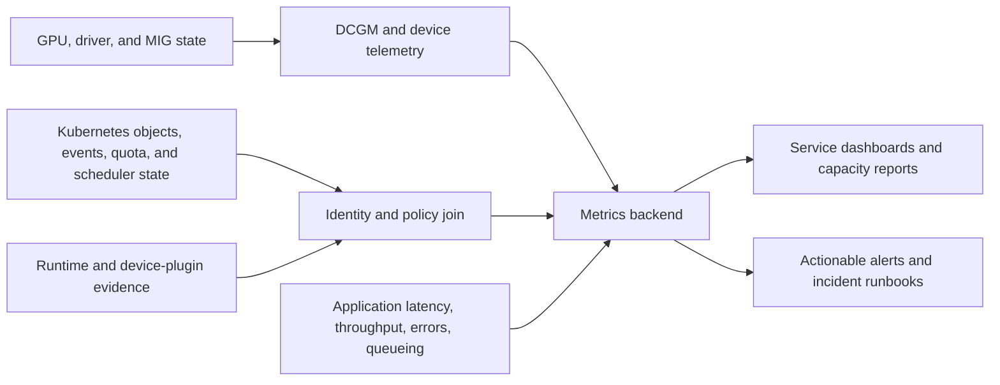

# Observability and SLOs for Shared GPUs

A shared GPU node can be healthy while a tenant receives unacceptable service. It can also show low utilization while correctly holding capacity for a latency-sensitive workload. Observability for a shared platform must therefore answer two distinct questions: *is the platform able to allocate and execute work safely?* and *is each service class delivering the experience it promised?*

Neither question is answered by a GPU utilization graph alone. The first requires hardware, driver, runtime, discovery, scheduling, and telemetry-pipeline evidence. The second requires a truthful connection between an allocation, a tenant-visible workload outcome, and the sharing policy in force at that time.

## Learning objectives

After this chapter, you should be able to:

- define a shared-GPU telemetry contract with stable identity and bounded labels;
- select SLIs that distinguish platform availability from tenant experience;
- design alerts with a clear owner, blast radius, and safe first action;
- investigate contention without treating sampled utilization as allocation truth; and
- use observability data for capacity, fairness, and post-incident improvement.

## The service that was green and still failing

A platform dashboard showed every node Ready, device-plugin Pods healthy, and GPU utilization near the expected range. An inference team still saw long tail latency after a development cohort started using the same time-sliced pool. The platform had instrumented hardware health but not the queue, application latency, or workload class. It could prove that a GPU existed; it could not prove that the service remained appropriate for the new concurrency.

The response was not an alert on any high utilization sample. The team created separate views for physical health, allocation and placement, and workload outcomes. It set an SLO only for the service tiers that could make a defensible promise, and it made best-effort behavior visible rather than silently grading it against a latency SLO.

## The shared-GPU evidence path



**Figure 11.10.1 — Hardware telemetry, allocation state, and application behavior answer different questions.** Joining them carefully is more valuable than collecting every possible metric.

The durable hardware identity is normally the GPU UUID plus node identity. Device indexes are useful when an operator is on a node, but they can change after configuration or inventory changes. A MIG instance, vGPU, or Pod association has its own lifecycle and should be represented only when the collection path can establish it accurately.

Do not turn a sampled list of GPU processes into the source of truth for ownership, billing, or tenant isolation. Use the scheduler, device-plugin allocation path, virtualization system, and workload metadata as controlled sources; use process evidence to diagnose behavior within its documented limits.

## Build three views, not one dashboard

| View | Primary audience | Questions it answers | Typical evidence |
|---|---|---|---|
| Platform health | SRE and platform operations | Is a node, device, runtime, or telemetry path unavailable or unsafe? | Node readiness, device discovery, driver/DCGM health, XID or error evidence, scrape freshness |
| Service delivery | Tenant and service owner | Is the documented workload outcome being met? | Queue time, request latency, completion time, error rate, reservation availability |
| Capacity and fairness | Platform product and finance teams | Is the catalog appropriate, and who is blocked or stranded? | Allocation hours, pending reasons, profile inventory, fragmentation, quota use, idle reservations |

One dashboard may link to all three views, but they should not collapse into a single “GPU health score.” A capacity shortage can be healthy hardware. An XID event can be critical even if no application metric has yet moved. A tenant’s p99 latency may be unacceptable while device health remains normal.

## The telemetry contract

Write the contract before choosing a dashboard layout. It should state:

1. **Coverage.** Every accepted GPU node has a monitored path, and missing or stale telemetry is visible as an observability failure.
2. **Identity.** Operators can navigate from a workload or allocation to its node, device identity, sharing mode, and policy version without exposing another tenant’s private context.
3. **Semantics.** Each retained metric has a known meaning, collection interval, and owner. Its field availability is validated against the deployed versions.
4. **Cardinality.** Labels are bounded and reviewed. Tenant-, Pod-, container-, request-, or process-level labels can be expensive and fragile at scale.
5. **Retention.** Raw and aggregated data support incident reconstruction, capacity reviews, and the organization’s data-handling policy.
6. **Access.** Tenant views and central operator views implement the same multi-tenant boundary as the platform itself.

DCGM and DCGM Exporter are often part of the device evidence path. Available fields and metric names depend on the exporter configuration and deployed software. Use the current [DCGM Exporter documentation](https://github.com/NVIDIA/dcgm-exporter) and the [DCGM documentation](https://docs.nvidia.com/datacenter/dcgm/latest/) to validate field selection rather than hard-coding assumptions from a dashboard copied from another cluster.

## Choose SLIs from the service promise

An SLI is a measured signal tied to a user-facing or operator-facing promise. It is not simply a metric that happens to be available.

| Service class | Candidate SLI | Why it matters | What it does not prove |
|---|---|---|---|
| Reserved MIG inference | Successful allocation rate; request latency and error rate | Measures access and the serving outcome | Model quality or a universal profile-performance ratio |
| Best-effort development | Queue-time distribution; successful starts; documented interruption rate | Measures access experience | Predictable run time under contention |
| Batch work | Completion within agreed window; retry/error rate | Measures the business outcome | Interactive responsiveness |
| vGPU workstation | Session availability and application responsiveness | Measures user-visible service | Host capacity in isolation from VM constraints |
| Platform foundation | Device availability; resource-advertisement correctness; telemetry freshness | Measures ability to operate the service | That every tenant workload is performing well |

Set an SLO only when the platform controls enough of the delivery chain and has an agreed response when it is missed. A best-effort pool can still have an availability target and a documented access objective; it should not inherit a latency SLO that its sharing model and admission policy cannot enforce.

**Concrete metric definitions and Prometheus queries:**

For a reserved MIG inference service with p99 latency SLO < 100ms:

```yaml
# Define what success looks like
sli_mig_inference_request_success: |
  rate(inference_requests_total{service="mig-inference", status="success"}[5m])
  / rate(inference_requests_total{service="mig-inference"}[5m])
  # Expected: > 99.5%

sli_mig_inference_p99_latency: |
  histogram_quantile(0.99, rate(inference_request_duration_ms_bucket[5m]))
  # Expected: < 100ms; breach if > 120ms

# Distinguish allocation failure from execution failure
mig_pod_allocation_rate: |
  rate(pod_scheduling_attempts_total{resource="nvidia.com/mig-1g.20gb"}[5m])
  # Track how many pods are actually being scheduled

mig_pod_pending_reasons: |
  count by (reason) (kube_pod_container_status_state{state="pending"})
  # "Insufficient nvidia.com/mig-1g.20gb" = profile shortage
  # Other reasons = policy/affinity issues
```

For a best-effort time-sliced pool:

```yaml
# Queue time instead of latency (it's shared access, not exclusive)
timeslice_queue_time_p95: |
  histogram_quantile(0.95, rate(gpu_queue_wait_seconds_bucket{pool="time-sliced"}[10m]))
  # Expected: < 30 seconds

# Visibility into contention
timeslice_concurrent_workloads: |
  count(kube_pod_running{node_pool="time-sliced-gpu"})
  # Correlate with application p99 to establish safe concurrency range
  
# Memory pressure indicator
timeslice_memory_utilization: |
  nvidia_smi_memory_used_mib{gpu_index="0"}
  / nvidia_smi_memory_total_mib{gpu_index="0"}
  # If > 90% for sustained period with high concurrency = expected contention
```

For platform foundation (infrastructure health):

```yaml
# Device availability
gpu_device_available: |
  count(nvidia_smi_memory_total_mib)
  # Alert if count drops unexpectedly

# Resource advertisement correctness
mig_resource_advertised: |
  count(kube_allocatable{resource=~"nvidia.com/mig.*"})
  # Alert if count mismatches approved layout

# Telemetry freshness (critical for SLO validation)
dcgm_exporter_scrape_age_seconds: |
  time() - scrape_timestamp_seconds{job="dcgm-exporter"}
  # Alert if > 120 seconds (staleness = uncertainty)
```

### Error budgets without invented precision

An error budget is the permitted amount of SLO failure in a defined window. The numerical target is a business decision backed by measured service behavior, not an NVIDIA hardware property. For a new service, begin with an observation period and a proposed objective, publish the measurement definition, and revise it after evidence from representative demand.

Define before launch:

- what counts as eligible demand;
- which failures are platform-caused versus client-caused;
- how planned maintenance is treated;
- which data source is authoritative when signals disagree;
- the aggregation window and handling of missing data; and
- the action when the budget is depleted, such as pausing new best-effort admission or deferring a rollout.

## Alerts must lead to a safe action

An alert is a request to interrupt someone. It needs an owner, a scope, and a first action that does not make the incident worse.

| Alert condition | Why it is actionable | First safe action | Do not do first |
|---|---|---|---|
| Expected GPU resource disappears from a node pool | It can strand queued workloads or invalidate reservations | Stop new placement to the affected scope; compare with a healthy peer | Reconfigure every node or delete device-plugin Pods blindly |
| GPU/driver reliability evidence with workload impact | It can require containment or hardware escalation | Preserve evidence, protect workloads, follow the hardware runbook | Reboot before capturing relevant state |
| Telemetry target stale or missing | Hardware conclusions are uncertain without coverage | Restore the collection/scrape path; mark health as unknown | Treat absent metrics as a healthy device |
| Sustained SLO breach in a protected class | The service promise is failing | Reduce admission or route to approved capacity while investigating | Raise a replica count to hide queueing |
| Capacity threshold crossed with pending demand | It informs an admission or procurement decision | Review requested shapes, reserve use, and queue reason | Page solely because an average utilization threshold moved |

Low utilization is often a dashboard or capacity-review signal, not a page. It can mean an input pipeline is stalled, a service is intentionally provisioned for bursts, a job is waiting on another resource, or metric collection is broken. The operational question is what action an on-call engineer should take immediately.

## Correlation: reconstruct the tenant experience

For an incident, work from scope to mechanism:

1. Establish the affected tenant, service class, time window, and user-visible symptom.
2. Identify the allocation, node pool, requested resource shape, and sharing policy in effect.
3. Determine whether the scheduler placed the work and whether the runtime exposed a usable device.
4. Inspect application outcomes—queueing, latency, throughput, errors, or completion—and compare with a healthy peer.
5. Correlate hardware, driver, thermal, power, memory, and error evidence with the same window.
6. Check concurrent allocations, recent changes, and telemetry freshness before drawing a causal conclusion.

This ordering protects against two common errors. First, an association can be wrong: a process observed on a GPU is not necessarily the allocation that caused a tenant’s symptom. Second, correlation is not proof: a hardware event near a latency spike deserves investigation but does not automatically explain an application regression.

## Sharing-model-specific signals

### MIG

Monitor the intended mode and profile inventory alongside normal device health. The operational signals include resource advertisement changes, requested profile availability, Pending reasons, layout drift, and node-drain or reconfiguration activity. Keep the current layout and approved baseline accessible to responders, but do not expose unnecessary hardware details to tenant-facing dashboards.

For a profile-based service, application latency or throughput is still required. Hardware partitioning improves isolation properties; it does not promise that every model or batch configuration fits the profile’s memory and compute envelope.

### Time-slicing

Track logical allocations, configured replica policy, concurrent active workload behavior, queueing, application tail latency, errors, and memory-related failure signals. The device may have a single healthy physical GPU while multiple Pods experience contention. Where per-process data is used, document its scope and access controls.

The most useful time-slicing dashboard compares a workload’s behavior alone and under the normal concurrency band. It should make the service tier visible so that a best-effort tenant does not mistake a capacity view for a performance guarantee.

### vGPU

Join host GPU health, vGPU profile inventory, VM placement, guest behavior, and the release-specific entitlement or licensing state where applicable. The [NVIDIA vGPU documentation](https://docs.nvidia.com/vgpu/) defines the supported product behaviors and release-specific evidence; capture the actual versions and configuration during incidents.

## Observability design for multi-tenancy

Telemetry can become a data-leakage path. A tenant dashboard that displays every namespace, node, GPU UUID, model name, or competing workload may reveal information that the authorization model intended to hide. Design audience-specific views:

| Audience | May need to see | Should not receive by default |
|---|---|---|
| Tenant | Its own service outcome, quota, allocation state, and documented maintenance status | Other tenants’ names, workload behavior, and detailed host inventory |
| Platform operator | Fleet and node evidence needed to operate safely | Secrets, payload data, or application logs outside the incident need |
| Finance/product | Aggregated service consumption and catalog trends | Per-request traces or sensitive workload metadata |
| Hardware/support escalation | Time-correlated technical evidence, redacted as required | Unnecessary tenant identifiers or data content |

Apply the same care to logs and exemplars. Labels that are convenient for a one-off debug session can become an uncontrolled retention and access problem when exported permanently.

## Capacity reports that drive action

Monthly fleet utilization is not enough. Review the following with service owners:

- allocation and idle-reservation hours by service class;
- queue time, rejection, and Pending reasons by requested shape;
- profile fragmentation and layout distribution;
- SLO compliance and error-budget use by protected tier;
- hardware and telemetry coverage gaps;
- maintenance and failure reserve consumption; and
- observed performance under the normal concurrency range.

Use the report to make a decision: adjust admission, change a standard layout, add a node pool, move a workload class, or keep the design unchanged. Metrics without a decision owner tend to become decorative.

## A dashboard design that supports an incident

Start every dashboard with a decision and a drill-down path. A fleet overview should not attempt to render every process or tenant label. It should identify an affected pool and provide links to the evidence that narrows scope.

| Dashboard level | Required context | Drill-down question |
|---|---|---|
| Fleet | Total healthy/unknown/unavailable nodes, configured service classes, capacity reserve, telemetry coverage | Is this a broad availability, observability, or demand event? |
| Node pool | Sharing model, approved layout or replica policy, allocatable inventory, queue/pending trend | Is the issue localized to one policy cohort? |
| Node/device | Node identity, UUID, mode/layout, driver/runtime evidence, recent events, scrape freshness | Is the first failed boundary host, discovery, or policy? |
| Allocation/service | Tenant-authorized service outcome, requested shape, allocation status, application metrics | Is the documented outcome failing for this allocation? |

Use a consistent incident time range and show recent changes in the same view: policy revision, layout change, node image rollout, workload release, or traffic event. An exact correlation still requires investigation, but hiding change history encourages speculation.

### Avoid misleading aggregation

An average across a fleet can hide both a hot shared device and an unavailable reserved pool. Prefer distributions, counts by service class, and explicit unknown states. For latency, use the service’s agreed percentile and window; for capacity, split requested profile shape from physical inventory; for telemetry, show coverage and freshness rather than replacing missing series with zero.

The same rule applies to tenant attribution. An aggregate useful to finance may be too coarse for a runtime incident, while a per-Pod label suitable for a short debug session may be too volatile or sensitive for a long-retention metric store.

## Establishing a new SLO safely

Do not turn a dashboard threshold into an SLO on launch day. Establish a short, disciplined sequence:

1. State the candidate service outcome and intended audience.
2. Verify the data source with a known workload and an allocation record.
3. Observe representative normal and stressed demand without silently changing policy.
4. Classify failures and missing data: platform, workload, client behavior, planned maintenance, or unknown.
5. Propose an objective and error-budget policy with the service owner.
6. Test alert routing and the first mitigation in a safe exercise.
7. Publish the definition, exclusions, and review date.

An objective is mature when an on-call engineer can tell whether it is breached, who owns the response, and what action protects customers without guessing. If those answers are absent, keep the signal as an operational metric while the contract is developed.

### SLO review questions

| Question | Why it matters |
|---|---|
| Does the SLI measure an outcome users notice? | A device counter rarely represents an application promise by itself |
| Can the platform accurately identify the eligible requests or allocations? | A denominator error can manufacture compliance or failure |
| Are missing data and planned maintenance handled explicitly? | Otherwise the report becomes a negotiation during every incident |
| Is the response owned and feasible? | An SLO without a mitigation path is only a report |
| Does the sharing tier support the promise? | Best-effort oversubscription cannot be described as deterministic isolation |

## Evidence retention and incident reconstruction

Retention is a design choice with cost, privacy, and debugging consequences. Keep enough time-correlated information to compare an event with the relevant deployment and maintenance window. Retain aggregate capacity trends longer only when their labels and access controls remain appropriate.

For a serious incident, preserve a bounded evidence package: the relevant dashboards and query definitions, source timestamps, node/device identity, allocation record, policy revision, events, selected logs, and the application outcome. Record whether any evidence was unavailable or stale. This allows a later reviewer to separate “the GPU was healthy” from “the monitoring system did not observe a fault.”

## Monitoring the monitors

The observability path is itself a distributed service. Monitor target discovery, collector scheduling, exporter failures, scrape freshness, query errors, storage pressure, and alert delivery. Assign each signal an owner.

Test failure behavior deliberately in a non-production or controlled environment: a missing target should become visible; a broken association should not silently attribute one tenant’s data to another; a dashboard should show unknown rather than a fabricated zero. The test is especially important after exporter, Prometheus, GPU Operator, or label-configuration changes.

## Change management for metrics and alerts

Version-control dashboard definitions, recording rules, alert rules, and the mapping logic that adds workload context. Review metric changes with the same care as a scheduling policy change when they affect SLO calculation, chargeback evidence, or a safety alert.

Before deleting an old series or renaming a label, identify its consumers: dashboards, alerts, capacity reports, billing workflows, and incident runbooks. Run old and new views in parallel long enough to validate semantics when the change is material. A green deployment of the monitoring stack does not prove that an alert still measures the intended condition.

## A practical alert catalogue

Start with a small catalogue whose alerts each have a playbook. The exact expression is implementation-specific because exporter fields, Kubernetes integration, and service definitions vary. Describe the condition and response before writing the query.

| Alert family | Condition to define locally | Owner | Evidence on arrival |
|---|---|---|---|
| Resource-loss alert | Expected resource count or allocatable inventory drops unexpectedly | Platform operations | Node events, plugin/runtime state, device/layout baseline |
| Hardware-evidence alert | Supported device health/error evidence changes with impact or policy threshold | Platform/hardware on-call | Time-correlated driver/DCGM evidence and workload effect |
| Telemetry-freshness alert | Expected target or critical series becomes stale | Monitoring owner | Target health, collector/exporter logs, scrape path |
| Protected-service alert | Eligible requests fail, queue, or breach the agreed outcome | Service owner plus platform | Allocation, application outcome, competing demand, policy version |
| Capacity-risk alert | Compatible inventory or reserve becomes insufficient for committed demand | Capacity owner | Requested shapes, pending reasons, active reserve, maintenance plan |

This catalogue avoids a common anti-pattern: an alert based on a hardware counter that pages a platform team without telling them which service or action is at risk. Hardware evidence belongs in the investigation; an alert needs an operational decision.

### Alert testing

For each alert, perform a controlled test at least once before depending on it in a production incident. Validate all of the following:

1. the source metric or event changes in the expected way;
2. the rule identifies the correct scope without an uncontrolled label explosion;
3. routing reaches the named owner;
4. the runbook can be followed with read-only evidence first;
5. the alert clears only when the condition is actually resolved; and
6. the test does not create a tenant-visible failure or require unsafe host changes.

Record the test date and software/configuration revision. A later exporter or rule change can invalidate the test.

## SLO incident response

When a protected service exhausts or threatens its error budget, treat it as a release and capacity signal. Pause changes that could broaden the breach, establish whether the condition is demand, policy, platform, or application behavior, and choose the least disruptive mitigation. Examples include reducing new admission, moving traffic to compatible reserve capacity, rolling back a recent workload release, or scheduling maintenance outside the recovery window.

Avoid using an SLO breach to justify permanent overprovisioning without diagnosis. Review the evidence after recovery: the answer may be a larger reserve, a different sharing class, better autoscaling, a revised workload limit, or a more realistic service promise.

## Troubleshooting scenario 1: metrics are present but workloads cannot be joined to them

**Symptoms.** The dashboard shows device metrics, but an operator cannot determine which tenant allocation was affected. A manually sampled process list appears to disagree with Kubernetes.

**Evidence.** Capture the allocation record, Pod or VM identity, node, GPU UUID, device-plugin or virtualization state, exporter labels, scrape configuration, and a time-aligned snapshot of the process evidence. Verify the time window and clock alignment.

**Diagnosis.** Determine which source is authoritative for allocation. A process list may be transient, incomplete, or subject to namespace and privilege boundaries. Missing workload labels may indicate an unsupported collection assumption, not a failed GPU.

**Safe resolution.** Present the incident view at the level the telemetry can prove—node and UUID if necessary—while using the allocation system to establish ownership. Improve the supported correlation path under change control; do not invent a mapping in a billing or tenant-facing dashboard.

**Prevention.** Document identity semantics, test a known allocation during observability acceptance, and monitor the join path itself.

## Troubleshooting scenario 2: healthy GPU, failing latency SLO

**Symptoms.** DCGM data and node health are normal. A protected inference tenant sees tail-latency breaches after load or co-tenancy changes.

**Evidence.** Compare request rate, batch behavior, latency percentiles, errors, queue time, allocation class, concurrent workloads, resource shape, memory use, recent deployment changes, and device telemetry. Include an unaffected peer or previous baseline where available.

**Diagnosis.** Separate a platform-wide hardware fault from contention, model behavior, input pressure, autoscaling lag, or an incorrect service-class placement. High or low utilization alone cannot make that distinction.

**Safe resolution.** First protect the stated service: limit admission, restore an approved placement, or move the tenant to compatible reserved capacity. Then test the performance hypothesis with controlled concurrency. Avoid changing sharing policy fleet-wide during an active breach.

**Prevention.** Tie admission limits to workload evidence, keep service classes explicit, and review concurrency curves after material runtime or model changes.

## Customer architecture conversation

Customers often ask for a single utilization dashboard. Explain that the platform will provide one, but it cannot be the service contract. A strong design offers a tenant view that shows their access, quota, and outcome; an operator view that supports safe diagnosis; and a capacity view that exposes fragmentation and reserve use.

The trade-off is intentional. More detailed labels improve local diagnosis but can increase metrics cost and leak tenancy information. A mature design uses controlled drill-down, stable identifiers, and audience-specific authorization instead of putting every dimension on every panel.

## Senior-level interview questions

**Why is GPU utilization an insufficient SLI for a shared platform?** It describes device activity, not whether a tenant obtained the promised allocation, latency, completion window, or isolation property. It can also be misleading when demand is intentionally buffered or telemetry is stale.

**How would you alert on a missing GPU metric?** Treat it as a telemetry-coverage incident. Alert on target discovery or freshness with an owner and restore the observation path before making hardware-health conclusions from the absence of data.

**What is the safest identity model for a shared-GPU incident?** Start with durable node and GPU identity, then join to allocation records from the scheduler or virtualization system. Add Pod or process context only when the collection mechanism can establish it correctly.

## Revision checklist

- Can you separate platform health, service delivery, and capacity/fairness views?
- Can you define an SLI for a best-effort service without pretending it has deterministic latency?
- Can you explain why stale telemetry changes the certainty of a health conclusion?
- Can you name the data required to correlate a tenant symptom with a shared device?
- Can you propose an alert whose first responder action is safe and specific?

## Further reading

- [NVIDIA DCGM documentation](https://docs.nvidia.com/datacenter/dcgm/latest/)
- [NVIDIA DCGM Exporter](https://github.com/NVIDIA/dcgm-exporter)
- [Prometheus instrumentation and labels](https://prometheus.io/docs/practices/instrumentation/)
- [Kubernetes resource metrics pipeline](https://kubernetes.io/docs/tasks/debug/debug-cluster/resource-metrics-pipeline/)

## Cross references

- [Kubernetes Scheduling for Shared GPUs](./chapter-07-kubernetes-scheduling-for-shared-gpus)
- [Tenant Isolation, Security, and Fairness](./chapter-08-tenant-isolation-security-and-fairness)
- [Capacity Planning and Chargeback](./chapter-09-capacity-planning-and-chargeback)
- [Production Troubleshooting](./chapter-11-production-troubleshooting)
