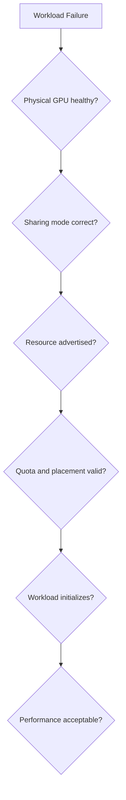

# Production Troubleshooting

Troubleshoot shared GPUs from the physical device upward.

## Playbook

| Symptom | Likely layer | First evidence |
|---|---|---|
| MIG resource absent | mode, layout, device plugin | `nvidia-smi -L`, plugin logs |
| Pod Pending | quota, selector, inventory | events and node resources |
| OOM across time-sliced users | shared memory pressure | process memory and workload logs |
| Latency variance | contention | concurrent workload and application metrics |
| vGPU unavailable | compatibility or entitlement | host, guest, and license state |

## Incident Method

1. Freeze automated changes.
2. Capture device, layout, node, Pod, and policy state.
3. Compare with a healthy node in the same pool.
4. Repair the lowest failed layer.
5. Run a representative validation workload.
6. Restore service gradually.
7. Update the capacity model and prevention controls.

## Prevention

Standardize node pools, pin versions, test reconfiguration, maintain spare capacity, alert on resource loss, and preserve a known-good layout manifest.
