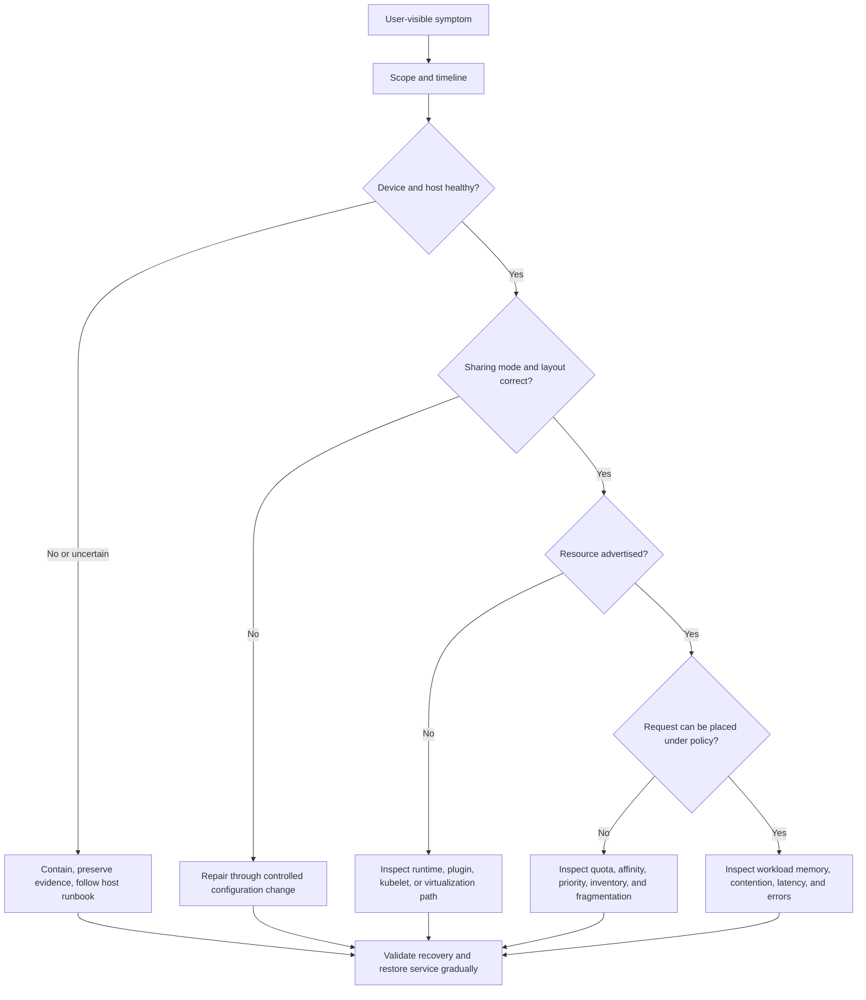

# Production Troubleshooting

Shared-GPU incidents become expensive when responders jump to the most visible layer. A Pod may be Pending because a MIG resource is absent, because a quota blocks it, because the requested layout is fragmented, or because a node selector excludes all eligible nodes. A time-sliced Pod may be Running while its application suffers memory pressure or unacceptable contention. A vGPU failure may originate on the host, in a guest, in placement, or in a release-specific entitlement path.

The response discipline is the same: establish scope, preserve evidence, identify the first failed boundary, apply the smallest safe mitigation, and validate the user-visible outcome. Do not reset a node, reconfigure a MIG layout, or restart every platform component simply because the first dashboard looks suspicious.

## Learning objectives

After this chapter, you should be able to:

- triage shared-GPU incidents in a layer-aware order;
- distinguish missing capacity, missing resource discovery, and unsatisfied scheduling policy;
- safely contain MIG, time-slicing, and vGPU incidents without widening the blast radius;
- assemble an escalation package that preserves time-correlated evidence; and
- turn recurring incidents into improvements to service classes, runbooks, and capacity policy.

## The incident model



**Figure 11.11.1 — Diagnose the lowest failed boundary before making a disruptive change.** The same user symptom can arise from several layers, and each layer has a different safe recovery.

## Before touching the system: establish scope

Start with a short incident statement:

| Field | Example question |
|---|---|
| Symptom | Is the issue Pending placement, CUDA initialization, OOM, latency, session failure, or missing metrics? |
| Scope | One Pod, one tenant, one GPU, one node, one pool, or the fleet? |
| Start time | Did it begin after a deployment, layout change, node reboot, traffic event, or maintenance window? |
| Service class | Is the workload best effort, reserved, isolated, VM-based, or otherwise protected? |
| Business impact | Which documented outcome is unavailable or degraded? |
| Change state | Are automation, rollout, or layout changes in progress? |

Freeze nonessential automated changes in the affected scope. This does not mean disabling the platform; it means preventing a concurrent rollout, autoscaler action, or operator reconciliation experiment from erasing the causal timeline. Preserve one healthy peer for comparison whenever capacity permits.

## Collect a safe evidence bundle

Evidence collection should be read-only by default. Use approved paths and redact tenant data before sharing it outside the incident team. The following examples illustrate categories of evidence; adapt commands to the platform’s access model and avoid collecting secrets or payload data.

| Evidence | Why it matters | Notes |
|---|---|---|
| Time-stamped incident timeline | Correlates symptoms with change and telemetry events | Include timezone and the source of each event |
| Node and device inventory | Establishes physical state, UUIDs, and visible MIG instances | `nvidia-smi` access is host- and policy-dependent |
| Kubernetes object state and events | Distinguishes placement failure from runtime failure | Capture the affected object and a healthy comparator |
| Device-plugin, kubelet, runtime, and operator logs | Locates discovery and device-injection boundaries | Scope the time window; do not dump unrelated fleet logs |
| Allocation, quota, affinity, and priority policy | Explains an apparently available but unplaceable request | Include the policy version or Git revision |
| Application and service metrics | Establishes the user-visible failure | Capture queue, latency, errors, throughput, and memory behavior where available |
| DCGM/device telemetry and scrape freshness | Supports hardware and monitoring conclusions | Missing telemetry is an uncertainty, not a clean bill of health |

For NVIDIA device state, use the operational procedures that match the installed driver and hardware. NVIDIA documents supported MIG management and visibility behavior in the [MIG User Guide](https://docs.nvidia.com/datacenter/tesla/mig-user-guide/). Do not copy a profile or reset command from a different GPU generation into an active production node.

## The layer-by-layer triage order

### 1. Physical device, host, and driver

Ask whether the host sees the intended device and whether the system shows relevant errors, resets, or a recent host change. Compare kernel, driver, node image, and GPU inventory with a healthy node in the same pool. If the physical layer is uncertain, protect the workload and preserve evidence before rebooting, resetting, or replacing anything.

This layer includes thermal, power, PCIe, fabric, and memory-health symptoms, but it does not turn every application failure into a hardware incident. Establish time correlation and compare with known-good behavior.

### 2. Sharing mode and configured shape

For MIG, confirm the intended mode, instance inventory, and node-pool layout. For time-slicing, confirm the deployed device-plugin configuration and that the node belongs to the expected service class. For vGPU, confirm host-side profile inventory, VM placement state, guest compatibility evidence, and release-specific prerequisites.

Mode changes and layout changes are operationally disruptive. Treat unexpected state as a configuration incident first; do not attempt an in-place “quick fix” on a node that is carrying tenant work.

### 3. Runtime, discovery, and advertisement

Determine whether the runtime can expose devices and whether the control plane advertises the intended resource. In Kubernetes, inspect the relevant device-plugin state, kubelet registration, node `capacity` and `allocatable`, events, and the GPU Operator or equivalent operands if used. A Running DaemonSet is not proof that the node advertises the expected resource.

### 4. Scheduling and policy

Read scheduler events before modifying selectors. Check requested extended resources, quota, limit ranges where relevant, node affinity, taints and tolerations, priority, reservations, and the actual compatible inventory. Distinguish exhaustion from fragmentation: unused capacity in a different MIG shape cannot satisfy a request automatically.

### 5. Workload initialization and service behavior

If placement succeeds, establish whether the workload can initialize its allocated device. Then inspect its application-level success condition: latency, throughput, error rate, queue delay, training step time, session behavior, or completion time. A Running Pod is not evidence that a shared service is delivering its promise.

### 6. Telemetry pipeline

Confirm that the exporter, scrape, log, and dashboard paths are fresh enough to support the conclusion. Do not interpret missing or stale metrics as a healthy GPU. Restore monitoring coverage as a parallel incident when it limits safe diagnosis.

## Incident playbook: MIG resource is absent

**Symptoms.** A workload requests a MIG extended resource that was previously available, or a node no longer advertises the expected inventory.

**Likely blast radius.** One node after a configuration or host event, or an entire standardized pool after a policy or operator change.

**Diagnostic commands — run in order:**

```bash
# Layer 1: Host-side device and MIG state
SSH_TARGET=gpu-node-1
ssh $SSH_TARGET 'nvidia-smi -i 0 --query-gpu=gpu_name,gpu_uuid,mig.mode.current --format=csv'
# Expected: NVIDIA H100..., GPU-12345678..., Enabled
# Broken: ...mig.mode.current not available or "Disabled"

# Layer 2: MIG instances actually exist?
ssh $SSH_TARGET 'nvidia-smi mig -lgi -i 0'
# Expected: GPU instances listed with profiles (e.g., 1g.10gb)
# Broken: "No GPU Instances are currently running on this GPU"

# Layer 3: Kubernetes node sees them?
kubectl describe node $GPU_NODE | grep -A 20 "Allocated resources"
kubectl get nodes -o custom-columns=NAME:.metadata.name,MIG_10GB:.status.allocatable.nvidia\\.com/mig-1g\\.10gb,MIG_20GB:.status.allocatable.nvidia\\.com/mig-1g\\.20gb
# Expected: Resource names present, counts > 0
# Broken: Resources absent or count is 0

# Layer 4: Device plugin logs
kubectl logs -n nvidia-driver-install ds/nvidia-device-plugin-daemonset --tail=50 | grep -i "device\|mig\|error"
# Expected: "discovered MIG instance" logs, no errors
# Broken: "failed to discover", "cannot list devices"

# Layer 5: Compare against healthy peer
kubectl describe node gpu-node-2 | grep -A 20 "Allocated resources"
# Diff against broken node
```

**Healthy evidence.** The node has the approved mode and layout, the control plane advertises the expected extended resources, and a small approved validation workload can request and initialize the resource.

**Broken evidence.** Instances are absent, the layout differs from the baseline, the plugin cannot discover devices, or node resources changed after a host/runtime event.

**Diagnosis example:**
- Host shows "Enabled" and instances exist, but node has zero `nvidia.com/mig-*` resources → device-plugin reconciliation issue
- Host shows "Disabled" mode → configuration changed (was reset? driver updated?)
- Device plugin shows no errors but node is NotReady → kubelet registration blocked by taints or node conditions

**Safe resolution.** Find the first layer that broke:
```bash
# If host instances are missing (layer 2 broken):
# → Node lifecycle event (reboot, driver change): reapply known-good MIG config

# If plugin logs show discovery failure (layer 4 broken):
# → Restart the device plugin
kubectl delete pod -n nvidia-driver-install -l app=nvidia-device-plugin
# Wait 30s, recheck node allocatable

# If nodes are misaligned (layer 5 shows difference):
# → Cordon the broken node and route work to healthy peers until maintenance window
kubectl cordon $GPU_NODE
```

Avoid modifying MIG mode on a node carrying running workloads. Always cordon and drain first.

**Prevention.** Version-control approved layouts, monitor advertised-resource changes, validate discovery after host changes, and retain a healthy comparison pool during rollouts.

## Incident playbook: Pod Pending despite apparent free capacity

**Symptoms.** The fleet has free GPU capacity, but a request remains Pending.

**Likely blast radius.** A namespace, requested profile, or placement policy; broad changes can affect the entire pool.

**Triage.** Read the Pod’s scheduling events. Inspect the exact requested resource, quota, node affinity, taints, tolerations, priority, reservation, and eligible node inventory. For MIG, check whether a compatible profile—not merely unused physical capacity—is available.

**Diagnosis.** Scheduler events are the initial evidence. Classify the condition as resource exhaustion, profile fragmentation, quota or admission policy, node eligibility, or a resource-discovery failure. Do not label it “GPU shortage” until the class is known.

**Safe resolution.** Correct an erroneous request or policy; route work to an approved compatible pool; or queue it according to the service contract. A layout change belongs to a planned maintenance operation, not a reaction to one Pending Pod.

**Prevention.** Expose pending reasons by service class, publish resource shapes, and test quota and scheduling rules as part of platform changes.

## Incident playbook: time-sliced workloads are slow or fail with memory pressure

**Symptoms.** Multiple time-sliced workloads schedule successfully, but latency rises, throughput falls, or applications report memory-related failures when concurrency increases.

**Likely blast radius.** Co-tenants on one device or an entire oversubscribed pool.

**Diagnostic commands — preserve time correlation:**

```bash
# Baseline: establish what changed
# Capture the start time
INCIDENT_TIME=$(date -u +%Y-%m-%dT%H:%M:%SZ)
echo "Incident start time: $INCIDENT_TIME"

# Verify concurrency and policy
kubectl get nodes gpu-node-1 -o jsonpath='{.status.allocatable}' | jq '.["nvidia.com/gpu"]'
# Expected: matches device-plugin replica config (e.g., 4, 8, 16)

# List running pods on the device
kubectl get pods -A -o wide | grep gpu-node-1 | head -20
# Count actual pods vs replicas available

# Application-level metrics (service-specific)
# Example for inference service:
kubectl logs deployment/inference-endpoint --tail=100 | grep "latency_p99\|queue_depth"
# Example for notebooks:
curl -s http://notebook-service:8000/metrics | grep latency_p99_ms

# GPU-level activity (host-side)
SSH_HOST=gpu-node-1
ssh $SSH_HOST 'nvidia-smi --query-gpu=name,memory.used,memory.total,clocks.current.sm,power.draw --format=csv -l 2' | tee /tmp/gpu-activity.txt
# Watch for 3-5 seconds; abort with Ctrl+C
# Expected under light load: memory < 60%, clocks stable, power steady
# Broken under contention: memory > 80%, clocks reduced (thermal throttle?), power spikes

# Process-level breakdown (can be difficult with time-slicing attribution)
ssh $SSH_HOST 'nvidia-smi --query-processes=pid,process_name,gpu_memory_usage --format=csv'
# Time-slicing limitation: can't cleanly attribute which pod owns which process
# Look for: total memory > GPU capacity, many CUDA processes

# Determine if it's truly memory contention or expected time-sharing
ssh $SSH_HOST 'cat /proc/meminfo | grep -E "MemTotal|MemAvailable|SwapFree"'
# Check if host RAM is constrained (pods spilling to host memory = slower)
```

**Diagnosis checklist:**
- Is memory > 95% → memory contention confirmed
- Is p99 latency higher now but concurrency unchanged → config drift (model weights grown?)
- Is latency unstable but average looks OK → memory pressure causing GC/reclamation spikes
- Are application errors "CUDA out of memory" → workload changed; profile is too small

**Safe resolution:**
```bash
# Immediate containment
# Move one sensitive service to protected pool (MIG or dedicated)
kubectl patch deployment critical-service -p '{"spec":{"nodeSelector":{"gpu.sharing":"dedicated"}}}'

# Measure the improvement
# Wait 5min, compare p99 latency, queue depth vs baseline

# If it recovers: the issue was contention from co-tenants
# → Route less-critical work elsewhere or reduce replicas until shared pool is stable

# If it doesn't improve: the issue is workload-specific (model grew, regression)
# → Check deployment history, model versions, framework updates
```

Avoid raising replica counts to reduce queueing without measuring the service impact.

**Prevention.** Use workload-specific concurrency tests, enforce service-class admission, and make the best-effort contract explicit.

## Incident playbook: a MIG pool is fragmented

**Symptoms.** Some profile requests remain Pending while dashboards show unused capacity on nodes in the pool.

**Likely blast radius.** Requests for one profile shape; reconfiguration can affect all tenants on a selected node.

**Triage.** Capture the requested profile, active layout on candidate nodes, free profile inventory, policy constraints, and pending duration. Confirm whether a different approved pool can satisfy the request.

**Diagnosis.** Fragmentation exists when remaining geometry cannot host the requested profile. It is distinct from an absent resource and from total exhaustion. It cannot be solved by Kubernetes pretending a different profile is equivalent.

**Safe resolution.** Use a compatible pool, queue under the documented policy, or schedule a controlled drain and reconfiguration through change control. Make the disruption, rollback, and post-change validation explicit.

**Prevention.** Standardize layouts, forecast demand by shape, and track stranded inventory in capacity review.

## Incident playbook: vGPU-backed VM cannot use its assigned GPU

**Symptoms.** A VM or desktop session is placed but cannot initialize the expected GPU function, or the expected vGPU profile is unavailable.

**Likely blast radius.** One guest, a host, a profile pool, or a release/compatibility cohort.

**Triage.** Capture the host profile inventory, VM placement and assignment, guest driver/runtime evidence, relevant entitlement or licensing state if applicable, and versions across the supported stack. Compare to a healthy guest on the same validated release.

**Diagnosis.** Separate host inventory, VM placement, guest initialization, and release-specific compatibility. The profile name alone is insufficient evidence of a supported or healthy stack.

**Safe resolution.** Protect the user by moving to an approved healthy host or profile when policy allows. Correct the first failed component using the release-specific vendor procedure. Avoid broad guest-driver changes before confirming the host and guest versions.

**Prevention.** Maintain a validated compatibility record, canary changes across host and guest boundaries, and collect a standard support package.

## Incident playbook: telemetry is missing or contradicts the user report

**Symptoms.** GPU metrics are absent, stale, or apparently healthy while users report failures.

**Likely blast radius.** One exporter target, a monitoring path, or a false sense of health across a fleet.

**Triage.** Check collector scheduling, logs, host access, DCGM connectivity, target discovery, scrape freshness, network policy, and dashboard query behavior. Compare an affected target with a healthy target. Separately collect user-visible application evidence.

**Diagnosis.** Missing telemetry is an observability failure. Healthy telemetry with a failing application may reflect a service-layer problem, a missing correlation dimension, or a metric interpretation error.

**Safe resolution.** Restore coverage and explicitly mark conclusions that relied on the missing path as uncertain. Continue application and platform triage using the evidence that is available. Do not silence an alert just because the hardware panel has no data.

**Prevention.** Monitor telemetry freshness, test correlations during acceptance, and give the monitoring path an incident owner.

## Containment and recovery patterns

| Situation | Safe containment | Recovery gate |
|---|---|---|
| Suspected host/device fault | Stop new placement; cordon or isolate the affected scope according to runbook | Device, driver, discovery, telemetry, and validation workload are healthy |
| Incorrect layout or sharing policy | Stop automated propagation; protect tenant workloads | Approved configuration is restored and advertised resources match baseline |
| Scheduling/policy defect | Avoid broad label or quota changes; route only compatible work | Scheduler events and a representative request succeed for the intended reason |
| Contention/SLO breach | Reduce admission or use approved protected capacity | Workload outcome returns inside the agreed measurement window |
| Monitoring-path failure | Restore collection and distinguish unknown from healthy | Targets are fresh and a known allocation can be correlated correctly |

Recovery is not complete when a controller becomes green. Re-run the validation appropriate to the affected service class: a MIG inventory check plus a representative request, a time-slicing concurrency test, a vGPU guest validation, or a workload-level latency/throughput check. Restore traffic gradually when the incident involved a broad change.

## Change-aware troubleshooting

Many shared-GPU incidents are interface failures introduced by a legitimate change: a node image update, driver or runtime update, device-plugin configuration change, MIG layout operation, policy revision, model release, or monitoring update. The goal is not to blame the last change; it is to compare a known state with the first failed boundary.

Use this change review table during triage:

| Change surface | Boundary most likely to change | Evidence to compare | Unsafe shortcut |
|---|---|---|---|
| Node image, kernel, or driver | Host initialization and device visibility | Kernel/driver inventory, node boot events, healthy-node comparison | Assuming a manifest rollback repairs host state |
| Runtime or toolkit | Device injection and container initialization | Runtime logs, chosen handler/CDI path, fresh validation Pod | Changing application code before testing a minimal workload |
| Device plugin or GPU Operator | Discovery and advertised resources | Config revision, controller/DaemonSet state, node allocatable | Restarting all components without identifying the first non-ready operand |
| MIG policy/layout | Profile inventory and placement | Layout baseline, drain record, resource advertisement | Reconfiguring an active node to satisfy a single request |
| Quota/admission rule | Policy acceptance and scheduling | Policy revision, rejected object/event, tenant/service class | Bypassing the policy with privileged labels |
| Model/workload release | Memory, latency, throughput, and errors | Application baseline, inputs, concurrency, allocation class | Declaring a hardware defect from a workload regression |

Preserve the prior revision and a healthy comparison node or pool through the observation window. A canary is useful only when the comparison state still exists and the validation includes the affected service class.

## Read-only first checks

Use local operational standards for access and redaction. The following commands are examples of read-only evidence collection and must be run only by an authorized operator against the intended scope.

| Purpose | Example command | Expected evidence | Failure interpretation |
|---|---|---|---|
| Identify GPU and MIG-visible devices | `nvidia-smi -L` | Physical GPU entries and any visible MIG devices | Missing or changed entries require host/mode investigation |
| Inspect current MIG instances | `nvidia-smi mig -lgi` | Instance inventory on a MIG-configured device | Empty or unexpected output can indicate layout/mode or access differences |
| Inspect a Pending request | `kubectl describe pod &lt;pod&gt; -n &lt;namespace&gt;` | Scheduler events and requested resources | Events classify placement rather than proving a hardware fault |
| Compare advertised resources | `kubectl get node &lt;node&gt; -o yaml` | Capacity/allocatable values and node policy context | A missing resource points below scheduling or to configuration drift |
| Establish recent scope | `kubectl get events -A --sort-by=.lastTimestamp` | Time-ordered cluster events | Event retention may be incomplete; preserve promptly |

These commands do not repair the system. Their value is the evidence they add to a layered diagnosis. Do not paste their raw output into a broad channel without considering tenant metadata and host identifiers.

## Safe validation workloads

A recovery needs an acceptance check that matches the failed service. Keep small approved validation workloads under version control and make their resource request, image provenance, expected behavior, and cleanup explicit.

| Service boundary | Minimal acceptance evidence |
|---|---|
| MIG discovery | Expected resource is advertised; a validation Pod requests the intended shape and initializes the device |
| Time-slicing policy | Logical resources reflect the approved policy; a controlled concurrency test stays within the documented best-effort envelope |
| Protected inference tier | Allocation succeeds and the agreed application latency/error measurement returns to normal under representative load |
| vGPU guest | VM receives the expected profile and a guest-side validated application initializes correctly |
| Monitoring path | A known allocation appears with accurate node/device identity and fresh metrics |

Do not use a successful `nvidia-smi` invocation as the only acceptance criterion for a user-facing service. It proves a narrow portion of the stack.

## Incident roles and communication

Shared platforms create coordination pressure: a capacity owner may need to decide which tier is protected, while a platform operator diagnoses a node and an application owner validates recovery. Assign roles early.

| Role | Responsibility during incident |
|---|---|
| Incident lead | Owns scope, timeline, decision log, and external updates |
| Platform responder | Collects host/runtime/discovery/scheduling evidence and applies approved containment |
| Workload owner | Validates workload-level impact and recovery; supplies demand and deployment context |
| Capacity/service owner | Decides on reservation use, admission reduction, and customer commitments |
| Communications owner | Shares accurate scope and next update time without exposing other-tenant information |

State uncertainty plainly. “Telemetry coverage is missing for this node, so hardware health is not yet established” is more useful than a confident but unsupported status.

## Tabletop exercise: profile shortage during a rollout

Run this exercise before relying on the incident process. A canary node pool is undergoing an approved update. A protected tenant requests a MIG shape that becomes unavailable in its preferred pool, while a separate best-effort pool has unused but incompatible capacity.

The incident team should demonstrate that it can:

1. identify whether the request is blocked by discovery, policy, exhaustion, or fragmentation;
2. stop the rollout before it consumes the healthy comparison capacity;
3. communicate the impact without exposing other tenants’ allocation data;
4. choose between queueing, an approved alternate pool, or a controlled maintenance change;
5. preserve the layout, scheduler, and change evidence; and
6. validate recovery with a representative request and the protected workload outcome.

Score the exercise on evidence quality and blast-radius control, not on the speed of a node reboot. Record any missing allocation mapping, undocumented policy, or unsafe runbook step as a corrective action.

## When to stop and escalate

Stop local remediation and use the established escalation path when:

- a device fault or safety condition requires hardware/vendor procedure;
- the needed change would disrupt active tenants without an approved recovery plan;
- observed behavior conflicts with the supported configuration or authoritative documentation;
- an entitlement, compatibility, or firmware issue cannot be verified from the deployed release record;
- telemetry is too incomplete to establish a safe host action; or
- the request would require bypassing the platform’s tenant or security boundary.

Escalation is not a failure of troubleshooting. It is a control that prevents a narrow incident from becoming a fleet-wide outage.

## Escalation package

An actionable escalation avoids the “please send logs” loop. Include:

- business impact, service class, scope, timestamps, and timezone;
- precise symptom and reproduction steps that do not expose tenant data;
- node, device UUID, sharing mode, profile/layout or replica policy;
- host, driver, runtime, Kubernetes/virtualization, plugin/operator, and workload versions;
- affected and healthy comparison evidence;
- scheduler events, relevant logs, telemetry, and allocation/policy state;
- change timeline, mitigations already attempted, and their results; and
- redaction notes and the requested decision from the support or engineering team.

For hardware or software support, collect only with the approved support procedure. The goal is to preserve diagnostic context, not to run unsupported commands on a stressed production system.

## Post-incident improvement

Close an incident with a factual review, not a blame exercise. Ask which control failed to detect, contain, or explain the issue:

- Was the service promise ambiguous?
- Did the catalog permit an unsupported or unmeasured allocation?
- Did the scheduler lack a compatible inventory signal?
- Did an upgrade or reconfiguration lack a canary and rollback gate?
- Did monitoring lack stable identity, freshness, or tenant-safe correlation?
- Did the runbook require a destructive action before evidence was captured?

Turn each accepted finding into an owner, due date, and verification method. A new dashboard is not a prevention measure unless it changes a decision or an alert response.

## Customer architecture conversation

The most reassuring customer statement is not “we can reset the GPU quickly.” It is “we can determine the scope, protect unaffected tenants, preserve evidence, recover the correct layer, and prove the service outcome afterward.” Demonstrate that discipline in a tabletop exercise before the platform carries critical work.

For a shared platform, offer differentiated recovery expectations. Best-effort jobs may be retried or queued; protected inference may require reserved capacity and a faster containment path. Making that difference explicit is fairer than providing an accidental first-come, first-served incident response.

## Senior-level interview questions

**Why should an operator read scheduler events before changing node labels?** Events identify whether the request is blocked by resource availability, quota, affinity, taints, priority, or another placement rule. Changing labels first can destroy the evidence and create an unrelated placement problem.

**How do you distinguish MIG fragmentation from a capacity shortage?** Inspect the requested profile shape and active layouts. Fragmentation means physical capacity may remain but cannot legally host the requested geometry; shortage means compatible inventory is exhausted. Their safe remediations differ.

**Why is rebooting early a poor default response?** It may remove driver, runtime, event, layout, and timing evidence while failing to address a policy or application problem. Preserve evidence and find the first failed boundary unless safety requires immediate isolation.

## Revision checklist

- Can you list the triage layers in order from host to user outcome?
- Can you describe a safe first action for a missing resource, a Pending Pod, and a latency breach?
- Can you identify the evidence needed before changing a MIG layout?
- Can you explain why a Running time-sliced Pod may still represent a service incident?
- Can you build an escalation package with a healthy comparison and timeline?

## Further reading

- [NVIDIA MIG User Guide](https://docs.nvidia.com/datacenter/tesla/mig-user-guide/)
- [NVIDIA k8s-device-plugin documentation](https://github.com/NVIDIA/k8s-device-plugin)
- [NVIDIA GPU Operator troubleshooting](https://docs.nvidia.com/datacenter/cloud-native/gpu-operator/latest/troubleshooting.html)
- [Kubernetes debugging Pods and scheduling](https://kubernetes.io/docs/tasks/debug/debug-application/debug-pods/)

## Cross references

- [MIG Architecture and Isolation](./chapter-02-mig-architecture-and-isolation)
- [Comparing MIG, Time-Slicing, and vGPU](./chapter-06-comparing-mig-time-slicing-and-vgpu)
- [Capacity Planning and Chargeback](./chapter-09-capacity-planning-and-chargeback)
- [Observability and SLOs for Shared GPUs](./chapter-10-observability-and-slos-for-shared-gpus)
- [Volume 11 Summary](./chapter-12-volume-11-summary)
