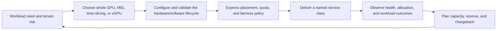

# Volume 11 Summary

GPU sharing is a platform-service decision. The sharing mechanism matters, but it is only one layer in a system that also includes identity, device lifecycle, runtime integration, scheduling, quotas, tenant boundaries, observability, capacity policy, change control, and incident response.

The recurring question throughout this volume has been: *what guarantee does this workload need, and what evidence shows the platform can keep it?* That question is more useful than asking how many logical users can be placed on a GPU.

## Learning objectives

By the end of this volume, you should be able to select a sharing model from a workload and tenant-risk statement rather than a utilization target; express that choice as a schedulable service class; and operate it through capacity, telemetry, change, and recovery controls. You should also be able to explain where the platform has a firm boundary, where it has only a best-effort behavior, and which evidence supports either claim.

## The end-to-end model

**Figure 11.12.1 — Sharing becomes reliable when mechanism, policy, and evidence form a closed operational loop.**

## Mechanisms and their boundaries

| Mechanism | Strongest use case | Primary benefit | Boundary to state explicitly |
|---|---|---|---|
| Whole-GPU allocation | Large, topology-sensitive, memory-intensive, or tightly controlled workloads | Simplest performance and lifecycle model | It can strand capacity for small or bursty work |
| MIG | Supported hardware needing profile-based partitions and stronger resource isolation properties | Predictable named partition shapes | Layout, profile geometry, and supported hardware/software combinations constrain placement |
| Time-slicing | Best-effort, bursty, or experimentally bounded access | More logical access to a physical device | It is an oversubscription mechanism, not a hard memory or deterministic-performance boundary |
| vGPU | VM-centric or virtual-desktop-style lifecycle | Integrates GPU service with a virtualization platform | Host, guest, profile, and release-specific compatibility all matter |

No row is a universal recommendation. The right choice depends on workload behavior, tenant risk, expected performance, operational maturity, and the recovery promise the platform can make.

## Decision sequence

Use this sequence before introducing a new shared service class:

1. Describe the workload’s outcome: access, latency, completion window, session experience, or training efficiency.
2. Define the tenant and security boundary, including what other tenants must not influence or observe.
3. Select a sharing model whose documented behavior matches that boundary.
4. Validate the exact hardware, driver, runtime, orchestration, and application combination.
5. Publish the resource shape and service guarantee—not just a device name.
6. Enforce it with node pools, admission, quota, priority, and reservations as appropriate.
7. Measure hardware health, allocation correctness, and workload outcome separately.
8. Include maintenance, failure, rollout, and fragmentation reserve in sellable capacity.
9. Rehearse recovery and update the service catalog from incident evidence.

## Production checklist

| Area | Questions to answer before production |
|---|---|
| Catalog | Are dedicated, MIG, time-sliced, and vGPU services named with their actual guarantees and exclusions? |
| Compatibility | Has the deployed hardware and software combination been verified against authoritative release documentation? |
| Lifecycle | Are layout/configuration changes version-controlled, drained, validated, and reversible? |
| Scheduling | Do resource names, quotas, affinity, priorities, and reservations produce the intended placement? |
| Isolation | Are identity, image, network, storage, host, and telemetry boundaries aligned with the sharing model? |
| Observability | Can operators join a tenant symptom to allocation, node, device identity, policy, and application outcome safely? |
| Capacity | Does sellable capacity exclude documented reserve and account for profile fragmentation or time-slicing contention? |
| Chargeback | Does the billable unit match the service promise and use an auditable ownership record? |
| Operations | Can the team contain an incident, preserve evidence, recover the lowest failed layer, and prove the outcome? |

## Common traps

**Treating scheduler placement as service success.** A Pod can be Running and still fail its latency, memory, throughput, or fairness objective.

**Treating every logical replica as independent capacity.** Time-slicing increases schedulable claims on a shared physical GPU. It does not produce equal performance or memory isolation.

**Calling arithmetic free capacity usable MIG capacity.** A free portion of a device may not have the geometry required by the next profile request.

**Using utilization as the only operational signal.** Utilization has no inherent tenant or service semantics. Pair it with health, allocation, queue, and application evidence.

**Reconfiguring active nodes to solve a single request.** MIG layout work is a controlled capacity transformation with workload and rollback consequences.

**Charging for a mystery unit.** A rate card must name the allocation, guarantee, attribution source, and exclusions. Otherwise it creates disputes rather than accountability.

## Production recovery scenario

An inference tenant with a protected MIG service reports Pending requests after a planned node-pool rollout. A development pool still shows unused GPU capacity, and an operator proposes moving the requests there immediately. The right response begins by checking scheduler events, the requested profile shape, the approved pool layout, the rollout timeline, and the remaining protected reserve. Unused capacity in an incompatible layout is not a recovery path, and a best-effort time-sliced pool does not automatically satisfy a protected service contract.

Contain the rollout before consuming the healthy comparison capacity. Route work only to an approved compatible pool, or queue it according to the published service policy. Preserve node, layout, resource-advertisement, and workload evidence before a drain or reconfiguration. Recovery is complete only when the intended profile is advertised, a representative request initializes successfully, and the tenant’s application-level outcome returns to its expected range.

The scenario demonstrates the central operational lesson: sharing incidents are resolved by restoring the correct service boundary, not by maximizing the number of Pods that can reach `Running`.

## Review questions

1. When would you choose a whole GPU even if sharing could raise average utilization?
2. Why is time-slicing unsuitable as a hard tenant-isolation claim?
3. How do you detect and respond to MIG fragmentation without disrupting active tenants?
4. Which evidence makes a shared-GPU SLO trustworthy?
5. Why must a capacity plan include maintenance and node-failure reserve?
6. What is the difference between physical, advertised, service, and sellable capacity?
7. What should be in an escalation package before a node reboot removes evidence?

## Senior interview questions

**A stakeholder asks for “90 percent GPU utilization” across every service. How do you respond?** Clarify the desired business outcome, then separate device activity from allocatable and sellable capacity. A latency service may need deliberate headroom; a development pool may tolerate queueing. Propose service-specific measurements and reserve policy rather than a fleet-wide utilization mandate.

**How would you explain MIG fragmentation to a non-specialist?** The platform can have unused accelerator capacity but still lack the exact partition shape a request needs, much like free seats that are not arranged in the required group. The remedy is catalog and layout planning, not an automatic reshuffle of active tenants.

**What proves that a time-sliced service is healthy?** Not merely that its Pods schedule. Evidence must include the documented service outcome—such as access or queue behavior—and workload-specific latency, errors, and memory behavior under the expected concurrency range. Its guarantee must remain explicitly best effort if the platform cannot bound contention.

**What is the first question during a shared-GPU incident?** Establish which tenant-facing outcome is failing and the blast radius. That determines whether to protect a reserved service, reduce best-effort admission, or investigate a single node without disrupting unaffected tenants.

## Customer discussion prompts

- Which workload outcomes have contractual or business significance?
- Which tenants need predictable partitions, and which can use best-effort access?
- What happens to each workload class during a node drain or a profile shortage?
- Which team owns capacity decisions, admission policy, and cost attribution?
- What telemetry can each audience see without exposing another tenant’s information?

## Further reading

- [NVIDIA MIG User Guide](https://docs.nvidia.com/datacenter/tesla/mig-user-guide/)
- [NVIDIA k8s-device-plugin documentation](https://github.com/NVIDIA/k8s-device-plugin)
- [NVIDIA vGPU documentation](https://docs.nvidia.com/vgpu/)
- [NVIDIA DCGM documentation](https://docs.nvidia.com/datacenter/dcgm/latest/)

## Cross references

- [Why GPU Sharing Exists](./chapter-01-why-gpu-sharing-exists)
- [MIG Profiles and Placement](./chapter-03-mig-profiles-and-placement)
- [Kubernetes Scheduling for Shared GPUs](./chapter-07-kubernetes-scheduling-for-shared-gpus)
- [Capacity Planning and Chargeback](./chapter-09-capacity-planning-and-chargeback)
- [Production Troubleshooting](./chapter-11-production-troubleshooting)

## Next volume

[Volume 12 — AI Inference](../volume-12/index) applies these platform choices to serving systems, where request paths, batching, KV-cache pressure, concurrency, and scaling determine the user-visible latency and throughput that the shared infrastructure must protect.
