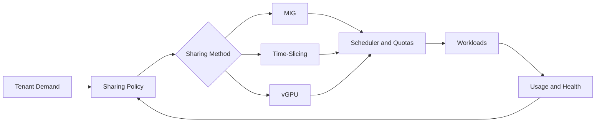

# Volume 11 — GPU Sharing

GPU scarcity creates pressure to share expensive accelerators. The difficult question is not whether multiple users can access one GPU. It is whether the platform can provide predictable performance, meaningful isolation, fair scheduling, accountable consumption, and recoverable operations.

This volume explains the major sharing models—MIG, time-slicing, and vGPU—from first principles. It then connects those mechanisms to Kubernetes scheduling, tenant security, capacity planning, observability, upgrades, and incident response.

| Volume field | Value |
|---|---|
| Difficulty | Advanced |
| Estimated reading time | 18–22 hours |
| Prerequisites | Volumes 01–10 |
| Primary focus | Shared GPU architecture and operations |
| Outcome | Select, deploy, monitor, and troubleshoot the correct sharing model |

## Big Picture

**Figure 11.0.1 — GPU sharing is a policy and lifecycle problem.** The mechanism must match the isolation, performance, and operational requirements.

## Chapters

1. [Why GPU Sharing Exists](./chapter-01-why-gpu-sharing-exists)
2. [MIG Architecture and Isolation](./chapter-02-mig-architecture-and-isolation)
3. [MIG Profiles and Placement](./chapter-03-mig-profiles-and-placement)
4. [Time-Slicing and Oversubscription](./chapter-04-time-slicing-and-oversubscription)
5. [vGPU Architecture and Enterprise Virtualization](./chapter-05-vgpu-architecture-and-enterprise-virtualization)
6. [Comparing MIG, Time-Slicing, and vGPU](./chapter-06-comparing-mig-time-slicing-and-vgpu)
7. [Kubernetes Scheduling for Shared GPUs](./chapter-07-kubernetes-scheduling-for-shared-gpus)
8. [Tenant Isolation, Security, and Fairness](./chapter-08-tenant-isolation-security-and-fairness)
9. [Capacity Planning and Chargeback](./chapter-09-capacity-planning-and-chargeback)
10. [Observability and SLOs for Shared GPUs](./chapter-10-observability-and-slos-for-shared-gpus)
11. [Production Troubleshooting](./chapter-11-production-troubleshooting)
12. [Volume 11 Summary](./chapter-12-volume-11-summary)

## Labs

- [Configure and Validate MIG](./labs/lab-01-configure-and-validate-mig)
- [Configure Kubernetes GPU Time-Slicing](./labs/lab-02-configure-kubernetes-gpu-time-slicing)
- [Compare Sharing Performance and Isolation](./labs/lab-03-compare-sharing-performance-and-isolation)
- [Troubleshoot a Multi-Tenant GPU Node](./labs/lab-04-troubleshoot-a-multi-tenant-gpu-node)
