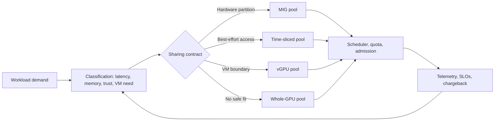

# Volume 11 — GPU Sharing

GPU sharing is a promise-management problem. A platform can expose more logical GPU allocations than physical devices, but it must state exactly what each allocation means: access to a device, a memory reservation, a compute partition, a virtual-machine boundary, or merely a turn at a shared execution engine.

This volume starts with that contract. It develops the hardware and scheduler mechanics behind Multi-Instance GPU (MIG), time-slicing, CUDA Multi-Process Service (MPS), and vGPU, then applies them to Kubernetes placement, tenant isolation, cost allocation, observability, upgrades, and incident response. The target reader is the engineer who must defend a sharing design during an outage—not merely enable a flag.

| Volume field | Value |
|---|---|
| Difficulty | Advanced |
| Estimated reading time | 18–22 hours |
| Prerequisites | Volumes 03, 07, 09, and 10 |
| Primary outcome | Match each workload class to an explicit sharing guarantee |
| Safety boundary | Do not change MIG mode or GPU layouts on a production node without drain, rollback, and change approval |

## The operating model

**Figure 11.0.1 — A sharing mechanism follows the workload contract; it does not define it.** Node labels and Kubernetes resources express inventory, while policy, quotas, admission, and service objectives determine whether that inventory is safe to consume.

## What this volume will and will not promise

MIG can partition supported GPUs into hardware-defined GPU instances with distinct compute and memory paths. Time-slicing makes additional scheduler-visible replicas available but does not provide memory or fault isolation between those replicas. vGPU is a virtualization stack with a VM-oriented lifecycle and compatibility requirements. None removes the shared physical dependencies: host security, driver lifecycle, power, cooling, firmware, and a physical-device failure can still be common causes.

The phrase **utilization** needs care. A low average utilization chart can indicate idle capacity, but it can also hide burst demand, memory pressure, synchronization stalls, or a tail-latency SLO. This volume therefore treats the following as separate design inputs:

| Question | Evidence to collect | Decision it informs |
|---|---|---|
| Can jobs coexist? | memory high-water mark, active contexts, burst overlap | density and admission |
| Must performance be predictable? | p50/p95/p99 latency, throughput variance | MIG versus whole GPU |
| Is the tenant boundary strong enough? | identity, namespace/VM controls, data sensitivity | vGPU, MIG, or separation |
| Can the platform reconfigure safely? | drain time, recovery objective, spare capacity | static layouts versus dynamic changes |
| Who pays for idle reservations? | allocation, active use, queue delay | quota and chargeback |

## Reading path

1. Why GPU Sharing Exists defines the contract and workload taxonomy.
2. MIG Architecture and Isolation explains hardware instances and their limits.
3. MIG Profiles and Placement turns profiles into fleet inventory.
4. Time-Slicing and Oversubscription explains logical replicas and contention.
5. vGPU Architecture and Enterprise Virtualization covers VM-oriented sharing.
6. Comparing MIG, Time-Slicing, and vGPU supplies a decision framework.
7. Kubernetes Scheduling for Shared GPUs connects inventory to placement.
8. Tenant Isolation, Security, and Fairness defines the policy envelope.
9. Capacity Planning and Chargeback sizes and accounts for the service.
10. Observability and SLOs for Shared GPUs makes the guarantees observable.
11. Production Troubleshooting provides incident patterns.
12. Volume 11 Summary consolidates the design decisions.

## Labs

- Configure and Validate MIG
- Configure Kubernetes GPU Time-Slicing
- Compare Sharing Performance and Isolation
- Troubleshoot a Multi-Tenant GPU Node

## Success criteria

By the end of the volume, you should be able to review a request such as “give every data scientist one GPU” and replace it with a defensible service definition: eligible workloads, supported hardware, resource names, admission limits, expected evidence, failure domains, escalation data, and a reversal path.
