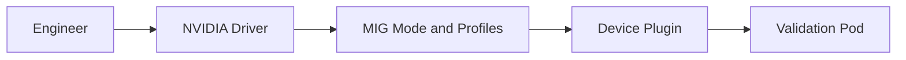

# Lab 01 — Configure and Validate MIG

## 1. Objective

Create a controlled MIG layout on a supported non-production GPU, verify instance inventory and workload visibility, inject a layout mismatch, and recover safely.

## 2. Background

MIG reconfiguration changes the schedulable shape of a node. Treat it as a maintenance operation, not an ad hoc user action.

## 3. Learning Outcomes

You will inventory supported profiles, create instances, validate device exposure, recognize fragmentation, and restore the approved layout.

## 4. Architecture



## 5. Prerequisites

- supported GPU and driver;
- no production workloads on the device;
- console access and rollback approval;
- Kubernetes drain procedure if the node is clustered.

## 6. Environment

Record GPU model, driver, firmware, kernel, and current workloads.

## 7. Components

Physical GPU, MIG mode, GPU instances, compute instances, device plugin, scheduler, validation workload.

## 8. Deployment

```bash
nvidia-smi -L
nvidia-smi mig -lgip
nvidia-smi mig -lgi
```

Drain the node where applicable. Enable MIG mode and create only a profile layout supported by the installed platform documentation and your approved runbook.

## 9. Validation

```bash
nvidia-smi -L
nvidia-smi mig -lgi
kubectl get node -o jsonpath='{.status.allocatable}'
```

Expected output includes MIG devices and corresponding schedulable resources.

## 10. Verification

Run one validation workload per instance and confirm device identity, memory capacity, and isolation from neighboring workloads.

## 11. Observability

Capture DCGM metrics, device-plugin logs, node events, and instance inventory.

## 12. Performance Measurements

Measure a small deterministic workload alone and concurrently. Compare throughput and latency against the expected profile envelope.

## 13. Failure Injection

Request a profile not present in the current layout. Observe the Pending event and prove that the scheduler cannot create geometry automatically.

## 14. Troubleshooting

If resources are missing, verify physical health, MIG mode, active instances, plugin discovery, and kubelet registration in that order.

## 15. Cleanup

Delete test workloads. Restore the approved MIG layout or disable MIG according to the runbook. Uncordon the node only after validation.

## 16. Summary

You treated MIG as a controlled capacity transformation and validated both hardware and scheduler state.

## 17. Challenge Exercises

Create two standardized layouts and document the drain, acceptance, and rollback gates.

## 18. Further Reading

- [MIG Architecture and Isolation](../chapter-02-mig-architecture-and-isolation)
- [MIG Profiles and Placement](../chapter-03-mig-profiles-and-placement)
