# Lab 01 — Configure and Validate MIG

| Field | Value |
|---|---|
| Chapter | 02–03 — MIG architecture, profiles, and placement |
| Difficulty / time | Advanced / 90–120 minutes |
| Type | Controlled reconfiguration and evidence collection |
| Audience | GPU platform engineers and SREs |

## 1. Objective

Apply one pre-approved Multi-Instance GPU (MIG) layout to a **disposable, supported GPU node**, prove that the host and Kubernetes expose the resulting devices, run bounded validation workloads, and restore the approved baseline. This is a lifecycle exercise, not a method for experimenting on a busy node.

## 2. Production Story

A platform team needs predictable small inference partitions. An engineer sees unused capacity and changes a MIG layout in place. Existing workloads lose their device shape, the device-plugin inventory changes, and a workload class cannot schedule. The reliable path is to treat the layout as capacity configuration: drain, record the before state, apply a documented geometry, verify every control-plane layer, and keep a tested rollback.

## 3. Learning Outcomes

You will be able to identify whether a GPU and driver expose MIG controls, distinguish supported profiles from active instances, collect evidence for a layout change, verify Kubernetes resource advertisement, and return the node to its documented baseline.

## 4. Architecture

```mermaid
flowchart LR
  Admin[Approved change] --> Drain[Drain or isolate node]
  Drain --> Driver[NVIDIA driver]
  Driver --> Mode[MIG mode]
  Mode --> GI[GPU instances]
  GI --> CI[Compute instances]
  CI --> Plugin[Device plugin]
  Plugin --> Kubelet[Kubelet inventory]
  Kubelet --> Pod[Validation Pod]
  Pod --> Evidence[Change evidence]
```



**Figure 11.L1.1 — A MIG layout is visible to workloads only after the driver, instance inventory, and Kubernetes registration agree.**

## 5. Prerequisites

- A supported GPU, compatible driver, and an approved maintenance window. Confirm support and profile names from the [NVIDIA MIG User Guide](https://docs.nvidia.com/datacenter/tesla/mig-user-guide/).
- A non-production cluster or an isolated node pool; do not use a node hosting customer work.
- `kubectl`, host-console or SSH access, and permission to create a namespace and Pods.
- An internally approved image that contains `nvidia-smi`; set `GPU_TEST_IMAGE` to that immutable image reference.
- A written baseline layout and rollback owner. Profile IDs and legal placements are hardware- and driver-specific; this lab deliberately does not guess them.

## 6. Safety and Change Boundaries

MIG mode and instance changes can require a GPU reset and can remove devices visible to running processes. Drain the node or isolate it from scheduling first. Do not run a profile-create command until the change ticket names the GPU index, target profile identifier, baseline layout, and rollback layout. Do not run this lab on a GPU that is passed through to an unmanaged tenant VM.

## 7. Environment and Variables

Set names only after the change approver has confirmed them.

**Purpose:** Bind every later command to the approved node and prevent an accidental context change.

**Command:**
```bash
export GPU_NODE='<approved-disposable-gpu-node>'
export GPU_INDEX='<approved-gpu-index>'
export LAB_NAMESPACE='gpu-sharing-lab'
export GPU_TEST_IMAGE='<approved-image-with-nvidia-smi>'
kubectl config current-context
kubectl get node "$GPU_NODE" -o wide
```

**Expected evidence:** The expected cluster context is printed and exactly one approved node is returned.

**Explanation:** Variables make the command log reviewable. They do not authorize a change.

**Common-failure interpretation:** A missing node, unexpected context, or authorization error is a stop condition. Do not substitute a production node.

## 8. Components and Data Flow

| Layer | Responsibility | Evidence to retain |
|---|---|---|
| GPU and driver | Expose supported MIG modes and profiles | `nvidia-smi` inventory |
| GPU/compute instances | Define the active hardware geometry | MIG instance listing |
| Device plugin | Discovers exposed devices | plugin logs and node resources |
| Kubelet and scheduler | Advertise and allocate resources | node status and Pod events |
| Validation workload | Proves the assigned device can initialize | container log |

## 9. Baseline Evidence

Run the host commands through the approved console or SSH path. These are **hardware-only commands**.

**Purpose:** Capture the physical inventory, supported profiles, active instances, and topology before changing anything.

**Command:**
```bash
nvidia-smi -L
nvidia-smi -i "$GPU_INDEX" -q -d MIG
nvidia-smi mig -lgip -i "$GPU_INDEX"
nvidia-smi mig -lgi -i "$GPU_INDEX"
nvidia-smi mig -lci -i "$GPU_INDEX"
```

**Expected evidence:** The output identifies the selected physical GPU. The profile listing is the authoritative source for supported profile IDs on this host; active GPU and compute instance listings may be empty at baseline.

**Example output — baseline state on an H100:**
```bash
$ nvidia-smi -L
GPU 0: NVIDIA H100 80GB HBM3 (UUID: GPU-12345678-1234-1234-1234-123456789abc)

$ nvidia-smi -i 0 -q -d MIG
GPU 0: NVIDIA H100 80GB HBM3
  MIG Mode: Disabled
  Current GPU Instance Occupancy: 0 / 1 (no instances)

$ nvidia-smi mig -lgip -i 0
| GPU  0 MIG Profiles  |  Name         | Instances | Memory |
|==========================================|
|  0   1g.10gb         |  1 GI of 10GB | 7         | 10 GB  |
|  1   1g.20gb         |  1 GI of 20GB | 4         | 20 GB  |
|  2   2g.20gb         |  1 GI of 20GB | 3         | 20 GB  |
|  3   3g.40gb         |  1 GI of 40GB | 2         | 40 GB  |
|  4   4g.40gb         |  1 GI of 40GB | 1         | 40 GB  |
|  5   7g.80gb         |  1 GI of 80GB | 1         | 80 GB  |

$ nvidia-smi mig -lgi -i 0
| GPU  0 GPU Instances |
| No GPU Instances are currently running on this GPU |

$ nvidia-smi mig -lci -i 0
| GPU  0 Compute Instances |
| No Compute Instances are currently running on this GPU |
```

Save this output to `mig-baseline-before.txt` in your change record.

**Explanation:** A profile catalog is not proof that a profile is active. Record both the catalog and active geometry so fragmentation and rollback can be investigated later.

**Common-failure interpretation:** `Failed to communicate with NVIDIA driver`, a missing MIG query, or an unexpected GPU index requires driver, hardware, or access investigation. Do not continue with a reconfiguration.

**Purpose:** Record Kubernetes’ pre-change view and identify the component that owns GPU discovery.

**Command:**
```bash
kubectl describe node "$GPU_NODE"
kubectl get pods -A -o wide | grep -Ei 'nvidia|device-plugin|gpu-feature' || true
```

**Expected evidence:** The node description records current extended resources, labels, taints, and conditions; the second command either identifies the deployed GPU operands or returns no matches without failing.

**Explanation:** The platform may use the GPU Operator or a standalone device plugin. Establish ownership before assuming a namespace or restart action.

**Common-failure interpretation:** A NotReady node, a pending platform upgrade, or an unknown ownership model is a stop condition for this lab.

## 10. Drain and Isolate the Node

Follow the organization’s maintenance runbook. The example below is intentionally not a universal drain command because DaemonSet, local-storage, and disruption policy decisions are cluster-specific.

**Purpose:** Verify that no non-lab workload still depends on the target node before a device-shape change.

**Command:**
```bash
kubectl get pods -A --field-selector spec.nodeName="$GPU_NODE" -o wide
kubectl cordon "$GPU_NODE"
```

**Expected evidence:** The first command produces a reviewable workload list; the second marks the node unschedulable.

**Explanation:** Cordon prevents new ordinary scheduling but does not evict existing Pods. Use an approved drain procedure only after its workload impact is reviewed.

**Common-failure interpretation:** Any unapproved workload on the node means stop and hand the list to the service owner. A cordon failure indicates an authorization or policy boundary, not a reason to escalate privileges.

## 11. Apply the Approved MIG Layout

The following commands use placeholders because NVIDIA documents profile identifiers and placements per supported GPU. Copy the exact values from the recorded profile listing and approved change record. These are **hardware-only, state-changing commands**.

**Purpose:** Enable MIG mode only when the approved baseline says it is disabled.

**Command:**
```bash
sudo nvidia-smi -i "$GPU_INDEX" -mig 1
```

**Expected evidence:** The driver reports that MIG mode was enabled, or reports that it was already enabled. Some systems require a reset or reboot before the mode takes effect.

**Explanation:** MIG mode is a prerequisite, not a complete layout. Follow the driver’s reset guidance and the approved runbook; never force-reset a device with active work.

**Common-failure interpretation:** A reset-required message is expected on some systems. A permission, support, or busy-device error means stop and resolve the prerequisite rather than retrying repeatedly.

**Purpose:** Create the single approved GPU-instance geometry and its compute instance(s).

**Command:**
```bash
sudo nvidia-smi mig -cgi <approved-profile-id> -C -i "$GPU_INDEX"
```

**Expected evidence:** The command returns an instance creation result or an error that names an unsupported or unavailable placement.

**Explanation:** `-cgi` accepts a profile identifier from the host’s own supported-profile output; `-C` requests corresponding compute-instance creation. For mixed layouts, execute only the ordered commands in the approved manifest.

**Common-failure interpretation:** An unavailable placement commonly indicates an incompatible existing layout or fragmentation. Do not delete instances opportunistically; return to the approved rollback path.

## 12. Validate Host Inventory and Kubernetes Advertisement

**Purpose:** Verify that the driver now reports the intended active layout.

**Command:**
```bash
nvidia-smi -L
nvidia-smi mig -lgi -i "$GPU_INDEX"
nvidia-smi mig -lci -i "$GPU_INDEX"
```

**Expected evidence:** The physical GPU and active MIG devices are listed. Record the instance identifiers and the layout timestamp in the change record.

**Explanation:** This proves the host state only. Kubernetes visibility is a separate reconciliation step.

**Common-failure interpretation:** Missing active instances after a reported create operation requires comparison with the driver’s error output and the change manifest before any retry.

**Purpose:** Wait for the existing platform to advertise the new inventory without manually restarting an unknown controller.

**Command:**
```bash
kubectl get node "$GPU_NODE" -o jsonpath='{.status.capacity}{"\n"}{.status.allocatable}{"\n"}'
kubectl get events -A --sort-by=.lastTimestamp | tail -n 30
```

**Expected evidence:** Node Capacity and Allocatable contain the resource names configured by the deployed MIG strategy, and recent events show no registration failure.

**Explanation:** Resource names differ by device-plugin strategy. Compare them with the platform’s documented policy rather than assuming a profile string.

**Common-failure interpretation:** Host devices present but no Kubernetes resources points to discovery, plugin, or kubelet registration. Capture logs from the owned platform component; do not recreate its Pods blindly.

## 13. Validation Workload

Create a disposable namespace and replace `&lt;advertised-mig-resource&gt;` with the exact allocatable resource name observed in section 12.

```yaml
apiVersion: v1
kind: Namespace
metadata:
  name: gpu-sharing-lab
---
apiVersion: v1
kind: Pod
metadata:
  name: mig-validation
  namespace: gpu-sharing-lab
spec:
  restartPolicy: Never
  nodeSelector:
    kubernetes.io/hostname: <approved-disposable-gpu-node>
  tolerations:
    - key: node.kubernetes.io/unschedulable
      operator: Exists
      effect: NoSchedule
  containers:
    - name: validation
      image: <approved-image-with-nvidia-smi>
      command: ["sh", "-c", "nvidia-smi -L; echo MIG_VALIDATION_COMPLETE"]
      resources:
        limits:
          <advertised-mig-resource>: 1
```

**Purpose:** Apply a single bounded Pod that requests one observed MIG resource.

**Command:**
```bash
kubectl apply -f mig-validation.yaml
kubectl get pod -n "$LAB_NAMESPACE" mig-validation -w
```

**Expected evidence:** The Pod is bound to the approved, still-cordoned node and reaches `Completed` if the image and runtime are available.

**Example output — successful validation:**
```bash
$ kubectl apply -f mig-validation.yaml
namespace/gpu-sharing-lab created
pod/mig-validation created

$ kubectl get pod -n gpu-sharing-lab mig-validation -w
NAME             READY   STATUS      RESTARTS   AGE
mig-validation   0/1     Pending     0          2s
mig-validation   0/1     ContainerCreating 0    5s
mig-validation   1/1     Running     0          8s
mig-validation   0/1     Completed   0          10s

$ kubectl logs -n gpu-sharing-lab mig-validation
GPU 0: NVIDIA H100 80GB HBM3 (GPU instance, not full device)
MIG_VALIDATION_COMPLETE
```

If instead you see:
```
Pending (Unschedulable (0/1 nodes are available: 1 node(s) had insufficient nvidia.com/mig-20gb resource))
```
Then: the resource name is wrong (compare with `kubectl describe node`) or the instance wasn't created.

**Explanation:** The narrowly scoped `node.kubernetes.io/unschedulable` toleration allows this named lab Pod to schedule while the cordon continues to protect the node from ordinary placement. Its node selector and disposable namespace are part of that boundary. The manifest tests scheduler allocation and runtime initialization; it does not benchmark isolation or establish a production SLO.

**Common-failure interpretation:** `Pending` without the expected toleration indicates the applied manifest differs from the reviewed file; a taint event requires verification that the cordon taint and toleration match. `ImagePullBackOff` is an image supply issue; a runtime creation failure indicates a device/runtime path problem.

## 14. Verification and Acceptance Criteria

**Purpose:** Collect allocation and runtime evidence for the change record.

**Command:**
```bash
kubectl logs -n "$LAB_NAMESPACE" mig-validation
kubectl describe pod -n "$LAB_NAMESPACE" mig-validation
```

**Expected evidence:** Logs include `MIG_VALIDATION_COMPLETE` and device enumeration; events show no allocation or runtime error.

**Explanation:** A completed Pod demonstrates a usable device path for the requested resource. It does not prove capacity for a different model or profile.

**Common-failure interpretation:** A successful schedule with failed `nvidia-smi` narrows the fault to container runtime or driver exposure; retain the event and container logs.

Accept the change only when: the approved active layout is present, the expected resource is Allocatable, one validation Pod completes, and the rollback layout has been recorded and reviewed.

## 15. Observability and Measurements

Capture a small evidence bundle before and after the change. Do not interpret one utilization snapshot as an isolation benchmark.

**Purpose:** Preserve minimum incident and audit evidence.

**Command:**
```bash
mkdir -p mig-lab-evidence
kubectl describe node "$GPU_NODE" > mig-lab-evidence/node.txt
kubectl get pod -n "$LAB_NAMESPACE" mig-validation -o yaml > mig-lab-evidence/pod.yaml
kubectl logs -n "$LAB_NAMESPACE" mig-validation > mig-lab-evidence/pod.log
```

**Expected evidence:** The directory contains node, Pod specification, and execution evidence suitable for the change record.

**Explanation:** Add device-plugin logs and DCGM telemetry using the platform’s approved collection path. Redact credentials before sharing the bundle.

**Common-failure interpretation:** A missing log due to a deleted Pod is a process gap; use events and avoid recreating the failure without approval.

## 16. Safe Failure Exercise and Troubleshooting

In a disposable cluster, request a resource name that is deliberately absent from the node. This changes only the test Pod, not the MIG layout.

**Purpose:** Observe a scheduling failure caused by resource inventory mismatch.

**Command:**
```bash
kubectl patch pod -n "$LAB_NAMESPACE" mig-validation --type merge \
  -p '{"spec":{"containers":[{"name":"validation","resources":{"limits":{"nvidia.com/mig-nonexistent":1}}}]}}'
```

**Expected evidence:** Kubernetes rejects mutation of an existing Pod spec or, if performed with a separately created test Pod, leaves it Pending with an insufficient-resource event.

**Explanation:** The safe exercise is intentionally scoped to a disposable workload. If an immutable-field error occurs, create a second manifest named `mig-missing-resource` instead of modifying the successful Pod.

**Common-failure interpretation:** If a nonexistent resource unexpectedly schedules, inspect the actual manifest and resource name; do not infer that the node created a profile automatically.

| Symptom | First evidence | Likely layer | Safe response |
|---|---|---|---|
| MIG query unsupported | driver inventory | hardware/driver support | stop and confirm support matrix |
| Create fails | profile catalog and active geometry | placement/fragmentation | use approved rollback |
| Host sees instances, node does not | plugin logs and node status | discovery/registration | repair owned component only |
| Pod Pending | Pod events and resource name | scheduling/policy | compare request to Allocatable |
| Pod starts but cannot enumerate | container log and runtime evidence | runtime/driver exposure | investigate before changing layout |

## 17. Cleanup and Rollback

Delete lab workloads first. Namespace deletion is a Kubernetes-only cleanup action. Then apply the approved rollback layout through the change runbook; the later `nvidia-smi` instance-deletion commands are **hardware-only and state-changing** and require validated instance IDs and ordering.

**Purpose:** Remove the disposable workload and namespace.

**Command:**
```bash
kubectl delete namespace "$LAB_NAMESPACE" --ignore-not-found
```

**Expected evidence:** Kubernetes reports deletion or `not found`.

**Explanation:** Namespace deletion removes only lab objects. Confirm it has completed before uncordoning the node.

**Common-failure interpretation:** A namespace stuck in Terminating requires ordinary cluster troubleshooting; do not remove finalizers unless the cluster owner approves.

**Purpose:** Restore the approved host layout after all instances have been drained.

**Command:**
```bash
sudo nvidia-smi mig -dci -i "$GPU_INDEX"
sudo nvidia-smi mig -dgi -i "$GPU_INDEX"
# Apply the approved baseline layout, or disable MIG only if that is the baseline:
# sudo nvidia-smi -i "$GPU_INDEX" -mig 0
```

**Expected evidence:** The driver confirms deletion, then the recorded baseline inventory is restored by the approved manifest or mode transition.

**Explanation:** Deletion order matters: remove compute instances before GPU instances. Never use this as an emergency fix for a node carrying workloads.

**Common-failure interpretation:** Busy-instance or reset-required messages mean the drain/rollback prerequisites are incomplete. Stop rather than forcing a reset.

**Purpose:** Verify baseline recovery before returning the node to scheduling.

**Command:**
```bash
nvidia-smi -L
kubectl get node "$GPU_NODE" -o jsonpath='{.status.allocatable}{"\n"}'
kubectl uncordon "$GPU_NODE"
```

**Expected evidence:** Host and Kubernetes inventory match the approved baseline, no lab workload remains, and the node becomes schedulable only after review.

**Explanation:** `uncordon` is the final change, not a substitute for rollback verification.

**Common-failure interpretation:** Any mismatch keeps the node cordoned and escalates with the evidence bundle.

## 18. Summary, Challenges, and Further Reading

You changed a device shape as a controlled capacity operation and proved its host-to-Pod path. For a next exercise, compare two *pre-approved* standardized layouts and calculate which workload demand cannot be served because of geometry—not merely total free slices.

- [MIG Architecture and Isolation](../chapter-02-mig-architecture-and-isolation)
- [MIG Profiles and Placement](../chapter-03-mig-profiles-and-placement)
- [Kubernetes Scheduling for Shared GPUs](../chapter-07-kubernetes-scheduling-for-shared-gpus)
- [NVIDIA MIG User Guide](https://docs.nvidia.com/datacenter/tesla/mig-user-guide/)
- [NVIDIA device plugin: MIG support](https://github.com/NVIDIA/k8s-device-plugin#multi-instance-gpu-mig-support)
