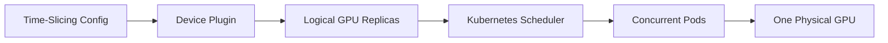

# Lab 02 — Configure Kubernetes GPU Time-Slicing

## Objective

Configure time-slicing on a test node, schedule multiple workloads, measure the difference between logical allocation and physical service, and restore the baseline.

## Architecture



## Prerequisites

GPU Operator or NVIDIA device plugin, one disposable GPU node, kubectl access, approved configuration, and a repeatable test workload.

## Deployment

Save the current values. Apply a version-controlled time-slicing configuration with a conservative replica count. Wait for the device plugin to reconcile.

## Validation

```bash
kubectl describe node <gpu-node>
kubectl get pods -A -o wide | grep -i device-plugin
```

Confirm that allocatable logical resources increased as expected.

## Verification

Launch several Pods requesting one logical GPU each. Confirm that several schedule to the same physical device.

## Observability

Measure per-Pod latency, GPU memory, physical utilization, process count, and scheduler queue time.

## Performance Measurement

Run one workload alone, then two, four, and the configured maximum. Plot throughput and p95 latency. Do not assume equal shares.

## Failure Injection

Increase concurrency until the service objective fails or memory pressure appears. Stop before risking node stability.

## Troubleshooting

A Running Pod does not prove acceptable service. Diagnose application latency and memory behavior, not only scheduler success.

## Cleanup

Delete workloads and restore the original device-plugin configuration.

## Challenge

Create an admission policy that prevents latency-sensitive namespaces from using time-sliced nodes.
