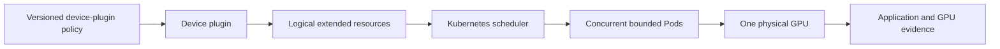

# Lab 02 — Configure Kubernetes GPU Time-Slicing

| Field | Value |
|---|---|
| Chapter | 04 and 07 — time-slicing and Kubernetes scheduling |
| Difficulty / time | Advanced / 75–105 minutes |
| Type | Configuration, validation, and bounded contention test |
| Audience | Kubernetes platform engineers and SREs |

## 1. Objective

Configure a documented NVIDIA device-plugin time-slicing policy on one disposable GPU node, verify the resulting logical resource advertisement, schedule bounded test Pods, collect application and node evidence, and restore the original policy. The lab demonstrates access oversubscription; it does not claim that logical replicas reserve equal compute, memory, or latency.

## 2. Production Story

A developer platform advertises eight logical GPUs for every physical GPU. Queue times improve, but a latency-sensitive service is accidentally admitted to the same pool and its p99 latency becomes unstable. The scheduler performed exactly what it was told: it allocated access tokens. The missing control was workload classification, not a larger replica number.

## 3. Learning Outcomes

You will identify the policy owner, apply an explicit time-slicing configuration, distinguish physical inventory from logical allocation, collect contention evidence, and use a safe workload-only failure exercise to validate scheduler and quota messages.

## 4. Architecture



## 5. Prerequisites

- An isolated, non-production GPU node with a known whole-GPU baseline. Do not combine this lab with an active MIG layout unless the platform design explicitly supports that combination.
- NVIDIA GPU Operator or NVIDIA device plugin ownership is known. The configuration shape below follows the [NVIDIA device-plugin configuration reference](https://github.com/NVIDIA/k8s-device-plugin#configuring-the-nvidia-device-plugin-binary).
- Permission to create a ConfigMap in the operator-owned namespace *only if* your change process permits it, and permission to create a disposable namespace and Pods.
- An immutable approved `GPU_TEST_IMAGE` containing `nvidia-smi` and a test command that ends predictably.

## 6. Safety and Change Boundaries

Time-slicing changes resource advertisement and therefore placement behavior. Use a tainted or otherwise isolated node, cordon it before policy changes, and do not edit a shared cluster-wide ConfigMap. Use a deliberately conservative replica count from the approved change record. A `Running` Pod is not success if its service objective fails.

## 7. Environment and Variables

**Purpose:** Establish an auditable target and keep lab resources separate from tenant namespaces.

**Command:**
```bash
export GPU_NODE='<approved-disposable-gpu-node>'
export OPERATOR_NAMESPACE='<namespace-that-owns-the-device-plugin>'
export CLUSTERPOLICY_NAME='<approved-clusterpolicy-name>'
export LAB_NAMESPACE='gpu-time-slicing-lab'
export GPU_TEST_IMAGE='<approved-image-with-nvidia-smi>'
kubectl config current-context
kubectl get node "$GPU_NODE" -o wide
```

**Expected evidence:** The expected context and the single approved node are displayed.

**Explanation:** Substitute values from the change record; do not infer the operator namespace from a tutorial.

**Common-failure interpretation:** An unexpected context, node, or authorization error is a stop condition.

## 8. Components and Resource Semantics

| Component | Responsibility | What it does not guarantee |
|---|---|---|
| Device plugin | Advertises configured logical replicas | equal compute share |
| Kubelet | Publishes Capacity and Allocatable | workload SLOs |
| Scheduler | Binds Pods that request resources | physical isolation |
| Kubernetes policy | Limits who can request tokens | memory partitioning |
| Application telemetry | Shows user-visible behavior | a universal replica limit |

## 9. Baseline and Node Isolation

**Purpose:** Capture physical GPU count and current extended-resource advertisement before changing policy.

**Command:**
```bash
kubectl get node "$GPU_NODE" -o jsonpath='{.status.capacity.nvidia\.com/gpu}{" capacity\n"}{.status.allocatable.nvidia\.com/gpu}{" allocatable\n"}'
kubectl describe node "$GPU_NODE"
```

**Expected evidence:** Resource values, labels, taints, conditions, and current allocations are available for the change record.

**Explanation:** The baseline lets reviewers distinguish an intended logical count from a stale or failed device-plugin update.

**Common-failure interpretation:** Missing baseline resources must be resolved as a GPU platform issue before testing time-slicing.

**Purpose:** Prevent new workload placement while the node’s advertised capacity changes.

**Command:**
```bash
kubectl get pods -A --field-selector spec.nodeName="$GPU_NODE" -o wide
kubectl cordon "$GPU_NODE"
```

**Expected evidence:** Existing workloads are reviewed and the node becomes unschedulable for ordinary new work.

**Explanation:** Cordon does not remove existing Pods. Apply the organization’s approved drain procedure only after reviewing disruption impact.

**Common-failure interpretation:** Unapproved workloads mean stop. Do not use force deletion to make the lab convenient.

## 10. Create an Explicit Policy

This is an example policy for **one approved test node/pool**. The replication count is a policy input, not an NVIDIA recommendation. Check the installed Operator/device-plugin version before applying it; field ownership differs between deployment models.

```yaml
apiVersion: v1
kind: ConfigMap
metadata:
  name: time-slicing-lab-config
  namespace: <namespace-that-owns-the-device-plugin>
data:
  any: |-
    version: v1
    sharing:
      timeSlicing:
        renameByDefault: false
        failRequestsGreaterThanOne: true
        resources:
          - name: nvidia.com/gpu
            replicas: <approved-conservative-replica-count>
```

**Purpose:** Create the version-controlled, named policy after replacing the namespace and replica placeholder with approved values.

**Command:**
```bash
kubectl apply -f time-slicing-lab-config.yaml
kubectl get configmap -n "$OPERATOR_NAMESPACE" time-slicing-lab-config -o yaml
```

**Expected evidence:** The ConfigMap exists and its rendered data matches the reviewed policy.

**Explanation:** The ConfigMap alone does nothing until the active device-plugin or GPU Operator configuration selects it.

**Common-failure interpretation:** A forbidden or missing namespace error means the platform ownership boundary is not available for this lab. Stop rather than creating an alternative global configuration.

## 11. Select the Policy Through the Supported Control Plane

This reproducible path applies only to a **dedicated test GPU Operator installation or a test-only GPU node pool**. The GPU Operator documents `spec.devicePlugin.config.name` and `default` selection; confirm these fields exist in the installed CustomResourceDefinition before use because Operator versions can differ. In a shared Operator installation, stop and use the owner’s versioned, node-scoped configuration workflow instead of replacing its selected ConfigMap.

**Purpose:** Inspect the current owner and configuration reference rather than guessing a resource name.

**Command:**
```bash
kubectl explain clusterpolicy.spec.devicePlugin.config
kubectl get clusterpolicy "$CLUSTERPOLICY_NAME" -o yaml > clusterpolicy-before-time-slicing.yaml
kubectl get clusterpolicy "$CLUSTERPOLICY_NAME" -o jsonpath='{.spec.devicePlugin.config}{"\n"}'
kubectl get pods -n "$OPERATOR_NAMESPACE" -o wide
```

**Expected evidence:** `kubectl explain` exposes the installed schema, the backup records the exact prior selection, and the final command identifies the device-plugin workload and its node placement.

**Explanation:** The GPU Operator selection is a named ConfigMap plus data key, not a generic DaemonSet edit. The backup is the rollback source; do not apply it blindly over unrelated post-capture changes.

**Common-failure interpretation:** No identifiable owner is a stop condition. Do not patch a DaemonSet spec based on assumptions.

**Purpose:** Select the `any` key in the named ConfigMap through the documented GPU Operator control plane on the isolated test installation.

**Command:**
```bash
kubectl patch clusterpolicy "$CLUSTERPOLICY_NAME" --type merge \
  --patch '{"spec":{"devicePlugin":{"config":{"name":"time-slicing-lab-config","default":"any"}}}}'
kubectl get clusterpolicy "$CLUSTERPOLICY_NAME" -o jsonpath='{.spec.devicePlugin.config}{"\n"}'
```

**Expected evidence:** The returned configuration names `time-slicing-lab-config` and key `any`; no other ClusterPolicy field is changed by this merge patch.

**Explanation:** This is version-aware because the preceding `kubectl explain` validates the local schema. It is reproducible because the ConfigMap key and patch are explicit. It is not a safe shortcut for a shared Operator control plane.

**Common-failure interpretation:** A schema, not-found, or forbidden error means this deployment does not meet the lab assumptions. Do not switch to direct DaemonSet mutation.

**Purpose:** Observe reconciliation after the supported selection action.

**Command:**
```bash
kubectl get pods -n "$OPERATOR_NAMESPACE" -o wide
kubectl get node "$GPU_NODE" -o jsonpath='{.status.allocatable.nvidia\.com/gpu}{" allocatable\n"}'
```

**Expected evidence:** The device-plugin Pod on the selected node reconciles and the node reports the approved logical count.

**Example output — time-slicing successfully applied:**

```bash
# Before patch (baseline):
$ kubectl get node gpu-node-1 -o jsonpath='{.status.allocatable.nvidia\.com/gpu}{" allocatable\n"}'
1 allocatable

# Apply patch (select time-slicing ConfigMap)
$ kubectl patch clusterpolicy gpu-cluster-policy --type merge \
  --patch '{"spec":{"devicePlugin":{"config":{"name":"time-slicing-lab-config","default":"any"}}}}'
clusterpolicy.nvidia.com/gpu-cluster-policy patched

# Wait 30 seconds for reconciliation
$ kubectl get pod -n nvidia-driver-install -l app=nvidia-device-plugin --watch
NAME                           READY   STATUS    RESTARTS   AGE
nvidia-device-plugin-abc12     1/1     Running   1          2s

# After patch (new state):
$ kubectl get node gpu-node-1 -o jsonpath='{.status.allocatable.nvidia\.com/gpu}{" allocatable\n"}'
4 allocatable
# If replicas: 4 was configured, each physical GPU now shows 4 logical allocatable units
```

**Explanation:** Device-plugin reconciliation can take time. Record the resource value and platform Pod generation; do not restart the Pod just to accelerate a configuration test. A Pod restart indicates a configuration change took effect; if it does not restart, the GPU Operator may not be watching this ConfigMap or patch may have failed.

**Common-failure interpretation:** 
- Pod crash loop: ConfigMap YAML is malformed
- Resource count unchanged after 60 seconds: Operator not configured to watch this ConfigMap
- Node becomes NotReady: Rare; indicates device-plugin or operator issue—rollback immediately

## 12. Deploy Bounded Validation Workloads

Replace the image and node placeholders with approved values. The command sleeps after recording inventory so that two Pods can coexist briefly without an indefinite workload.

```yaml
apiVersion: v1
kind: Namespace
metadata:
  name: gpu-time-slicing-lab
---
apiVersion: v1
kind: Pod
metadata:
  name: time-slice-a
  namespace: gpu-time-slicing-lab
  labels:
    lab: time-slicing
spec:
  restartPolicy: Never
  nodeSelector:
    kubernetes.io/hostname: <approved-disposable-gpu-node>
  tolerations:
    - key: node.kubernetes.io/unschedulable
      operator: Exists
      effect: NoSchedule
  containers:
    - name: validation
      image: <approved-image-with-nvidia-smi>
      command: ["sh", "-c", "nvidia-smi -L; sleep 60; echo TIME_SLICE_A_COMPLETE"]
      resources:
        limits:
          nvidia.com/gpu: 1
---
apiVersion: v1
kind: Pod
metadata:
  name: time-slice-b
  namespace: gpu-time-slicing-lab
  labels:
    lab: time-slicing
spec:
  restartPolicy: Never
  nodeSelector:
    kubernetes.io/hostname: <approved-disposable-gpu-node>
  tolerations:
    - key: node.kubernetes.io/unschedulable
      operator: Exists
      effect: NoSchedule
  containers:
    - name: validation
      image: <approved-image-with-nvidia-smi>
      command: ["sh", "-c", "nvidia-smi -L; sleep 60; echo TIME_SLICE_B_COMPLETE"]
      resources:
        limits:
          nvidia.com/gpu: 1
```

**Purpose:** Create two isolated lab Pods that each request one logical GPU token.

**Command:**
```bash
kubectl apply -f time-slicing-validation.yaml
kubectl get pods -n "$LAB_NAMESPACE" -o wide -w
```

**Expected evidence:** Both Pods are bound to the approved, still-cordoned node if the logical inventory and policy permit it.

**Explanation:** The lab-only unschedulable toleration is paired with an exact node selector and disposable namespace, so the cordon keeps ordinary workloads off the node while these two reviewed Pods run. Concurrent scheduling demonstrates logical allocation; it does not prove that the Pods received exclusive or equal hardware shares.

**Common-failure interpretation:** Pending Pods require `kubectl describe pod`. A `node(s) had untolerated taint` event means the reviewed toleration was not applied or differs from the cordon taint. Image failures are unrelated to sharing and must be resolved through the approved image supply path.

## 13. Verification and Acceptance Criteria

**Purpose:** Prove allocation and inspect events, not merely Pod phases.

**Command:**
```bash
kubectl describe pod -n "$LAB_NAMESPACE" time-slice-a
kubectl describe pod -n "$LAB_NAMESPACE" time-slice-b
kubectl logs -n "$LAB_NAMESPACE" time-slice-a
kubectl logs -n "$LAB_NAMESPACE" time-slice-b
```

**Expected evidence:** Events show binding to the approved node; logs show each container initialized and printed its completion marker after the bounded wait.

**Explanation:** A successful outcome requires the configured logical resource count, two concurrent allocations, and no unexpected runtime error.

**Common-failure interpretation:** One Pod scheduling while one remains Pending can be an intended capacity limit. Compare actual Allocatable, quota, selectors, and the requested policy.

## 14. Observability and Evidence Collection

**Purpose:** Preserve Kubernetes evidence and the physical GPU process view during the overlap window.

**Command:**
```bash
mkdir -p time-slicing-evidence
kubectl get pods -n "$LAB_NAMESPACE" -o yaml > time-slicing-evidence/pods.yaml
kubectl get events -n "$LAB_NAMESPACE" --sort-by=.lastTimestamp > time-slicing-evidence/events.txt
```

**Expected evidence:** The directory contains Pod specifications and timestamped scheduler events.

**Explanation:** Collect DCGM metrics, application latency, and device-plugin logs through approved observability systems. Correlate with Pod UID and namespace; avoid exporting tenant payloads.

**Common-failure interpretation:** If logs rotate or a Pod exits before capture, record that gap and use central logging rather than recreating production-like load.

**Purpose:** Inspect host process and memory evidence during the controlled overlap. **Hardware-only command.**

**Command:**
```bash
nvidia-smi
nvidia-smi pmon -c 1
```

**Expected evidence:** The output identifies the physical GPU and, where visibility permits, active processes. Process visibility varies by driver and container runtime.

**Explanation:** These snapshots complement application telemetry; they are not a fairness measurement.

**Common-failure interpretation:** Absent process detail is an observability limitation, not proof that no work is running.

## 15. Performance Measurements

Use one approved deterministic workload and keep image, input, precision, request rate, duration, node, and telemetry window constant. Measure it alone, then with two concurrent logical allocations. Record completion count, median and tail latency, errors, GPU memory, utilization, power/thermal signals, and queue time. Report only observed values; do not generalize a replica count to another model or GPU.

## 16. Safe Failure Exercise and Troubleshooting

The safe failure is a namespace-scoped quota, not a node-level overload. It proves that policy denial has a different signal from missing GPU inventory.

```yaml
apiVersion: v1
kind: ResourceQuota
metadata:
  name: one-logical-gpu
  namespace: gpu-time-slicing-lab
spec:
  hard:
    requests.nvidia.com/gpu: "1"
    limits.nvidia.com/gpu: "1"
```

**Purpose:** Apply a quota only after deleting one validation Pod, then attempt to create two one-GPU Pods in the lab namespace.

**Command:**
```bash
kubectl apply -f one-logical-gpu-quota.yaml
kubectl get resourcequota -n "$LAB_NAMESPACE"
```

**Expected evidence:** The quota exists and the second request is denied or remains blocked according to the admission implementation.

**Explanation:** Quota creates a reversible tenant-policy failure without changing device-plugin configuration or stressing the node.

**Common-failure interpretation:** If quota does not apply, inspect its resource key and the Pod’s resource request. Do not increase physical load to force a failure.

| Symptom | First evidence | Likely cause | Safe response |
|---|---|---|---|
| Logical count unchanged | selected policy and plugin logs | policy not selected/reconciled | roll back and involve owner |
| Resources disappear | node status and plugin logs | malformed or incompatible config | restore prior policy |
| Pod Pending | Pod events, quota, taints | policy or placement | correct only lab policy |
| Pods run but SLO degrades | app metrics and GPU evidence | physical contention | reduce replicas or move service class |
| OOM or process errors | app logs and memory evidence | shared memory pressure | stop test and protect node |

## 17. Cleanup and Rollback

**Purpose:** Remove the disposable workloads and quota while retaining the ConfigMap and ClusterPolicy evidence needed for a controlled rollback.

**Command:**
```bash
kubectl delete namespace "$LAB_NAMESPACE" --ignore-not-found
```

**Expected evidence:** Kubernetes reports namespace deletion or `not found`; the selected `time-slicing-lab-config` remains present until it is no longer referenced.

**Explanation:** Restore the prior `spec.devicePlugin.config` values recorded in `clusterpolicy-before-time-slicing.yaml` with a reviewed merge patch **before** deleting the ConfigMap. Substitute the recorded `<prior-configmap>` and `<prior-key>` values in the next command.

**Purpose:** Restore the recorded ClusterPolicy selection and wait for the node to recover its baseline inventory before removing the selected ConfigMap.

**Command:**
```bash
kubectl patch clusterpolicy "$CLUSTERPOLICY_NAME" --type merge \
  --patch '{"spec":{"devicePlugin":{"config":{"name":"<prior-configmap>","default":"<prior-key>"}}}}'
kubectl get clusterpolicy "$CLUSTERPOLICY_NAME" -o jsonpath='{.spec.devicePlugin.config}{"\n"}'
kubectl get node "$GPU_NODE" -o jsonpath='{.status.allocatable.nvidia\.com/gpu}{" allocatable\n"}'
```

**Expected evidence:** The ClusterPolicy configuration exactly matches the values recorded in `clusterpolicy-before-time-slicing.yaml`, and the node’s advertised GPU resource value returns to its recorded baseline.

**Explanation:** Do not delete the lab ConfigMap until it is no longer selected *and* the baseline inventory is visible through kubelet. A node that does not return to baseline remains cordoned.

**Common-failure interpretation:** An unchanged selection, a missing resource, or a resource value different from baseline is a rollback failure. Preserve the ConfigMap and escalate with the platform logs and backup.

**Purpose:** Remove the now-unselected lab ConfigMap and prove it is absent.

**Command:**
```bash
kubectl delete configmap -n "$OPERATOR_NAMESPACE" time-slicing-lab-config --ignore-not-found
kubectl get configmap -n "$OPERATOR_NAMESPACE" time-slicing-lab-config --ignore-not-found -o name
```

**Expected evidence:** The delete reports success or `not found`, and the follow-up command returns no ConfigMap object.

**Explanation:** This removal comes after—not before—the restored ClusterPolicy and baseline inventory proof.

**Common-failure interpretation:** If the ConfigMap remains selected or cannot be removed, keep the node cordoned and investigate ownership/authorization rather than uncordoning.

**Purpose:** Verify baseline resource recovery before allowing normal scheduling.

**Command:**
```bash
kubectl get node "$GPU_NODE" -o jsonpath='{.status.allocatable.nvidia\.com/gpu}{" allocatable\n"}'
kubectl uncordon "$GPU_NODE"
```

**Expected evidence:** The advertised resource value matches the recorded baseline, the lab namespace is absent, and the node becomes schedulable only after review.

**Explanation:** The policy rollback is complete only when kubelet’s published inventory is back to baseline.

**Common-failure interpretation:** A mismatch means retain the cordon and hand off to the GPU platform owner.

## 18. Summary, Challenges, and Further Reading

You configured logical access, validated placement, and separated scheduler success from tenant experience. Next, define three workload classes—best-effort development, batch, and latency-sensitive serving—and write an admission rule that prevents the latter from selecting this node pool.

- [Time-Slicing and Oversubscription](../chapter-04-time-slicing-and-oversubscription)
- [Kubernetes Scheduling for Shared GPUs](../chapter-07-kubernetes-scheduling-for-shared-gpus)
- [Tenant Isolation, Security, and Fairness](../chapter-08-tenant-isolation-security-and-fairness)
- [NVIDIA GPU Operator GPU sharing](https://docs.nvidia.com/datacenter/cloud-native/gpu-operator/latest/gpu-sharing.html)
- [NVIDIA k8s-device-plugin configuration](https://github.com/NVIDIA/k8s-device-plugin#configuring-the-nvidia-device-plugin-binary)
