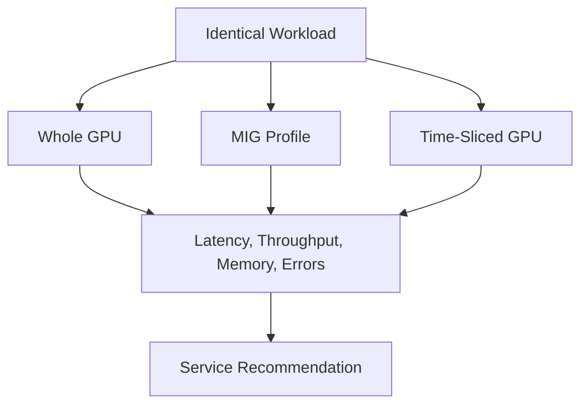

# Lab 03 — Compare Sharing Performance and Isolation

## Objective

Run the same representative workload under whole-GPU, MIG, and time-sliced configurations and produce an evidence-based recommendation.

## Method

Keep model, image, input, precision, concurrency, and measurement window constant. Record topology, driver, power state, and background activity.

## Architecture

## Validation

Confirm each run uses the intended device shape. Preserve logs and metric snapshots.

## Measurements

- median, p95, and p99 latency;
- throughput;
- memory use;
- startup time;
- error and OOM count;
- performance under a noisy neighbor.

## Failure Injection

Introduce a second workload with controlled memory and compute demand. Observe which isolation properties hold and which do not.

## Interpretation

Do not declare a universal winner. Recommend a service class for each workload category and state the assumptions.

## Cleanup

Restore the approved node layout and remove all test workloads.
