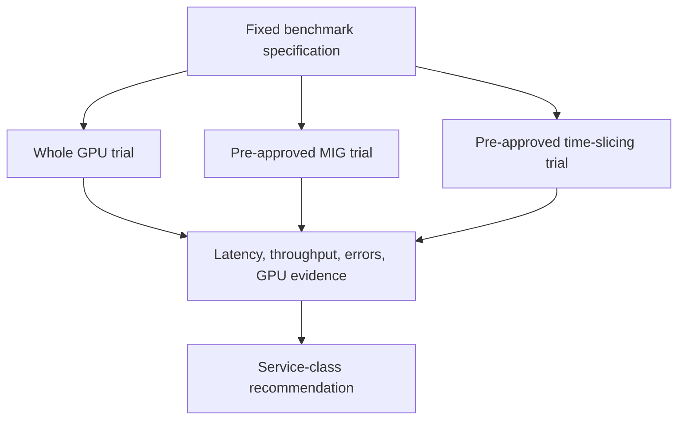

# Lab 03 — Compare Sharing Performance and Isolation

| Field | Value |
|---|---|
| Chapter | 03, 04, and 06 — profiles, time-slicing, and model selection |
| Difficulty / time | Advanced / 2–3 hours |
| Type | Controlled comparative experiment |
| Audience | Capacity planners, platform engineers, and performance engineers |

## 1. Objective

Measure one representative workload under whole-GPU, pre-approved MIG, and pre-approved time-slicing configurations. Produce a recommendation bounded by the observed workload, node, software versions, concurrency, and service objective. This lab does not seek a universal winner.

## 2. Production Story

A customer asks which sharing method is “fastest.” Their workload mix includes interactive notebooks, steady batch inference, and a p99-sensitive API. A benchmark that changes model, input, or node between trials gives a tidy but useless answer. The platform team instead tests the same workload in repeatable conditions and routes each service class to the guarantee it actually needs.

## 3. Learning Outcomes

You will design a fair comparison, preserve topology and version evidence, distinguish capacity isolation from performance behavior, recognize noisy-neighbor effects, and make a workload-specific placement recommendation.

## 4. Architecture



## 5. Prerequisites

- A disposable, supported test node or three equivalent isolated pools. Never change a production node between trials.
- A pre-approved whole-GPU baseline, MIG layout, and time-slicing policy with documented rollback for each.
- An approved benchmark image and command. The command must emit structured timestamps, request count, error count, and a completion marker; do not use an ad hoc synthetic load that does not resemble the intended service.
- A metrics path for application latency/throughput and GPU health. Use the [NVIDIA DCGM documentation](https://docs.nvidia.com/datacenter/dcgm/latest/) for platform telemetry capabilities.

## 6. Safety and Change Boundaries

Only exercise a bounded test workload and an approved noisy-neighbor case in a disposable environment. Do not exhaust GPU memory, reset the device, alter clock/power policy, or compare results across different GPU models without labeling that change as a separate experiment. Stop on XID, ECC, thermal, or host-health warnings.

## 7. Environment and Variables

**Purpose:** Record a fixed experimental identity before a first run.

**Command:**
```bash
export GPU_NODE='<approved-test-node>'
export LAB_NAMESPACE='gpu-sharing-comparison'
export BENCHMARK_IMAGE='<approved-immutable-benchmark-image>'
export BENCHMARK_COMMAND='<approved-deterministic-benchmark-command>'
export RESULTS_DIR='gpu-sharing-results'
kubectl config current-context
kubectl get node "$GPU_NODE" -o wide
```

**Expected evidence:** The context and node match the approved test plan.

**Explanation:** Record image digest, model/artifact digest, input set version, precision, concurrency, duration, driver, runtime, and policy version alongside these variables.

**Common-failure interpretation:** Missing immutable inputs means postpone the comparison. A mutable image tag invalidates repeatability.

## 8. Components and Data Flow

| Element | Held constant | May change by trial |
|---|---|---|
| Workload | image, artifact, input, precision, duration | assigned GPU shape |
| Node | GPU model, driver, topology, thermal state | sharing configuration |
| Load | arrival pattern and concurrency | optional approved neighbor |
| Evidence | metric names and collection window | measured result |

## 9. Test Plan and Acceptance Hypotheses

Write hypotheses before running: for example, a whole GPU is the baseline for the selected workload; a MIG profile is accepted only if its measured memory and latency fit the service class; time-slicing is accepted only for a best-effort class. Do not set a pass threshold from a result observed during the experiment. Obtain the product owner’s SLO and retain it with the results.

## 10. Baseline Inspection

The following are read-only **hardware-only commands**.

**Purpose:** Capture physical and topology evidence once for every trial.

**Command:**
```bash
nvidia-smi -L
nvidia-smi -q
nvidia-smi topo -m
```

**Expected evidence:** The GPU inventory, driver-reported state, and topology are captured in the trial record.

**Explanation:** A change in driver state, MIG inventory, thermal condition, or topology can explain result changes more credibly than a sharing label.

**Common-failure interpretation:** Driver communication errors, health warnings, or unexpected topology changes invalidate the run; repair the node before collecting performance data.

**Purpose:** Capture the Kubernetes resource contract for the active trial.

**Command:**
```bash
kubectl describe node "$GPU_NODE"
kubectl get node "$GPU_NODE" -o jsonpath='{.status.allocatable}{"\n"}'
```

**Expected evidence:** Labels, taints, Allocatable resources, and node conditions are recorded.

**Explanation:** The resource request in the benchmark manifest must match this inventory exactly.

**Common-failure interpretation:** An unrecognized or missing resource is a configuration failure, not a benchmark result.

## 11. Deploy the Benchmark

Use a manifest that makes the assigned resource and workload parameters explicit. Replace every placeholder before applying it.

```yaml
apiVersion: v1
kind: Namespace
metadata:
  name: gpu-sharing-comparison
---
apiVersion: batch/v1
kind: Job
metadata:
  name: sharing-trial-<whole-or-mig-or-timeslice>
  namespace: gpu-sharing-comparison
  labels:
    experiment: gpu-sharing-comparison
    trial: <whole-or-mig-or-timeslice>
spec:
  backoffLimit: 0
  template:
    spec:
      restartPolicy: Never
      nodeSelector:
        kubernetes.io/hostname: <approved-test-node>
      containers:
        - name: benchmark
          image: <approved-immutable-benchmark-image>
          command: ["sh", "-c", "<approved-deterministic-benchmark-command>"]
          resources:
            limits:
              <resource-observed-on-node>: 1
```

**Purpose:** Create one trial only after the target sharing configuration is applied through its approved runbook.

**Command:**
```bash
kubectl apply -f sharing-trial.yaml
kubectl get job -n "$LAB_NAMESPACE" -w
```

**Expected evidence:** The Job binds to the approved node and completes without retries.

**Explanation:** A separate manifest or generated label per trial prevents accidental result mixing. Keep node, image, input, and load constant.

**Common-failure interpretation:** A Pending Job is a resource or policy issue; an image or runtime error is not a valid performance datapoint.

## 12. Validate Workload Identity

**Purpose:** Verify the actual Job spec, placement, and completion marker.

**Command:**
```bash
kubectl get pod -n "$LAB_NAMESPACE" -l job-name=sharing-trial-<whole-or-mig-or-timeslice> -o wide
kubectl logs -n "$LAB_NAMESPACE" job/sharing-trial-<whole-or-mig-or-timeslice>
```

**Expected evidence:** The Pod runs on the selected node and logs contain the benchmark’s structured completion marker and measured fields.

**Explanation:** The benchmark must identify configuration and workload inputs in its own output; otherwise results cannot be audited.

**Common-failure interpretation:** Missing fields or a different node means discard the trial rather than retroactively guessing its conditions.

## 13. Verification and Acceptance Criteria

For each trial, acceptance is evidence completeness: immutable workload identity, node/driver/topology record, exact resource request, completed Job, application metrics, and a GPU-health snapshot from the same time window. A performance result is only interpretable after those conditions are met.

## 14. Observability and Evidence Collection

**Purpose:** Create a per-trial bundle without collecting tenant payloads.

**Command:**
```bash
mkdir -p "$RESULTS_DIR/<trial-name>"
kubectl get job -n "$LAB_NAMESPACE" sharing-trial-<whole-or-mig-or-timeslice> -o yaml > "$RESULTS_DIR/<trial-name>/job.yaml"
kubectl get events -n "$LAB_NAMESPACE" --sort-by=.lastTimestamp > "$RESULTS_DIR/<trial-name>/events.txt"
kubectl logs -n "$LAB_NAMESPACE" job/sharing-trial-<whole-or-mig-or-timeslice> > "$RESULTS_DIR/<trial-name>/benchmark.log"
```

**Expected evidence:** The bundle contains specification, events, and benchmark output for one named trial.

**Explanation:** Add DCGM, application, and scheduler telemetry by timestamp through the organization’s observability platform. Redact secrets and request payloads.

**Common-failure interpretation:** If a collection source is unavailable, mark the run incomplete; do not fill the gap with invented utilization values.

## 15. Measurements and Analysis

Measure request count, success/error count, median/p95/p99 latency where the workload has requests, throughput, startup time, allocated memory, GPU utilization, active process count where visible, power/thermal state, and scheduler queue time. Run a warm-up and a documented number of repetitions. Report distributions and raw data locations, not just a single average. State whether the result reflects a single tenant, concurrent tenants, or a noisy neighbor.

## 16. Safe Failure Exercise and Troubleshooting

Add a **bounded second copy of the same approved Job** only in the time-sliced trial, with a fixed short duration and a known memory ceiling. Do not use deliberate OOM or unlimited compute loops.

**Purpose:** Observe whether the service class changes under controlled concurrent demand.

**Command:**
```bash
kubectl apply -f sharing-trial-neighbor.yaml
kubectl get pods -n "$LAB_NAMESPACE" -l experiment=gpu-sharing-comparison -o wide
```

**Expected evidence:** The neighbor has an explicit identity and bounded lifecycle; scheduler events show whether both Pods received logical allocations.

**Explanation:** The exercise isolates contention as an experiment variable. It does not establish a security boundary or prove fairness.

**Common-failure interpretation:** OOM, node pressure, driver errors, or health alerts are stop conditions. Delete the neighbor and preserve evidence before investigating.

| Observation | Evidence | Interpretation | Next action |
|---|---|---|---|
| MIG Job cannot schedule | events and resource inventory | layout or request mismatch | repair configuration, not benchmark |
| Time-sliced Jobs run but tails rise | app metrics and overlap timeline | expected contention candidate | classify as best-effort or reduce density |
| Whole-GPU result regresses | node health and image digest | environment changed | invalidate and re-baseline |
| Memory errors occur | Job logs and GPU metrics | workload does not fit sharing envelope | stop and use larger/dedicated shape |

## 17. Cleanup and Rollback

**Purpose:** Delete only the disposable benchmark namespace and verify no lab workload remains.

**Command:**
```bash
kubectl delete namespace "$LAB_NAMESPACE" --ignore-not-found
kubectl get pods -A --field-selector spec.nodeName="$GPU_NODE" -o wide
```

**Expected evidence:** The namespace is deleted or absent; the follow-up list contains no remaining benchmark Pods.

**Explanation:** Restore the original whole-GPU, MIG, or time-slicing policy with the corresponding approved runbook before returning the node to normal scheduling.

**Common-failure interpretation:** A terminating namespace or unrecovered resource inventory keeps the node isolated and requires platform-owner escalation.

## 18. Summary, Challenges, and Further Reading

You made a workload-specific recommendation from comparable evidence rather than a universal sharing claim. Next, add a cost/queue-time view and decide whether a workload should receive whole-GPU, MIG, time-sliced, or no shared capacity.

- [MIG Profiles and Placement](../chapter-03-mig-profiles-and-placement)
- [Comparing MIG, Time-Slicing, and vGPU](../chapter-06-comparing-mig-time-slicing-and-vgpu)
- [Observability and SLOs for Shared GPUs](../chapter-10-observability-and-slos-for-shared-gpus)
- [NVIDIA DCGM documentation](https://docs.nvidia.com/datacenter/dcgm/latest/)
- [NVIDIA MIG User Guide](https://docs.nvidia.com/datacenter/tesla/mig-user-guide/)
