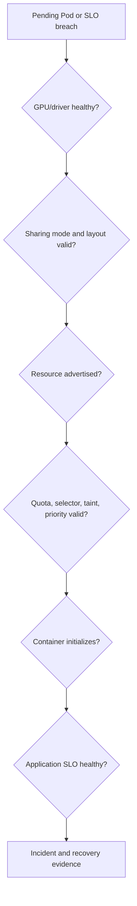

# Lab 04 — Troubleshoot a Multi-Tenant GPU Node

| Field | Value |
|---|---|
| Chapter | 07, 08, 10, and 11 — scheduling, isolation, SLOs, and troubleshooting |
| Difficulty / time | Advanced / 90 minutes |
| Type | Incident simulation and evidence-driven recovery |
| Audience | On-call SREs and GPU platform engineers |

## 1. Objective

Diagnose a disposable shared-GPU-node incident in which one tenant cannot schedule and another reports degraded service. Collect evidence from physical device through policy and application layers, inject a namespace-scoped policy failure safely, verify recovery, and produce an escalation-quality handoff.

## 2. Production Story

Tenant A reports a Pending Pod. Tenant B reports latency spikes on the same node. The first responder restarts the device plugin, which changes no policy and destroys useful timing evidence. A better response preserves the scene, identifies whether the failure is device health, sharing mode, inventory, scheduling policy, runtime initialization, or physical contention, then changes the lowest failed layer only.

## 3. Learning Outcomes

You will collect a minimally sufficient incident bundle, separate a resource-policy denial from absent hardware capacity, protect tenant data, correlate scheduler events with node state, and verify that cleanup restores the exact lab baseline.

## 4. Architecture



## 5. Prerequisites

- A disposable test node or isolated test pool with a known sharing policy and rollback owner.
- Read-only host access for a designated on-call engineer and Kubernetes read access; write access is limited to the named lab namespace.
- A pre-approved test image and a non-sensitive deterministic request or job. Do not capture tenant prompts, models, secrets, or customer data in evidence.
- An approved GPU Operator/device-plugin ownership model. Refer to [Kubernetes debugging Pods](https://kubernetes.io/docs/tasks/debug/debug-application/debug-pods/) and the platform’s NVIDIA runbook for component-specific logs.

## 6. Safety and Incident Boundaries

Freeze automated changes only through the established incident process. Do not reset a GPU, delete a platform Pod, drain a node, alter tenant quota, or trigger an OOM as part of this lab. The only injected fault is a ResourceQuota in a disposable namespace. Escalate immediately for XID/ECC/thermal events, repeated runtime failures across tenants, or evidence of cross-tenant data exposure.

## 7. Environment and Variables

**Purpose:** Identify the exact node and keep test artifacts tenant-safe and scoped.

**Command:**
```bash
export GPU_NODE='<approved-disposable-gpu-node>'
export LAB_NAMESPACE='gpu-sharing-incident-lab'
export OPERATOR_NAMESPACE='<namespace-that-owns-the-device-plugin>'
export EVIDENCE_DIR='shared-gpu-incident'
kubectl config current-context
kubectl get node "$GPU_NODE" -o wide
```

**Expected evidence:** The expected cluster and approved test node are shown.

**Explanation:** Record incident time, on-call owner, sharing mode, and change-window identifier outside this command transcript.

**Common-failure interpretation:** Context mismatch or inadequate access is a stop condition; route to the incident commander rather than using broader credentials.

## 8. Components and Triage Order

| Order | Layer | Key question | Evidence |
|---:|---|---|---|
| 1 | Hardware/driver | Can the host enumerate the device? | driver inventory and health |
| 2 | Sharing state | Is intended MIG/time-slicing mode active? | MIG inventory or policy |
| 3 | Registration | Does Kubernetes advertise the expected resource? | node Capacity/Allocatable |
| 4 | Scheduling policy | Can this tenant request it? | events, quota, taints, selectors |
| 5 | Runtime | Does an assigned container initialize it? | Pod event and container log |
| 6 | Service | Is the user-visible SLO acceptable? | app and GPU telemetry |

## 9. Preserve the Scene

**Purpose:** Create a bounded Kubernetes evidence bundle before any change.

**Command:**
```bash
mkdir -p "$EVIDENCE_DIR"
kubectl describe node "$GPU_NODE" > "$EVIDENCE_DIR/node-describe.txt"
kubectl get pods -A --field-selector spec.nodeName="$GPU_NODE" -o wide > "$EVIDENCE_DIR/node-pods.txt"
kubectl get events -A --sort-by=.lastTimestamp > "$EVIDENCE_DIR/events.txt"
```

**Expected evidence:** Three files capture node state, resident workloads, and recent scheduler/runtime events.

**Explanation:** Use workload names, namespace, and Pod UID for correlation. Redact or exclude data-bearing logs before attaching the bundle to an incident.

**Common-failure interpretation:** An inaccessible namespace is an authorization boundary. Preserve what is permitted and request the owning team’s evidence rather than changing RBAC mid-incident.

**Purpose:** Capture the resource contract presented to the scheduler.

**Command:**
```bash
kubectl get node "$GPU_NODE" -o jsonpath='{.status.capacity}{"\n"}{.status.allocatable}{"\n"}' > "$EVIDENCE_DIR/node-resources.txt"
kubectl get resourcequota -A > "$EVIDENCE_DIR/resourcequotas.txt"
```

**Expected evidence:** Extended-resource inventory and namespace quota summaries are retained.

**Explanation:** A GPU existing physically does not imply it is allocatable to a given Pod or tenant.

**Common-failure interpretation:** Missing GPU resources move investigation to registration; quota output alone does not show selectors, taints, priorities, or admission policy.

## 10. Inspect Hardware and Sharing State

Run through the approved host path. These are read-only **hardware-only commands**.

**Purpose:** Determine whether the driver can enumerate the GPU and whether MIG instances are active.

**Command:**
```bash
nvidia-smi -L
nvidia-smi -q
nvidia-smi mig -lgi 2>&1 || true
```

**Expected evidence:** The first two commands identify driver-visible GPUs and health; the MIG listing identifies active instances where supported.

**Explanation:** Time-slicing is a device-plugin policy, so it may have no MIG output. Capture the result rather than treating an unsupported query as a fault.

**Common-failure interpretation:** Driver communication failure, health alerts, or unexpected missing instances are physical/platform incidents. Stop workload experiments and escalate with host evidence.

**Purpose:** Identify the platform component and inspect its log path without assuming a pod name.

**Command:**
```bash
kubectl get pods -n "$OPERATOR_NAMESPACE" -o wide
kubectl get pods -n "$OPERATOR_NAMESPACE" -o name | grep -Ei 'device-plugin|nvidia' || true
```

**Expected evidence:** The output identifies candidate platform operands and their node placement.

**Explanation:** Obtain log access through the component owner’s runbook. Do not restart a component merely because it appears in a search result.

**Common-failure interpretation:** No matching workload can be valid for an installation managed elsewhere; confirm ownership before taking action.

## 11. Inspect Scheduling and Policy

**Purpose:** Compare a reported Pending Pod’s request with the node and policy contract.

**Command:**
```bash
kubectl describe pod -n <affected-namespace> <affected-pod>
kubectl get pod -n <affected-namespace> <affected-pod> -o yaml
```

**Expected evidence:** Events show whether the block is insufficient resource, taint, selector/affinity, quota/admission, image, or runtime related.

**Explanation:** Replace placeholders only after the incident owner approves access to the affected tenant namespace. Do not paste application environment variables or secret references into a broad incident channel.

**Common-failure interpretation:** An `Insufficient` event is not enough by itself: compare the exact resource name and integer request against Allocatable and the sharing strategy.

## 12. Deploy a Bounded Diagnostic Pod

Use this only in the lab namespace. Replace the image and resource name with values already observed on the test node.

```yaml
apiVersion: v1
kind: Namespace
metadata:
  name: gpu-sharing-incident-lab
---
apiVersion: v1
kind: Pod
metadata:
  name: diagnostic-gpu-pod
  namespace: gpu-sharing-incident-lab
spec:
  restartPolicy: Never
  nodeSelector:
    kubernetes.io/hostname: <approved-disposable-gpu-node>
  containers:
    - name: diagnostic
      image: <approved-image-with-nvidia-smi>
      command: ["sh", "-c", "nvidia-smi -L; echo DIAGNOSTIC_GPU_OK"]
      resources:
        limits:
          <observed-gpu-resource>: 1
```

**Purpose:** Test the scheduler-to-runtime path without touching a tenant workload.

**Command:**
```bash
kubectl apply -f diagnostic-gpu-pod.yaml
kubectl get pod -n "$LAB_NAMESPACE" diagnostic-gpu-pod -w
```

**Expected evidence:** The Pod either completes on the approved node or produces a specific event to compare with the customer symptom.

**Explanation:** A healthy diagnostic Pod narrows the investigation toward tenant policy, workload shape, or service contention. It does not clear every platform component.

**Common-failure interpretation:** If it is Pending, inspect events before changing configuration. If it fails at runtime, retain the logs and compare host/device-plugin state.

## 13. Verification and Acceptance Criteria

**Purpose:** Confirm the diagnostic conclusion with container and event evidence.

**Command:**
```bash
kubectl logs -n "$LAB_NAMESPACE" diagnostic-gpu-pod
kubectl describe pod -n "$LAB_NAMESPACE" diagnostic-gpu-pod
```

**Expected evidence:** A healthy result contains `DIAGNOSTIC_GPU_OK` and a successful allocation event; a failure has a captured, attributable event.

**Explanation:** The acceptance criterion is a defensible diagnosis of the first failed layer, not merely restoring a green Pod phase.

**Common-failure interpretation:** Missing logs after immediate failure require events and platform logs; avoid rerunning repeatedly because it may overwrite timing evidence.

## 14. Observability and Tenant-Safe Evidence

Correlate the incident timestamp with GPU health (temperature, power, ECC/XID where available), logical allocation, process/memory visibility permitted by policy, application request latency/error rate, and scheduler queue time. Preserve stable identifiers—node, resource type, namespace, Pod UID, and change ID—without collecting request content, secrets, or customer data. A node with high utilization may be healthy while a service SLO fails due to contention.

## 15. Measurements

Record incident start and detection time; time to evidence collection; Pending duration; resource Capacity versus Allocatable; configured replica count or MIG layout; active allocation count; application median and tail latency; error rate; and time to verified recovery. These values support a post-incident review; they are not generic thresholds.

## 16. Safe Failure Injection and Troubleshooting

Inject a policy failure only in the lab namespace. This validates that a quota denial can be distinguished from a missing device resource without touching shared node configuration.

```yaml
apiVersion: v1
kind: ResourceQuota
metadata:
  name: diagnostic-gpu-denial
  namespace: gpu-sharing-incident-lab
spec:
  hard:
    requests.nvidia.com/gpu: "0"
    limits.nvidia.com/gpu: "0"
```

**Purpose:** Apply the zero-GPU lab quota, then create a second copy of the diagnostic Pod named `quota-denied-gpu-pod`.

**Command:**
```bash
kubectl apply -f diagnostic-gpu-denial.yaml
kubectl get resourcequota -n "$LAB_NAMESPACE" diagnostic-gpu-denial
```

**Expected evidence:** The quota exists and admission rejects a GPU-requesting Pod in this namespace, while the node’s physical and allocatable inventory remains unchanged.

**Explanation:** This produces a reversible, tenant-policy symptom. It does not simulate GPU exhaustion, reset, or device-plugin failure.

**Common-failure interpretation:** If admission allows the Pod, validate that it requests the exact resource limited by the quota. If the node inventory changes, stop and escalate—this lab should not change it.

| Symptom | First evidence | Diagnosis direction | Resolution verification |
|---|---|---|---|
| Host cannot enumerate GPU | `nvidia-smi` and host logs | hardware/driver | host inventory restored |
| Host inventory exists; node resource absent | node status and plugin logs | registration | expected Allocatable returned |
| Pod denied before scheduling | admission response/quota | tenant policy | only after policy correction |
| Pod Pending with insufficient resource | Pod events and active layout | inventory/capacity | request matches Allocatable |
| Pod runs; service SLO fails | app + GPU timeline | contention/workload class | SLO recovery under documented load |

## 17. Cleanup and Recovery Verification

**Purpose:** Remove the injected policy and all lab-only workloads.

**Command:**
```bash
kubectl delete resourcequota -n "$LAB_NAMESPACE" diagnostic-gpu-denial --ignore-not-found
kubectl delete namespace "$LAB_NAMESPACE" --ignore-not-found
```

**Expected evidence:** Kubernetes reports deletion or `not found` only for named lab resources.

**Explanation:** Never “clean up” by deleting a tenant quota or a platform resource. Preserve the evidence directory according to incident retention policy.

**Common-failure interpretation:** A namespace stuck in Terminating requires normal cluster troubleshooting; do not bypass finalizers without owner approval.

**Purpose:** Verify the node’s advertised inventory matches the recorded baseline after lab cleanup.

**Command:**
```bash
kubectl get node "$GPU_NODE" -o jsonpath='{.status.allocatable}{"\n"}'
kubectl get pods -A --field-selector spec.nodeName="$GPU_NODE" -o wide
```

**Expected evidence:** Allocatable resources remain at baseline and no lab Pods remain on the node.

**Explanation:** Recovery is confirmed by inventory, policy removal, and successful bounded diagnostics—not by an assumption that deleting a namespace solved the underlying incident.

**Common-failure interpretation:** Any inventory drift, health alert, or unresolved affected workload is an escalation condition. Keep the node isolated if required by the runbook.

## 18. Summary, Challenges, and Further Reading

You used a bottom-up incident method, preserved evidence before changing state, and proved a reversible policy failure separately from device health. Next, conduct a tabletop cross-domain incident: a time-sliced node has healthy hardware, a quota denial for one namespace, and an SLO breach for another. Define the parallel evidence owners and escalation package.

- [Kubernetes Scheduling for Shared GPUs](../chapter-07-kubernetes-scheduling-for-shared-gpus)
- [Tenant Isolation, Security, and Fairness](../chapter-08-tenant-isolation-security-and-fairness)
- [Observability and SLOs for Shared GPUs](../chapter-10-observability-and-slos-for-shared-gpus)
- [Production Troubleshooting](../chapter-11-production-troubleshooting)
- [Kubernetes: Debugging Pods](https://kubernetes.io/docs/tasks/debug/debug-application/debug-pods/)
