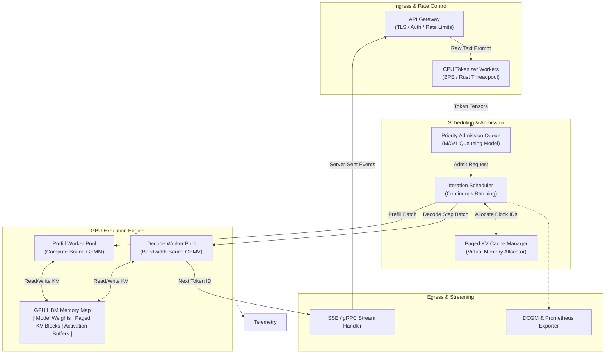

# Chapter 01 — Why Inference Infrastructure Is Different

## WHY: The Fundamental Shift from Training to Serving

A machine learning team successfully trains a 70-billion-parameter Large Language Model (LLM) across a cluster of 64 NVIDIA H100 GPUs. During training, the infrastructure pipeline runs offline batch jobs with predictable tensor shapes, continuous 100% GPU compute utilization, and static memory allocations. The primary objective is maximizing aggregate compute throughput (TFLOPS per dollar per day).

When the team deploys that exact same model behind a customer-facing interactive chat API, the infrastructure paradigm flips entirely. In production serving:
1. **Requests arrive unpredictably** following Poisson distributions with sharp traffic spikes.
2. **Input sequence lengths vary wildly**—from a 10-token query to a 32,000-token document prompt.
3. **Users demand immediate responsiveness**, measuring service quality in milliseconds for Time To First Token (TTFT) and Inter-Token Latency (ITL).
4. **Memory consumption becomes dynamic**, growing non-linearly with active request concurrency due to Key-Value (KV) cache accumulation.

Treating an inference deployment as simply "running the forward pass of a trained model" leads directly to production outages, severe tail latency degradation, and astronomical cloud costs. Inference is an online, interactive systems problem where latency, throughput, memory bounds, and cost exist in perpetual tension.

---

## WHAT: First-Principles Mechanics of AI Inference

To design robust inference platforms, engineers must understand the hardware mechanics of model execution, latency decomposition, and memory utilization.

### 1. Prefill vs. Decode: Two Radically Different Hardware Execution Phases

Autoregressive transformer inference consists of two distinct execution phases with completely different arithmetic characteristics:

```
Input Prompt: "Explain quantum computing in simple terms" (8 tokens)
  │
  ├── PHASE 1: PREFILL (Prompt Ingestion)
  │   - Ingests all 8 input tokens simultaneously in ONE forward pass.
  │   - Computes Key-Value matrices for all prompt tokens.
  │   - Highly compute-bound: General Matrix Multiply (GEMM).
  │   - High Arithmetic Intensity (FLOPs / Byte >> 100).
  │
  └── PHASE 2: DECODE (Autoregressive Generation)
      - Generates output tokens ONE BY ONE.
      - Token 1 -> Token 2 -> Token 3 -> ... -> End-of-Sequence (EOS).
      - Loads ALL model weights from HBM to SRAM for EVERY single token.
      - Highly memory-bandwidth bound: General Matrix-Vector Multiply (GEMV).
      - Low Arithmetic Intensity (FLOPs / Byte ≈ 1 - 2).
```

- **Arithmetic Intensity (`I`):** Defined as the ratio of floating-point operations performed to bytes of memory transferred from High Bandwidth Memory (HBM) to GPU SRAM (`I = FLOPs / Bytes`).
- **Prefill Phase:** Computes self-attention across all input tokens simultaneously. Matrix multiplications scale as `O(N_in^2)`. Because large input matrices reside in fast GPU SRAM during compute, Tensor Cores execute at peak compute capability (e.g., 989 TFLOPS on H100 FP16).
- **Decode Phase:** Generates one output token at a time. To generate a single token, the GPU must fetch all 140 GB of FP16 model weights from HBM into SRAM. For an H100 GPU with 3.35 TB/s HBM3 memory bandwidth, fetching 140 GB takes `140 GB / 3350 GB/s ≈ 41.7 ms` per token—yielding a theoretical hardware ceiling of `≈ 24 tokens/sec` per single-sequence stream, regardless of how many TFLOPS the Tensor Cores possess.

### 2. Deconstructing the Inference Latency Budget

Customer-perceived quality depends on three distinct latency metrics:

```text
Total End-to-End Latency (E2E) = t_network_ingress + t_queue + TTFT + (N_out - 1) * ITL + t_network_egress
```

```
Request Timeline:
│<-------------------------------------- Total E2E Latency ------------------------------------->|
|-- Network Ingress --|-- Queue --|-- Prefill (TTFT) --|-- Decode 1 (ITL) --|-- Decode 2 --|...|-- Egress --|
                                  ^                    ^                    ^
                           Request Sent          First Token Out      Second Token Out
```

- **Time To First Token (TTFT):** Duration from request receipt to the emission of the first generated token. Dominated by queue wait time `t_queue` and prefill execution time.
- **Inter-Token Latency (ITL):** Time elapsed between generating token `i` and token `i+1`. Dictated by the decode iteration cycle time.
- **Time Per Output Token (TPOT):** Average decode time per token across the generated response sequence.

### 3. Mathematics of KV Cache Memory Consumption

During autoregressive generation, self-attention requires key and value tensors for all previous tokens in the sequence. To avoid recomputing these tensors at every decode step, the inference engine caches them in GPU HBM as the **KV Cache**.

The memory footprint `M_KV` (in bytes) required for storing the KV Cache of a single request sequence is:

```text
M_KV = 2 * L * H * N_heads * P_seq * S_precision
```

Where:
- `2`: Two matrices (Key tensor and Value tensor).
- `L`: Number of transformer layers in the model architecture.
- `H`: Dimension of each attention head (`d_head = d_model / N_heads`).
- `N_heads`: Number of Key-Value attention heads (accounting for Multi-Query Attention / Grouped-Query Attention).
- `P_seq`: Total sequence length (`Prompt Length + Generated Response Length`).
- `S_precision`: Bytes per element (2 bytes for FP16/BF16, 1 byte for FP8/INT8).

#### Concrete Sizing Example:
Consider serving Llama-3-70B (`L=80`, `N_heads_kv=8`, `d_head=128`, Precision=FP16/2 bytes) with a context length `P_seq = 4096` tokens:

```text
M_KV_single = 2 * 80 * 8 * 128 * 4096 * 2 bytes = 1,342,177,280 bytes ≈ 1.34 GB per sequence
```

If an inference server handles **64 concurrent requests** at this sequence length, the KV Cache alone consumes:

```text
M_KV_total = 64 * 1.34 GB = 85.76 GB of VRAM
```

This exceeds the entire memory capacity of an 80GB A100 GPU! Model weights require an additional 140 GB (requiring tensor parallelism across multiple GPUs). If memory is unmanaged, dynamic KV cache growth causes catastrophic GPU Out-Of-Memory (OOM) crashes.

---

## HOW: Inference System Architecture

Modern production inference decouples ingress, scheduling, execution, and memory management into dedicated pipeline stages.



**Figure 12.1.1 — Production Inference Microservice Architecture.** Ingress, tokenization, admission scheduling, virtualized KV memory management, and GPU execution function as distinct components with bounded interfaces.

---

## Component Responsibilities Matrix

| Component | Primary Function | Key Failure Mode | Operational Metric | Target Threshold |
|---|---|---|---|---|
| **API Gateway** | Request authentication, routing, protocol conversion | Connection pool exhaustion | `http_requests_total`, `latency` | 99.99% Uptime |
| **CPU Tokenizer** | Converts raw UTF-8 strings to integer token IDs | Single-thread CPU saturation | `tokenizer_duration_seconds` | &lt; 5 ms |
| **Admission Queue** | Manages backpressure and prevents server overload | Unbounded queue delay, client timeout | `inference_queue_depth` | &lt; 50 depth |
| **Batch Scheduler** | Assembles prefill & decode steps into continuous iterations | Prefill starving active decode loops | `scheduler_iteration_time_ms` | &lt; 30 ms/iter |
| **KV Block Allocator** | Virtual memory management for key-value tensors | Memory fragmentation, out-of-memory | `kv_cache_usage_percent` | 70% - 85% |
| **GPU Execution Engine** | Launches optimized CUDA kernels (TensorRT / vLLM) | CUDA stream deadlock, illegal memory access | `dcgm_gpu_utilization` | &gt; 75% |
| **Stream Handler** | Serializes tokens to SSE/gRPC streaming chunks | Socket buffer bloat, client disconnection | `stream_flush_latency_ms` | &lt; 2 ms |

---

## TRADEOFFS: Architectural Trade-off Analysis

### 1. Training Infrastructure vs. Inference Infrastructure

| Dimension | Training Infrastructure | Inference Infrastructure |
|---|---|---|
| **Primary Goal** | Maximize aggregate training throughput (TFLOPS/sec) | Serve requests within strict latency SLOs (TTFT / ITL) |
| **Workload Profile** | Offline, long-running, scheduled batch jobs | Online, unpredictable, bursty user traffic |
| **Batch Size** | Large, static (e.g., 512, 1024 sequences) | Dynamic, variable (B=1 to B=128) |
| **Memory Footprint** | Model weights + Gradients + Optimizer States + Activations | Model weights + Dynamic KV Cache + Staging Buffers |
| **Hardware Bottleneck** | Compute bound (Tensor Cores) & Interconnect bound (NVLink/InfiniBand) | Memory bandwidth bound (HBM) & Host-to-Device latency (PCIe) |
| **Failure Impact** | High checkpoint save; restart from last step | Immediate user-visible HTTP 5xx errors or broken streams |
| **Scaling Vector** | Distributed data parallel (DDP) / Model parallel across nodes | Horizontal pod autoscaling (HPA) of independent model replicas |
| **Cost Vector** | Total GPU execution time per training run | Idle capacity cost vs. over-provisioning for peak traffic spikes |

### 2. Core Serving Trade-offs

```
               HIGH THROUGHPUT (Large Batches)
                      ▲
                      │         Production Optimal Point
                      │             ★ (Continuous Batching)
                      │
                      │
                      └────────────────────────► LOW LATENCY (Small Batches)
```

- **Large Static Batches vs. Small Dynamic Batches:** Large batches maximize GPU HBM bandwidth efficiency (higher FLOPs/Byte), yielding maximum tokens/second per dollar. However, waiting for a batch to fill inflates queue latency and TTFT.
- **Precision Quantization (FP16 vs. FP8 vs. INT4):** Quantizing a 70B model from FP16 (140 GB) to INT4 (35 GB) enables fitting the weights onto a single 80GB GPU instead of two. This reduces HBM transfer bandwidth by 4x, dramatically improving ITL. *Trade-off:* Minor degradation in output quality/perplexity on complex reasoning tasks.
- **Prefill/Decode Co-location vs. Disaggregation:** Executing prefill (compute-bound) and decode (bandwidth-bound) on the same GPU causes long prompt ingestions to stall decode steps. Disaggregating prefill nodes from decode nodes eliminates decode jitter but introduces network transmission latency for sending KV caches over NVLink/InfiniBand.

---

## PRODUCTION: Scalability and Operating Windows

Operating a production inference cluster requires enforcing strict bounds on concurrency, queue depth, and memory thresholds:

```
[ Safe Operating Zone: 0 - 80% Capacity ]
- KV Cache Usage: < 80%
- Queue Wait Time: < 20ms
- ITL P99: < 25ms
                          [ Warning Zone: 80% - 90% ]
                          - Activate Autoscaling Trigger
                          - Begin Request Throttling
                                                    [ Emergency Zone: > 90% ]
                                                    - Reject New Requests (HTTP 429)
                                                    - Evict Lowest Priority KV Cache Blocks
```

---

## TROUBLESHOOTING: Worked Failure Scenarios

### Scenario 1: Cascading CUDA Out-of-Memory (OOM) Evictions Under Concurrency Spike

#### 1. Production Incident Context
During a promotional event, an e-commerce platform experienced a 3x traffic spike on its customer support LLM service. Within 90 seconds of the spike, multiple Triton inference pods crashed simultaneously, triggering Kubernetes pod restarts. As surviving pods absorbed redirected traffic, they immediately crashed with OOM errors, creating a cascading outage.

#### 2. Root Cause Analysis
The inference server was configured with dynamic KV cache allocation without an absolute upper block threshold or request admission limiter. As concurrent long-context requests arrived (P_seq &gt; 8192), total memory demanded by active KV cache blocks exceeded available GPU HBM VRAM. The CUDA driver failed a allocation request inside the model execution thread, causing unhandled process termination.

#### 3. Log & Telemetry Evidence
Inspection of Triton process logs (`/var/log/triton/server.log`) revealed:

```text
2026-08-06T14:22:01.104Z ERROR [cuda_utils.cc:84] CUDA allocation failed: out of memory
2026-08-06T14:22:01.104Z ERROR [vllm_backend.cc:312] Exception in engine iteration loop: 
  RuntimeError: CUDA error: out of memory
  CUDA kernel errors might be asynchronously reported at some other API call, so the stacktrace below might be incorrect.
  Device Global Memory: Total=81187MB, Used=80912MB, Free=275MB
```

#### 4. Exact Diagnostic Commands
```bash
# 1. Inspect live KV cache memory allocation via metrics endpoint
curl -s http://localhost:8002/metrics | grep -E "(kv_cache_usage|gpu_memory_used)"

# 2. Reproduce memory pressure using perf_analyzer with long prompt payloads
perf_analyzer -m llama3-70b -u localhost:8001 -i gRPC \
  --concurrency-range 64:64 \
  --shape input_ids:4096 \
  --measurement-interval 10000
```

#### 5. Remediation & Configuration Fix
To resolve cascading OOM failures, configure an explicit upper ceiling for KV cache allocation (`gpu_memory_utilization: 0.85`), enforce preemption via block swapping/recomputation, and enable admission control:

```yaml
# Fix configuration in backend_config (vLLM / TensorRT-LLM)
engine_config:
  gpu_memory_utilization: 0.85   # Hard cap VRAM usage for weights + KV cache at 85%
  max_num_seqs: 64                # Bound maximum active concurrent sequences
  max_num_batched_tokens: 8192    # Limit maximum tokens per iteration step
  swap_space: 16                  # Allocate 16GB host CPU RAM for KV preemption swapping
  block_size: 16                  # PagedAttention block size
```

#### 6. Verification Steps
After deploying the updated engine parameters, execute a load sweep:

```bash
# Run 128 concurrent streams to verify strict backpressure rejection (HTTP 429) without crashing
perf_analyzer -m llama3-70b -u localhost:8001 -i gRPC --concurrency-range 128:128
```

*Result:* `nvidia-smi` confirms HBM memory usage stays capped at exactly 85% (68.8 GB), excess requests receive clean 429 status codes, and zero pods crash.

---

### Scenario 2: Severe P99 Tail Latency Degradation Caused by Prefill Execution Starving Decode Batches

#### 1. Production Incident Context
An enterprise knowledge base service reported erratic user experience during peak hours. While average latency appeared acceptable (TTFT ~ 300ms), P99 Inter-Token Latency (ITL) spiked to over 4,500 ms, causing streaming text delivery in the frontend web application to pause for 4–5 seconds at a time.

#### 2. Root Cause Analysis
The inference cluster served both long document analysis queries (prompts up to 16,000 tokens) and interactive user chat on the same GPU instances. When a 16K token prompt prefill executed, its GEMM compute kernels occupied 100% of the GPU Tensor Cores for 350+ milliseconds. During this time, the iteration scheduler could not execute decode steps for the 32 active streaming chat users, resulting in multi-second inter-token stalls.

#### 3. Log & Telemetry Evidence
OpenTelemetry waterfall trace analysis for a single streaming session:

```text
[Span: Chat Completion Request] -------------------------------------------------> 4,820 ms
  ├── [Span: Tokenize Input] ------------------> 4 ms
  ├── [Span: Admission Queue Wait] ------------> 12 ms
  ├── [Span: TTFT (Prefill Ingest)] -----------> 180 ms  (First token sent)
  ├── [Span: Decode Token 1-10] --------------> 240 ms  (ITL ~ 24ms)
  ├── [Span: DECODE STALL - Prefill Ingestion] > 3,850 ms (Gaps of 380ms between tokens!)
  └── [Span: Decode Token 11-50] -------------> 534 ms  (ITL ~ 24ms)
```

Prometheus metrics:
```text
vllm:inter_token_latency_seconds_bucket{le="0.03"} 84210
vllm:inter_token_latency_seconds_bucket{le="1.0"}  85100
vllm:inter_token_latency_seconds_bucket{le="+Inf"} 92150   <-- Severe tail distribution!
```

#### 4. Exact Diagnostic Commands
```bash
# 1. Profile ITL histogram buckets in real time
curl -s http://localhost:8002/metrics | grep "vllm:inter_token_latency_seconds"

# 2. Reproduce stall by mixing long prompt prefill with streaming decode requests
python3 -m vllm.entrypoints.openai.api_server &
python3 benchmark_serving.py \
  --backend vllm \
  --model llama3-70b \
  --dataset-name sharegpt \
  --num-prompts 100 \
  --request-rate 10 \
  --output-json results.json
```

#### 5. Remediation & Configuration Fix
To prevent large prompt prefills from hogging the GPU, enable **Chunked Prefill**. Chunked prefill splits large prompts into smaller token chunks (e.g., 512 tokens), interleaving prompt chunk computation with ongoing decode steps within the same batch iteration.

Updated server execution flags:

```bash
# vLLM Startup with Chunked Prefill enabled
python3 -m vllm.entrypoints.openai.api_server \
  --model /models/llama3-70b-instruct \
  --tensor-parallel-size 2 \
  --enable-chunked-prefill \
  --max-num-batched-tokens 512 \
  --max-num-seqs 128
```

#### 6. Verification Steps
Re-run the benchmark suite with mixed prompt lengths (512 tokens to 16,000 tokens) alongside 50 streaming decode clients:

```bash
jq '.metrics | {mean_ttft_ms: .mean_ttft_ms, p99_itl_ms: .p99_itl_ms}' results.json
```

*Result Verification Output:*
```json
{
  "mean_ttft_ms": 210.4,
  "p99_itl_ms": 22.8
}
```
P99 ITL drops from 4,500 ms to 22.8 ms, ensuring perfectly fluid text streaming regardless of incoming prompt lengths.

---

## SENIOR INTERVIEW QUESTIONS: Staff/Senior SRE & MLOps

### Question 1: "Why does a 100% GPU utilization metric in `nvidia-smi` often misrepresent the real health and throughput of an LLM inference cluster?"

**Model Answer:**  
`nvidia-smi` reports **Volatile GPU Utilization**, which measures the percentage of time over the past sampling interval (typically 1 second) during which at least one CUDA kernel was active on the GPU execution engine. 

In LLM inference, this metric is deceiving for two reasons:
1. **Memory-Bandwidth Saturation vs. Compute Utilization:** During the autoregressive decode phase, CUDA kernels are running continuously (showing 100% GPU utilization in `nvidia-smi`), but the Tensor Cores are sitting idle 95% of the time waiting for weights to load from HBM3 (memory-bandwidth bound execution). The GPU is bottlenecked by memory transfer rates, not compute capability.
2. **Kernel Launch Overheads & Idle Waiting:** A process issuing tiny, unbatched kernel launches (e.g., batch size 1) can register high GPU engine time while delivering under 5% of peak theoretical model token throughput.

*Production Alternative:* To measure true GPU health, engineers must track **TFLOPS Efficiency** via DCGM (`DCGM_FI_DEV_FB_USED` and Tensor Core activity) alongside application-level metrics: **KV Cache Block Utilization**, **P99 Inter-Token Latency (ITL)**, and **Tokens/Second per GPU**.

---

### Question 2: "Mathematical breakdown: How do you size the GPU memory requirement for serving a 70B FP16 LLM with a 4K context window for 100 concurrent requests?"

**Model Answer:**  
Total GPU Memory (`M_total`) consists of three components: `M_weights`, `M_KV`, and `M_overhead` (activation buffers and engine memory workspaces).

1. **Model Weights (`M_weights`):**
   - 70 billion parameters in FP16 (2 bytes per parameter):
```text
M_weights = 70 * 10^9 * 2 bytes = 140 GB
```

2. **KV Cache (`M_KV`):**
   - For Llama-3 70B (`L=80` layers, Grouped-Query Attention with `N_heads_kv=8`, head dimension `d_head=128`, FP16 precision = 2 bytes):
```text
M_KV_per_token = 2 (Key+Value) * 80 * 8 * 128 * 2 bytes = 327,680 bytes/token ≈ 327.68 KB/token
```
   - For a 4,096 token sequence length:
```text
M_KV_per_seq = 327.68 KB * 4096 = 1.342 GB
```
   - For 100 concurrent sequences:
```text
M_KV_100_seqs = 100 * 1.342 GB = 134.2 GB
```

3. **Activation Buffers & Engine Workspace (`M_overhead`):**
   - Typically reserved as ~20% of weight footprint or fixed at ~10 GB.

4. **Total Requirement:**
```text
M_total = 140 GB (Weights) + 134.2 GB (KV Cache) + 10 GB (Workspace) = 284.2 GB VRAM
```

*Hardware Provisioning:* Sizing for 284.2 GB requires a minimum of **4x 80GB NVIDIA H100 GPUs** (320 GB total VRAM) configured with Tensor Parallelism (`TP=4`).

---

### Question 3: "Explain the difference between Time To First Token (TTFT) and Inter-Token Latency (ITL) from both a CUDA kernel execution perspective and a customer SLA perspective."

**Model Answer:**  

| Dimension | Time To First Token (TTFT) | Inter-Token Latency (ITL) |
|---|---|---|
| **CUDA Kernel Execution** | Dominated by **Compute-Bound GEMM** kernels (Prefill Phase). The GPU processes all input prompt tokens in parallel, generating high Tensor Core utilization (`I >> 100`). | Dominated by **Memory-Bandwidth-Bound GEMV** kernels (Decode Phase). The GPU executes sequential iteration loops, loading model weights for every single token (`I ≈ 1-2`). |
| **Primary System Bottleneck** | Queue wait time (`t_queue`), CPU tokenization speed, and prompt context length (`P_prompt`). | HBM3 Memory Bandwidth (TB/s), Tensor Parallelism interconnect latency (NVLink), and KV cache lookup speed. |
| **Customer SLA Perspective** | Perceived responsiveness / "Time to acknowledge." High TTFT makes the application feel unresponsive or frozen. | Perceived output reading speed / fluidity. High ITL causes stuttering, jitter, and unnatural streaming output. |
| **Optimization Strategy** | Chunked prefill, prompt caching (prefix reuse), prefill node disaggregation, fast C++ tokenizers. | FP8/INT4 weight quantization, PagedAttention, continuous iteration batching, FlashDecoding kernels. |

---

## Production Troubleshooting: Real-World Evidence

### Problem: High Time-To-First-Token (TTFT) Despite GPU Availability

| Signal | Root Cause | Diagnostic Command | Real Evidence | Remediation |
|---|---|---|---|---|
| TTFT > 500ms; GPU util < 30% | CPU tokenization bottleneck (single-threaded Python) | `ps aux \| grep tokenizer; cat /proc/PID/status \| grep Threads` | `Threads: 1` (single thread saturated at 100%) | Move tokenizer to C++/Rust microservice with thread pool; target 4-8 worker threads |
| TTFT > 200ms; GPU util > 90%; queue depth steady | Queue admission backlog during traffic spike | `curl -s http://localhost:8002/metrics \| grep inference_queue_depth` | `inference_queue_depth{gpu="0"} 45` (queued requests waiting) | Enable request rate limiting (token bucket algorithm) and/or autoscale GPU pods horizontally |
| TTFT = 400ms; high CPU on Gateway node; GPU idle | Prompt ingestion CPU preprocessing (document parsing, regex, normalization) | `curl -s http://localhost:8002/metrics \| grep -E "(gateway_cpu_seconds_total\|tokenizer_latency)" \| head -3` | `gateway_preprocessing_duration_seconds_bucket{le="0.250"} 120` \| `gateway_preprocessing_duration_seconds_bucket{le="1.0"} 8950` (most requests 250ms-1s) | Profile gateway preprocessing with `py-spy` or `cProfile`; eliminate redundant regex passes |

**Interpretation:** When TTFT > 200ms, always check queue depth first (infrastructure issue), then GPU utilization (compute availability), then tokenization latency (CPU throughput). The SLA breach is determined by the *slowest* component in the chain.

### Problem: Elevated Inter-Token Latency (ITL) with Memory Pressure

| Signal | Root Cause | Diagnostic Command | Real Evidence | Remediation |
|---|---|---|---|---|
| ITL = 35ms (SLA: &lt;25ms); KV cache usage &gt; 90%; no swap | KV cache memory fragmentation + no preemption strategy | `nvidia-smi \| grep -i memory; curl -s http://localhost:8002/metrics \| grep kv_cache` | `kv_cache_usage_percent{gpu="0"} 91.2` \| `nvidia-smi memory.used 72451 MiB / 81559 MiB` | Reduce `max_num_seqs` to 48 (from 64); enable KV cache block swapping to host RAM (`swap_space: 8GB`) |
| ITL oscillates (15ms → 80ms → 20ms) | Prefill batches starving concurrent decode requests | `curl -s http://localhost:8002/metrics \| grep -E "iteration_time_ms\|prefill_duration_ms\|decode_duration_ms"` | `prefill_duration_ms_bucket{le="300"} 89` \| `decode_duration_ms_bucket{le="50"} 45` (prefill 300ms locks out 20 concurrent decode steps) | Enable **Chunked Prefill**: split prompts into 512-token chunks; interleave with active decode batches |
| ITL = 28ms average but P99 = 400ms | Occasional CUDA stream lock contention under load spikes | `nsys profile --stats=true -d 30 -o profile.nsys tritonserver --model-repo=/models` (extract CUDA API call trace) | `[CUDA_LAUNCH_KERNEL] duration: 8.2ms → 45ms (under contention)` | Reduce concurrent instance count from 8 to 2; ensure 1 instance per 2 GPUs for isolation |

**Interpretation:** ITL degradation is almost always memory-bound (KV cache saturation) or scheduling-bound (prefill starving decode). GPU utilization remaining at 95%+ during ITL spikes is a strong signal for the latter.

### Problem: Cascading GPU Out-Of-Memory (OOM) Crashes

| Signal | Root Cause | Diagnostic Command | Real Evidence | Remediation |
|---|---|---|---|---|
| `CUDA error: out of memory` in logs; pod crashes in < 60s after traffic spike | Unbounded KV cache growth during concurrency surge | `dmesg -T \| tail -10; cat /var/log/triton/server.log \| grep "out of memory"` | `[Aug 6 14:22:01] Out of memory: GPU HBM allocation failed for 4.2 GB KV block (free: 0.8 GB)` | Configure hard memory cap: `gpu_memory_utilization: 0.85` (H100 w/ 80GB = 68GB max); set `max_num_seqs: 64` admission gate |
| Rapid pod restart loop (CrashLoopBackOff); each pod lives 40s before OOM | No request admission control; new traffic admitted before KV blocks freed | `kubectl logs -f POD_NAME --tail=50; grep -i "admitted\|rejected" /var/log/triton/server.log` | `Log line 1: Request 142 admitted (KV blocks available: 32); Log line 200: Request 203 rejected (KV blocks: 0 available)` | Implement request throttling: reject with HTTP 429 if `kv_cache_usage > 85%` or `queue_depth > 50` |

**Interpretation:** Cascading OOM is a *scheduling and admission control* failure, not a hardware failure. Once the first pod OOM kills, surviving pods immediately overload and cascade. Fix the admission layer, not the hardware.

---

## Summary & Authoritative References

### Key Takeaways
1. **Inference is fundamentally different from training:** Training optimizes long-running compute throughput; inference optimizes real-time user-visible latency percentiles (TTFT, ITL) under strict memory bounds.
2. **Prefill vs. Decode:** Prefill is compute-bound (`O(N^2)` GEMM); decode is memory-bandwidth bound (`O(N)` GEMV).
3. **KV Cache Management is Critical:** Dynamic KV cache growth consumes massive HBM VRAM (1.34 GB per 4K sequence on 70B models). Virtualized block allocators (PagedAttention) and memory caps are mandatory to prevent cascading CUDA OOM crashes.
4. **Solve Tail Latency:** Enable Chunked Prefill and Continuous Batching to prevent prompt ingestion from starving active streaming decode iterations.

### Authoritative References
- **vLLM: Efficient Memory Management for Large Language Model Serving** (Kwon et al., SOSP 2023): [https://arxiv.org/abs/2309.06180](https://arxiv.org/abs/2309.06180)
- **NVIDIA TensorRT-LLM Architecture Guide**: [https://github.com/NVIDIA/TensorRT-LLM](https://github.com/NVIDIA/TensorRT-LLM)
- **NVIDIA Triton Inference Server Manual**: [https://github.com/triton-inference-server/server](https://github.com/triton-inference-server/server)
- **Splitwise: Efficient Generative LLM Serving Using Disaggregated Architecture** (Patel et al., ISCA 2024): [https://arxiv.org/abs/2311.18677](https://arxiv.org/abs/2311.18677)
