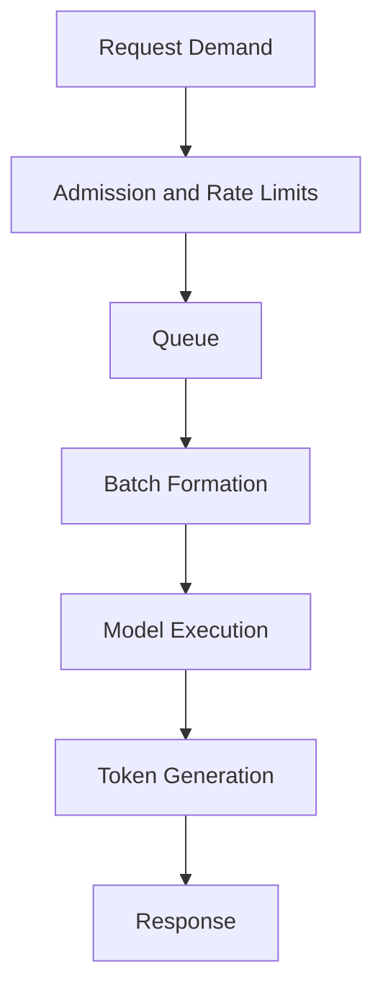

# Why Inference Infrastructure Is Different

A model trains successfully across eight GPUs. The team deploys it behind an API and expects the same hardware to deliver a responsive service. During testing, average latency looks acceptable. In production, p99 latency rises, requests queue, memory fills with KV cache, and autoscaling reacts too slowly.

Inference is not simply shorter training. It is a service system shaped by arrival rate, request variability, queueing, batching, model residency, token generation, and user-visible tail latency.

## Learning Objectives

You will be able to distinguish training and inference objectives, define the critical path, identify queueing and memory risks, and select architecture metrics that represent customer experience.

## Training Versus Inference

| Dimension | Training | Inference |
|---|---|---|
| Primary goal | Maximize useful training throughput | Meet latency, throughput, and availability SLOs |
| Workload shape | Long-running and planned | Bursty and user-driven |
| Memory | Weights, activations, optimizer state | Weights, runtime buffers, KV cache |
| Scaling | Synchronized distributed job | Replicas, batching, sharding, routing |
| Failure effect | Lost progress or restart | Immediate user impact |

## Architecture

## The Core Trade-off

Batching improves throughput by combining work, but waiting to form a batch increases latency. More concurrency improves device utilization until memory or scheduling becomes the bottleneck. The correct operating point depends on the service objective.

## Production Story

A team optimizes requests per second with large batches. Throughput rises, but interactive users see longer time to first token. The service must separate batch and interactive classes or use a scheduler that balances queue delay against GPU efficiency.

## Troubleshooting

**Symptom:** GPU utilization is high while p99 latency is poor.

**Diagnosis:** separate queue time, preprocessing, time to first token, inter-token latency, and network time.

**Root cause:** the platform optimized aggregate throughput instead of the user-visible SLO.

## Customer Perspective

Ask: What is the request distribution? Which percentile matters? Is streaming required? How much model and cache memory is needed? What happens during spikes and failures?

## Interview Questions

- Why is average latency insufficient?
- How does batching trade latency for throughput?
- When should inference use separate hardware pools?
