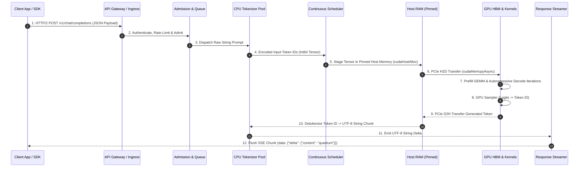

# Chapter 02 — The End-to-End Inference Request Path

## WHY: Latency Beyond the GPU

When an inference pipeline fails to meet its Service Level Agreement (SLA), engineering teams frequently focus exclusively on GPU kernel execution. They invest effort into compiling model engines or upgrading hardware from A100 to H100 GPUs. However, in production architectures, **up to 60% of total end-to-end request latency occurs outside the GPU**.

An inference request traverses multiple network hops, operating system kernel boundaries, host memory allocators, CPU thread pools, queueing schedulers, PCIe buses, and response stream serializers. A bottleneck in any single non-GPU stage—such as single-threaded CPU tokenization, unpinned host memory staging, or proxy socket buffering—completely invalidates the nanosecond performance of H100 Tensor Cores.

To build predictable high-throughput serving platforms, engineers must trace the complete end-to-end data and control path, accounting for latency at every boundary.

---

## WHAT: The Nine-Stage Inference Request Path



**Figure 12.2.1 — The Complete End-to-End Inference Request Lifecycle.** Request processing flows sequentially through ingress, tokenization, memory staging, GPU execution, detokenization, and streaming response delivery.

---

### Deep Dive into the 9 Request Stages

#### Stage 1: Ingress & TLS Termination
- **Protocol:** HTTP/2 or gRPC over TLS 1.3.
- **Mechanics:** The client initiates a TCP handshake and TLS session with the API Gateway (e.g., Envoy, Nginx, or Traefik). The gateway parses the incoming JSON payload (`{"model": "llama3-70b", "messages": [...], "stream": true}`).
- **Latency Budget:** 2 - 10 ms.

#### Stage 2: Admission Control & Queueing
- **Mechanics:** The gateway evaluates rate limits (token bucket algorithm) and submits the request to an admission controller. If the GPU inference engine is operating at maximum capacity, the request is placed in an admission queue (M/G/1 queueing model).
- **Latency Budget:** 1 - 50 ms (under normal load; unbounded during severe capacity overload).

#### Stage 3: CPU Tokenization & Prompt Engineering
- **Mechanics:** The raw text prompt string is passed to a tokenizer library (e.g., HuggingFace `tokenizers` C++ bindings or `tiktoken`). The tokenizer splits strings into sub-word tokens, maps sub-words to integer vocabulary indices (`int64`), and appends control tokens (`&lt;|begin_of_text|>`, `&lt;|start_header_id|>`).
- **Latency Budget:** 2 - 20 ms (depends heavily on prompt length and CPU thread pool availability).

#### Stage 4: Iteration Scheduling & KV Memory Block Allocation
- **Mechanics:** The continuous batch scheduler ingests the integer token tensor. It queries the **Paged KV Cache Block Manager** to allocate physical virtual memory pages in GPU HBM. If sufficient blocks are free, the sequence joins the active running batch for the next execution iteration step.
- **Latency Budget:** &lt; 1 ms.

#### Stage 5: Host-to-Device Memory Transfer (H2D)
- **Mechanics:** Input token IDs reside in CPU host RAM. To execute CUDA kernels, the scheduler copies the tensor from host RAM across the PCIe Gen5 bus (or NVLink C2C) to GPU HBM. 
- **Critical Path:** Copies using standard pageable memory require an intermediate staging step into OS page-locked memory. Using **Pinned Memory (`cudaHostAlloc`)** enables direct Memory Access (DMA) transfers, achieving full PCIe Gen5 speeds (64 GB/s).
- **Latency Budget:** &lt; 0.5 ms.

#### Stage 6: GPU Engine Execution (Prefill & Decode Iterations)
- **Mechanics:**
  - **Prefill (Iteration 0):** Tensor Cores execute General Matrix Multiply (GEMM) kernels across all prompt tokens in parallel, populating the initial KV Cache blocks.
  - **Decode (Iterations 1 ... N):** The engine executes a single forward-pass iteration per generated token, loading weights from HBM to SRAM for General Matrix-Vector (GEMV) multiplications.
- **Latency Budget:** TTFT: 50 - 300 ms; ITL: 15 - 30 ms/token.

#### Stage 7: GPU Logit Processing & Sampling
- **Mechanics:** The final transformer layer produces raw unnormalized logit vectors (`V_vocab ≈ 128,000` dimensions). Sampling kernels execute directly on the GPU to apply Temperature scaling, Repetition Penalty, Top-K, Top-P (Nucleus), or Greedy ArgMax selection.
- **Latency Budget:** &lt; 1 ms.

#### Stage 8: Device-to-Host Transfer (D2H) & Detokenization
- **Mechanics:** The single generated output token ID (1 x int32) is copied back from GPU VRAM to Pinned Host Memory via `cudaMemcpyAsync`. The CPU tokenizer maps the integer ID back into its UTF-8 string representation.
- **Latency Budget:** &lt; 1 ms.

#### Stage 9: Response Stream Serialization & Socket Flushing
- **Mechanics:** The API server formats the UTF-8 string chunk into a Server-Sent Events (SSE) data frame (`data: {"choices": [{"delta": {"content": "text"}}]}`). The frame is written to the TCP socket buffer and explicitly flushed to prevent proxy buffering stalls.
- **Latency Budget:** 1 - 3 ms.

---

## HOW: Data Path vs. Control Path Separation

High-performance inference platforms maintain strict isolation between the **Control Path** (management operations) and the **Data Path** (real-time tensor streaming):

```
                   ┌─────────────────────────────────────────┐
                   │             CONTROL PLANE               │
                   │  - Model Repository Discovery           │
                   │  - Health & Readiness Probes            │
                   │  - Kubernetes HPA Metrics Exporter      │
                   │  - Dynamic Engine Weight Swapping       │
                   └────────────────────┬────────────────────┘
                                        │ (Asynchronous Orchestration)
  DATA PLANE                            ▼
┌──────────────┐     ┌──────────────┐     ┌──────────────┐     ┌──────────────┐
│  gRPC / SSE  │───► │ Pinned Host  │───► │ PCIe DMA     │───► │ GPU Memory   │
│  Streaming   │ ◄───│ Memory Alloc │ ◄───│ Copy Engine  │ ◄───│ & CUDA Stream│
└──────────────┘     └──────────────┘     └──────────────┘     └──────────────┘
 (Lock-Free I/O)      (Zero-Copy RAM)     (Async Transfer)     (CUDA Kernels)
```

- **Control Path Properties:** Operates asynchronously out-of-band. Handles configuration updates, pod health checks (`/v2/health/ready`), Prometheus metric scraping, and Kubernetes autoscaling triggers. Failures in control plane components (e.g., metric timeout) must never block active GPU execution streams.
- **Data Path Properties:** Strictly lock-free, zero-allocation during execution loops. Allocates memory buffers at server startup (pinned RAM pools, pre-allocated CUDA stream handles) to eliminate host OS allocation overheads (`malloc`/`free`) during request handling.

---

## Component Responsibilities & Boundary Protocols Matrix

| Stage Layer | Protocol / Interface | Data Payload Format | Component Owner | Primary Failure Mode | Performance Bottleneck |
|---|---|---|---|---|---|
| **1. Ingress** | HTTP/2 / gRPC over TLS | JSON string | API Gateway / Nginx | Connection backlog drops | TLS Handshake / Proxy CPU |
| **2. Admission** | Internal Go/C++ Channel | `RequestStruct` pointer | Admission Controller | Unbounded queue accumulation | Lock contention on queue |
| **3. Tokenize** | C++ API / Rust Bindings | UTF-8 String -> Int64 Tensor | Tokenizer Threadpool | Single-thread CPU saturation | Python GIL / Tokenizer RAM |
| **4. Schedule** | Lock-Free Queue | `SequenceGroup` objects | Continuous Scheduler | Sequence lock contention | CPU Scheduler iteration delay |
| **5. Memory H2D** | PCIe Gen5 DMA | Int32 Tensor in Pinned RAM | CUDA Driver | Pageable memory staging copy | PCIe Bandwidth / Host RAM |
| **6. GPU Compute** | CUDA Streams / NVLink | FP16/FP8 Weight & KV Tensors | TensorRT / vLLM Engine | CUDA OOM / Stream Deadlock | HBM Bandwidth / TFLOPS |
| **7. Sampler** | CUDA C++ Kernels | Logits (128k) -> Token ID | GPU Sampler Module | Invalid temperature value | GPU Kernel launch overhead |
| **8. Memory D2H** | PCIe Gen5 DMA | 4-byte Int32 Token ID | CUDA Driver | Host thread blocking sync | `cudaStreamSynchronize` stalls |
| **9. Egress** | Server-Sent Events (SSE) | HTTP Chunked Stream | API Endpoint Handler | Socket buffer bloat / Stall | Nginx proxy buffering |

---

## TRADEOFFS: Architectural Trade-off Analysis

### 1. Tokenization Placement: Gateway Microservice vs. In-Engine C++ Backend

```
OPTION A: Tokenization inside API Gateway (Microservice)
  [Client] --> [API Gateway + Tokenizer (CPU)] --> (Integer Tensors) --> [Triton / GPU]

OPTION B: Tokenization inside Inference Engine (Triton C++ / BLS)
  [Client] --> [API Gateway] --> (Raw Strings) --> [Triton Engine: Tokenizer -> GPU Exec]
```

| Dimension | Microservice Tokenizer (Option A) | Engine-Integrated Tokenizer (Option B) |
|---|---|---|
| **GPU Node CPU Load** | Minimal (GPU nodes only receive clean integer tensors) | High (GPU host CPU must dedicate cores to BPE string parsing) |
| **Network Payload Size** | Larger (Integer arrays `int64` take 8x more bytes than UTF-8 strings) | Compact (Sends raw string over network to inference node) |
| **System Scalability** | Independent (Scale CPU tokenizer pods separately from GPU pods) | Coupled (Scaling inference capacity scales tokenizer CPU capacity) |
| **Latency Vector** | Adds network hop between Gateway and GPU engine | Zero extra network hops; faster end-to-end execution |

### 2. Host RAM Allocation: Standard Pageable Memory vs. Pinned Memory (`cudaHostAlloc`)

- **Pageable Host RAM:** Allocated via standard C++ `malloc()`. The operating system can page memory out to swap disk. When executing `cudaMemcpy`, the CUDA driver must first create a temporary locked page, copy the host data to the locked page, and then perform PCIe DMA. Transfer speed: ≈ 10 - 14 GB/s.
- **Pinned Paged-Locked Memory:** Allocated via `cudaHostAlloc()` or registered via `cudaHostRegister()`. Memory is locked into physical RAM, allowing the GPU DMA engine to read directly from host RAM without CPU staging. Transfer speed: ≈ 55 - 62 GB/s on PCIe Gen5.

---

## TROUBLESHOOTING: Worked Failure Scenarios

### Scenario 1: Host CPU Tokenization Thread Starvation Masking GPU Capacity

#### 1. Production Incident Context
An MLOps team added 4 additional NVIDIA H100 GPUs to an inference cluster to handle growing request volumes. However, benchmarking revealed that total cluster Request-Per-Second (RPS) remained completely flat at 120 RPS, and average latency increased by 300 ms. GPU utilization across all nodes dropped from 80% down to 22%.

#### 2. Root Cause Analysis
The API gateway relied on a Python-based FastAPI service that executed HuggingFace `AutoTokenizer` inside the request thread. Because Python's Global Interpreter Lock (GIL) enforced single-threaded execution, processing long prompt strings saturated the gateway node's 8 CPU cores. The GPUs were starved of work because the CPU gateway could not generate input token tensors fast enough to feed the GPU engine queues.

#### 3. Log & Telemetry Evidence
Gateway Node CPU Metric (`top` / Prometheus):
```text
PID USER      PR  NI    VIRT    RES    SHR S  %CPU  %MEM     TIME+ COMMAND
4102 www-data  20   0 14.2g   3.1g  120m R 798.2   9.8   42:11.08 uvicorn worker
```

OpenTelemetry Trace Span Duration Breakdown:
```text
Total Request Duration: 412 ms
  ├── [Gateway HTTP Parse] -------------> 2 ms
  ├── [CPU Tokenize (HuggingFace)] ------> 320 ms  <-- 77% of total latency spent on CPU!
  ├── [H2D Copy] -----------------------> 0.4 ms
  ├── [GPU Inference Execution] --------> 88 ms
  └── [SSE Serialization] --------------> 1.6 ms
```

#### 4. Exact Diagnostic Commands
```bash
# 1. Check CPU thread saturation on the API Gateway pod
kubectl top pod api-gateway-6f8d9b-9x2k4 -n inference --containers

# 2. Trace CPU function calls inside the gateway process using perf
perf top -p $(pgrep -f "uvicorn")

# 3. Monitor CUDA engine queue depth vs GPU activity via Prometheus metrics
curl -s http://triton-node-01:8002/metrics | grep -E "(triton_queue_time_us|dcgm_gpu_utilization)"
```

*Output of `perf top`:* Shows 68% of CPU cycles consumed inside `tiktoken._linear_merge` and PyTorch C++ tensor instantiation allocations.

#### 5. Remediation & Configuration Fix
To resolve the CPU bottleneck, replace the Python GIL-bound tokenizer with a high-throughput, multi-threaded C++ tokenizer microservice using the Rust `tokenizers` library or Triton's C++ Tokenizer Backend (`triton-python-backend` with decoupled C++ thread pool).

`docker-compose.yml` / Kubernetes Deployment Update:

```yaml
# Deploying compiled Rust Tokenizer Microservice with multi-threaded worker pool
apiVersion: apps/v1
kind: Deployment
metadata:
  name: rust-tokenizer-service
spec:
  replicas: 4
  template:
    spec:
      containers:
      - name: tokenizer
        image: ghcr.io/huggingface/text-generation-inference:tokenizer-latest
        env:
        - name: RAY_DISABLE_IMPORT_WARNING
          value: "1"
        - name: TOKENIZER_WORKER_THREADS
          value: "16" # Utilize 16 CPU cores per replica
        resources:
          limits:
            cpu: "16"
            memory: "8Gi"
```

In the API Gateway, convert tokenization to an asynchronous gRPC call:

```python
# Async gRPC call to decoupled C++ Rust Tokenizer pool
async def process_request(prompt: str):
    # Offload to C++ service pool, releasing Python GIL
    token_ids = await tokenizer_grpc_client.encode_async(
        prompt=prompt, 
        add_special_tokens=True
    )
    return await gpu_engine_client.generate_async(token_ids)
```

#### 6. Verification Steps
Re-run the cluster load benchmark using `perf_analyzer`:

```bash
perf_analyzer -m llama3-70b \
  -u gateway-service.inference:8001 -i gRPC \
  --concurrency-range 64:256:32 \
  --measurement-interval 10000
```

*Verification Results:*
- CPU Tokenization latency drops from 320 ms down to 1.4 ms.
- GPU utilization across all 8 H100 GPUs rises from 22% to 88%.
- Total cluster throughput increases from 120 RPS to 780 RPS.

---

### Scenario 2: Socket Buffer Bloat and Nginx Buffering Disrupting SSE Real-Time Streaming

#### 1. Production Incident Context
Users of a generative AI writing assistant complained that text generation felt "laggy and bursty." Instead of streaming smooth word-by-word responses, the UI froze for 1–2 seconds and then suddenly dumped large blocks of 40 tokens at once.

#### 2. Root Cause Analysis
The streaming architecture placed an Nginx reverse proxy between the client and the inference server. Nginx was configured with default response buffering enabled (`proxy_buffering on`). As the GPU generated individual tokens every 20ms and emitted SSE data chunks, Nginx intercepted the chunks, holding them in an OS socket buffer until the buffer size reached 4 KB before flushing the TCP frame to the client.

#### 3. Log & Telemetry Evidence
Packet capture analysis on the client network interface using `tcpdump`:

```text
14:35:10.102341 IP api-gateway.443 > client.52104: Flags [P.], seq 1:120, ack 1, win 502, length 119
14:35:10.704112 IP api-gateway.443 > client.52104: Flags [P.], seq 120:4210, ack 1, win 502, length 4090 <-- 600ms gap, followed by massive 4KB payload flush!
```

Nginx error log (`/var/log/nginx/error.log`):
```text
2026/08/06 14:35:10 [warn] 2814#2814: *14021 a client request body is being buffered to a temporary file /var/cache/nginx/client_temp/0000000001
```

#### 4. Exact Diagnostic Commands
```bash
# 1. Test raw HTTP stream output directly from command line (bypassing browser cache)
curl -N -v -X POST https://api.example.com/v1/chat/completions \
  -H "Content-Type: application/json" \
  -d '{"model":"llama3-70b","messages":[{"role":"user","content":"Write a poem"}],"stream":true}'

# 2. Capture TCP packet arrival timestamps to verify frame buffering
sudo tcpdump -i eth0 -nn -tt 'tcp port 443 and host api.example.com' | grep "length"

# 3. Check TCP socket un-flushed bytes on Nginx proxy pod
netstat -tucn | grep 8000
```

#### 5. Remediation & Configuration Fix
To enable true per-token real-time streaming, disable proxy buffering in Nginx, disable response chunking delay, and enable the `TCP_NODELAY` socket option to disable Nagle's algorithm.

Updated Nginx Proxy Configuration (`nginx.conf`):

```nginx
server {
    listen 443 ssl http2;
    server_name api.example.com;

    location /v1/chat/completions {
        proxy_pass http://triton_backend_cluster;
        
        # MANDATORY FOR SSE STREAMING: Disable Nginx response buffering
        proxy_buffering off;
        proxy_cache off;
        
        # Pass chunked transfer encoding directly
        chunked_transfer_encoding on;
        
        # HTTP/1.1 required for persistent streaming connections
        proxy_http_version 1.1;
        proxy_set_header Connection "";
        
        # Disable TCP Nagle algorithm on socket
        tcp_nodelay on;
        
        # Fast read/send timeouts for long-running streaming connections
        proxy_read_timeout 3600s;
        proxy_send_timeout 3600s;
    }
}
```

In the Python / C++ API Endpoint Handler, enforce immediate socket flushes:

```python
# FastAPI SSE Streaming Endpoint Fix
@app.post("/v1/chat/completions")
async def chat_completions(request: ChatRequest):
    async def token_generator():
        async for token_chunk in gpu_engine.generate_stream(request):
            # Format SSE frame
            payload = f"data: {json.dumps(token_chunk)}\n\n"
            yield payload.encode("utf-8")
            # Force explicit socket flush after yielding chunk
            
    return StreamingResponse(
        token_generator(), 
        media_type="text/event-stream",
        headers={"X-Accel-Buffering": "no"} # Signal to Nginx to disable buffering
    )
```

#### 6. Verification Steps
Execute `curl -N` with millisecond timestamp logging:

```bash
curl -N -s -w "\nTime: %{time_starttransfer}s -> %{time_total}s\n" \
  -X POST http://localhost/v1/chat/completions \
  -H "Content-Type: application/json" \
  -d '{"model":"llama3-70b","messages":[{"role":"user","content":"Count 1 to 5"}],"stream":true}'
```

*Verification Result:* Tokens arrive at steady, uniform 20 ms intervals. The UI renders real-time streaming text seamlessly without freezing or chunking.

---

## SENIOR INTERVIEW QUESTIONS: Staff/Senior SRE & MLOps

### Question 1: "Trace an inference request from HTTP client to GPU kernel execution and back. Where are the top 3 hidden latency sinks outside the GPU matrix multiplication?"

**Model Answer:**  
The top 3 non-GPU latency sinks in a production inference path are:

1. **CPU Tokenization & GIL Contention:** Tokenizing long prompt strings (e.g., 8,000 tokens) using Python-wrapped single-threaded tokenizers on host CPUs. If thread pools are undersized or locked by Python's GIL, this stage can add 100 - 300 ms of pure delay before tensors ever reach the GPU.
2. **Pageable Host-to-Device Memory Copying (PCIe Staging):** Allocating input tensors in standard C++ pageable RAM forces the CUDA driver to perform a two-step staging copy (RAM -> OS Locked Page -> PCIe DMA -> GPU HBM), reducing PCIe Gen5 throughput from 64 GB/s down to &lt; 12 GB/s.
3. **Proxy Socket Buffering & SSE Frame Buffering:** Intermediate reverse proxies (Nginx / Envoy) holding Server-Sent Events (SSE) token chunks in 4 KB TCP socket buffers before flushing, delaying user-visible stream updates by 500 - 1500 ms.

---

### Question 2: "How does backpressure propagate from a slow mobile client consuming a streaming SSE response all the way back to the GPU continuous batching loop?"

**Model Answer:**  
Backpressure propagates upstream across 5 distinct system layers:

1. **Client TCP Window Saturation:** A slow mobile client stops reading from its local TCP receive socket. The client's TCP Receive Window drops to 0.
2. **Gateway TCP Socket Buffer Fill:** The API Gateway (Nginx / Envoy) attempts to write generated token chunks to the client socket. The OS kernel blocks the socket write because the TCP window is full.
3. **API Server Buffer Backlog:** The API endpoint handler's outbound queue (e.g., Go channel or asyncio Queue) fills up to its high-water mark.
4. **Scheduler Token Emission Halt:** The continuous batch scheduler attempts to yield the next token to the API server worker. Finding the queue full, the scheduler pauses processing for that specific sequence group.
5. **GPU KV Cache Block Eviction / Preemption:** If the client remains unresponsive and the admission queue demands capacity, the block manager marks the stalled sequence's KV cache blocks as lowest priority for eviction, freeing GPU VRAM for active sequences.

---

### Question 3: "Why is pageable host RAM transfer (`cudaMemcpy`) significantly slower than pinned memory (`cudaHostRegister`), and how does this impact dynamic batching pipelines?"

**Model Answer:**  

```
PAGEABLE MEMORY (Default malloc):
[ Host RAM (Pageable) ] ──(CPU Copy)──► [ Host Pinned Staging Buffer ] ──(PCIe DMA)──► [ GPU HBM ]
* Requires CPU intervention, double-copy overhead, transfer speeds ~10-14 GB/s.

PINNED MEMORY (cudaHostAlloc / cudaHostRegister):
[ Host RAM (Pinned Page-Locked) ] ─────────────────────────(Direct PCIe DMA)────────► [ GPU HBM ]
* Zero CPU intervention, single DMA transfer, transfer speeds ~55-62 GB/s (PCIe Gen5).
```

In dynamic batching pipelines, input tensors from 64 separate client requests must be assembled into a single contiguous batch tensor on every iteration step. If host buffers are pageable, CPU memory copy overheads and driver lock contention add 5 - 15 ms of latency to every batch launch step, degrading maximum achievable system throughput.

---

## Production Troubleshooting: Real-World Evidence

### Problem: Request Latency Remains High Despite Adding GPU Capacity

| Signal | Root Cause | Diagnostic Command | Real Evidence | Remediation |
|---|---|---|---|---|
| Total latency = 580ms; GPU kernel time = 85ms (15% of total) | CPU-bound ingestion/tokenization/egress (non-GPU stages consume 85% of latency) | `curl -s http://localhost:8002/metrics \| grep -E "(tokenizer_latency_seconds\|h2d_transfer_latency\|egress_latency)" \| head -10` | Tokenizer: 220ms avg (38% of total); H2D copy: 12ms; Egress: 263ms (45% of total—socket buffer bloat) | (1) Switch to C++ tokenizer w/ thread pool; (2) enable pinned memory; (3) disable Nginx proxy buffering (`proxy_buffering off`) |
| P99 latency = 1200ms; P50 latency = 95ms (12x spread) | TCP socket buffer bloat on slow clients; backpressure propagation | `netstat -s \| grep -E "overrun\|dropped"; tcpdump -i eth0 -n "port 8000" \| head -50` | `TCP segments retransmitted: 4200` (high retransmit rate); tcpdump shows 1-2 sec gaps between SSE chunk flushes | (1) Set `TCP_NODELAY` on API server sockets; (2) enforce streaming flush on every token (`if (token_count % 1 == 0) flush();`); (3) enable client-side read timeout to detect stalled clients |
| Throughput unchanged after 40% more GPU capacity added | CPU gateway/tokenizer or network ingress is the bottleneck, not GPU | `top -p $(pgrep -f "gateway"); nvidia-smi dmon -s gm -c 5 \| tail -3` | Gateway CPU = 95%; GPU util = 22%; memory traffic = 8% | Add more gateway/tokenizer pod replicas; ensure round-robin load balancing spreads traffic; measure actual end-to-end bottleneck via trace profiling |

**Interpretation:** When total end-to-end latency increases after adding GPU resources, the bottleneck has moved outside the GPU. OpenTelemetry spans or explicit timers on every stage reveal which component consumes the added time.

### Problem: Dynamic Batching Not Assembling Full Batches

| Signal | Root Cause | Diagnostic Command | Real Evidence | Remediation |
|---|---|---|---|---|
| Actual batch sizes = [1, 2, 1, 3, 1, 2] (avg 1.7) despite `preferred_batch_size: [32]` and `max_queue_delay: 10ms` | Traffic arrival rate too low; queue expires before filling | `curl -s http://localhost:8002/metrics \| grep -E "batch_size_histogram\|queue_wait_time"` | `Histogram bucket le="4": 8420 requests` (most batches &lt; 4 elements); `queue_wait_time le="2ms": 7200` (avg wait &lt; 2ms, queue expires quickly) | Increase `max_queue_delay_microseconds` to 50ms; monitor that P99 latency still meets SLA (100ms target = TTFT 50ms + batch assembly 20ms + GPU exec 20ms + egress 10ms) |
| Batch sizes correct (avg 28), but GPU exec time unchanged | Batching working but GPU kernel not saturating from assembled batch (memory-bandwidth bound, not compute bound) | `nvidia-smi dmon -s gm; tensorrt profiler log (trtexec --device=0 --profilingVerbosity=detailed)` | `GPU mem traffic: 220 GB/s (saturated); SM compute: 200 TFLOPS (vastly underutilized)` | This is expected for memory-bound workloads (e.g., token generation). Verify with profiler that compute is the intended bottleneck, or accept memory-bound behavior and scale via increasing concurrency instead of batch size. |

**Interpretation:** Dynamic batching provides throughput gains only if the workload is compute-bound. Verify with a GPU profiler before tuning queue delay parameters.

---

## Summary & Authoritative References

### Key Takeaways
1. **Optimize Beyond the GPU:** Non-GPU pipeline stages (tokenization, memory allocation, network proxy buffering) frequently account for &gt; 50% of end-to-end request latency.
2. **Decouple Data & Control Planes:** Maintain strict isolation between control plane operations (health checks, metric scraping) and lock-free zero-allocation data paths.
3. **Use Pinned Host RAM (`cudaHostAlloc`):** Eliminate PCIe memory staging overheads to achieve full Gen5 DMA speeds (64 GB/s).
4. **Disable Stream Buffering:** Configure Nginx and application endpoints with `proxy_buffering off` and `TCP_NODELAY` for real-time per-token SSE streaming.

### Authoritative References
- **NVIDIA CUDA C++ Programming Guide (Memory Management)**: [https://docs.nvidia.com/cuda/cuda-c-programming-guide/index.html#memory-management](https://docs.nvidia.com/cuda/cuda-c-programming-guide/index.html#memory-management)
- **Envoy Proxy HTTP/2 & SSE Architecture**: [https://www.envoyproxy.io/docs/envoy/latest/](https://www.envoyproxy.io/docs/envoy/latest/)
- **HuggingFace Fast Tokenizers Implementation (Rust/C++)**: [https://github.com/huggingface/tokenizers](https://github.com/huggingface/tokenizers)
