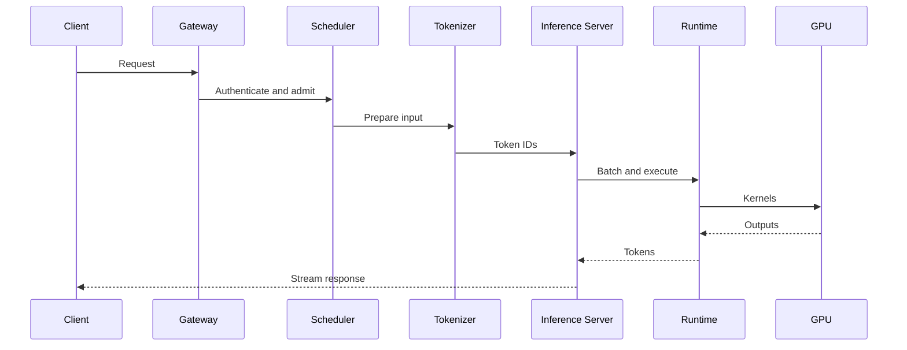

# The End-to-End Inference Request Path

The GPU executes only one part of an inference request. Every surrounding stage can become the dominant source of latency.

## Sequence

## Latency Budget

Total latency includes network, gateway, queue, preprocessing, model execution, sampling, serialization, and streaming. For LLMs, measure time to first token separately from time per output token.

## Data and Control Paths

The data path carries prompts, tensors, cache entries, and generated tokens. The control path performs routing, admission, health checks, model loading, and autoscaling. A healthy control plane does not prove a fast data path.

## Production Failure

A GPU dashboard shows only 40 percent utilization. The team adds replicas. Latency remains high because tokenization is CPU-bound and the request queue sits before the GPU service.

## Troubleshooting

Instrument every boundary with timestamps and correlation IDs. Compare queue depth, CPU saturation, batch size, GPU execution time, and response streaming delay.

## Interview Question

Draw an inference request and identify where backpressure should be enforced.
