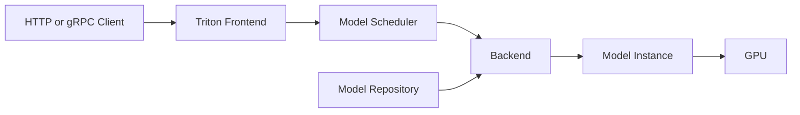

# Triton Inference Server Architecture

Triton separates serving concerns from application code. It provides standardized endpoints, model repositories, backend integration, schedulers, batching, instance groups, and metrics.

## Architecture



## Model Repository

A model repository defines versioned model artifacts and configuration. Production design must control artifact integrity, rollout, rollback, and model-loading behavior.

## Scheduling and Instance Groups

Triton can create model instances and apply dynamic or sequence batching. More instances increase concurrency but also consume memory and can create contention.

## Health and Metrics

```bash
curl -s localhost:8000/v2/health/live
curl -s localhost:8000/v2/health/ready
curl -s localhost:8002/metrics | head
```

Liveness means the process is running. Readiness should reflect whether required models can serve.

## Troubleshooting

**Symptom:** Triton is Ready, but requests fail for one model.

**Diagnosis:** inspect model repository structure, model state, backend logs, configuration, and memory availability.

**Root cause:** server health and model readiness were treated as the same signal.

## Interview Questions

- Why use separate model readiness checks?
- How do instance groups affect memory and concurrency?
- When should a model load dynamically versus at startup?
