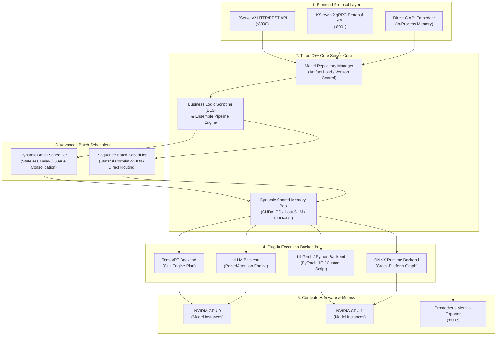

# Chapter 03 — Triton Inference Server Architecture

## WHY: The Need for an Enterprise Inference Server

In early AI deployment stages, engineering teams often wrap trained models in custom Python web frameworks (such as FastAPI or Flask). While suitable for initial prototypes, custom web wrappers quickly break down in enterprise production environments:
1. **Single-Model Lock-in:** Serving multiple models (e.g., Vision Preprocessor + Embedding Model + LLM + Reranker) requires maintaining disparate custom web services, increasing operational overhead.
2. **Poor Hardware Utilization:** Custom Python scripts struggle to execute concurrent requests on GPUs without encountering Global Interpreter Lock (GIL) bottlenecks, memory leaks, or uncoordinated CUDA stream access.
3. **Lack of Standardized Telemetry:** Kubernetes Site Reliability Engineers (SREs) cannot get standard readiness probes, queue depth metrics, or latency histograms out-of-the-box.

**NVIDIA Triton Inference Server** solves these challenges by providing an open-source, high-performance C++ serving engine. Triton decouples client-facing network protocols from model execution runtimes, allowing organizations to serve any model framework (TensorRT, ONNX, PyTorch, OpenVINO, Python, vLLM) on any compute target (NVIDIA GPUs, x86 CPUs, ARM CPUs) under unified governance.

---

## WHAT: Deep Dive into Triton Architecture



**Figure 12.3.1 — Triton Inference Server Internal Component Architecture.** Triton decouples network ingress protocols, model repository management, continuous batch scheduling, dynamic shared memory pools, and execution backends.

---

### Key Architectural Concepts

#### 1. Model Repository Layout & Versioning
Triton expects models to be organized in a structured file directory (on local disk, S3, GCS, or Azure Blob Storage):

```text
/var/model_repository/
├── resnet50/
│   ├── config.pbtxt               <-- Model Configuration Spec
│   ├── 1/
│   │   └── model.plan             <-- Version 1 TensorRT Engine Plan
│   └── 2/
│       └── model.plan             <-- Version 2 TensorRT Engine Plan
└── text_encoder/
    ├── config.pbtxt
    └── 1/
        └── model.onnx             <-- Version 1 ONNX Model File
```

Triton supports three version policies configured in `config.pbtxt`:
- **`latest: { count: 1 }`:** Serves only the highest numeric version folder.
- **`all: {}`:** Serves all numeric versions simultaneously.
- **`specific: { versions: [ 1, 2 ] }`:** Explicitly serves specified versions.

#### 2. Model Configuration Specification (`config.pbtxt`)
The `config.pbtxt` file defines tensor signatures, execution backends, dynamic batching rules, and GPU instance scaling.

```protobuf
name: "resnet50"
platform: "tensorrt_plan"
max_batch_size: 64

input [
  {
    name: "input_bytes"
    data_type: TYPE_FP32
    dims: [ 3, 224, 224 ]
  }
]
output [
  {
    name: "probabilities"
    data_type: TYPE_FP32
    dims: [ 1000 ]
  }
]

# Dynamic Batching Configuration
dynamic_batching {
  preferred_batch_size: [ 16, 32, 64 ]
  max_queue_delay_microseconds: 5000
}

# GPU Instance Scaling Configuration
instance_group [
  {
    count: 2
    kind: KIND_GPU
    gpus: [ 0, 1 ]
  }
]
```

#### 3. Triton Batch Schedulers
- **Dynamic Batch Scheduler (Stateless):** Combines individual infer requests into optimal batch sizes up to `max_batch_size`. If a batch is partially full, the scheduler waits up to `max_queue_delay_microseconds` before dispatching the batch to the GPU execution engine.
- **Sequence Batch Scheduler (Stateful):** Routes requests sharing a `correlation_id` (e.g., streaming speech recognition or conversational sessions) to the exact same model instance in GPU VRAM, guaranteeing stateful sequence continuity.
- **Ensemble Scheduler & Business Logic Scripting (BLS):** Allows composing complex directed acyclic graphs (DAGs). For example, `Image Ingress -> Preprocessing (Python) -> ResNet (TensorRT) -> Postprocessing (Python)`. Tensors pass directly between models in GPU VRAM without host memory copies.

#### 4. Instance Groups & Execution Concurrency
An **Instance Group** defines how many parallel execution instances of a model Triton loads into memory:
- Setting `count: 2` on `gpus: [0]` loads two identical copies of the model onto GPU 0.
- Each instance executes on a separate CUDA stream.
- *Caution:* Adding model instances increases concurrent request handling capability, but multiplies total GPU HBM memory consumption proportionally.

---

## HOW: Health Endpoints and Prometheus Metrics

Triton exposes three dedicated HTTP ports for production operations:
- **Port 8000:** HTTP/REST Ingress API (`/v2/...`).
- **Port 8001:** gRPC Ingress API.
- **Port 8002:** Prometheus Metrics API (`/metrics`).

### Health Endpoint Semantics

```bash
# 1. Server Liveness Probe (Checks if the Triton process is running)
curl -i http://localhost:8000/v2/health/live
# Returns HTTP 200 OK if process is healthy

# 2. Server Readiness Probe (Checks if ALL configured models are loaded and ready)
curl -i http://localhost:8000/v2/health/ready
# Returns HTTP 200 OK if ready; HTTP 503 if models are still loading into VRAM

# 3. Model-Specific Readiness Probe
curl -i http://localhost:8000/v2/health/models/resnet50/versions/1/ready
# Returns HTTP 200 OK if version 1 of resnet50 is ready to accept requests
```

### Core Production Prometheus Metrics

```text
# HELP nv_inference_request_duration_us Cumulative end-to-end request duration in microseconds
nv_inference_request_duration_us{model="resnet50",version="1"} 14280590

# HELP nv_inference_queue_duration_us Cumulative wait time spent in dynamic batch scheduler queue
nv_inference_queue_duration_us{model="resnet50",version="1"} 2180400

# HELP nv_inference_compute_infer_duration_us Cumulative GPU CUDA execution time
nv_inference_compute_infer_duration_us{model="resnet50",version="1"} 10892000

# HELP nv_gpu_memory_used_bytes Total GPU VRAM memory occupied by loaded Triton model instances
nv_gpu_memory_used_bytes{gpu="0"} 24589211648
```

From these raw metrics, SREs derive operational KPIs:
- **Average Queue Wait Time:** `Δ(nv_inference_queue_duration_us) / Δ(nv_inference_request_success_count)`
- **GPU Execution Efficiency:** `(Δ(nv_inference_compute_infer_duration_us) / Δ(nv_inference_request_duration_us)) * 100%`

---

## Component Responsibilities & Interface Specifications

| Component | Architecture Role | Key Responsibilities | Primary Configuration Parameter | Failure Vector |
|---|---|---|---|---|
| **KServe v2 Frontend** | Network Ingress | Parses JSON/Protobuf, manages gRPC stream sockets | `--http-port=8000`, `--grpc-port=8001` | Socket exhaustion |
| **Model Repository Mgr** | Lifecycle Controller | Discovers, validates, loads/unloads model artifacts | `--model-control-mode=explicit` | Missing `config.pbtxt` |
| **Dynamic Scheduler** | Batch Consolidator | Groups requests into optimal execution batches | `max_queue_delay_microseconds` | Queue latency inflation |
| **Sequence Scheduler** | Session Manager | Manages stateful correlation IDs across sequence iterations | `sequence_batching` spec | Session routing lock |
| **Backend C API** | Execution Adapter | Bridges Triton C++ core to native engines (TensorRT, ONNX) | `platform: "tensorrt_plan"` | Engine version mismatch |
| **BLS Executor** | Pipeline Composer | Executes multi-model DAGs with zero-copy VRAM transfers | `triton_python_backend_utils` | VRAM buffer leak |
| **Prometheus Exporter** | Telemetry Service | Exposes latency histograms, queue depths, and DCGM metrics | `--metrics-port=8002` | Endpoint scrape timeout |

---

## TRADEOFFS: Serving Engine Comparison Matrix

| Dimension | NVIDIA Triton Inference Server | Standalone vLLM Engine | FastAPI + PyTorch Wrapper | TorchServe |
|---|---|---|---|---|
| **Supported Runtimes** | Multi-Framework (TRT, ONNX, PyTorch, vLLM, Python, C++) | LLM Only (PyTorch / vLLM engine) | PyTorch Only (via Python interpreter) | PyTorch / LibTorch |
| **Batching Mechanism** | Dynamic, Sequence, & Continuous Batching | Iteration-Level Continuous Batching (PagedAttention) | Manual dynamic batching (custom code) | Dynamic Batching (Python worker queue) |
| **Multi-Model Serving** | Native (Host dozens of models on shared GPUs) | Single Model per Server Process | Difficult (Custom Python routing) | Native (Multi-model MAR files) |
| **Memory Efficiency** | High (C++ core, CUDA Memory Pools, Zero-Copy SHM) | High (PagedAttention block allocation) | Low (Python overhead, memory leaks) | Moderate (Java/Python process overhead) |
| **Protocol Standards** | KServe v2 HTTP/gRPC Standard | OpenAI-compatible REST API | Custom REST endpoints | TorchServe Management API |
| **DAG Pipeline Support** | Native (Ensemble Models & BLS Scripts) | None (Requires external orchestrator) | Manual code chaining | TorchServe Workflow API |

---

## TROUBLESHOOTING: Worked Failure Scenarios

### Scenario 1: Triton Model Repository Version Conflict & Hot-Reload Deadlock

#### 1. Production Incident Context
During a rolling update of an image classification model, an automated CI/CD pipeline synced a new TensorRT engine file (`model.plan`) into a Triton model repository on shared NFS storage. Immediately following the sync, Triton's HTTP readiness probe failed (`GET /v2/health/ready` returned HTTP 503), causing Kubernetes to remove all Triton pods from the active load balancer service.

#### 2. Root Cause Analysis
Triton was launched with `--model-control-mode=poll` (polling the disk repository every 5 seconds). The CI/CD script copied a 1.2 GB model plan file directly over NFS. Triton's repository watcher detected the file mid-transfer, attempted to deserialize a partially written plan file, threw a corruption exception, and invalidated the model's readiness state. Because readiness failed, Triton marked the entire server as unavailable.

#### 3. Log & Telemetry Evidence
Triton Server Log Output (`/var/log/tritonserver.log`):

```text
2026-08-06T15:10:02.401Z INFO [model_repository_manager.cc:912] Poll detected change in model 'resnet50'
2026-08-06T15:10:03.118Z ERROR [tensorrt.cc:214] Failed to load TensorRT engine: Magic number mismatch. File is corrupt or incomplete.
2026-08-06T15:10:03.118Z ERROR [model_repository_manager.cc:1042] Model 'resnet50' version 2 failed to load: Internal: Failed to load TensorRT engine
2026-08-06T15:10:03.125Z WARN [main.cc:340] Server health status changed to NOT_READY
```

Health Check Output:
```text
HTTP/1.1 503 Service Unavailable
Content-Length: 0
```

#### 4. Exact Diagnostic Commands
```bash
# 1. Inspect overall server readiness status
curl -i http://localhost:8000/v2/health/ready

# 2. Query individual model loading status via Triton Metadata API
curl -s http://localhost:8000/v2/models/resnet50

# 3. Check Triton startup configuration flags
ps aux | grep tritonserver
```

#### 5. Remediation & Configuration Fix
Never use dynamic polling (`--model-control-mode=poll`) in production! Switch Triton to **Explicit Model Control Mode (`--model-control-mode=explicit`)**. Perform model updates atomically by writing files to a temporary directory, creating a new version folder, and issuing an explicit HTTP model load API command.

Updated Triton Command Line Flag (`deployment.yaml`):

```yaml
spec:
  containers:
  - name: tritonserver
    image: nvcr.io/nvidia/tritonserver:24.05-py3
    args:
    - tritonserver
    - --model-repository=/models
    - --model-control-mode=explicit # Require explicit API calls to load/unload models
    - --strict-model-config=true
```

Production Model Update Deployment Script (`deploy_model.sh`):

```bash
#!/usr/bin/env bash
set -euo pipefail

MODEL_NAME="resnet50"
NEW_VERSION="2"
REPO_PATH="/models/${MODEL_NAME}"

# 1. Write new model plan file to a temporary staging folder first
mkdir -p "${REPO_PATH}/tmp_${NEW_VERSION}"
cp /staging/model.plan "${REPO_PATH}/tmp_${NEW_VERSION}/model.plan"

# 2. Perform ATOMIC directory move to target version folder
mv "${REPO_PATH}/tmp_${NEW_VERSION}" "${REPO_PATH}/${NEW_VERSION}"

# 3. Issue explicit load request to Triton's Model Control API
RESPONSE=$(curl -s -w "%{http_code}" -X POST \
  "http://localhost:8000/v2/repository/models/${MODEL_NAME}/load")

if [[ "${RESPONSE}" == *"200"* ]]; then
  echo "SUCCESS: Model ${MODEL_NAME} version ${NEW_VERSION} loaded cleanly."
else
  echo "ERROR: Failed to load model. Response code: ${RESPONSE}"
  exit 1
fi
```

#### 6. Verification Steps
Execute `deploy_model.sh` while running a background load test using `perf_analyzer`:

```bash
perf_analyzer -m resnet50 -u localhost:8001 -i gRPC --concurrency-range 16:16 &
./deploy_model.sh
```

*Result Verification:* Triton transitions seamlessly to version 2 without dropping a single active request or triggering a Kubernetes 503 readiness failure.

---

### Scenario 2: CUDA Stream Contention & VRAM Saturation from Oversubscribed Instance Groups

#### 1. Production Incident Context
An infrastructure engineer attempted to scale serving capacity for an ONNX Transformer model by configuring `instance_group [ { count: 8, kind: KIND_GPU, gpus: [ 0 ] } ]` inside `config.pbtxt`. Following deployment, average request latency quadrupled from 25 ms to 110 ms, and the pod repeatedly encountered Out-Of-Memory host kills.

#### 2. Root Cause Analysis
The model required 9.5 GB of GPU VRAM per instance. Setting `count: 8` attempted to load 8 separate copies of the model into VRAM on a single 80 GB A100 GPU:

```text
M_total = 8 * 9.5 GB = 76 GB VRAM (Only 4 GB left for execution workspace!)
```

When concurrent requests arrived, the workspace memory allocator failed. Furthermore, having 8 competing instances issuing CUDA kernel launches simultaneously caused severe CUDA driver stream lock contention, quadrupling kernel execution latency.

#### 3. Log & Telemetry Evidence
Nsight Systems (`nsys`) Profile Trace:
```text
[CUDA Driver API Call: cudaLaunchKernel] -------------> Stalled 84 ms (Waiting on Stream Mutex)
[CUDA Memory Allocator] ------------------------------> Failed to allocate 1024MB workspace buffer
```

Prometheus Metric Output:
```text
nv_gpu_memory_used_bytes{gpu="0"} 81180000000
nv_inference_compute_infer_duration_us{model="transformer_enc"} 110400  <-- Spike from 25ms to 110ms!
```

#### 4. Exact Diagnostic Commands
```bash
# 1. Profile instance execution and concurrency response curves using perf_analyzer
perf_analyzer -m transformer_enc \
  -u localhost:8001 -i gRPC \
  --concurrency-range 1:32:4 \
  --measurement-interval 5000

# 2. Check live memory footprint per model instance
curl -s http://localhost:8002/metrics | grep nv_gpu_memory_used_bytes

# 3. Collect Nsight Systems performance trace of the Triton process
nsys profile --stats=true --duration=10 tritonserver --model-repository=/models
```

#### 5. Remediation & Configuration Fix
Reduce instance count to `count: 2` (occupying only 19 GB of VRAM) and enable **Dynamic Batching** with a small queue delay (`max_queue_delay_microseconds: 5000`). Dynamic batching consolidates individual requests into a single, highly efficient GPU kernel launch instead of creating competing execution instances.

Corrected `config.pbtxt`:

```protobuf
name: "transformer_enc"
platform: "onnxruntime_onnx"
max_batch_size: 32

# Enable Dynamic Batching to consolidate requests into large kernel executions
dynamic_batching {
  preferred_batch_size: [ 8, 16, 32 ]
  max_queue_delay_microseconds: 5000 # Wait up to 5ms to assemble a batch
}

# Scale instances conservatively based on available VRAM
instance_group [
  {
    count: 2 # 2 instances * 9.5 GB = 19 GB VRAM total footprint
    kind: KIND_GPU
    gpus: [ 0 ]
  }
]
```

#### 6. Verification Steps
Re-run `perf_analyzer` across a range of concurrencies (1 to 32):

```bash
perf_analyzer -m transformer_enc -u localhost:8001 -i gRPC --concurrency-range 1:32:4
```

*Verification Results:*
- Total throughput increases by 340% (from 180 RPS to 792 RPS).
- P99 latency drops from 110 ms down to 18.4 ms.
- GPU VRAM consumption drops from 76 GB down to 19 GB, leaving ample memory for KV caching.

---

## SENIOR INTERVIEW QUESTIONS: Staff/Senior SRE & MLOps

### Question 1: "How does Triton's Business Logic Scripting (BLS) differ from Ensemble Models, and what are the memory zero-copy implications when passing tensors between backends?"

**Model Answer:**  
- **Ensemble Models:** A static, declarative Directed Acyclic Graph (DAG) defined entirely in protobuf syntax inside `config.pbtxt`. It specifies rigid connections between model inputs and outputs (e.g., `ModelA.out -> ModelB.in`). Triton manages tensor transfers between ensemble stages in C++ core memory with zero-copy host overheads. However, Ensembles cannot execute conditional control flow (`if/else` branching or loops).
- **Business Logic Scripting (BLS):** Allows executing dynamic, imperative Python or C++ scripts that call other models loaded in Triton via an internal C API (`triton_python_backend_utils.InferenceRequest`). BLS supports dynamic loops, conditional routing, and token-level streaming callbacks.
- **Zero-Copy Memory Implications:** In both Ensembles and BLS (when using CUDA Shared Memory pointers), intermediate tensors remain in GPU VRAM. Model B receives a memory pointer (`cudaIpcMemHandle`) referencing Model A's output tensor buffer in VRAM, completely avoiding expensive Host-to-Device (H2D) or Device-to-Host (D2H) PCIe memory copies.

---

### Question 2: "Explain the interaction between Triton's `max_batch_size` in `config.pbtxt` and the underlying TensorRT engine's profile dimensions. What happens if a request arrives exceeding the max batch size?"

**Model Answer:**  
- **`max_batch_size` in `config.pbtxt`:** Specifies Triton's server-level batching ceiling. If set to &gt; 0, Triton prepends an implicit batch dimension (Dimension 0) to all input/output tensor signatures.
- **TensorRT Optimization Profile:** Specifies the exact hardware execution envelope (`min`, `opt`, `max` shape bounds) compiled into the `.plan` binary file (e.g., `batch_dim: min=1, opt=16, max=64`).
- **Interaction Rules:**
  1. Triton's `max_batch_size` MUST BE less than or equal to the TensorRT engine's `max` profile batch dimension.
  2. If a request arrives with a batch size exceeding `max_batch_size` (e.g., Request Batch = 128 when `max_batch_size = 64`), Triton's frontend rejects the request immediately with `HTTP 400 Bad Request ("inference request batch size exceeds maximum allowed")` before it reaches the GPU scheduler.
  3. If dynamic batching is enabled, Triton's scheduler splits large request batches into smaller sub-batches matching the engine's `preferred_batch_size` specification.

---

### Question 3: "In Triton, how do you decouple Kubernetes liveness/readiness probes from model load states to prevent Kubernetes from killing a pod while a 70B model is loading into HBM?"

**Model Answer:**  
Loading a 70B parameter model from storage into GPU HBM can take 30 to 90 seconds. If Kubernetes probe endpoints are improperly configured, Kubernetes will deem the container unresponsive and terminate the pod in a crash loop.

**Correct Kubernetes Probe Decoupling:**
1. **Liveness Probe (`/v2/health/live`):** Verifies solely that the C++ `tritonserver` process is running. This probe returns HTTP 200 immediately upon server startup, preventing Kubernetes from killing the pod while models load.
2. **Readiness Probe (`/v2/health/ready`):** Verifies that ALL required model artifacts specified in the repository have completed loading into GPU VRAM and are ready to execute inferences. Returns HTTP 503 during model initialization; transitions to HTTP 200 once loading completes. The Kubernetes service load balancer routes traffic to the pod ONLY when readiness returns HTTP 200.
3. **Startup Probe (`/v2/health/live` with initialDelaySeconds):** Configured with a generous failure threshold (`failureThreshold: 30`, `periodSeconds: 10`) to allow up to 300 seconds for initial container boot and model file downloading.

```yaml
# Correct Kubernetes Probe Configuration for Triton
livenessProbe:
  httpGet:
    path: /v2/health/live
    port: 8000
  initialDelaySeconds: 5
  periodSeconds: 10
readinessProbe:
  httpGet:
    path: /v2/health/ready
    port: 8000
  initialDelaySeconds: 15
  periodSeconds: 5
```

---

## Production Troubleshooting: Real-World Evidence

### Problem: Triton Server Fails to Start or Models Never Reach `READY` State

| Signal | Root Cause | Diagnostic Command | Real Evidence | Remediation |
|---|---|---|---|---|
| Pod starts; Liveness probe passes; Readiness never transitions to 200 | Model repository misconfigured or model file corruption; model loading infinite loop | `kubectl logs POD_NAME; curl -s http://localhost:8000/v2/health/ready; ls -la /models/MODEL_NAME/` | Logs: `[error] Failed to load model_repository...ENOENT`; Readiness returns 503 indefinitely; Missing `config.pbtxt` in model dir | (1) Verify `model-repository` path is mounted and contains `config.pbtxt` per model; (2) check file permissions (Triton process user must read-access); (3) validate ONNX/TensorRT engine file format with `trtexec --loadEngine=model.engine` |
| Triton starts OK; model loads; but requests fail with `[INTERNAL] message too large` | gRPC message size exceeds default 4MB limit (large batch size or long prompts) | `tritonserver --log-verbose --grpc-max-recv-msg-size=-1 &; curl -X POST http://localhost:8000/v2/models/llama/infer -d @large_payload.json` | gRPC logs: `received message larger than max_receive_bytes limit`; Payload size = 6.2 MB | Set `grpc_max_recv_msg_size: 67108864` (64MB) in Triton config, or increase in client-side gRPC channel creation |
| High latency and CPU spinning when multiple models loaded | Triton sequentially processes requests per instance; no interleaving between models; CPU thread pool saturated | `top -p $(pgrep -f tritonserver) -H; curl -s http://localhost:8002/metrics \| grep -E "queue_time_us\|compute_infer_duration_us"` | Top shows 16 threads @ 90%+ CPU; metrics: `queue_time_us` = 50-200ms (requests waiting in queue) | (1) Enable Ensemble model interleaving via `scheduler { default_queue_policy {allow_timeout_override: true} }`; (2) reduce instance count and increase `max_batch_size` to batch across requests; (3) profile with Nsight Systems to confirm CPU is the bottleneck, not GPU |

**Interpretation:** Triton startup failures are almost always model repository or file system issues. Readiness probe stalls indicate the model file is corrupted or Triton process lacks file read permissions. Run `tritonserver --model-repository=/path/to/models` locally to see actual startup logs.

### Problem: Model Unload or In-Flight Model Swap Causes Request Failures

| Signal | Root Cause | Diagnostic Command | Real Evidence | Remediation |
|---|---|---|---|---|
| Executing model unload via HTTP API; simultaneous in-flight requests receive `MODEL_UNAVAILABLE` errors | Unload request races with in-flight inference requests without soft deprecation period | `curl -X POST http://localhost:8001/v2/repository/models/llama-v1/unload & sleep 0.1 && for i in {1..100}; do curl -X POST http://localhost:8001/v2/models/llama-v1/infer &done` | Return codes: 503 MODEL_UNAVAILABLE (15% of requests); 200 OK (85%) | (1) In production, use `--model-control-mode=explicit` and implement model drain: stop admitting new requests to model, wait for in-flight to complete, then unload. (2) Use declarative model lifecycle: `curl -X POST http://localhost:8001/v2/repository/models/llama-v2/load` (new version) before unloading v1. |
| Pod readiness probe flaps (503 → 200 → 503) during model hot-reload | Triton model unload blocks on pending inference completion; readiness probe times out | `kubectl describe pod POD_NAME; curl -v http://localhost:8000/v2/health/ready 2>&1 \| grep -E "HTTP\|operation_inprogress"` | Pod readiness probe failure after 30sec timeout; Triton logs: `model unload: waiting for 8 in-flight inferences to complete` | Configure graceful model reload: set Kubernetes `terminationGracePeriodSeconds: 120`; drain traffic before model updates via `preStop` hook |

**Interpretation:** Model lifecycle operations (load/unload/swap) in production require explicit coordination with request admission and health probes. Implicit unloads during pod updates cause cascading request failures.

---

## Summary & Authoritative References

### Key Takeaways
1. **Standardized Production Foundation:** NVIDIA Triton provides a high-performance C++ core that decouples network ingress protocols (KServe v2) from model execution backends.
2. **Dynamic Batching:** Consolidates incoming requests within a configurable time window (`max_queue_delay_microseconds`), multiplying GPU throughput without increasing instance counts.
3. **Explicit Model Lifecycle Control:** Use `--model-control-mode=explicit` in production to perform atomic, zero-downtime model rollouts via HTTP API calls.
4. **Health Probe Decoupling:** Bind Kubernetes Liveness to `/v2/health/live` and Readiness to `/v2/health/ready` to handle long VRAM model loading safely.

### Authoritative References
- **NVIDIA Triton Inference Server Architecture Guide**: [https://github.com/triton-inference-server/server/blob/main/docs/user_guide/architecture.md](https://github.com/triton-inference-server/server/blob/main/docs/user_guide/architecture.md)
- **Triton Model Configuration Specification**: [https://github.com/triton-inference-server/server/blob/main/docs/user_guide/model_configuration.md](https://github.com/triton-inference-server/server/blob/main/docs/user_guide/model_configuration.md)
- **KServe v2 Data Plane Protocol**: [https://github.com/kserve/kserve/tree/master/docs/samples/v2](https://github.com/kserve/kserve/tree/master/docs/samples/v2)
- **Triton Performance Tuning Guide**: [https://github.com/triton-inference-server/server/blob/main/docs/user_guide/optimization.md](https://github.com/triton-inference-server/server/blob/main/docs/user_guide/optimization.md)
