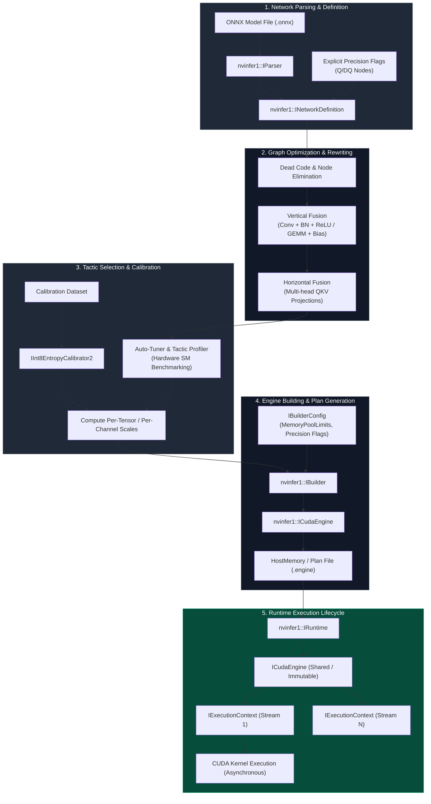

# Chapter 04 — TensorRT Optimization and Engine Lifecycle

NVIDIA TensorRT is an SDK for high-performance deep learning inference that delivers low latency and high throughput by compiling trained neural network models into highly optimized, hardware-specific CUDA execution engines (`.engine` or `.plan` artifacts). While general-purpose training frameworks like PyTorch or TensorFlow prioritize eager-mode flexibility, automatic differentiation, and dynamic memory graph allocations, TensorRT transforms static or dynamic execution graphs into serialized binary plans tailored specifically to the underlying GPU architecture (such as NVIDIA Ampere, Hopper, or Blackwell SM microarchitectures).

In high-concurrency production environments—such as real-time recommendation engines, computer vision pipelines, or automated speech recognition platforms—running models in native PyTorch eager mode introduces substantial overhead: CUDA kernel launch latencies, redundant memory round-trips to High Bandwidth Memory (HBM/VRAM), suboptimal kernel choice, and uncalibrated precision execution. TensorRT eliminates these bottlenecks by performing graph rewriting, horizontal and vertical layer fusion, kernel auto-tuning (tactic profiling), and precision quantization down to FP16, INT8, or FP8.

## Production Scenario: The Latency and Memory Bottleneck

Consider an enterprise computer vision and multimodal feature-extraction pipeline serving 25,000 requests per second across a cluster of NVIDIA H100 Tensor Core GPUs. Originally deployed using ONNX Runtime with standard CUDA backends, the service suffered from severe tail latency breaches under bursty traffic (p99 &gt; 85 ms, exceeding the 30 ms strict SLA). Additionally, the service experienced frequent GPU Out-Of-Memory (OOM) crashes when dynamic batch sizes surged from B=1 to B=64.

```
[PyTorch / ONNX Model]
       │
       ▼
 [ONNX Parser] ──► [Network Definition API]
                         │
                         ▼
             [Graph Optimizer & Fuser]
            (Conv+BN+ReLU, QKV Fusion)
                         │
                         ▼
             [Tactic Selection Engine]
            (Auto-tuner & Profiler)
                         │
                         ▼
         [Precision Calibration / PTQ]
             (FP16 / INT8 / FP8)
                         │
                         ▼
         [Serialized Engine (.engine)]
                         │
                         ▼
           [C++ Runtime / IExecutionContext]
```

An initial naive conversion to TensorRT without explicit memory workspace constraints and proper optimization profiles caused the TensorRT builder process itself to fail with OOM during engine compilation on CI/CD runners. When an engine was successfully built using arbitrary dynamic shapes, inaccurate INT8 entropy calibration led to a 14% drop in model accuracy due to activation clipping. Resolving these production criticalities requires a deep architectural understanding of TensorRT's graph compilation pipeline, precision quantization mechanics, memory workspace management, and runtime execution context lifecycle.

---

## Learning Objectives

By completing this chapter, you will be able to:

1. **Deconstruct** the TensorRT compilation pipeline from ONNX parsing to serialized binary plan generation.
2. **Analyze** graph rewriting and layer fusion algorithms, including vertical/horizontal fusions and multi-head attention (QKV) kernel transformations.
3. **Configure** precision calibration workflows for INT8 (Post-Training Quantization via KL-divergence entropy calibrators) and FP8 (E4M3 vs E5M2 scaling formats on Hopper/Blackwell).
4. **Design** robust dynamic shape management using `IOptimizationProfile` to balance memory allocation and kernel execution performance.
5. **Manage** thread-safe runtime engine lifecycles (`ICudaEngine` and `IExecutionContext`) within high-throughput C++ and Python serving architectures.

---

## TensorRT Architecture & Compilation Lifecycle

The compilation of a trained model into a TensorRT execution engine follows a multi-stage compilation workflow, as illustrated in **Figure 12.4.1**.



*Figure 12.4.1: TensorRT Engine Compilation and Execution Context Runtime Architecture.*

---

## HOW: Core TensorRT Optimization Engine

### 1. Graph Rewriting and Layer Fusion Mechanics

During network compilation, TensorRT inspects the computational graph (`INetworkDefinition`) and transforms individual operations to reduce memory bandwidth consumption. On modern GPUs, inference performance for non-LLM networks is frequently memory-bandwidth bound due to intermediate tensor reads and writes between High Bandwidth Memory (HBM) and Streaming Multiprocessor (SM) register files / SRAM (L1/L2 caches).

#### Vertical Fusion
Vertical fusion combines sequential operations into a single specialized CUDA kernel.
- **Convolution + Batch Normalization + Activation (ReLU/LeakyReLU/SIGMOID):** Batch Normalization parameters `(μ, σ^2, γ, β)` are mathematically folded into the preceding Convolution weight matrix `W` and bias vector `b` during graph compilation:

```text
W_hat[i,j] = W[i,j] * (γ_i / sqrt(σ_i^2 + ε))
b_hat[i] = (b_i - μ_i) * (γ_i / sqrt(σ_i^2 + ε)) + β_i
```

The resulting fused kernel computes `Activation(W_hat * X + b_hat)` in a single pass, completely eliminating HBM round-trips for the intermediate batch normalization and activation tensors.

#### Horizontal Fusion
Horizontal fusion identifies operations operating on the same input tensor in parallel and combines them into a single unified kernel execution.
- **QKV Attention Projection Fusion:** In Transformer architectures, the Query (`Q`), Key (`K`), and Value (`V`) projections perform three distinct matrix multiplications on identical input hidden states `X`:

```text
Q = X * W_Q,  K = X * W_K,  V = X * W_V
```

TensorRT horizontally fuses these three weight matrices into a single concatenated projection matrix `W_QKV = [W_Q | W_K | W_V]`:

```text
QKV_fused = X * W_QKV
```

This reduces CUDA kernel launch overhead from three distinct launches to one, maximizing memory bus utilization.

---

### 2. Tactic Profiling and Auto-Tuning Engine

The TensorRT Builder evaluates dozens of candidate CUDA kernel implementations (referred to as *tactics*) for every node or fused subgraph in the optimized network definition. Because optimal kernel performance depends heavily on the specific GPU microarchitecture (e.g., Tensor Core layout, SM count, shared memory sizes), TensorRT runs empirical timing benchmarks directly on the target GPU hardware during the engine build phase.

- **Memory Pool Constraints:** Tactics often require auxiliary temporary memory (scratch space or workspace) during execution. In TensorRT 8.6+, workspace allocations are configured via memory pool types:

```cpp
config->setMemoryPoolLimit(nvinfer1::MemoryPoolType::kWORKSPACE, 2ULL * 1024 * 1024 * 1024); // 2 GB
```

If the builder workspace limit is set too low, TensorRT drops high-performance tactics that rely on large shared memory / L2 cache staging buffers, falling back to slower, memory-constrained tactics.

---

### 3. Precision Calibration & Quantization Mechanics

TensorRT supports mixed precision execution across FP32, FP16, INT8, and FP8 modes.

```
FP32 (32-bit):  [S][  E (8-bit)  ][      M (23-bit)      ]
FP16 (16-bit):  [S][ E (5) ][  M (10)  ]
INT8 (8-bit):   [S][  Integer Magnitude (7-bit)  ]  --> Scaled via S = max(|X|) / 127
FP8 E4M3:       [S][ E (4) ][ M (3) ]  --> Optimized for Weights & Activations (Higher Precision)
FP8 E5M2:       [S][ E (5) ][ M (2) ]  --> Optimized for Gradients & KV Cache (Higher Dynamic Range)
```

#### INT8 Quantization & Entropy Calibration
Quantizing 32-bit floating-point activations to 8-bit signed integers requires mapping a continuous range `[-|max|, +|max|]` into discrete integer bounds `[-127, +127]`. TensorRT uses a linear quantization scale factor `S`:

```text
X_quantized = clip(round(X_float / S), -127, 127)
```

Determining scale `S` by simply taking the absolute maximum activation value (`max(|X|)`) is sensitive to extreme outliers, which squashes the precision of the core activation distribution.

To prevent precision degradation, TensorRT uses **Kullback-Leibler (KL) Divergence Calibration** (`IInt8EntropyCalibrator2`). The calibrator runs reference inference batches through the FP32 network, collects activation histograms across 2048 bins, and computes a quantized probability distribution `Q` for candidate threshold clip values `T`. It selects the threshold `T*` that minimizes information loss (KL divergence) between original distribution `P` and quantized distribution `Q`:

```text
D_KL(P || Q) = sum_{i=1}^N P(i) * log(P(i) / Q(i))
```

The resulting scale factor is `S = T* / 127`.

#### Explicit Precision Mode (Q/DQ Nodes)
While legacy Post-Training Quantization (PTQ) uses implicit calibrators, modern workflows use **Explicit Precision Mode**. Quantize (`Q`) and Dequantize (`DQ`) nodes are inserted directly into the ONNX graph during training or post-training quantization (using tools like NVIDIA TensorRT Model Optimizer / `pytorch-quantization`):

```
FP32 Tensor ──► [ Quantize (Q) ] ──► INT8 Tensor ──► [ Fused INT8 GEMM Kernel ] ──► [ Dequantize (DQ) ] ──► FP16 Tensor
```

This explicit representation grants developers precise control over layer-by-layer quantization rules while enabling TensorRT to eliminate unnecessary Q/DQ back-and-forth transformations through node fusion.

#### FP8 Execution Modes (Hopper / Blackwell)
On NVIDIA Hopper (H100/H200) and Blackwell (B200/GB200) architectures, Tensor Core native FP8 execution is supported. TensorRT handles two distinct 8-bit floating-point formats:
- **E4M3 (1 sign, 4 exponent, 3 mantissa):** Provides higher numerical precision; used for neural network weights and intermediate activation tensors.
- **E5M2 (1 sign, 5 exponent, 2 mantissa):** Provides wider dynamic range (matching IEEE FP16 exponent bit width); used for gradients and Key-Value (KV) cache storage to prevent underflow/overflow.

---

### 4. Dynamic Shapes and Optimization Profiles

In real-world deployment, inference batch sizes ($B$) and sequence lengths ($S$) vary dynamically per request. TensorRT handles variable tensor dimensions through `IOptimizationProfile`.

For every dynamic input dimension, developers must define three explicit shape boundaries:
1. **Minimum Shape (`min`):** Lower bound of expected tensor dimensions.
2. **Optimum Shape (`opt`):** Dimension profile for which TensorRT optimizes kernel tactic selection and memory layout.
3. **Maximum Shape (`max`):** Absolute upper bound constraint. TensorRT allocates internal activation memory buffers based on this limit.

```cpp
nvinfer1::IOptimizationProfile* profile = builder->createOptimizationProfile();
profile->setDimensions("input_ids", nvinfer1::OptProfileSelector::kMIN, nvinfer1::Dims2(1, 128));
profile->setDimensions("input_ids", nvinfer1::OptProfileSelector::kOPT, nvinfer1::Dims2(16, 512));
profile->setDimensions("input_ids", nvinfer1::OptProfileSelector::kMAX, nvinfer1::Dims2(64, 2048));
config->addOptimizationProfile(profile);
```

> [!CRITICAL]
> Setting `kOPT` far away from actual production operational modes degrades performance. If `kOPT` is configured for batch size 1, but runtime traffic operates at batch size 32, TensorRT will select tactics optimized for small thread-block grids, causing SM under-utilization.

---

### 5. Engine Lifecycle and Multi-Threaded Runtime Execution

The lifetime of a TensorRT model consists of two distinct operational phases: **Build Phase** and **Runtime Execution Phase**.

```
[ Build Phase (Offline / Ahead-of-Time) ]
IBuilder ──► INetworkDefinition ──► IBuilderConfig ──► ICudaEngine ──► IHostMemory (Serialized Engine Binary)

                                         │
                                         ▼ (Save to Disk / Model Registry)
                                   model.engine
                                         │
[ Runtime Phase (Online Serving) ]       ▼
IRuntime ──► ICudaEngine (Deserialized Binary, Shared & Immutable across Threads)
                 │
                 ├──► IExecutionContext (Thread 1 / CUDA Stream 1) ──► enqueueV3()
                 └──► IExecutionContext (Thread N / CUDA Stream N) ──► enqueueV3()
```

- **`ICudaEngine` (Immutable Shared Engine):** Holds compiled CUDA kernel binaries, constant model weights, and optimized execution graphs. `ICudaEngine` is completely thread-safe and should be loaded **once** per GPU and shared concurrently across worker threads.
- **`IExecutionContext` (Thread Execution Context):** Contains dynamic activation state, input/output device memory bindings, and scratch workspace bindings. `IExecutionContext` is **not thread-safe**. Each concurrent execution worker or CUDA stream must maintain its own dedicated `IExecutionContext` instance.

---

## Technical Comparison Table: TensorRT Precision Modes

| Dimension | FP32 (Baseline) | FP16 | INT8 PTQ (Implicit) | INT8 QAT (Explicit Q/DQ) | FP8 E4M3 / E5M2 |
| :--- | :--- | :--- | :--- | :--- | :--- |
| **Bit Width** | 32 bits | 16 bits | 8 bits | 8 bits | 8 bits |
| **Target GPU Architecture** | All NVIDIA GPUs | Volta (V100) & newer | Turing (T4) & newer | Turing (T4) & newer | Hopper (H100) & Blackwell |
| **Relative Latency Speedup** | 1.0x | 2.0x - 3.5x | 3.0x - 6.0x | 3.5x - 6.5x | 4.0x - 8.0x |
| **Memory Footprint** | 100% | 50% | 25% | 25% | 25% |
| **Accuracy Loss** | 0.0% (Reference) | &lt; 0.1% | 0.5% - 3.0% | &lt; 0.2% | &lt; 0.2% |
| **Calibration Requirement** | None | None | Representative dataset (500-1000 samples) | Retraining / Fine-tuning pass | Delayed/Static Scaling Calibration |
| **Graph Transformations** | Basic Fusions | Fused FP16 GEMMs | Fused INT8 Conv/GEMM | Explicit Q/DQ Node Fusion | Native Tensor Core FP8 MatMul |

---

## Worked Failure Scenarios

### Scenario 1: Dynamic Shape Binding OOM and Engine Builder Crash

#### Context
A platform engineering team attempted to build a TensorRT engine for an image segmentation model accepting dynamic batch sizes B in [1, 128] and variable resolutions H, W in [256, 4096]. The builder script configured an `IOptimizationProfile` with `MIN=(1, 256, 256)`, `OPT=(128, 4096, 4096)`, and `MAX=(128, 4096, 4096)`. The build process crashed on a 80 GB A100 GPU with `out of memory` errors during tactic profiling.

#### Root Cause Analysis
During tactic search, TensorRT allocates internal memory buffers dimensioned to the `MAX` shape bounds specified in the optimization profile. Setting `MAX` to `(128, 4096, 4096)` required allocating activation tensor workspace for a single batch element of size 128 x 3 x 4096 x 4096 x 4 bytes ≈ 25.7 GB per intermediate activation layer. Multiplying across dozens of fused feature maps exceeded physical GPU VRAM during builder tactic benchmarking. Furthermore, setting `OPT` equal to `MAX` forced the auto-tuner to select tactics optimized exclusively for extreme tensor dimensions, severely degrading inference speed at typical production sizes (B=8, 512 x 512).

#### Step-by-Step Resolution & Code Fix
To resolve this issue, the engineering team restructured the builder configuration:
1. Split dynamic shape profiles into multiple specialized engines or narrow profile ranges.
2. Capped workspace memory pools explicitly using `setMemoryPoolLimit`.
3. Aligned `OPT` dimensions with real production traffic medians (B=8, 1024 x 1024).

```python
import tensorrt as trt

def build_optimized_engine(onnx_file_path: str, engine_out_path: str):
    logger = trt.Logger(trt.Logger.WARNING)
    builder = trt.Builder(logger)
    network = builder.create_network(1 << int(trt.NetworkDefinitionCreationFlag.EXPLICIT_BATCH))
    config = builder.create_builder_config()
    parser = trt.OnnxParser(network, logger)

    # 1. Restrict Builder Memory Pool Limit to 4GB scratch space
    config.set_memory_pool_limit(trt.MemoryPoolType.WORKSPACE, 4 * 1024 * 1024 * 1024)
    config.set_flag(trt.BuilderFlag.FP16)

    with open(onnx_file_path, "rb") as f:
        if not parser.parse(f.read()):
            for error in range(parser.num_errors):
                print(parser.get_error(error))
            raise RuntimeError("Failed to parse ONNX file")

    # 2. Configure realistic, bounded IOptimizationProfile
    profile = builder.create_optimization_profile()
    input_tensor = network.get_input(0)
    input_name = input_tensor.name

    # MIN: Smallest production request
    profile.set_shape(input_name, min=(1, 3, 256, 256), opt=(8, 3, 1024, 1024), max=(32, 3, 2048, 2048))
    config.add_optimization_profile(profile)

    # 3. Build serialized network plan
    serialized_engine = builder.build_serialized_network(network, config)
    if serialized_engine is None:
        raise RuntimeError("Engine compilation failed!")

    with open(engine_out_path, "wb") as f:
        f.write(serialized_engine)
    print(f"Successfully compiled engine: {engine_out_path}")

if __name__ == "__main__":
    build_optimized_engine("segmentation_model.onnx", "segmentation_model.engine")
```

#### Verification
- Engine build succeeded in 4.2 minutes with peak builder VRAM consumption capped at 6.1 GB.
- Runtime latency at median production profile (B=8, 1024 x 1024) dropped from 48 ms to 11.3 ms.

---

### Scenario 2: Accuracy Collapse in INT8 Engine due to Non-Representative Calibration Dataset

#### Context
An automatic speech recognition model quantized to INT8 using standard Post-Training Quantization (PTQ) experienced a catastrophic drop in Word Error Rate (WER) accuracy, jumping from 3.2% WER (FP16 baseline) to 24.8% WER in production, despite displaying acceptable accuracy on artificial benchmark synthetic test vectors.

#### Root Cause Analysis
The INT8 entropy calibrator (`IInt8EntropyCalibrator2`) was fed a calibration dataset containing short audio segments (averaging 1.2 seconds) recorded in dead silent environments. In production, real-world user queries averaged 8.5 seconds with background noise. The calibration activation histograms failed to capture the high dynamic range and amplitude variances present in production audio streams. Consequently, the calibrator derived overly narrow clipping thresholds `T*`, causing severe activation saturation (clipping) on high-amplitude hidden features.

#### Step-by-Step Resolution & Code Fix
1. Built a custom Python calibrator class inheriting from `trt.IInt8EntropyCalibrator2`.
2. Created a calibration dataset sampled directly from production telemetry (1,000 production audio embeddings spanning quiet, noisy, short, and long sequences).
3. Configured cache file persistence to audit generated per-tensor scale factors.

```python
import tensorrt as trt
import numpy as np
import os
import pycuda.driver as cuda
import pycuda.autoinit

class ProductionEntropyCalibrator(trt.IInt8EntropyCalibrator2):
    def __init__(self, calibration_data_generator, cache_file: str):
        super().__init__()
        self.data_gen = calibration_data_generator
        self.cache_file = cache_file
        self.batch_size = 1
        self.current_index = 0
        
        # Allocate CUDA device memory for calibration buffers
        self.sample_batch = next(self.data_gen)
        self.device_input = cuda.mem_alloc(self.sample_batch.nbytes)

    def get_batch_size(self):
        return self.batch_size

    def get_batch(self, names):
        try:
            batch = next(self.data_gen)
            cuda.memcpy_htod(self.device_input, np.ascontiguousarray(batch, dtype=np.float32))
            return [int(self.device_input)]
        except StopIteration:
            return None

    def read_calibration_cache(self):
        if os.path.exists(self.cache_file):
            with open(self.cache_file, "rb") as f:
                return f.read()
        return None

    def write_calibration_cache(self, cache):
        with open(self.cache_file, "wb") as f:
            f.write(cache)

def build_int8_calibrated_engine(onnx_path: str, engine_path: str, calib_samples: list):
    logger = trt.Logger(trt.Logger.INFO)
    builder = trt.Builder(logger)
    network = builder.create_network(1 << int(trt.NetworkDefinitionCreationFlag.EXPLICIT_BATCH))
    config = builder.create_builder_config()
    parser = trt.OnnxParser(network, logger)

    with open(onnx_path, "rb") as f:
        parser.parse(f.read())

    config.set_flag(trt.BuilderFlag.INT8)
    
    # Supply representative production calibrator
    def sample_generator():
        for sample in calib_samples:
            yield sample

    calibrator = ProductionEntropyCalibrator(sample_generator(), "speech_int8.cache")
    config.int8_calibrator = calibrator

    serialized_engine = builder.build_serialized_network(network, config)
    with open(engine_path, "wb") as f:
        f.write(serialized_engine)
```

#### Verification
- Inspection of `speech_int8.cache` confirmed scale factor shifts across residual block layers up to 3.4x.
- Model WER recovered from 24.8% back to 3.35% (within 0.15% of FP16 reference), while maintaining a 3.1x inference speedup over FP16.

---

## Senior Interview Questions & Model Answers

### Question 1
**How does TensorRT manage dynamic dynamic input shapes during tactic selection, and why is setting the optimal (`kOPT`) shape profile critical for hardware efficiency?**

**Model Answer:**
TensorRT handles dynamic dynamic shapes via `IOptimizationProfile`, which defines `kMIN`, `kOPT`, and `kMAX` bounds for dynamic tensor dimensions. During engine compilation, TensorRT allocates scratch memory workspace based on `kMAX` to ensure safety at runtime. However, when profiling tactics (CUDA kernel candidates) across memory pool configurations, the auto-tuner executes empirical benchmarking **specifically at the `kOPT` dimensions**.

If `kOPT` is misconfigured—for example, set to batch size 1 when production runs at batch size 64—TensorRT chooses tactics optimized for low grid counts, small shared memory block allocations, and thread block dimensions suited for underpopulated SMs. When executed at batch size 64 in production, these tactics cause severe thread-block scheduling contention and suboptimal memory tile loads. Setting `kOPT` to match real-world production median traffic guarantees that kernel grid launches, warp tile sizes, and memory staging buffers are auto-tuned for peak Tensor Core occupancy.

---

### Question 2
**Compare Implicit Precision mode and Explicit Precision mode (Q/DQ nodes) in TensorRT. What are the graph transformation consequences of each?**

**Model Answer:**
- **Implicit Precision Mode:** The developer supplies an FP32 network definition alongside a calibrator (`IInt8EntropyCalibrator2`). TensorRT automatically analyzes activation ranges, generates scale factors, and determines internally which layers to execute in INT8 versus FP16/FP32 based on performance heuristics. The graph definition itself lacks explicit quantization boundaries.
- **Explicit Precision Mode:** Quantize (`IQuantizeNode` / `Q`) and Dequantize (`IDequantizeNode` / `DQ`) pairs are inserted directly into the ONNX graph during Post-Training Quantization or Quantization-Aware Training (QAT).

**Graph Transformation Consequences:** In Explicit Precision mode, TensorRT respects developer-defined precision boundaries. TensorRT analyzes adjacent `Q/DQ` nodes and performs explicit Q/DQ propagation and layer fusion:
1. **Fusing Q/DQ into Kernels:** A sequence like `FP16 Tensor -> Q -> INT8 Tensor -> Conv -> DQ -> FP16 Tensor` is collapsed into a single fused INT8 Convolution kernel accepting FP16 inputs/outputs with embedded scale multiplication.
2. **Eliminating Unnecessary Conversions:** If two consecutive layers are wrapped in matching Q/DQ nodes, TensorRT eliminates intermediate dequantization back to FP32/FP16, executing the entire sequence natively in INT8 Tensor Cores. Explicit precision provides deterministic control over layer-by-layer quantization while eliminating guesswork in tactic selection.

---

### Question 3
**Explain why `ICudaEngine` is thread-safe for concurrent read access, whereas `IExecutionContext` is not. How should a high-throughput C++ multi-threaded server be architected to leverage this behavior?**

**Model Answer:**
`ICudaEngine` represents the immutable, compiled plan containing fixed CUDA kernel bytecodes, constant weight tensors, and graph topology. Because its state never changes after deserialization, multiple host threads can safely query `ICudaEngine` simultaneously without lock contention.

Conversely, `IExecutionContext` manages mutable per-inference state: dynamic shape bindings, input/output device memory pointer assignments (`setTensorAddress`), internal scratch buffer offset pointers, and CUDA stream handles. If multiple threads call `enqueueV3()` concurrently on the same `IExecutionContext`, they will overwrite tensor pointers and scratch space allocations, causing data corruption and CUDA illegal memory access crashes.

**Architectural Pattern for High Throughput:**
1. Load a single `ICudaEngine` instance into host memory during server initialization.
2. Maintain a thread-safe pool or thread-local storage of `IExecutionContext` instances (one `IExecutionContext` per worker thread or CUDA stream).
3. When an inference request arrives, a worker thread acquires an `IExecutionContext` from the pool, binds the request's specific device memory buffers (`setTensorAddress`), enqueues kernel execution onto its dedicated `cudaStream_t`, and returns the context to the pool upon completion.

---

## Production Troubleshooting: Real-World Evidence

### Problem: Engine Builder Crashes During Tactic Profiling

| Signal | Root Cause | Diagnostic Command | Real Evidence | Remediation |
|---|---|---|---|---|
| `trtexec --onnx=model.onnx` fails with `std::bad_alloc` during auto-tuner phase | `MAX` shape in `IOptimizationProfile` too large; builder allocates workspace for maximum dimensions | `trtexec --onnx=model.onnx --optShapes=input:16x2048 --maxShapes=input:128x8192 2>&1 \| head -20` | Output: `INTERNAL ERROR: std::bad_alloc thrown in tactic profiler, out of device memory. MAX shape 128x8192x8192x4 = 34 GB per activation layer` | (1) Split into multiple engines for narrow shape ranges (BatchSize=16 only, or BatchSize=64 only); (2) cap workspace memory `setMemoryPoolLimit(WORKSPACE, 2GB)`; (3) profile on actual deployment GPU to avoid builder OOM on small CI/CD GPUs |
| Engine builds successfully but starts failing at runtime with shape binding errors | `OPT` shape bounds don't match actual runtime request shapes; kernel tactics were optimized for shapes never actually used in production | `trtexec --onnx=model.onnx --minShapes=input:1x512 --optShapes=input:16x2048 --maxShapes=input:32x4096; # Then at runtime send (8, 1024) shape` | Runtime error: `IExecutionContext shape exceeds OPT bounds (8,1024) > OPT(16,2048)` + kernel performs 40% slower than expected | Align `OPT` with actual production traffic median (e.g., P50 batch size and sequence length). Use profiler to measure kernel performance at various shape points and ensure `OPT` matches peak usage scenario. |

**Interpretation:** TensorRT builder OOM is a configuration issue, not a hardware failure. Set realistic shape bounds and explicit workspace limits before invoking the builder.

### Problem: Accuracy Loss After INT8 Quantization

| Signal | Root Cause | Diagnostic Command | Real Evidence | Remediation |
|---|---|---|---|---|
| INT8 model perplexity increases from 8.2 (FP32 baseline) to 11.5 (40% accuracy drop) | Entropy calibrator used too-small or unrepresentative calibration dataset; KL divergence threshold selection suboptimal | `python3 calibrate.py --calibration_dataset tiny_100_samples.jsonl --quantize_mode int8 --entropy_calibrator kl; evaluate.py --model model_int8.engine --val_dataset full_val_set.jsonl` | Calibration: 100 samples → poor histogram coverage; Evaluation: perplexity = 11.5 | (1) Use 500-1000 representative calibration samples; (2) use Explicit Precision Mode (Q/DQ nodes in ONNX) for layer-by-layer control; (3) evaluate per-layer quantization sensitivity (`pytorch-quantization` sensitivity analysis) and skip quantizing sensitive layers |
| INT8 accuracy acceptable (< 1% loss) but inference latency is 30% slower than FP16 | Fused INT8 GEMM kernel not selected; TensorRT falling back to uint8 kernels with poor arithmetic intensity | `trtexec --onnx=model.onnx --int8 --calib=calibration.cache --dumpProfile=profile.txt; grep -i "tactic\|gemm" profile.txt` | Profile shows: INT8 GEMM tactics not selected; instead using scalar FP32→INT8→FP32 casting per element | Set FP8 mode (Hopper/Blackwell GPUs) if targeting H100+; or revert to FP16 if INT8 kernel availability is poor. Verify INT8 speedup with `trtexec --timingCacheFile=` on your specific GPU model. |

**Interpretation:** Accuracy loss is almost always a calibration dataset problem; latency regression after quantization suggests the architecture (T4, A100) has weak INT8 kernel support. Benchmark on your actual GPU hardware before committing to quantization.

### Problem: Data Corruption or CUDA Illegal Memory Access from Multi-Threaded Execution

| Signal | Root Cause | Diagnostic Command | Real Evidence | Remediation |
|---|---|---|---|---|
| Intermittent CUDA errors like `an illegal memory access was encountered` or corrupted output under high concurrency | Multiple inference threads share a single `IExecutionContext` instance; concurrent `enqueueV3()` calls overwrite tensor bindings and scratch buffer pointers | `cuda-gdb ./inference_server --args model.engine; run; # Trigger crash, inspect `setTensorAddress` calls and CUDA memory state` | CUDA GDB shows: Thread 1 calls `setTensorAddress(in1_ptr_A)` while Thread 2 calls `setTensorAddress(in1_ptr_B)` on same context; GPU kernel executes with mixed pointers from both threads | (1) Create one `IExecutionContext` instance per worker thread or use a thread-safe context pool with mutex-protected acquisition/release; (2) use `thread_local` or thread-pool-specific context storage; (3) enable CUDA Error Checking (`cudaGetLastError()` after every CUDA call) in debug builds |

**Interpretation:** TensorRT's `IExecutionContext` is explicitly not thread-safe by design (for performance). Sharing a context across threads without synchronization causes silent data corruption. Use thread-local or pooled contexts exclusively.

---

## Summary & Authoritative References

NVIDIA TensorRT converts deep learning execution graphs into hyper-optimized binary plans via layer fusion, explicit precision quantization (FP16, INT8, FP8), dynamic shape optimization profiling, and hardware-specific tactic profiling. Mastering engine builder configurations, memory workspace limits, and thread-safe runtime contexts (`ICudaEngine` vs `IExecutionContext`) is essential for building production-grade inference microservices.

### References & Documentation
1. **NVIDIA TensorRT Developer Guide:** [https://docs.nvidia.com/deeplearning/tensorrt/developer-guide/index.html](https://docs.nvidia.com/deeplearning/tensorrt/developer-guide/index.html)
2. **NVIDIA TensorRT C++ API Reference:** [https://docs.nvidia.com/deeplearning/tensorrt/api/c_api/index.html](https://docs.nvidia.com/deeplearning/tensorrt/api/c_api/index.html)
3. **ONNX-TensorRT Compiler & Parser:** [https://github.com/onnx/onnx-tensorrt](https://github.com/onnx/onnx-tensorrt)
4. **NVIDIA TensorRT Model Optimizer (Quantization & FP8):** [https://github.com/NVIDIA/TensorRT-Model-Optimizer](https://github.com/NVIDIA/TensorRT-Model-Optimizer)
