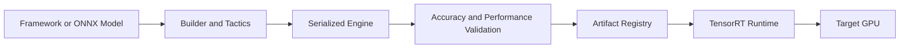

# TensorRT Optimization and Engine Lifecycle

TensorRT converts a trained model into an execution engine optimized for a defined hardware and software context.

## Lifecycle



## Why Engines Need Governance

An engine can depend on GPU architecture, TensorRT version, plugins, precision choices, optimization profiles, and tactic selection. Treat it as a build artifact with provenance, not a portable generic file.

## Build Example

```bash
trtexec --onnx=model.onnx --saveEngine=model.plan --fp16
trtexec --loadEngine=model.plan --verbose
```

The first command builds an engine; the second validates load and execution. Production validation must also compare accuracy and representative latency.

## Trade-offs

Lower precision can improve throughput and memory use, but requires accuracy validation. Broader dynamic-shape profiles increase flexibility but may enlarge build time and memory requirements.

## Troubleshooting

**Symptom:** an engine works on the build node but not on another pool.

**Root cause:** hardware, runtime, plugin, or profile assumptions differ.

**Prevention:** build per qualified target class, record checksums and versions, and use canary validation.
