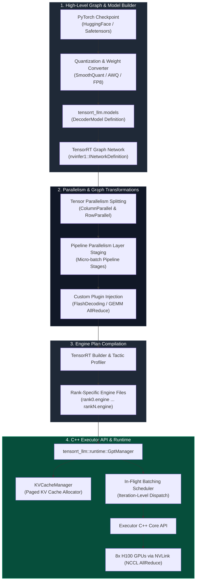

# Chapter 05 — TensorRT-LLM and LLM Execution

Serving Large Language Models (LLMs) such as Llama-3-70B, Mistral-Large, or DeepSeek-V3 in enterprise production environments introduces fundamentally different architectural challenges compared to traditional convolutional or small transformer networks. LLM generation operates in two distinct phases: an initial compute-bound **Prefill phase** (processing input tokens in parallel) followed by an autoregressive memory-bandwidth-bound **Decode phase** (generating one output token per step).

Running LLM inference using standard PyTorch pipelines suffers from severe operational bottlenecks: Python interpreter overhead, excessive CUDA kernel launch latencies, unoptimized memory allocations for Key-Value (KV) cache tensors, and inefficient inter-GPU communication over NCCL during distributed tensor parallelism. 

**NVIDIA TensorRT-LLM** addresses these challenges by combining TensorRT's low-level graph compilation with custom high-performance CUDA kernels (e.g., FlashAttention, FlashDecoding, SmoothQuant, FP8 GEMM), distributed execution primitives (Tensor Parallelism and Pipeline Parallelism), dynamic KV cache management, and a low-latency C++ `Executor` runtime interface.

---

## Production Scenario: Distributed 70B LLM Scaling Bottleneck

An AI platform team deployed a 70-billion parameter autoregressive language model across an 8x NVIDIA H100 SXM5 GPU node to serve an internal enterprise assistant. The initial implementation used a naive PyTorch Hugging Face pipeline wrapped in Python multiprocessing with NCCL tensor parallelism ($TP=8$).

Under peak concurrency (150 active request sessions), the system breached production performance targets:
- **Inter-Token Latency (ITL):** Averaged 115 ms/token, failing the target SLA of &lt; 25 ms/token.
- **GPU Utilization:** Volatile, swinging between 12% during decoding and 98% during prefill due to CUDA kernel launch overheads.
- **GPU Out-Of-Memory (OOM):** Repeated crashes during long-context RAG prompts (> 8192 tokens) caused by static pre-allocation of contiguous KV cache memory tensors.

```
[PyTorch Model Definition] ──► [TensorRT-LLM High-Level Builder]
                                         │
                                         ▼
                            [Graph Construction Pass]
                           (Column & Row Parallelism)
                                         │
                                         ▼
                            [Custom CUDA Kernel Fusion]
                           (FlashDecoding, FP8 GEMM, XQA)
                                         │
                                         ▼
                            [Engine Plan Serialization]
                                         │
                                         ▼
                         [C++ GptManager / Executor API]
                                         │
             ┌───────────────────────────┴───────────────────────────┐
             ▼                                                       ▼
   [GPU 0..3: TP Rank 0..3]                                [GPU 4..7: TP Rank 4..7]
(NVLink High-Speed AllReduce)                          (NVLink High-Speed AllReduce)
```

By re-architecting the serving layer on **TensorRT-LLM**—compiling the model into Tensor Parallel execution graphs, fusing attention ops via FlashDecoding, enabling FP8 quantized KV caching, and driving request execution through the C++ `GptManager` Executor API—the team reduced ITL from 115 ms to 18.4 ms while doubling total system throughput.

---

## Learning Objectives

By completing this chapter, you will be able to:

1. **Trace** the compilation pipeline from PyTorch high-level definitions to compiled TensorRT-LLM C++ execution graphs.
2. **Deconstruct** distributed execution patterns, including ColumnParallelLinear and RowParallelLinear layers with inter-GPU NCCL communication primitives.
3. **Analyze** specialized LLM CUDA kernels: FlashAttention-2, FlashDecoding, XQA, SmoothQuant (W8A8), and INT4 AWQ/GPTQ weight-only quantization.
4. **Configure** dynamic memory management for Key-Value (KV) caches, including FP8 KV cache scaling and paged memory allocations.
5. **Architect** high-throughput serving microservices using the C++ `Executor` API and `GptManager` runtime.

---

## TensorRT-LLM Architectural Pipeline

The overall architecture of TensorRT-LLM spans model definition, graph compilation, custom kernel selection, distributed multi-GPU routing, and C++ runtime orchestration, as shown in **Figure 12.5.1**.



*Figure 12.5.1: TensorRT-LLM Compilation Pipeline, Distributed Graph Transformations, and C++ Runtime Architecture.*

---

## Deep Architectural & Mathematical Analysis

### 1. Model Parallelism Execution Graphs

To serve models exceeding single-GPU VRAM capacity (e.g., Llama-3 70B requiring 140GB in FP16), TensorRT-LLM builds parallel execution graphs using **Megatron-LM style Tensor Parallelism (TP)** and **Pipeline Parallelism (PP)**.

```
                  COLUMN PARALLEL LINEAR                          ROW PARALLEL LINEAR
         ┌──────────────────────────────────────┐        ┌──────────────────────────────────────┐
         │ Input X                              │        │ Input X = [X1 | X2]                  │
         │   │                                  │        │   │        │                         │
         │   ├──► Rank 0: Y1 = X * W1           │        │   ▼        ▼                         │
         │   │                                  │        │ Rank 0   Rank 1                      │
         │   └──► Rank 1: Y2 = X * W2           │        │ Z1=X1*W1 Z2=X2*W2                    │
         │                                      │        │   │        │                         │
         │ Output Y = [Y1 | Y2] (No Comm Req)   │        │   └───┬────┘                         │
         └──────────────────────────────────────┘        │       ▼                              │
                                                         │   AllReduce(SUM) ──► Output Z        │
                                                         └──────────────────────────────────────┘
```

#### ColumnParallelLinear
In a ColumnParallelLinear layer, the weight matrix `W in R^{h x k}` is partitioned column-wise across `TP` ranks (`W = [W_1 | W_2 | ... | W_{TP}]`). Each GPU rank computes a slice of the output feature dimension:

```text
Y_i = X * W_i,  Y_i in R^{b x (k / TP)}
```

No GPU-to-GPU communication is required during this forward step.

#### RowParallelLinear
In a RowParallelLinear layer, the weight matrix `W in R^{k x h}` is partitioned row-wise across `TP` ranks (`W = [W_1^T | W_2^T | ... | W_{TP}^T]^T`). The input tensor `X` is split along its hidden dimension (`X = [X_1 | X_2 | ... | X_{TP}]`). Each GPU computes a partial matrix multiplication:

```text
Z_i = X_i * W_i,  Z_i in R^{b x h}
```

To obtain the final output `Z`, an **AllReduce (SUM)** operation must be executed across all `TP` ranks:

```text
Z = sum_{i=1}^{TP} Z_i = AllReduce-Sum(Z_i)
```

#### Multi-Head Attention (MHA / GQA) Partitioning
In Transformer layers, Multi-Head Attention projections map directly to this paradigm:
1. **Query, Key, Value (`W_{QKV}`) Projection:** Implemented as a `ColumnParallelLinear` layer. Weights are partitioned across attention heads.
2. **Attention Output (`W_O`) Projection:** Implemented as a `RowParallelLinear` layer. An AllReduce operation sums the partial attention projections across ranks.

#### Communication Overhead Math
The data volume transmitted per GPU rank during a single RowParallel AllReduce call is:

```text
Data Volume = 2 * ((TP - 1) / TP) * B * S * H * BytesPerElement
```

where `B` is batch size, `S` is sequence length, `H` is hidden size. On an 8x H100 node with 900 GB/s NVLink interconnects, fused kernel operations (`TwoShotAllReduce` or `KernelFusedAllReduce`) combine the matrix multiplication output directly with the NCCL reduce step inside SM registers, eliminating intermediate HBM writes.

---

### 2. Custom CUDA Kernels for LLM Execution

Standard GEMM operations fall short when serving LLMs due to memory bandwidth limits during decoding and quadratic computational complexity during prefill. TensorRT-LLM integrates specialized CUDA kernels:

#### FlashAttention-2 & FlashDecoding
Standard self-attention computes `A = softmax((Q * K^T) / sqrt(d)) * V`, requiring intermediate `O(S^2)` memory allocations to store attention matrix `A` in HBM.
- **FlashAttention-2:** Uses tiled, online softmax algorithms inside SM shared memory to compute attention in a single fused kernel pass, reducing memory transfers from `O(S^2)` to `O(S)`.
- **FlashDecoding:** Standard FlashAttention-2 parallelizes computation across sequence length `S` during prefill, but during the single-token decode phase (`S_new=1`), thread occupancy drops drastically. FlashDecoding splits the long historical KV cache sequence across multiple SM thread blocks, parallelizing the reduction step and achieving up to 8x faster decode throughput on long contexts.

```
Standard FlashAttention (Decode Phase):
[ Single Thread Block ] ──► Iterates sequentially over entire KV Cache (100% of KV length) ──► Low SM Occupancy

FlashDecoding (Decode Phase):
[ SM 1 ] ──► Processes KV Cache Chunk 0..2048 ──┐
[ SM 2 ] ──► Processes KV Cache Chunk 2049..4096 ┼──► [ Parallel Reduction Kernel ] ──► High SM Occupancy
[ SM N ] ──► Processes KV Cache Chunk N..Max    ──┘
```

#### Quantization Kernels
- **SmoothQuant (W8A8 INT8):** Addresses activation outliers in LLM hidden states (which reach magnitudes up to 100x baseline distributions). It applies per-channel smoothing scales `s` to migrate quantization difficulty from activations to weights:

```text
X_hat = X * diag(s)^{-1},  W_hat = diag(s) * W
Y = (X_hat_INT8 * W_hat_INT8) * (scales_X * scales_W)
```

- **AWQ / GPTQ INT4 (W4A16 Weight-Only):** Weights are quantized to 4-bit integers while activations remain in FP16. Custom CUDA kernels load 4-bit weights from HBM, unpack and dequantize them into FP16 inside SM registers on-the-fly, and execute FP16 Tensor Core GEMMs, halving memory bandwidth demand.

---

### 3. Dynamic KV Cache Allocation & Memory Management

During autoregressive decoding, past Key and Value vectors for all attention heads are stored in memory to prevent recomputing them at every generation step. Storing FP16 KV vectors for a 70B model requires significant memory footprint:

```text
KV Memory Per Token = 2 * L * H_kv * d_head * BytesPerElem
```

For Llama-3-70B (`L=80, H_kv=8, d_head=128`) in FP16, each token consumes 327,680 bytes ≈ 320 KB. A sequence of 4,096 tokens consumes 1.31 GB per user session.

```
FP16 KV Cache:  [ 2 Bytes per Element ]  -->  1.31 GB per 4K sequence
FP8 KV Cache:   [ 1 Byte per Element  ]  -->  0.65 GB per 4K sequence (50% VRAM Savings)
```

TensorRT-LLM optimizes KV cache storage through two mechanisms:
1. **Paged KV Cache (`KVCacheManager`):** Memory is allocated in non-contiguous physical blocks (e.g., blocks of 16 or 32 tokens). Virtual block tables map logical sequence tokens to physical memory addresses, eliminating external memory fragmentation.
2. **FP8 Quantized KV Cache:** Keys and Values are quantized to 8-bit floating point formats (E5M2 or E4M3). This cuts VRAM requirements by $50\%$, doubling maximum concurrent serving capacity per GPU.

---

### 4. C++ Runtime Architecture: `GptManager` and `Executor` API

TensorRT-LLM separates offline model building from online serving through a high-performance C++ execution core.

```
[ Incoming Requests ] ──► [ GptManager (C++ Runtime) ]
                                   │
                                   ├──► [ In-Flight Batching Scheduler ]
                                   ├──► [ KVCacheManager (Paged Blocks) ]
                                   └──► [ Executor API Engine Interface ]
                                              │
                                              ▼
                                 [ Synchronized CUDA Streams ]
```

- **`GptManager`:** A high-level C++ coordinator that manages request queues, handles continuous (in-flight) batching, manages KV cache allocations via `KVCacheManager`, and streams generated token IDs back to clients via callbacks.
- **`Executor` API:** Lower-level thread-safe C++ runtime interface (`tensorrt_llm::executor::Executor`). It directly loads compiled `.engine` plans, handles inter-process multi-GPU synchronization via MPI/NCCL, and schedules iteration-level execution steps onto underlying CUDA streams.

---

## Parallelism Strategy Comparison Table

| Parallelism Strategy | Target Bottleneck | Communication Primitive | NVLink Interconnect Required? | Latency Impact | Max Batch Size Scaling | Multi-Node Suitability |
| :--- | :--- | :--- | :--- | :--- | :--- | :--- |
| **Tensor Parallelism (TP)** | Single-request latency & Layer VRAM size | AllReduce (Sum), AllGather | **Yes** (Requires &gt; 300 GB/s bus) | **Substantial Reduction** (Parallelizes single GEMM) | Low (Focuses on single-stream speed) | Intra-Node Only (Single 8-GPU box) |
| **Pipeline Parallelism (PP)** | Multi-layer model fitting across GPUs | Point-to-Point (Send/Recv) | No (Tolerates PCIe / InfiniBand) | Slight Increase (Pipeline bubble overhead) | **High** (Requires large micro-batches) | Inter-Node (Across multiple servers) |
| **Context Parallelism (CP)** | Extreme prompt length (> 32K tokens) | AllGather / Ring-Attention | **Yes** (High-bandwidth communication) | Lowers Memory per GPU | High for long-context prompts | Intra-Node / High-Speed Inter-Node |
| **Data Parallelism (DP)** | Overall request throughput capacity | AllReduce (Gradient / Sync) | No | None (Independent requests) | Scales linearly with GPU count | Multi-Node Clusters |

---

## Worked Failure Scenarios

### Scenario 1: NVLink NCCL AllReduce Deadlock during Multi-Node Tensor Parallelism

#### Context
A research team deployed a 130B parameter custom LLM across two nodes (each containing 4x H100 GPUs) using Tensor Parallelism TP=8. During server execution initialization, the C++ `GptManager` process froze indefinitely during the initial execution context enqueue, yielding a `CUDA driver error: driver shutting down` timeout after 300 seconds.

#### Root Cause Analysis
Tensor Parallelism (TP) relies on frequent, ultra-low-latency AllReduce operations per Transformer layer. Executing TP=8 across two distinct physical servers forced NCCL to route AllReduce packets across external PCIe-to-InfiniBand interfaces between Node 1 (GPUs 0–3) and Node 2 (GPUs 4–7). Because PCIe host bridges lack the nanosecond-level latency and bidirectional bandwidth of NVLink, communication latency spiked by over 30x. 

Furthermore, a misconfigured MPI launcher bound rank communicators incorrectly, leading to an out-of-order barrier synchronization that caused an unrecoverable NCCL kernel deadlock.

#### Step-by-Step Resolution & Builder Configuration Fix
1. Re-architected parallelism layout: Configured Tensor Parallelism to TP=4 (fitting strictly within intra-node NVLink domains) and Pipeline Parallelism to PP=2 (crossing InfiniBand between nodes).
2. Set explicit NCCL environment variables to prevent inter-node TP binding.
3. Updated the TensorRT-LLM build script:

```python
import tensorrt_llm
from tensorrt_llm.builder import Builder
from tensorrt_llm.models import LLaMAForCausalLM
from tensorrt_llm.network import net_guard

def build_hybrid_parallel_engine():
    # Configure hybrid TP=4 (Intra-node NVLink), PP=2 (Inter-node IB)
    tensor_parallel = 4
    pipeline_parallel = 2
    world_size = tensor_parallel * pipeline_parallel

    builder = Builder()
    builder_config = builder.create_builder_config(
        name="llama_130b_hybrid",
        precision="float16",
        timing_cache="timing.cache",
        tensor_parallel=tensor_parallel,
        pipeline_parallel=pipeline_parallel,
    )

    # Enable custom fused AllReduce plugins for intra-node TP
    builder_config.plugin_config.set_gemma_allreduce_plugin()
    builder_config.plugin_config.set_nccl_plugin(dtype="float16")
    builder_config.plugin_config.enable_paged_kv_cache()

    print(f"Building TensorRT-LLM engine for World Size {world_size} (TP={tensor_parallel}, PP={pipeline_parallel})...")
    # Build plan files per rank...

if __name__ == "__main__":
    build_hybrid_parallel_engine()
```

#### Verification
- Server startup completed in under 14 seconds without deadlocks.
- Inter-node communication over InfiniBand dropped by 88% due to point-to-point PP micro-batching replace multi-node AllReduce calls.

---

### Scenario 2: KV Cache Allocation OOM under High Concurrency due to Block Size and Scale Mismatch

#### Context
A customer-service AI platform running Llama-3-70B on 4x A100 GPUs (TP=4) experienced sporadic runtime service crashes with `[TRT-LLM][ERROR] Out of memory during KVCache block allocation` when concurrent sessions exceeded 64 active requests.

#### Root Cause Analysis
The team configured static contiguous KV cache allocations with an overly large block size (`tokens_per_block=128`) and retained default FP16 precision. When requests arrived with variable sequence lengths (e.g., 129 tokens), the allocator was forced to allocate two full 128-token physical blocks (256 tokens total capacity), wasting nearly 50% of allocated KV memory due to internal fragmentation.

Additionally, the total physical KV cache pool was configured to claim 95% of remaining GPU memory (`kv_cache_free_gpu_memory_fraction=0.95`), leaving insufficient scratch workspace for intermediate FlashDecoding activations during long-context prefill steps.

#### Step-by-Step Resolution & C++ Configuration Fix
1. Reduced paged KV cache block size from 128 to 32 tokens to minimize internal fragmentation.
2. Enabled FP8 KV Cache quantization (`kv_cache_quant_mode=1`), halving per-token KV memory footprint.
3. Lowered `kv_cache_free_gpu_memory_fraction` to 0.85 to reserve workspace memory for execution context scratch buffers.

```cpp
#include "tensorrt_llm/runtime/gptManager.h"
#include "tensorrt_llm/executor/executor.h"

namespace tllm = tensorrt_llm::executor;

tllm::ExecutorConfig create_optimized_executor_config() {
    tllm::ExecutorConfig config;
    
    // 1. Configure Paged KV Cache Manager Settings
    tllm::KvCacheConfig kv_config;
    kv_config.setEnableBlockReuse(true);             // Enable prefix caching
    kv_config.setMaxTokensPerBlock(32);              // Reduce internal fragmentation (32 tokens/block)
    kv_config.setFreeGpuMemoryFraction(0.85f);       // Leave 15% VRAM for activation scratch space
    kv_config.setKvCacheQuantMode(tllm::KvCacheQuantMode::FP8()); // Enable 8-bit KV cache

    config.setKvCacheConfig(kv_config);

    // 2. Configure In-Flight Scheduler Settings
    tllm::SchedulerConfig sched_config;
    sched_config.setCapacitySchedulerPolicy(tllm::CapacitySchedulerPolicy::kGUARANTEED_NO_EVICT);
    config.setSchedulerConfig(sched_config);

    return config;
}
```

#### Verification
- Max concurrent active sessions increased from 64 to 210 requests per node without encountering OOM crashes.
- Effective GPU KV cache utilization increased from 52% to 91%.

---

## Senior Interview Questions & Model Answers

### Question 1
**Detail the exact sequence of communication primitives executed across GPUs during a forward pass through a Megatron-LM style Transformer layer in TensorRT-LLM.**

**Model Answer:**
A single Transformer layer in TensorRT-LLM consists of two main sub-modules: Self-Attention and Multi-Layer Perceptron (MLP). Each contains a pair of matrix projections configured for Tensor Parallelism (TP):

1. **Self-Attention Sub-Module:**
   - **QKV Projection (`ColumnParallelLinear`):** Input hidden state `X` is replicated across all `TP` ranks. Each rank multiplies `X` by its local weight slice (`W_{QKV, i}`). **No communication** occurs.
   - **Attention Core (FlashAttention/FlashDecoding):** Computed locally per rank on its subset of attention heads.
   - **Output Projection (`RowParallelLinear`):** Each rank multiplies its local attention output by its local weight slice (`W_{O, i}`).
   - **Communication Step 1:** An **AllReduce-Sum** is executed across all `TP` ranks to combine partial sums into the final attention residual tensor.

2. **MLP Sub-Module:**
   - **Gate/Up Projection (`ColumnParallelLinear`):** Input `H` is multiplied by rank-local weight slices (`W_{gate, i}`, `W_{up, i}`). **No communication** occurs.
   - **Activation Function (SwiGLU/GeLU):** Applied locally per rank.
   - **Down Projection (`RowParallelLinear`):** Rank-local intermediate activations are multiplied by rank-local weight slice (`W_{down, i}`).
   - **Communication Step 2:** A second **AllReduce-Sum** is executed across all `TP` ranks.

Total communication overhead per Transformer layer: **2 AllReduce operations**.

---

### Question 2
**How does FlashDecoding differ structurally from standard FlashAttention-2 during the autoregressive Decode phase, and why does it deliver significant speedups for long context lengths?**

**Model Answer:**
During the initial **Prefill phase**, the input prompt consists of `S` tokens processed simultaneously. FlashAttention-2 achieves high GPU utilization by parallelizing work across both batch size `B` and sequence length `S`, tiling matrices `Q, K, V` into SM shared memory.

However, during the single-token **Decode phase**, input query length is `S_query = 1`. Standard FlashAttention-2 assigns one thread block per attention head. Because `S_query = 1`, a single thread block must iterate sequentially over the entire historical KV cache (`S_keys = 4096 or 32768` tokens). On GPUs with many SMs (such as the H100 with 132 SMs), this results in severe SM under-utilization because there are not enough active thread blocks to occupy the hardware.

**FlashDecoding** restructures the decode kernel by introducing a two-stage parallel reduction:
1. **Stage 1 (Splitting KV Cache):** FlashDecoding partitions the historical KV cache sequence into `N` smaller chunks (e.g., 256 tokens per chunk). It spawns `N` distinct thread blocks across multiple SMs to compute partial softmax statistics and partial output vectors concurrently.
2. **Stage 2 (Reduction Kernel):** A lightweight secondary reduction kernel combines the partial softmax outputs from all SMs to produce the final attention vector.

This converts a sequential reduction into a parallel grid execution, restoring full SM occupancy and speeding up decoding on long contexts by up to 8x.

---

### Question 3
**Explain the architecture of TensorRT-LLM's `GptManager` and how it implements In-Flight Batching (Continuous Batching) at the iteration level.**

**Model Answer:**
`GptManager` is TensorRT-LLM's high-performance C++ runtime engine that coordinates real-time LLM inference requests. Traditional batching operates at the request level, waiting for all sequences in a batch to finish generating before accepting new work. `GptManager` implements **In-Flight Batching** (iteration-level continuous batching):

1. **Iteration Step Loop:** `GptManager` executes inference in step-by-step iterations corresponding to single-token generation passes.
2. **Dynamic Request Slotting:** At the start of every iteration, `GptManager` checks its internal request queue. If a running sequence emits an End-of-Sequence (``\<EOS\>``) token or hits its `max_tokens` limit, its slot in the execution batch is immediately released, and its physical KV cache blocks are freed via `KVCacheManager`.
3. **Prefill/Decode Co-Scheduling:** If free KV cache blocks are available, `GptManager` introduces a newly arrived request into the active batch. The new request executes its **Prefill phase** concurrently alongside ongoing requests executing their **Decode phase** in the exact same execution step.
4. **Non-Blocking Token Streaming:** Generated tokens are emitted via thread-safe queue callbacks to the host client at every iteration step, enabling real-time streaming without blocking worker threads.

---

## Production Troubleshooting: Real-World Evidence

### Problem: Low Throughput Despite High GPU Utilization During Tensor Parallelism

| Signal | Root Cause | Diagnostic Command | Real Evidence | Remediation |
|---|---|---|---|---|
| GPU utilization = 95%; throughput = 45 tokens/sec (lower than single-GPU baseline of 60 tokens/sec) | Inter-GPU all-reduce communications saturated; GPU computation starved waiting for tensor reduction results from peer GPUs | `nsys profile --stats=true -d 30 tritonserver --model-repo=/models; grep -A5 "CUDA_LAUNCH\|NVLink\|collective" nsys_report.txt` | Profile output: `[NVLink Bandwidth] Measured: 180 GB/s (vs. theoretical peak 900 GB/s)`; `[All-Reduce Collective] 450 μs per iteration (vs. ideal 120 μs)` | (1) Verify NVLink is enabled: `nvidia-smi topo -m` should show `NV2` connections between GPUs, not `PXB` (PCIe); (2) check NCCL environment: `NCCL_DEBUG=INFO` to confirm all-reduce algorithm selection; (3) profile collectives with `nccl-tests` (all-reduce bandwidth sweep) to isolate GPU communication bottleneck |
| Tensor parallelism TP=4 on 4xH100 GPUs; throughput does not scale (1 GPU = 60 tok/s; 4 GPU = 85 tok/s instead of 240 tok/s) | Communication overhead dominates compute; typical when KV cache or model is relatively small, or communication is synchronous (blocking all-reduce) | `python3 -c "import tensorrt_llm; engine.print_performance_report()" \| grep -E "compute_time_ms\|comm_time_ms"` | Report: compute per step = 8ms; communication per step = 11ms (communication > computation); efficiency = 8 / (8+11) = 42% | Reduce tensor parallelism (TP=2 or TP=1) for smaller models (< 30B params); or increase batch size to amortize communication costs across more sequences. For 70B+ models, TP=2 or TP=4 + continuous batching (B=64+) is optimal. |

**Interpretation:** Tensor parallelism provides scaling benefits only when model size is large enough that compute >> communication. Profile with NCCL to isolate communication latency.

### Problem: OOM During Prefill Phase Despite Adequate HBM Capacity

| Signal | Root Cause | Diagnostic Command | Real Evidence | Remediation |
|---|---|---|---|---|
| Prefill of 2K-token prompt fails with `CUDA error: out of memory`, but solo decode runs fine | Prefill computes full `O(N^2)` self-attention across all prompt tokens simultaneously; requires temporary buffers for attention matrices (`Q @ K.T = 2K x 2K = 4M elements x 2 bytes = 8 MB per head`), accumulated across 8+ heads and batch size > 1 | `python3 build_engine.py --model llama-70b --max_batch_size 8 --max_seq_len 2048 2>&1 \| grep -i "alloc\|workspace"` | Build log: `Prefill workspace allocation: 450 MB for attention matrices (batch=8, seq=2048, heads=8)` | (1) Reduce `max_batch_size` for prefill (`prefill_batch_size=1` to decouple from decode batching); (2) enable chunked prefill (split 2K prompt into 512-token chunks, interleave with decode); (3) use quantized KV cache (INT8 or FP8) to reduce intermediate buffer sizes |
| High decode memory usage (>90% utilization) with small batch size (B=4); cannot add more concurrent sequences | KV cache not being freed when sequences finish; memory fragmentation from repeated allocate/free cycles | `nvidia-smi \| grep memory; timeout 30 tritonserver --model-repo=/models 2>&1 \| grep -E "kv_cache_freed\|alloc.*fail"` | Memory usage climbs from 40GB → 72GB over 10min under steady 4-sequence load; no evidence of cache deallocation | (1) Inspect KV cache manager state: `engine.kv_cache_manager.print_fragmentation_report()`; (2) enable memory defragmentation: `kv_cache_manager.defragment()` on sequence completion; (3) use page-aligned KV cache allocation (`page_size=16 tokens`) to improve reuse |

**Interpretation:** Prefill OOM is a temporary buffer issue; decode OOM is a KV cache management failure. Use different batch size limits for prefill vs. decode.

---

## Summary & Authoritative References

TensorRT-LLM provides an end-to-end ecosystem for compiling and serving Large Language Models on NVIDIA GPUs. By combining high-level Python graph definitions, Megatron-style distributed Tensor and Pipeline Parallelism, specialized custom CUDA kernels (FlashDecoding, SmoothQuant, FP8), paged KV cache memory management, and an iteration-level C++ `GptManager` execution runtime, TensorRT-LLM achieves state-of-the-art inference efficiency for enterprise production workloads.

### References & Documentation
1. **TensorRT-LLM GitHub Repository:** [https://github.com/NVIDIA/TensorRT-LLM](https://github.com/NVIDIA/TensorRT-LLM)
2. **TensorRT-LLM C++ Executor API Architecture:** [https://nvidia.github.io/TensorRT-LLM/executor.html](https://nvidia.github.io/TensorRT-LLM/executor.html)
3. **Megatron-LM: Training Multi-Billion Parameter Language Models:** [https://arxiv.org/abs/1909.08053](https://arxiv.org/abs/1909.08053)
4. **FlashDecoding: Fast On-chip Attention for Long Sequences:** [https://crfm.stanford.edu/2023/10/12/flashdecoding.html](https://crfm.stanford.edu/2023/10/12/flashdecoding.html)
5. **SmoothQuant: Accurate and Efficient Post-Training Quantization for Large Language Models:** [https://arxiv.org/abs/2211.10438](https://arxiv.org/abs/2211.10438)
