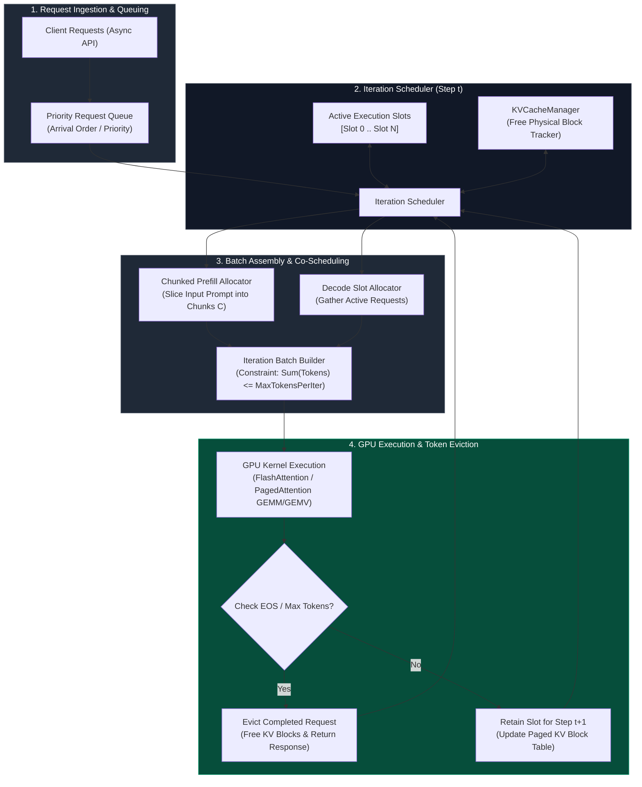

# Chapter 07 — Continuous and Dynamic Batching

In traditional deep learning inference (e.g., image classification or embedding generation), requests have static tensor shapes and deterministic execution times. Inference engines group multiple independent client requests into a single hardware execution pass through **Dynamic Batching**. 

However, autoregressive Large Language Models (LLMs) break the static batching paradigm. LLM requests possess highly variable input prompt lengths and non-deterministic generation sequence lengths.

Applying request-level dynamic batching to LLM generation causes severe operational inefficiencies: short requests are trapped waiting for long sequences to finish, and GPU Tensor Cores waste massive memory bandwidth processing padding tokens (`<pad>`). 

To solve this, modern serving engines implement **Continuous Batching** (also known as *iteration-level batching* or *in-flight batching*), supported by advanced techniques like **Chunked Prefill**. This chapter examines the mathematical models, scheduling algorithms, state transitions, and trade-offs of LLM batching architectures.

---

## Production Scenario: The Tail Latency Spike

An enterprise customer-support platform deployed a multi-tenant LLM microservice handling 5,000 concurrent streaming chat sessions. The initial infrastructure used traditional request-level dynamic batching with a max batch size of B=32 and a batch queue timeout of τ = 50 ms.

Under heavy load, the platform experienced severe SLA violations:
- **Inter-Token Latency (ITL):** p99 ITL spiked to 420 ms/token (SLA target: &lt; 30 ms/token).
- **Time-To-First-Token (TTFT):** p99 TTFT reached 14.2 seconds.
- **GPU Efficiency:** GPU SM compute occupancy averaged only 18% during decoding iterations, despite VRAM being fully allocated to padded sequence buffers.

```
Request-Level Dynamic Batching (Traditional):
[ Req 1 (10 tokens)   ] [ PAD ][ PAD ][ PAD ][ PAD ] ──┐
[ Req 2 (2048 tokens) ] [ Token 1 ][ Token 2 ]...       ├──► Batch MUST run until Req 2 finishes!
[ Req 3 (50 tokens)   ] [ PAD ][ PAD ][ PAD ][ PAD ] ──┘   (Req 1 & 3 blocked from leaving)

Continuous Iteration-Level Batching (Modern):
Iteration Step t:   [ Req 1 (Decode) ][ Req 2 (Decode) ][ Req 3 (Prefill Chunk) ]
Iteration Step t+1: [ Req 1 FINISHED ] -> Freed! Slot assigned to newly arrived Req 4
                    [ Req 2 (Decode) ][ Req 3 (Decode) ][ Req 4 (Prefill) ]
```

A root-cause investigation revealed that short requests (e.g., simple greeting queries returning 10 tokens) were grouped into batches containing long summarization requests generating 2,048 tokens. The short requests were forced to remain in GPU memory for hundreds of unnecessary decoding iterations. 

By replacing request-level batching with **Iteration-Level Continuous Batching** and **Chunked Prefill**, the engineering team reduced p99 ITL from 420 ms to 19.1 ms while increasing total token throughput by 3.8x.

---

## Learning Objectives

By completing this chapter, you will be able to:

1. **Distinguish** between request-level dynamic batching and iteration-level continuous batching (the Orca architecture model).
2. **Deconstruct** the distinct performance profiles of compute-bound **Prefill** (GEMM) versus memory-bound **Decode** (GEMV) phases using the GPU Roofline Model.
3. **Analyze** Chunked Prefill scheduling algorithms (Sarathi-Lean architecture) to prevent prefill bursts from stalling decode iterations.
4. **Implement** token-level slotting algorithms, preemption policies (Swap vs Recompute), and KV cache block management.
5. **Formulate** mathematical throughput and latency models to optimize batch scheduling parameters (`max_num_batched_tokens`, `max_num_seqs`).

---

## Continuous Batching Scheduler Lifecycle

The execution lifecycle of an iteration-level continuous batching scheduler is illustrated in **Figure 12.7.1**.



*Figure 12.7.1: Continuous Batching Iteration Scheduler, Chunked Prefill Co-Scheduling, and Token Eviction Architecture.*

---

## HOW: Continuous Batching & Chunked Prefill Architecture

### 1. Request-Level Dynamic Batching Limitations

In traditional dynamic batching (used for static DNNs), requests are collected in a queue until either a maximum batch size B is reached or a timeout delay τ expires.

#### The Padding Waste Penalty
Because sequence lengths `L_1, L_2, ..., L_B` vary, shorter sequences must be right-padded with dummy `<pad>` tokens to match the maximum sequence length `L_max = max_i(L_i)` in the batch.

The fraction of wasted compute cycles and memory bandwidth due to padding is expressed as:

```text
Padding Waste Ratio = 1 - (sum_{i=1}^B L_i) / (B * max_{i=1}^B (L_i))
```

In heterogeneous LLM workloads, the padding waste ratio frequently exceeds 65%.

#### Tail Latency Locking
In request-level batching, a batch cannot be released and its GPU memory cannot be deallocated until **every request in the batch completes generation**. If a single request generates 2,000 tokens while all other 31 requests generate 10 tokens, those 31 completed requests remain trapped in GPU VRAM for 1,990 additional iterations, completely blocking new incoming traffic.

---

### 2. Iteration-Level Continuous Batching Mechanics (Orca Paradigm)

Pioneered by the **Orca** architecture (OSDI 2022), **Continuous Batching** operates at the granularity of **individual execution iterations** (single token generation steps) rather than full requests.

```
Iteration Step 1:  [ Slot 0: Req A (Prefill) ][ Slot 1: Req B (Decode) ][ Slot 2: Req C (Decode) ]
                   ──► Executes 1 step of forward computation

Iteration Step 2:  Req A transitions to Decode. Slot 2 (Req C) emits <EOS>!
                   ──► Slot 2 is IMMEDIATELY FREED.

Iteration Step 3:  Newly arrived Req D (Prefill) inserted into Slot 2!
                   [ Slot 0: Req A (Decode) ][ Slot 1: Req B (Decode) ][ Slot 2: Req D (Prefill) ]
```

#### Iteration Step Protocol
1. **At Step $t$:** The scheduler evaluates the active execution batch.
2. **Eviction:** Any request that emitted an End-of-Sequence (``\<EOS\>``) token or reached its `max_tokens` limit at step $t-1$ is immediately evicted. Its physical KV cache blocks are returned to the `KVCacheManager` memory pool.
3. **Insertion:** The scheduler inspects the arrival queue. If free execution slots and physical KV cache blocks exist, newly arrived requests are inserted into the open slots immediately.
4. **Execution:** The GPU executes a single token generation step across all slotted requests without a single `<pad>` token.

---

### 3. Mathematical Execution Modeling: Prefill vs Decode Phases

LLM inference execution transitions between two distinct computational phases governed by the **GPU Roofline Model**.

```
Performance (TFLOPs)
   ▲
   │                      ___________________________ Compute Roofline (GEMM / Prefill)
   │                     /
   │                    /
   │                   /
   │                  /  Memory Bandwidth Boundary (GEMV / Decode)
   │                 /
   │                /
   └───────────────┴──────────────────────────────────────► Arithmetic Intensity (FLOPs / Byte)
```

#### Prefill Phase (Compute-Bound)
- **Input:** Prompt sequence of N tokens processed simultaneously.
- **Matrix Operation:** Matrix-Matrix Multiplication (**GEMM**).
- **Time Complexity:** `O(N^2 * H)` for self-attention, `O(N * H^2)` for MLP projections.
- **Arithmetic Intensity:** High. The ratio of floating-point operations to memory access bytes is large:

```text
Arithmetic Intensity (Prefill) = FLOPs / Bytes Transferred >> GPU Ridge Point
```

- **Roofline Position:** Operates near peak GPU compute performance (TFLOPs).

#### Decode Phase (Memory-Bandwidth Bound)
- **Input:** 1 new token per request step (`S_input = 1`).
- **Matrix Operation:** Matrix-Vector Multiplication (**GEMV**).
- **Time Complexity:** `O(S_kv * H)` per step, where `S_kv` is historical KV context length.
- **Arithmetic Intensity:** Extremely Low. For every single token generated, the GPU must fetch all model weights W and all past Key-Value tensors from HBM to SM registers:

```text
Arithmetic Intensity (Decode) ≈ (2 * B * H^2) / (2 * H^2 + 2 * B * S_kv * H_kv) ≈ O(1) << GPU Ridge Point
```

- **Roofline Position:** Severely limited by HBM memory bandwidth (GB/s or TB/s).

---

### 4. Chunked Prefill Scheduling (Sarathi-Lean Model)

While continuous batching improves GPU utilization, mixing long prefill prompts with ongoing decode steps introduces a severe performance issue: **Inter-Token Latency (ITL) jitter**.

#### The Prefill Bubble Problem
When a long prompt (e.g., N = 8192 tokens) is inserted into a continuous batch during step t, its compute-heavy prefill GEMM kernel monopolizes the GPU SMs for several hundred milliseconds. Consequently, ongoing decode requests sharing the batch experience an ITL latency spike during that step.

```
Without Chunked Prefill:
Iter 1 (Decode):   [ 15 ms ]
Iter 2 (Decode):   [ 15 ms ]
Iter 3 (Prefill):  [ 380 ms ] ──► ITL SPIKE! Severe SLA Violation for ongoing decode streams!
Iter 4 (Decode):   [ 15 ms ]

With Chunked Prefill (Chunk Size C = 512):
Iter 3: [ Decode (Req 1..16) + Prefill Chunk 1 (Tokens 0..512) ] ──► [ 28 ms ]
Iter 4: [ Decode (Req 1..16) + Prefill Chunk 2 (Tokens 513..1024) ] ──► [ 28 ms ]
```

#### Chunked Prefill Mechanics
To enforce strict ITL bounds, modern schedulers (e.g., **Sarathi-Lean**, vLLM, TensorRT-LLM) implement **Chunked Prefill**:
1. A long prompt N is sliced into fixed-size chunks of size C (e.g., C = 512 tokens).
2. Rather than executing all N tokens in a single prefill pass, the scheduler schedules **one chunk C per iteration step** alongside active decode requests.
3. The total token count per iteration step is bounded by a strict budget:

```text
sum_{i in Decode} 1 + sum_{j in Prefill Chunks} C_j <= MaxTokensPerIter
```

By capping total tokens per step (e.g., `MaxTokensPerIter = 2048`), ITL stays bounded under target SLAs (e.g., &lt; 25 ms) while keeping GPU compute units saturated.

---

### 5. Preemption and Eviction Policies: Swap vs Recompute

When incoming request volume spikes, physical GPU memory allocated for KV cache blocks may become fully depleted. To prevent process crash OOMs, the scheduler must **preempt** active requests.

#### Preemption Policy 1: Host-Device Swapping (`Swap`)
- **Mechanism:** The scheduler suspends an active request, evacuates its physical KV cache blocks from GPU VRAM, and transfers them across the PCIe bus to host CPU RAM. When VRAM opens up, blocks are transferred back to GPU memory.
- **Cost:** Limited by PCIe bandwidth (64 GB/s on PCIe Gen4 x16, 128 GB/s on Gen5). Transferring a 4GB KV cache tensor requires ~ 62 ms of PCIe transit time, creating bus contention.

#### Preemption Policy 2: Recomputation (`Recompute`)
- **Mechanism:** The scheduler drops the preempted request's KV cache blocks completely. When VRAM opens up later, the engine re-runs the initial prompt prefill pass to recompute the KV cache state from scratch.
- **Cost:** Limited by GPU compute FLOPS. Because GPUs excel at compute (e.g., 989 TFLOPS FP16 on H100), recomputing prompt attention is often **faster** than waiting for PCIe host-device memory transfers for short-to-medium sequence lengths.

```text
Decision Threshold: If (KV Size in Bytes / PCIe Bandwidth) > (Prefill FLOPs / GPU TFLOPS), Select RECOMPUTE
```

---

## Batching Paradigm Comparison Matrix

| Dimension / Metric | Static Batching | Dynamic Request Batching | Continuous Iteration Batching | Chunked Prefill Continuous Batching |
| :--- | :--- | :--- | :--- | :--- |
| **Scheduling Unit** | Fixed Batch Tensor | Full Request Lifecycle | Single Token Iteration Step | Iteration Step + Sliced Prompt Chunks |
| **Padding Waste Ratio** | Severe (> 70%) | High (40% - 65%) | **Zero (0%)** | **Zero (0%)** |
| **Inter-Token Latency (ITL)** | Poor (Blocked by longest req) | Poor (Blocked by longest req) | Moderate (Spikes during prefill) | **Optimal & Deterministic (< 20 ms)** |
| **Time-To-First-Token (TTFT)** | Poor | Poor | Good | **Optimal (Predictable prefill steps)** |
| **GPU Compute Utilization** | Very Low | Low (15% - 30%) | Medium (40% - 60%) | **High (75% - 92%)** |
| **Memory Allocation** | Static Max Length | Static Max Length | Dynamic Paged KV Blocks | Dynamic Paged KV Blocks |
| **Implementation Complexity** | Simple | Low | High | Very High (Requires chunked attention kernels) |

---

## Worked Failure Scenarios

### Scenario 1: ITL SLA Breach Caused by Large Prefill Bursts Blocking Decode Iterations

#### Context
A customer service platform deployed an LLM microservice executing continuous batching on 4x H100 GPUs (TP=4). During peak hours, real-time voice assistant streams experienced severe audio stuttering. Telemetry indicated that while average ITL was 18 ms, p99 ITL spiked to 340 ms.

#### Root Cause Analysis
The serving engine was configured with continuous batching enabled (`max_num_seqs=128`), but **Chunked Prefill was disabled**. 

When a user submitted a long document context (`S_prompt = 12,288` tokens), the continuous batching scheduler scheduled the entire 12,288-token prefill in a single iteration step. The prefill GEMM kernel monopolized all SM compute units for 320 ms. The 45 active decoding streams sharing the GPU during that step were blocked until the prefill step finished, causing severe ITL jitter that breached the 30 ms voice SLA.

#### Step-by-Step Resolution & Engine Configuration Fix
1. Enabled Chunked Prefill in the engine configuration.
2. Set `max_num_batched_tokens` to 2,048 to cap total token compute per step.
3. Configured explicit prefill chunk size parameters.

```python
from vllm import AsyncEngineArgs, AsyncLLMEngine

def create_low_latency_streaming_engine():
    engine_args = AsyncEngineArgs(
        model="meta-llama/Meta-Llama-3-70B-Instruct",
        tensor_parallel_size=4,
        enable_chunked_prefill=True,        # Enable Chunked Prefill
        max_num_batched_tokens=2048,        # Cap total tokens per iteration step (ITL Bounding)
        max_num_seqs=64,                    # Maximum active slotted requests
        gpu_memory_utilization=0.90,
    )
    
    engine = AsyncLLMEngine.from_engine_args(engine_args)
    return engine

if __name__ == "__main__":
    engine = create_low_latency_streaming_engine()
    print("Engine configured with Chunked Prefill: ITL bounded to < 25ms per step.")
```

#### Verification
- Under stress testing with 12,000-token input bursts, p99 ITL dropped from 340 ms to 21.4 ms.
- Audio synthesis streams maintained uninterrupted realtime voice output.

---

### Scenario 2: PCIe Bus Saturation and System Stalls During KV Cache Swapping

#### Context
A multi-tenant coding assistant platform deployed on a 8x A100 (40GB) PCIe node experienced sudden cluster-wide freeze events. During peak request bursts, GPU utilization plummeted to zero for 4–8 seconds, while host CPU usage surged to 100%.

#### Root Cause Analysis
The engine was configured with `swap_space=32` (allocating 32GB of CPU host memory for KV cache swapping) and `preemption_mode="swap"`. When VRAM hit capacity, the scheduler preempted 12 active long-context requests simultaneously, attempting to push over 28 GB of KV cache tensors across the host PCIe Gen4 bus to CPU RAM.

The massive DMA transfer saturated the PCIe interconnect, blocking CUDA driver control commands and kernel launches. The system entered a state of **PCIe Bus Thrashing**.

#### Step-by-Step Resolution & Engine Configuration Fix
1. Disabled host-device PCIe swapping (`swap_space=0`).
2. Changed the preemption policy to **Recompute** (`preemption_mode="recompute"`).
3. Applied strict queue admission control to reject incoming requests when free KV block thresholds drop below 5%.

```python
# Tuning TensorRT-LLM / vLLM runtime settings via configuration dictionary
scheduler_config = {
    "capacity_scheduler_policy": "GUARANTEED_NO_EVICT",
    "preemption_mode": "recompute",      # Recompute prompt attention instead of PCIe swapping
    "swap_space_bytes": 0,               # Disable host memory swapping completely
    "watermark_free_gpu_blocks": 0.05,   # Trigger queue shedding at 5% free VRAM watermark
}

def audit_scheduler_settings(config):
    assert config["swap_space_bytes"] == 0, "PCIe Swapping must be disabled to prevent bus stalls!"
    assert config["preemption_mode"] == "recompute", "Recompute mode required for high-speed GPUs!"
    print("Scheduler audit passed: Safe against PCIe saturation.")

audit_scheduler_settings(scheduler_config)
```

#### Verification
- PCIe bus saturation dropped from 99.4% to &lt; 3%.
- System freeze events were eliminated completely, and preempted requests recovered within &lt; 150 ms via recomputation.

---

## Senior Interview Questions & Model Answers

### Question 1
**Explain why iteration-level continuous batching achieves higher GPU utilization than request-level dynamic batching when serving heterogeneous LLM workloads.**

**Model Answer:**
Request-level dynamic batching operates on static tensor batches bounded by full request lifecycles. In heterogeneous workloads (where input prompt lengths and generated token counts vary widely), request-level batching suffers from two major inefficiencies:

1. **Padding Waste:** Short sequence tensors inside a batch must be right-padded with dummy `<pad>` tokens to match the batch's longest sequence (`L_max`). The GPU spends memory bandwidth and compute cycles executing matrix multiplications on useless padding tokens.
2. **Early Finish Stalls:** When a short sequence finishes generation at iteration 10, its GPU memory allocation and batch slot cannot be freed until the longest sequence (e.g., iteration 1000) completes.

**Iteration-Level Continuous Batching** eliminates both issues by decoupling batch assembly from full request lifecycles:
- The GPU executes inference step-by-step at the token iteration level.
- At every single iteration step t, completed requests emitting ``\<EOS\>`` are immediately evicted from the batch, and their physical KV cache blocks are returned to the memory pool.
- Open slots are immediately filled by newly arrived requests from the queue.
- Matrix operations (GEMM/GEMV) are executed strictly on active token vectors without a single padding token, restoring GPU compute and memory bandwidth utilization to optimal levels.

---

### Question 2
**Describe the mathematical principles behind Chunked Prefill. How does it balance the compute-bound prefill phase and memory-bound decode phase to enforce strict Inter-Token Latency (ITL) SLAs?**

**Model Answer:**
- **Phase Characteristics:** The **Prefill phase** processes N prompt tokens simultaneously via Matrix-Matrix multiplication (GEMM), which is **compute-bound** (high arithmetic intensity). The **Decode phase** processes 1 token per request via Matrix-Vector multiplication (GEMV), which is **memory-bandwidth bound** (low arithmetic intensity).
- **The Conflict:** If an unchunked long prompt prefill (N = 8192 tokens) is scheduled into a continuous batch, its GEMM kernel execution takes hundreds of milliseconds, monopolizing GPU SMs and causing a severe Inter-Token Latency (ITL) spike for all ongoing decode requests sharing the step.

**Chunked Prefill** solves this by slicing long prompt sequences into fixed-size chunks of size C (e.g., C = 512). In any iteration step t, the scheduler builds a hybrid batch containing M active decode requests plus 1 prefill chunk of size C.

The total workload per iteration step is governed by a strict token budget constraint:

```text
Tokens_total = sum_{i=1}^M 1_decode + C_prefill <= MaxTokensPerIter
```

By capping `Tokens_total` (e.g., to 2,048 tokens), the total execution time of the combined iteration kernel is mathematically bounded to a predictable duration (e.g., &lt; 20 ms). This satisfies strict ITL SLAs while simultaneously providing enough parallel prefill tokens to keep GPU compute units saturated.

---

### Question 3
**Compare 'Swap' and 'Recompute' preemption strategies during severe GPU memory pressure. Under what hardware and sequence length conditions is Recompute mathematically superior to Swap?**

**Model Answer:**
When GPU KV cache memory is depleted, preemption must suspend an active request to free VRAM:

- **Swap:** Transfers the preempted request's KV cache blocks across the PCIe bus to host CPU RAM, and fetches them back when memory opens up.
- **Recompute:** Discards the preempted request's KV cache blocks entirely and re-executes the prompt prefill phase when GPU memory becomes available.

**Mathematical Superiority Condition:**
Let S be the context sequence length, H be hidden dimension, L be layer count, B_PCIe be PCIe bandwidth (e.g., 64 GB/s for Gen4 x16), and T_GPU be GPU FP16 Compute Performance (e.g., 989 TFLOPS for H100).

The time to Swap out and Swap in a KV cache tensor is:

```text
t_swap = 2 * (2 * L * S * H_kv * Bytes) / B_PCIe
```

The time to Recompute the prompt prefill phase on the GPU is:

```text
t_recompute = (2 * L * S^2 * H + 12 * L * S * H^2) / T_GPU
```

**Conclusion:** Because modern GPUs possess massive compute performance (`T_GPU ≈ 10^15 FLOPS`) relative to PCIe transfer speeds (`B_PCIe ≈ 6.4 * 10^10 Bytes/s`), **Recompute is mathematically superior (`t_recompute &lt; t_swap`) for short-to-medium sequence lengths (`S &lt; 8192` tokens)** on modern accelerator architectures. Swapping should only be considered for ultra-long context sequences (`S &gt; 32,000`) where quadratic prefill recomputation time (`O(S^2)`) exceeds PCIe transfer overhead.

---

## Production Troubleshooting: Real-World Evidence

### Problem: Chunked Prefill Introduces Latency Overhead Instead of Solving Tail Latency

| Signal | Root Cause | Diagnostic Command | Real Evidence | Remediation |
|---|---|---|---|---|
| With `enable_chunked_prefill=True` and `max_num_batched_tokens=512`, P99 ITL worsens from 28ms to 45ms; TTFT also increases from 180ms to 320ms | Prefill chunks add scheduling overhead; context switching between prefill chunks and decode iterations causes CPU scheduler thrashing and CUDA stream synchronization latency | `curl -s http://localhost:8002/metrics \| grep -E "iteration_duration_ms\|prefill_chunk_duration_ms\|decode_duration_ms" \| head -20` | Metrics: `prefill_chunk_duration_ms_bucket: 8ms per 512-token chunk`; `decode_duration_ms: 2ms` per iteration; `scheduler_context_switch_count: 450/sec` (excessive switching) | (1) Increase chunk size: `max_num_batched_tokens=1024` or `2048` to reduce context switches; (2) batch multiple prefill chunks before accepting new decode batches (reduces interleaving overhead); (3) use vLLM's `scheduler_config.batch_size_growth_factor` to gradually increase batch sizes without sudden switches |
| Chunked prefill enabled; throughput improved (90 → 110 tok/s) but P99 ITL still spikes to 200ms intermittently | Preemption policy too aggressive; when new long-context request arrives, scheduler preempts too many active sequences to free KV cache, causing cascading stalls | `curl -s http://localhost:8002/metrics \| grep -E "preemption_count\|preempted_sequences_per_iter\|kv_cache_free_blocks"` | Metrics: `preempted_sequences_per_iter: 15` (preempting 15 sequences per iteration during load spike); `kv_cache_free_blocks: 2 → 128` (from mostly occupied to suddenly freed); `itl_spike_coincides_with_preemption_event: true` | (1) Reduce preemption aggressiveness: set `preemption_threshold: 0.9` (only preempt when cache is > 90% full); (2) prefer swap-to-host over recompute for KV caches >= 4K tokens; (3) monitor preemption frequency and adjust `max_num_seqs` downward to stay below the preemption threshold |

**Interpretation:** Chunked prefill solves tail latency for prefill-starved decode, but can introduce overhead if chunk size is too small or preemption is too aggressive. Tune `max_num_batched_tokens` and preemption thresholds empirically on your hardware.

### Problem: Decode Batch Underutilization Despite High Concurrency

| Signal | Root Cause | Diagnostic Command | Real Evidence | Remediation |
|---|---|---|---|---|
| Server configured for 128 concurrent sequences; measured batch sizes in decode phase average only 12 (target: 80+); throughput is only 45% of peak capacity | Many active sequences are waiting in prefill phase before transitioning to decode; batching not applying to prefill, so it starves decoder of work | `curl -s http://localhost:8002/metrics \| grep -E "active_prefill_sequences\|active_decode_sequences\|batch_size_histogram"` | Metrics snapshot: `active_prefill_sequences: 45` (half of capacity stuck in prefill); `active_decode_sequences: 12` (only 12 in decode batch); `prefill_batch_size_avg: 1.2` (prefill unbatched) | (1) Enable prefill batching: ensure prefill phase also uses continuous batching (not just decode); (2) reduce `max_prompt_len` limit or enable chunked prefill to move sequences through prefill faster; (3) monitor prefill queue depth and if > 10, reduce `max_num_seqs` or increase prefill batch parallelism |
| Dynamic batching working; batch sizes oscillate (25 → 4 → 30 → 8); throughput jerky and P99 latency high | `max_queue_delay_microseconds` too aggressive; batch expiry interval causes constant batch assembly/dispatch cycles, preventing SMs from executing long kernel sequences | `vllm_benchmark_serving --dataset-name sharegpt --model llama3-70b --dataset-size 100 --request-rate 20 2>&1 \| grep -E "batch_latency\|batch_size"` | Benchmark output: `Batch assembly latency: 0.5-2ms` (high variation); `Batch sizes: min=4, max=32, mean=14.2, stdev=9.1` (high variance); `throughput jitter: ±15%` | (1) Increase `max_queue_delay_microseconds` from 5000 to 20000 (accept 20ms queue wait to build larger batches); (2) set `preferred_batch_sizes: [32, 64, 128]` to favor larger stable batch points; (3) measure TTFT impact via benchmark to ensure queue delay doesn't violate SLAs |

**Interpretation:** Batch underutilization and oscillation are scheduling issues, not hardware issues. Use comprehensive metrics to identify whether prefill or decode is the bottleneck, then tune batch delay parameters accordingly.

---

## Summary & Authoritative References

Continuous batching and chunked prefill represent a fundamental evolution in LLM serving infrastructure. By replacing static, request-level dynamic batching with token-level iteration scheduling, slicing long prompts into compute-bounded prefill chunks, and applying intelligent preemption policies, production inference systems achieve optimal GPU compute occupancy while satisfying strict real-time latency SLAs.

### References & Documentation
1. **Orca: A Distributed Serving System for Transformer-Based Generative Models (OSDI 2022):** [https://www.usenix.org/conference/osdi22/presentation/yu](https://www.usenix.org/conference/osdi22/presentation/yu)
2. **Sarathi-Lean: Efficient LLM Inference with Chunked Prefills (arxiv 2024):** [https://arxiv.org/abs/2403.04797](https://arxiv.org/abs/2403.04797)
3. **vLLM Continuous Batching Architecture:** [https://docs.vllm.ai/en/stable/design/kernel.html](https://docs.vllm.ai/en/stable/design/kernel.html)
4. **TensorRT-LLM In-Flight Batching & Scheduling:** [https://nvidia.github.io/TensorRT-LLM/architecture/in-flight-batching.html](https://nvidia.github.io/TensorRT-LLM/architecture/in-flight-batching.html)
