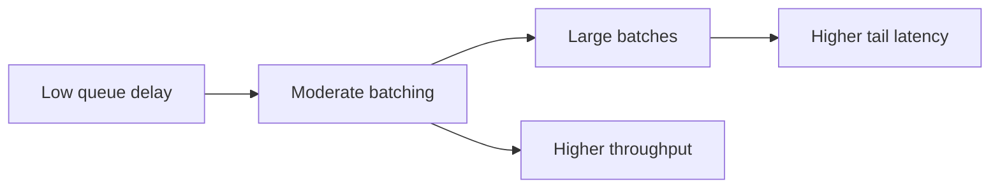

# Continuous and Dynamic Batching

Batching combines requests so the GPU performs more useful work per launch. The gain comes with queue delay and fairness decisions.

## Dynamic Batching

Dynamic batching waits briefly for compatible requests, forms a batch, and executes it. It is effective for models with similar-shaped requests and bounded latency budgets.

## Continuous Batching

Continuous batching admits and retires sequences over time rather than waiting for an entire static batch to finish. This is valuable for LLM requests with variable output lengths.

## Trade-off Curve

## Fairness

Long prompts or generations can monopolize memory and scheduler attention. Production systems need admission limits, request classes, and cancellation behavior.

## Troubleshooting

**Symptom:** throughput rises while p99 latency worsens.

**Resolution:** reduce maximum queue delay, separate request classes, cap context or output length, and tune concurrency against memory.
