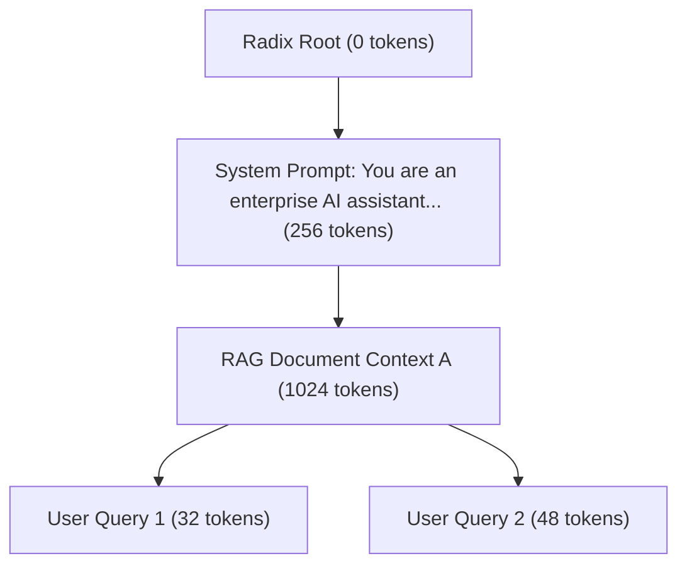

# KV Cache Memory and Concurrency

In Large Language Model (LLM) serving, GPU memory (VRAM) is not merely a static bucket for model weights; it is the primary dynamic asset that dictates request concurrency, maximum context length, and system throughput. While model weights remain fixed in size during inference, the Key-Value (KV) cache grows dynamically with every generated token across every active request. 

Improper KV cache capacity planning leads directly to catastrophic production failures: sudden Out-Of-Memory (OOM) kernel panics, request preemptions, thrashing between host CPU and GPU RAM, and severe tail latency spikes (p99 Time to First Token and Inter-Token Latency). This chapter provides the mathematical foundations, allocation mechanics, prefix caching strategies, and incident playbooks required to architect high-concurrency LLM inference platforms.

---

## Learning Objectives

By completing this chapter, you will be able to:
- Compute exact KV cache memory footprints across Multi-Head Attention (MHA), Grouped-Query Attention (GQA), and Multi-Query Attention (MQA) architectures.
- Analyze the memory mechanics of PagedAttention, virtual-to-physical block tables, and block allocation strategies to eliminate external memory fragmentation.
- Implement Prefix Caching (Radix Trees) and Chunked Prefill to optimize prompt prefill latency and elevate cache hit rates.
- Formulate concurrency capacity planning models balancing GPU VRAM headroom, max sequence length, and tensor parallel sharding.
- Execute diagnostic playbooks for KV cache OOM crashes, preemption storms, and cache thrashing using DCGM and Prometheus telemetry.

---

## Mathematical Foundations of KV Cache Memory

During the autoregressive decode phase, an LLM generates tokens sequentially. To compute self-attention for token `t`, the transformer layer requires key and value tensors for all previous tokens `1 ... t-1`. Recomputing key and value projections for past tokens at every step would yield `O(N^2)` compute complexity per token. The **KV Cache** trades VRAM memory capacity for computational speed by storing past key and value states in GPU memory.

### Generic KV Cache Equation

For a standard model operating with `L` transformer layers, sequence length `S`, hidden dimension `D`, and element precision in bytes `P` (e.g., FP16 = 2 bytes, FP8 = 1 byte):

```text
KV Cache Memory (Bytes) = 2 × L × H_kv × D_head × S × P
```

Where:
- `2`: Accounts for both Key and Value tensors.
- `L`: Total number of transformer layers.
- `H_kv`: Number of Key-Value attention heads.
- `D_head`: Dimension per head (`D_head = D_model / H_query`).
- `S`: Sequence length (sum of prompt tokens + generated output tokens).
- `P`: Precision size in bytes (FP32 = 4, FP16/BF16 = 2, FP8 = 1, INT4 = 0.5).

```
+-----------------------------------------------------------------------------------+
|                            GPU VRAM ALLOCATION MODEL                              |
+------------------------------------+----------------------------------------------+
| Model Weights (Static)             | e.g., 70B @ FP16 = 140 GB                    |
+------------------------------------+----------------------------------------------+
| Runtime Workspace / Activation Buffers | e.g., TensorRT/PyTorch Workspace = 4-8 GB|
+------------------------------------+----------------------------------------------+
| KV Cache Memory Pool (Dynamic)     | Remaining VRAM (Paged Blocks for Concurrency)|
+------------------------------------+----------------------------------------------+
```

### Architectural Variants: MHA vs GQA vs MQA

The memory scaling of the KV cache is governed by the ratio of Query heads (`H_q`) to Key-Value heads (`H_kv`):

| Attention Architecture | Key-Value Heads (`H_kv`) | Memory Ratio relative to MHA | Example Models |
|---|---|---|---|
| **Multi-Head Attention (MHA)** | `H_kv = H_q` | `1.0x` (100%) | Llama-1, GPT-3 |
| **Grouped-Query Attention (GQA)** | `H_kv = H_q / G` (where `G` is group size) | `(1/G)x` (typically `0.125x`) | Llama-2-70B, Llama-3-8B/70B, Mistral-7B |
| **Multi-Query Attention (MQA)** | `H_kv = 1` | `(1/H_q)x` (typically `0.015x`) | Falcon-40B, Command-R |

#### Worked Mathematical Example: Llama-3-70B

Let us calculate the KV cache memory footprint for **Llama-3-70B** operating at BF16 precision (`P = 2` bytes).
- Architecture Parameters: `L = 80` layers, `H_q = 64` query heads, `H_kv = 8` KV heads (GQA with ratio 8:1), `D_model = 8192` which implies `D_head = 8192 / 64 = 128`.

**Step 1: KV Cache per Token per Sequence**
```text
M_token = 2 × 80 × 8 × 128 × 2 bytes = 327,680 bytes = 320 KiB / token
```

**Step 2: Footprint for standard context length (`S = 4096` tokens)**
```text
M_seq_4k = 320 KiB × 4096 = 1,310,720 KiB ≈ 1.25 GiB per sequence
```

**Step 3: Footprint for long context (`S = 128,000` tokens)**
```text
M_seq_128k = 320 KiB × 128,000 = 40,960,000 KiB ≈ 39.06 GiB per sequence
```

> **Key Takeaway:** Under MHA (64 KV heads), a single 128k context request would require **312.5 GB** of KV cache—exceeding the entire memory of an 80GB H100 GPU. GQA reduces this to **39.06 GB**, making 128k context serving feasible across tensor-parallel GPU clusters.

---

## Memory Allocation Paradigms: Contiguous vs PagedAttention

### Contiguous Allocation and Memory Waste

Early LLM serving frameworks allocated KV cache as contiguous tensor buffers in GPU RAM based on the maximum sequence length (`S_max`).

```mermaid
flowchart TD
    subgraph Contiguous Memory Allocation (Naive)
        R1["Request 1: Reserved 4096 Tokens"]
        A1["Used: 512 Tokens"]
        W1["Internal Fragmentation: 3584 Unused Tokens"]
        R1 --> A1
        R1 --> W1
    end
    subgraph PagedAttention Memory Allocation (vLLM)
        B1["Logical Block 0"] --> PB4["Physical Block 14"]
        B2["Logical Block 1"] --> PB9["Physical Block 92"]
        B3["Logical Block 2"] --> PB1["Physical Block 03"]
    end
```

Contiguous allocation suffers from three severe forms of memory inefficiency:
1. **Reserved Over-allocation:** Allocating space for `S_max` (e.g., 4096 tokens) when a request only generates 256 tokens wastes >90% of allocated memory.
2. **Internal Fragmentation:** Memory reserved for active sequences remains locked even if output generation terminates early.
3. **External Fragmentation:** Dynamic allocation and deallocation of variable-sized sequence buffers fragments physical VRAM, preventing new requests from finding contiguous slots.

In total, traditional contiguous serving frameworks waste **60% to 80%** of available GPU RAM.

### PagedAttention Mechanics

Inspired by virtual memory paging in operating systems, **PagedAttention** (pioneered by vLLM) partitions the KV cache into fixed-size physical memory blocks (typically 16 or 32 tokens per block).

```
LOGICAL SEQUENCE (Request A)
+----------------+----------------+----------------+
| Block 0 (0-15) | Block 1 (16-31)| Block 2 (32-47)|
+-------+--------+-------+--------+-------+--------+
        |                |                |
        v                v                v
BLOCK TABLE (Request A)
+----------------+----------------+----------------+
| Logical Block  | Physical Block | Status         |
+----------------+----------------+----------------+
| 0              | 104            | Full           |
| 1              | 12             | Full           |
| 2              | 87             | Active (3/16)  |
+----------------+----------------+----------------+
        |                |                |
        +----------------+----------------+
                         |
                         v
PHYSICAL GPU MEMORY POOL (Non-contiguous Blocks)
+------------+------------+------------+------------+
| Phys Block | Phys Block | Phys Block | Phys Block |
| 12 (Req A) | 03 (Req B) | 87 (Req A) | 104(Req A) |
+------------+------------+------------+------------+
```

1. **Virtual Block Table:** Each request maintains a lookup table mapping logical sequence block IDs to physical block addresses in GPU RAM.
2. **Dynamic Allocation:** Blocks are allocated on demand as tokens are generated. When a block fills up (e.g., token 16), the engine allocates a new physical block from the free block pool.
3. **Near-Zero Waste:** External fragmentation is completely eliminated. Internal fragmentation is restricted strictly to the final incomplete block of a sequence (less than 4% total waste).

---

## Prefix Caching and Chunked Prefill

### Radix Tree Prefix Caching

In production applications (e.g., multi-turn chat, RAG workflows, agentic tool loops), multiple requests frequently share identical prefix tokens (system prompts, vector database contexts, or past conversation history).



**Prefix Caching** maintains physical KV cache blocks in a **Radix Tree** structure across requests:
- When a new request arrives, the engine performs a prefix match on the Radix Tree.
- Cached blocks are reused immediately by increasing their reference count in the Block Table without recomputing self-attention.
- **Latency Impact:** Prefill compute for shared prompt tokens drops from `O(N)` GPU matrix multiplications to an `O(1)` memory lookup, reducing Time to First Token (TTFT) by up to **90%**.

### Chunked Prefill

When long prompts arrive (e.g., 32,000 tokens), processing the prompt in a single monolithic prefill step monopolizes GPU compute execution units for hundreds of milliseconds. This starves active decoding requests, causing severe spikes in Inter-Token Latency (ITL).

**Chunked Prefill** breaks large prompt prefills into smaller chunks (e.g., 512 or 1024 tokens) and co-batches prompt chunks alongside decoding steps in the same iteration.

```
Without Chunked Prefill:
Iteration 1: [Long Prefill 8192 Tokens] ---> ITL Spike: 250ms for decoding requests
Iteration 2: [Decode Step 1]

With Chunked Prefill (max_num_batched_tokens = 2048):
Iteration 1: [Prefill Chunk 1: 1536 Tokens] + [Decode Step 1: 512 Requests] ---> ITL: 22ms
Iteration 2: [Prefill Chunk 2: 1536 Tokens] + [Decode Step 2: 512 Requests] ---> ITL: 24ms
```

---

## Concurrency Capacity Planning Formula

To size an inference cluster, platform engineers must calculate maximum request concurrency (`C_max`) supported by GPU hardware under targeted SLO bounds.

### Step-by-Step VRAM Allocation Budget

```text
VRAM_total = VRAM_weights + VRAM_workspace + VRAM_kv_pool + VRAM_headroom
```

1. **Calculate Model Weight Footprint:**
   ```text
   VRAM_weights = (Parameters_in_Billions × Precision_Bytes) / Tensor_Parallel_Size
   ```
2. **Reserve Workspace/CUDA Overhead:**
   ```text
   VRAM_workspace ≈ 4.0 GB to 8.0 GB (PyTorch allocator, CUDA context, TRT engine buffers)
   ```
3. **Determine Available KV Cache Pool:**
   ```text
   VRAM_kv_pool = (VRAM_total × GPU_utilization_ratio) - VRAM_weights - VRAM_workspace
   ```
   *(where `GPU_utilization_ratio` is typically configured to 0.90 to leave 10% safety margin).*
4. **Compute Maximum Concurrent Active Sequences (`C_max`):**
   ```text
   C_max = VRAM_kv_pool / (KV_per_token × Avg_Seq_Len)
   ```

### Capacity Matrix across GPU Architectures

Below is a capacity planning matrix for **Llama-3-70B (GQA, BF16)** sharded across Tensor Parallelism (TP=4 or TP=8) for different sequence lengths (`S_avg`):

| Hardware Topology | Total VRAM | Weight Memory | Available KV Pool | `C_max` (`S=2048`) | `C_max` (`S=8192`) | `C_max` (`S=32768`) |
|---|---|---|---|---|---|---|
| **4x A100-80GB (TP=4)** | 320 GB | 140 GB | 140 GB | 218 requests | 54 requests | 13 requests |
| **8x A100-80GB (TP=8)** | 640 GB | 140 GB | 428 GB | 668 requests | 167 requests | 41 requests |
| **4x H100-80GB (TP=4)** | 320 GB | 140 GB | 140 GB | 218 requests | 54 requests | 13 requests |
| **8x H100-80GB (TP=8)** | 640 GB | 140 GB | 428 GB | 668 requests | 167 requests | 41 requests |

> **Note:** H100 GPUs deliver approximately 3x higher compute throughput (TFLOPS) than A100, enabling much faster generation per request, but total VRAM capacity limits the raw concurrent sequence bounds equally unless model weights are quantized (e.g., FP8 / INT4).

---

## Worked Failure Scenarios

### Worked Failure Scenario 1: Unbounded Context KV Cache OOM & GPU Worker Thrashing

#### Production Incident Context
During a promotional marketing campaign, a customer-facing assistant service experienced an influx of users pasting massive codebase files (averaging 28,000 tokens per prompt). The serving cluster consisted of 4x H100-80GB running vLLM with Llama-3-70B. Within 3 minutes of traffic bursting, GPU worker processes began crashing with CUDA out-of-memory errors, triggering Kubernetes pod crash loops.

#### Symptoms & Initial Metrics
- HTTP 500 internal server errors spiking to 42% of total traffic.
- Kubernetes pod restarts on inference deployment (`CrashLoopBackOff`).
- Prometheus alert firing: `VLLMGPUCacheResetsHigh`.

#### Evidence Gathering
The on-call SRE inspected the vLLM container engine logs and executed diagnostic commands:

```bash
# Check GPU memory and process status
nvidia-smi --query-gpu=timestamp,name,memory.total,memory.used,memory.free --format=csv -l 1

# Check vLLM engine live metrics endpoint
curl -s http://localhost:8000/metrics | grep -E "vllm:gpu_cache_usage_perc|vllm:num_requests"
```

**Broken Log Output:**
```text
2026-08-06T14:12:05.112Z [ERROR] vllm.engine.async_llm_engine: Error in engine loop:
torch.cuda.OutOfMemoryError: CUDA out of memory. Tried to allocate 1.42 GiB (GPU 2; 79.35 GiB total capacity; 75.12 GiB already allocated; 1.10 GiB free; 76.80 GiB reserved by PyTorch)
2026-08-06T14:12:05.118Z [CRITICAL] Ray worker process killed by SIGSEGV (Exit code 139)
```

**Telemetry Evidence:**
- `vllm:gpu_cache_usage_perc`: Hit `1.0` (100% saturation).
- `vllm:num_requests_running`: 64 active requests.
- `vllm:num_requests_waiting`: 142 queued requests.

#### Root Cause Analysis
The engine launch configuration lacked upper bounds on sequence lengths and batched tokens, and PyTorch memory headroom was configured aggressively:
1. `--gpu-memory-utilization` was set to `0.98`, leaving only 1.6 GB for CUDA context and workspace buffers.
2. `--max-model-len` was set to the default model maximum (`131072`), allowing incoming requests with 30k+ prompt tokens to consume thousands of physical PagedAttention blocks simultaneously.
3. `--enable-chunked-prefill` was set to `false`.

#### Resolution & Mitigation

1. Apply an emergency hotfix to vLLM container startup parameters:

```yaml
# Kubernetes Deployment Patch (vllm-args)
containers:
  - name: vllm-inference
    image: vllm/vllm-openai:v0.5.4
    args:
      - "--model"
      - "meta-llama/Meta-Llama-3-70B-Instruct"
      - "--tensor-parallel-size"
      - "4"
      - "--gpu-memory-utilization"
      - "0.90"               # Leave 10% VRAM headroom for PyTorch/CUDA workspace
      - "--max-model-len"
      - "16384"              # Restrict max sequence context
      - "--max-num-seqs"
      - "128"                # Limit max concurrent active sequences
      - "--enable-chunked-prefill"
      - "--max-num-batched-tokens"
      - "2048"
```

2. Implement admission control in API Gateway (Kong/Envoy) to reject prompts exceeding 12,000 tokens with HTTP 400 Bad Request before hitting the LLM cluster.

#### Verification & Clean Output
After deploying the patch, the service was re-tested under identical synthetic load using `vllm benchmark_serving`:

```bash
# Verify metrics stability under load
curl -s http://localhost:8000/metrics | grep -E "vllm:gpu_cache_usage_perc|vllm:num_requests_waiting"
```

**Clean Output:**
```text
vllm:gpu_cache_usage_perc{model="meta-llama/Meta-Llama-3-70B-Instruct"} 0.84
vllm:num_requests_waiting{model="meta-llama/Meta-Llama-3-70B-Instruct"} 12
vllm:num_requests_running{model="meta-llama/Meta-Llama-3-70B-Instruct"} 96
```

#### Prevention
- Set rigid `--gpu-memory-utilization` values (never exceeding 0.90 for multi-GPU setups).
- Enforce cluster-wide automated load testing with realistic context distributions prior to deployment.

---

### Worked Failure Scenario 2: Severe Prefix Cache Eviction Storm and CPU Swapping Thrashing

#### Production Incident Context
An enterprise multi-tenant customer platform running vLLM enabled CPU host memory swapping (`--swap-space 32`) to prevent OOM errors during peak hours. Shortly after enabling swapping, average Inter-Token Latency (ITL) degraded by 4,000%, increasing from 20ms/token to 850ms/token. Voice translation and interactive chatbots became unusable.

#### Symptoms & Initial Metrics
- Client-side p99 end-to-end response latency exceeded 45 seconds.
- GPU Utilization (`dcgm_gpu_utilization`) dropped to 18%, while PCIe bus TX/RX bandwidth (`dcgm_pcie_tx_throughput`) saturated at maximum capacity (64 GB/s on PCIe Gen5).
- vLLM metric `vllm:num_preempted_requests_total` rapidly incrementing.

#### Evidence Gathering
The engineer checked Prometheus metrics for vLLM block swapping:

```prometheus
# Query CPU cache block usage and preemptions
vllm:cpu_cache_usage_perc
rate(vllm:num_preempted_requests_total[5m])
```

**Diagnostic Telemetry:**
- `vllm:gpu_cache_usage_perc`: 99.8%
- `vllm:cpu_cache_usage_perc`: 88.4%
- `rate(vllm:num_preempted_requests_total[5m])`: 4.2 preemptions/sec.

#### Root Cause Analysis
When GPU VRAM filled completely, vLLM evicted active request block tables by **swapping physical blocks to host CPU system memory over the PCIe bus**. During subsequent decode steps for preempted requests, the engine had to pause execution, copy blocks back from host RAM to GPU RAM, and evict *other* active blocks to host RAM. This created a classic **thrashing loop**, where the PCIe bus became the main bottleneck while GPUs sat idle waiting for memory transfers.

#### Resolution & Mitigation

1. Disable CPU swapping entirely (`--swap-space 0`). In real-time serving, swapping to host RAM is never acceptable; requests should queue in the admission queue instead.
2. Enable automatic **Prefix Caching** (`--enable-prefix-caching`) to reuse common system prompts.
3. Increase block size from 8 tokens to 16 tokens to lower block management overhead.

**Corrected Launch Commands:**
```bash
python3 -m vllm.entrypoints.openai.api_server \
    --model meta-llama/Meta-Llama-3-8B-Instruct \
    --tensor-parallel-size 2 \
    --gpu-memory-utilization 0.92 \
    --block-size 16 \
    --enable-prefix-caching \
    --swap-space 0 \
    --max-num-seqs 256
```

#### Verification
Monitoring the preempted request rate showed an immediate drop to zero:

```text
vllm:num_preempted_requests_total 0
vllm:cpu_cache_usage_perc 0.00
vllm:gpu_cache_usage_perc 0.81
```
ITL latency returned to 18ms per token.

#### Prevention
- Always configure `--swap-space 0` for latency-critical production inferencing.
- Rely on queueing and rate-limiting at ingress rather than memory swapping.

---

## Prometheus Metrics and Alerting Rules

### Essential Telemetry Reference Table

| Prometheus Metric | Type | Description | Target Operational Threshold |
|---|---|---|---|
| `vllm:gpu_cache_usage_perc` | Gauge | Percentage of allocated GPU PagedAttention blocks currently in use | `&lt; 85%` nominal, alert at `> 95%` |
| `vllm:cpu_cache_usage_perc` | Gauge | Percentage of CPU swap space blocks in use | Should strictly be `0%` |
| `vllm:num_requests_waiting` | Gauge | Number of requests queued in the engine admission queue | `&lt; 10` nominal |
| `vllm:num_requests_running` | Gauge | Number of requests concurrently executing in GPU engine | Near `C_max` capacity |
| `vllm:num_preempted_requests_total` | Counter | Total count of requests preempted due to memory exhaustion | Must be `0` |
| `vllm:prompt_tokens_total` | Counter | Cumulative prefill tokens processed | Used for throughput calculation |

### Prometheus Alerting Rules Configuration

```yaml
groups:
  - name: vllm_kv_cache_alerts
    rules:
      - alert: LLMKVCacheSaturated
        expr: vllm:gpu_cache_usage_perc > 0.95
        for: 2m
        labels:
          severity: critical
        annotations:
          summary: "vLLM GPU KV Cache near saturation (>95%)"
          description: "GPU KV cache memory pool on {{ $labels.instance }} is at {{ $labels.value }}%. Risk of request preemptions and OOM."

      - alert: LLMRequestPreemptionsOccurring
        expr: rate(vllm:num_preempted_requests_total[2m]) > 0
        for: 30s
        labels:
          severity: critical
        annotations:
          summary: "vLLM Active Request Preemptions Detected"
          description: "Engine on {{ $labels.instance }} is preempting/swapping active sequences. ITL degradation occurring."
```

---

## Senior Interview Questions & Model Answers

### Question 1: How does Grouped-Query Attention (GQA) reduce KV cache memory consumption, and what is the exact math for a 70B model with context length S?

**Model Answer:**
Grouped-Query Attention (GQA) divides query heads into groups (`G`) that share a single Key-Value head. In Multi-Head Attention (MHA), every query head has a dedicated KV head (`H_kv = H_q`). In GQA, `H_kv = H_q / G`. 

For Llama-3-70B, `H_q = 64`, `H_kv = 8` (a 8:1 ratio), `L = 80` layers, and `D_head = 128`. Using 16-bit precision (`P = 2` bytes), the KV cache size per token across all layers is:
```text
M_token = 2 × 80 × 8 × 128 × 2 = 327,680 bytes = 320 KiB / token
```
For sequence length `S`, total memory per sequence is `320 KiB × S`.
Under MHA (`H_kv = 64`), the footprint would be `2.56 MiB / token` (8x larger). Thus, GQA reduces KV cache memory by **87.5%**, enabling 8x higher concurrency on identical GPU hardware.

---

### Question 2: Explain the internal architecture of PagedAttention. How does it resolve fragmentation issues compared to naive tensor allocation?

**Model Answer:**
PagedAttention solves memory fragmentation by borrowing virtual memory paging concepts from OS kernels. Naive serving pre-allocates static contiguous tensors based on worst-case maximum sequence length (`S_max`), causing massive internal fragmentation (unused space reserved for short requests) and external fragmentation (inability to reuse freed memory gaps).

PagedAttention breaks the KV cache into small, fixed-size physical blocks (e.g., 16 tokens). Each request has a **Logical Block Table** mapping logical sequence indices to arbitrary non-contiguous **Physical Blocks** in GPU RAM. 
- Blocks are allocated dynamically on demand as new tokens are decoded.
- Memory waste is reduced from 60–80% down to under 4% (limited only to the unfilled tokens of the very last block of a sequence).
- Freed blocks immediately return to a global free block pool, completely eliminating external memory fragmentation.

---

### Question 3: What is Chunked Prefill, and why is it necessary for stabilizing Inter-Token Latency (ITL) in multi-tenant LLM serving?

**Model Answer:**
In LLM inference, prefill (prompt processing) is compute-bound, whereas decode (token generation) is memory-bandwidth bound. Without chunked prefill, a long prompt arrival (e.g., 16,000 tokens) causes the engine to execute a massive prefill matrix multiplication step that monopolizes the GPU for hundreds of milliseconds. During this time, existing active decode requests cannot run, resulting in a severe Inter-Token Latency (ITL) spike.

Chunked Prefill mitigates this by slicing large prompts into smaller chunks (e.g., 512 or 1024 tokens) and co-batching a prompt chunk with decoding tokens from active sequences in the same GPU execution step. This caps the maximum time spent in any single iteration, keeping ITL predictable and meeting tight latency SLOs.

---

## Production Troubleshooting: Real-World Evidence

### Problem: PagedAttention Block Fragmentation Preventing Concurrency Growth

| Signal | Root Cause | Diagnostic Command | Real Evidence | Remediation |
|---|---|---|---|---|
| KV cache utilization = 62%; no requests rejected, but concurrent sequence count stalled at 32 (below target 64) | Block fragmentation; many requests finish with partially-filled final blocks (e.g., sequence of 1500 tokens uses 1536 tokens = 96 blocks with last block 12/16 tokens filled); freed blocks are fragmented, cannot accommodate new 16-block requests | `python3 -c "from vllm import get_engine; engine = get_engine(); print(engine.kv_cache_manager.get_fragmentation_report())"` | Fragmentation report: `Total blocks: 8192; Allocated blocks: 5120 (62.5%); Fragmented gaps: 847 blocks (10.3%); Longest free gap: 3 blocks (cannot fit 16-block request)` | (1) Reduce block size: `block_size=8` (from 16) to reduce fragmentation per sequence; (2) enable block recompaction: `defragment()` called on every nth request completion; (3) proactively reserve blocks for incoming requests using predictive allocation based on SLA requirements |
| After 8 hours of continuous serving, memory utilization climbs from 72% to 89%; OOM imminent despite total free blocks showing 25% | Memory leak in block reference counting or dangling block pointers not freed when sequences complete | `nvidia-smi \| head -3; curl -s http://localhost:8002/metrics \| grep -E "kv_cache_allocated_bytes\|kv_cache_freed_bytes" \| tail -5; dmesg \| grep -i "memory\|oom"` | Metrics: `kv_cache_allocated_bytes: 52.1 GB` (at 8h mark); `kv_cache_freed_bytes: 38.9 GB total` (only 38.9 GB ever freed despite many sequence completions); leaked ≈ 13 GB | (1) Add explicit block deallocation on sequence finish: confirm `block_table.clear()` is called; (2) enable memory audit logging: `--log-allocated-blocks` to trace block lifecycle; (3) restart inference engine weekly to clear accumulated fragmentation (operational workaround) |

**Interpretation:** PagedAttention fragmentation is inevitable at scale. Monitor block allocation metrics and enable defragmentation policies. Memory leaks indicate missing block cleanup on sequence completion—review engine shutdown code.

### Problem: Prefix Caching Hit Ratio Degraded After Enabling Chunked Prefill

| Signal | Root Cause | Diagnostic Command | Real Evidence | Remediation |
|---|---|---|---|---|
| Before chunked prefill: prefix cache hit ratio = 45%; after enabling: hit ratio drops to 8% | Chunked prefill breaks logical sequence prefixes into partial chunks; prefix matching operates on complete original sequences, missing the fragmented cache structure created by chunking | `curl -s http://localhost:8002/metrics \| grep -E "prefix_cache_hit_ratio\|chunked_prefill_enabled" \| head -10` | Metrics: `prefix_cache_hit_ratio_before_chunking: 0.45`; `prefix_cache_hit_ratio_after_chunking: 0.08` (5.6x drop) | (1) Disable prefix caching when chunked prefill is enabled: `enable_prefix_caching=False, enable_chunked_prefill=True`; (2) alternatively, implement chunk-aware prefix caching: match prefixes at chunk boundaries (e.g., every 512 tokens) instead of whole sequence boundaries; (3) use SGLang RadixAttention which natively supports both chunked computation and prefix matching |
| Prefix cache hit ratio = 32%; P99 TTFT = 350ms (high) despite 32% of requests re-using cached prefixes | Prefix cache hits not accelerating TTFT because prefill still executed for non-cached portions; effective speedup is only (hit_ratio * prefill_time_saved) | `perf_analyzer -m llama-70b --concurrency-range 32:32 --dataset-name sharegpt 2>&1 \| grep -E "infer_time\|ttft_ms"` | Benchmark output: `Requests with cache hit: 32%; Avg TTFT with hit: 280ms`; `Avg TTFT without hit: 420ms` (only 140ms saved, or 33% speedup, not 32% cache hit rate); effective throughput gain = (32% * 33%) ≈ 10% | Expected behavior, not a bug. Prefix caching value depends on workload diversity. For RAG with diverse documents, hit ratio stays low. For customer support FAQ, hit ratio climbs to 70%+. Measure actual throughput gain, not just cache hit ratio. |

**Interpretation:** Prefix caching only accelerates if prompts share prefixes. Chunked prefill and prefix caching are orthogonal optimizations; enabling both requires chunk-boundary-aware cache matching. Verify end-to-end latency gain, not just cache metrics.

---

## Summary & Authoritative References

### Chapter Summary
- KV cache memory growth is the primary constraint on request concurrency and context length in LLM serving.
- Architectural innovations like Grouped-Query Attention (GQA) reduce KV cache footprints by 8x compared to MHA.
- PagedAttention eliminates external memory fragmentation by organizing KV cache into fixed physical blocks managed via block tables.
- Prefix caching leverages Radix Trees to skip prompt prefill compute, while Chunked Prefill prevents long prompts from degrading decode tail latency.
- Disabling CPU swapping (`--swap-space 0`) and properly tuning `--gpu-memory-utilization` (0.90) are vital to preventing production thrashing and OOM crashes.

### Authoritative References
- **Kwon et al. (2023):** *Efficient Memory Management for Large Language Model Serving with PagedAttention* (SOSP 2023). [arXiv:2309.06180](https://arxiv.org/abs/2309.06180)
- **vLLM Documentation:** *Engine Configuration and Memory Management*. [vllm.ai Docs](https://docs.vllm.ai)
- **NVIDIA TensorRT-LLM Architecture Guide:** *KV Cache Management and Optimization*. [NVIDIA Developer Documentation](https://developer.nvidia.com/tensorrt-llm)
- **Ainslie et al. (2023):** *GQA: Training Generalized Multi-Query Transformer Models from Multi-Head Checkpoints*. [arXiv:2305.13245](https://arxiv.org/abs/2305.13245)
