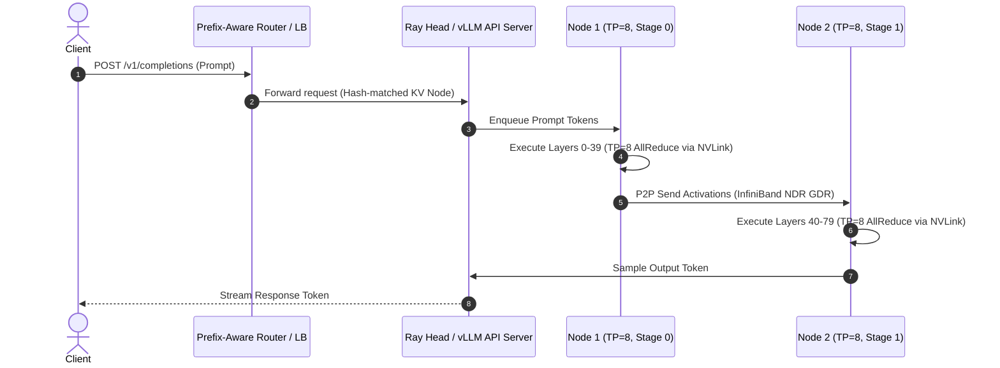

# Scaling Multi-GPU and Multi-Node Inference

As Large Language Models grow to tens or hundreds of billions of parameters (e.g., Llama-3-70B, Llama-3-405B, Mixtral-8x22B), a single GPU’s VRAM capacity and compute throughput are no longer sufficient to host model weights and maintain operational KV cache concurrency. Scaling LLM inference, however, presents fundamentally different engineering challenges than scaling distributed training.

While distributed training prioritizes overall token throughput over hours or days, distributed inference must deliver sub-50ms Inter-Token Latency (ITL) and strict Time to First Token (TTFT) Service Level Objectives (SLOs) under dynamic, multi-tenant arrival rates. Partitioning a model across GPUs introduces inter-device communication into the synchronous execution path of *every generated token*. 

This chapter examines the operational mechanics of Tensor Parallelism (TP), Pipeline Parallelism (PP), high-speed hardware interconnect topologies (NVLink, NVSwitch, InfiniBand NDR, RoCEv2), distributed serving orchestrations (vLLM Ray clusters, Triton TensorRT-LLM), and multi-node load balancing.

---

## Learning Objectives

By completing this chapter, you will be able to:
- Evaluate the execution mechanics and communication overhead of Tensor Parallelism (TP) vs. Pipeline Parallelism (PP) vs. Data Parallelism Replicas (DP).
- Map hardware interconnect topologies (NVLink 900 GB/s, NVSwitch, PCIe Gen5, InfiniBand NDR 400 Gbps, GPUDirect RDMA) to distributed parallel sharding configurations.
- Design multi-node LLM serving architectures using vLLM Ray clusters and Triton TensorRT-LLM orchestrations.
- Implement prefix-aware load balancing and prompt routing to maximize KV cache hit rates across distributed worker nodes.
- Diagnose and resolve NCCL ring initialization timeouts, inter-node AllReduce latency bottlenecks, and pipeline bubble starvation incidents.

---

## Parallelism Strategies for Inference: TP vs PP vs DP

Partitioning LLMs across multiple GPUs requires splitting either matrix operations within layers, sequence layers across nodes, or batch streams across distinct model replicas.

```mermaid
flowchart TD
    subgraph Tensor Parallelism (TP - Intra-Node)
        Direction1["Splits Layer Weights (Column/Row Parallel)"]
        Comm1["Requires AllReduce per Layer over NVLink (Microseconds)"]
    end

    subgraph Pipeline Parallelism (PP - Inter-Node)
        Direction2["Splits Layers Sequentially Across Nodes"]
        Comm2["Requires Point-to-Point Send/Recv at Stage Boundaries"]
    end

    subgraph Data Parallelism (DP / Scale-Out Replicas)
        Direction3["Duplicates Full Model onto Independent Nodes"]
        Comm3["Zero Inter-GPU Communication (Independent KV Caches)"]
    end
```

### Tensor Parallelism (TP) Mechanics

Tensor Parallelism (pioneered by Megatron-LM) shards the weight matrices of individual transformer layers across `N` GPUs.
- **Column-Parallel Linear Layers:** Used in Multi-Head Attention key, query, and value projections (`W_q, W_k, W_v`) and MLP gate/up projections. The input tensor `X` is duplicated across all TP ranks, while weight matrix `W` is split column-wise (`W = [W_1 | W_2 | ... | W_N]`).
- **Row-Parallel Linear Layers:** Used in attention output projections (`W_o`) and MLP down projections. Weight matrix `W` is split row-wise (`W = [W_1^T | W_2^T | ... | W_N^T]^T`). 
- **Communication Pattern:** A Row-Parallel layer produces partial matrix outputs on each GPU rank. An **AllReduce (Sum)** collective operation must execute across all TP ranks to sum the partial results before passing them to the next layer.

> **Operational Implication:** A standard transformer block contains 2 Row-Parallel layers (Attention output and MLP down projection). Therefore, TP requires **2 AllReduce operations per transformer layer**. For an 80-layer model (Llama-3-70B), generating a **single token** requires **160 synchronous AllReduce calls**. This demands microsecond-level interconnect latency offered exclusively by NVLink.

### Pipeline Parallelism (PP) Mechanics

Pipeline Parallelism partitions sequential transformer layers into pipeline stages across GPUs or nodes (e.g., Stage 0: Layers 0–19; Stage 1: Layers 20–39; Stage 2: Layers 40–59; Stage 3: Layers 60–79).
- **Communication Pattern:** Inter-GPU communication occurs **only at stage boundaries**. Stage `k` completes activation processing for a layer group and sends the activation tensor via Point-to-Point (`NCCL_Send`/`Recv`) to Stage `k+1`.
- **Pipeline Bubble Penalty:** In single-sequence generation, downstream stages sit completely idle while upstream stages process activations (the "pipeline bubble"). In production, dynamic batching and micro-batch pipelining overlap requests across stages to keep all pipeline ranks saturated.

### Data Parallelism (DP) / Scale-Out Replicas

Data Parallelism creates complete, independent model replicas across separate GPU nodes or clusters. Each replica maintains its own isolated engine, scheduler, and KV cache pool.
- **Communication Pattern:** **Zero inter-node communication** during execution. Requests are routed independently by an ingress load balancer.
- **VRAM Constraint:** Requires each node (or TP group) to have sufficient VRAM to host the entire model weights plus KV cache pool.

### Architectural Parallelism Matrix

| Dimension | Tensor Parallelism (TP) | Pipeline Parallelism (PP) | Data Parallel Replicas (DP) |
|---|---|---|---|
| **Primary Scope** | Intra-Node (Single Host) | Inter-Node (Cross Host) | Inter-Node / Cluster |
| **Interconnect Requirement** | NVLink / NVSwitch (`> 900` GB/s) | InfiniBand / RoCEv2 (`400` Gbps) | Standard Ethernet / Any |
| **Comm Operations** | 2x AllReduce per layer per token | Point-to-Point Send/Recv | None |
| **Impact on Token Latency (ITL)** | Decreases ITL (more compute units per token) | Slightly increases ITL (stage transport overhead) | No change to single-request ITL |
| **KV Cache Footprint** | KV heads sharded across TP ranks (`KV / TP`) | KV blocks held only on respective stage layers | Independent full KV cache pool per replica |

---

## Hardware Interconnect Topologies

The choice of distributed parallelism is strictly governed by physical interconnect bandwidth and latency characteristics.

```
NVIDIA HGX H100 NODE ARCHITECTURE (8-GPU NVLink Mesh)
+-----------------------------------------------------------------------+
|  GPU 0  <===>  GPU 1  <===>  GPU 2  <===>  GPU 3                      |
|    ^             ^             ^             ^                        |
|    ||            ||            ||            ||  NVIDIA NVSwitch      |
|    v             v             v             v  (900 GB/s per GPU)    |
|  GPU 4  <===>  GPU 5  <===>  GPU 6  <===>  GPU 7                      |
+-----------------------------------------------------------------------+
|  PCIe Gen5 Switch (64 GB/s) <---> Dual 400G InfiniBand NDR ConnectX-7 |
+-----------------------------------------------------------------------+
```

### Interconnect Hierarchy & Bandwidth Comparison

| Interconnect Layer | Physical Interface | Bidirectional Bandwidth | Latency | Viable Parallel Strategy |
|---|---|---|---|---|
| **NVLink 4 (H100/H200)** | Custom High-Speed Trace / NVSwitch | 900 GB/s per GPU | `< 1.0 µs` | Tensor Parallelism (TP=2, 4, 8) |
| **NVLink 3 (A100)** | NVSwitch Mesh | 600 GB/s per GPU | `< 1.5 µs` | Tensor Parallelism (TP=2, 4, 8) |
| **PCIe Gen5 x16** | PCIe Bus Switch | 64 GB/s per GPU | `5 - 10 µs` | Pipeline Parallelism (PP) / DP |
| **InfiniBand NDR / RoCEv2** | CX-7 NIC + GPUDirect RDMA (GDR) | 400 Gbps (50 GB/s) per port | `1.5 - 3.0 µs` | Pipeline Parallelism (PP) / DP |
| **Standard 100GbE Network** | TCP/IP Host Stack | 100 Gbps (12.5 GB/s) | `50 - 150 µs` | Data Parallel Replicas (DP) ONLY |

> **Critical Engineering Rule:** **Never configure Tensor Parallelism across nodes or across PCIe slots lacking NVLink interconnects.** Executing 160 AllReduce operations per token over PCIe or Ethernet introduces 50ms–200ms of inter-node latency per token, destroying engine performance.

---

## Distributed Engine Architecture & Cluster Orchestration

Scaling LLM inference across multi-node clusters requires a coordination framework to manage GPU worker processes, initialize NCCL communication rings, and route incoming requests efficiently.



### vLLM Distributed Ray Architecture

In a multi-node vLLM cluster:
1. **Ray Head Node:** Hosts the OpenAI-compatible HTTP API server, global request scheduler, and Ray Cluster Controller.
2. **Ray Worker Nodes:** Spawn Ray Actor workers per GPU rank. Upon container initialization, Ray workers establish an inter-node NCCL communication mesh using GPUDirect RDMA (`NCCL_NET_GDR_LEVEL=5`).
3. **Tensor Parallel Execution:** Each GPU rank runs an engine execution loop. Weights are sharded across workers, and PagedAttention block tables are synchronized across ranks.

### Prefix-Aware Load Balancing

In a scale-out Data Parallel cluster (e.g., 4 nodes running Llama-3-70B TP=8 independent engines), round-robin or random load balancing wastes VRAM cache efficiency.

**Prefix-Aware Routing** evaluates incoming prompt request headers or system prompt hashes:
- Incoming requests sharing identical system prompt prefixes (e.g., tenant system prompts, fixed agent instructions) are routed consistently to the **same engine replica**.
- This maximizes Radix Tree prefix cache hits on that node (achieving `> 85%` hit rates), reducing prefill compute and saving VRAM PagedAttention blocks across the rest of the cluster.

---

## Worked Failure Scenarios

### Worked Failure Scenario 1: Inter-Node NCCL AllReduce Timeout and PCIe Bottleneck

#### Production Incident Context
An infrastructure team attempted to deploy a 405B model across two 8-GPU H100 nodes. To fit the model weights without pipeline bubbles, the deployment manifest specified `--tensor-parallel-size 16`. Upon startup, the Ray worker deployment hung indefinitely during engine creation before failing with severe NCCL watchdog timeout errors.

#### Symptoms & Initial Metrics
- Kubernetes deployment stuck in `ContainerCreating` / `Running` with zero API responsiveness.
- CPU utilization spike to 100% on Ray head node.
- High memory allocation on GPU 0 of both nodes, while GPUs 1–7 remained at 0% memory.

#### Evidence Gathering
The engineer inspected container logs with `NCCL_DEBUG=INFO` enabled:

```bash
# Kubernetes log command for distributed worker pod
kubectl logs pod/vllm-node-2-worker-0 -c vllm-worker
```

**Broken Log Output:**
```text
2026-08-06T15:02:11.412Z [INFO] ncclCommInitRank: Initializing NCCL rank 8 of 16 across hosts node-1, node-2
2026-08-06T15:02:41.890Z [WARN] [NCCL WARN] Transport dev pcie3-0 is not NVLink capable. Falling back to Host TCP sockets.
2026-08-06T15:03:11.902Z [ERROR] [NCCL ERROR] Call to connect returned Connection refused (Socket: node-1:41235)
2026-08-06T15:03:11.905Z [CRITICAL] Watchdog caught timeout in NCCL collective operation AllReduce. Process terminating.
```

**Topology Check Command (`nvidia-smi topo -m`):**
```text
        GPU0    GPU1    GPU2    GPU3    GPU4    GPU5    GPU6    GPU7    NIC0
GPU0     X      NV9     NV9     NV9     NV9     NV9     NV9     NV9     NODE
...
NIC0    NODE    NODE    NODE    NODE    NODE    NODE    NODE    NODE     X
```

#### Root Cause Analysis
1. The engine was configured with `TP=16`, forcing Tensor Parallel AllReduce collectives to execute across two distinct physical server chassis connected over host Ethernet.
2. Because NVLink interconnects do not extend between separate server chassis (without specialized NVLink Network Switches), NCCL attempted to fall back to PCIe and TCP host network sockets.
3. The high latency of host network sockets triggered a hard 30-second NCCL collective initialization watchdog timeout.

#### Resolution & Mitigation

1. Re-architect the multi-node parallelism strategy:
   - Use **Tensor Parallelism TP=8** intra-node (strictly bounded within each 8-GPU chassis via NVLink).
   - Use **Pipeline Parallelism PP=2** inter-node (connecting Node 1 layers 0–39 to Node 2 layers 40–79 over InfiniBand NDR).

2. Update Kubernetes vLLM deployment environment variables and arguments:

```yaml
apiVersion: apps/v1
kind: Deployment
metadata:
  name: vllm-llama-405b-distributed
spec:
  template:
    spec:
      containers:
        - name: vllm-worker
          image: vllm/vllm-openai:v0.5.4
          env:
            - name: NCCL_DEBUG
              value: "INFO"
            - name: NCCL_IB_DISABLE
              value: "0"                  # Enforce InfiniBand utilization
            - name: NCCL_NET_GDR_LEVEL
              value: "5"                  # Enable GPUDirect RDMA level 5 (PCIe bridge bypass)
            - name: NCCL_CROSS_NIC
              value: "1"
          args:
            - "--model"
            - "meta-llama/Meta-Llama-3-405B-Instruct-FP8"
            - "--tensor-parallel-size"
            - "8"                         # Intra-node NVLink bound
            - "--pipeline-parallel-size"
            - "2"                         # Inter-node InfiniBand bound
            - "--gpu-memory-utilization"
            - "0.90"
```

#### Verification & Clean Output
After applying the topology fix, the multi-node cluster initialized successfully in under 45 seconds:

```text
2026-08-06T15:10:04.112Z [INFO] ncclCommInitRank: Rank 0-7 using NVLink 4 (900 GB/s) for TP AllReduce
2026-08-06T15:10:04.301Z [INFO] ncclCommInitRank: Rank 0 -> Rank 8 using InfiniBand NDR (CX7_IB_0, GDR Level 5) for PP P2P
2026-08-06T15:10:18.450Z [INFO] vLLM Engine initialized successfully. Ready to accept OpenAI API requests.
```

#### Prevention
- Enforce strict topology validation checks in CI/CD Helm charts: Reject any deployment manifest specifying `TP &gt; 8` unless running on specialized NVLink-Network switch infrastructure.

---

### Worked Failure Scenario 2: Pipeline Parallelism Dynamic Load Imbalance & Cache Starvation

#### Production Incident Context
A multi-node inference cluster configured with Pipeline Parallelism (TP=4, PP=2) experienced severe degradation during peak hours. Node 1 (handling PP Stage 0) was constantly exhausting its KV cache pool, while Node 2 (handling PP Stage 1) had over 60% of its VRAM idle.

#### Symptoms & Initial Metrics
- `vllm:gpu_cache_usage_perc` on Node 1 hit **99.2%**, triggering frequent request queueing.
- `vllm:gpu_cache_usage_perc` on Node 2 remained low at **38.5%**.
- End-to-end request queue times exceeded 4,500ms.

#### Evidence Gathering
The engineer inspected metric differentials across pipeline stages:

```prometheus
# Prometheus query comparing KV cache utilization per stage rank
vllm:gpu_cache_usage_perc{job="vllm-pp-cluster"}
```

**Diagnostic Output:**
- Stage 0 (Node 1): `0.992`
- Stage 1 (Node 2): `0.385`

#### Root Cause Analysis
In pipeline-parallel serving, **Stage 0 receives raw prompt tokens from incoming client requests and computes initial embeddings and prefill attention**. When client requests contain massive prompt contexts with short output generations (e.g., prompt length = 8192 tokens, output length = 64 tokens), Stage 0 allocates hundreds of PagedAttention blocks during prefill, whereas Stage 1 processes far fewer active decode steps per time unit. This produced a severe **KV cache memory imbalance** across pipeline stages.

#### Resolution & Mitigation

1. Enable **Chunked Prefill** (`--enable-chunked-prefill`) to prevent Stage 0 from holding massive un-chunked prefill blocks during single iterations.
2. Rebalance VRAM allocations by adjusting `--gpu-memory-utilization` dynamically or sharding models using **Data Parallelism Replicas (DP=2, TP=8)** instead of Pipeline Parallelism (PP=2, TP=4), eliminating stage-dependent KV cache imbalances entirely.

**Updated Execution Configuration (Shifting to DP Replicas):**
```bash
# Node 1 Execution (Replica A)
vllm serve meta-llama/Meta-Llama-3-70B-Instruct --tensor-parallel-size 8 --port 8000

# Node 2 Execution (Replica B)
vllm serve meta-llama/Meta-Llama-3-70B-Instruct --tensor-parallel-size 8 --port 8000
```

#### Verification
With independent DP=8 replicas, KV cache usage balanced perfectly across both nodes (Node 1: 72%, Node 2: 74%), and end-to-end queue delay dropped to zero.

#### Prevention
- Prioritize Data Parallel (DP) scale-out replicas over Pipeline Parallelism (PP) whenever VRAM capacity allows model weights to fit within intra-node TP boundaries.

---

## Prometheus Metrics and Alerting Rules

### Distributed Telemetry Reference Table

| Metric | Type | Description | Operational Target |
|---|---|---|---|
| `dcgm_nvlink_throughput` | Counter | Total byte throughput across intra-node NVLink connections | Saturation monitoring |
| `nccl_comm_latency_seconds` | Histogram | Latency distribution of NCCL AllReduce and P2P calls | `< 50 µs` per AllReduce |
| `vllm:gpu_cache_usage_perc` | Gauge | KV cache block usage on rank 0 | `< 85%` |
| `vllm:num_requests_waiting` | Gauge | Global queued request count in cluster scheduler | `< 5` |

### Prometheus Alerting Rules

```yaml
groups:
  - name: vllm_distributed_alerts
    rules:
      - alert: NCCLCommunicationDegraded
        expr: rate(nccl_comm_latency_seconds_sum[2m]) / rate(nccl_comm_latency_seconds_count[2m]) > 0.005
        for: 1m
        labels:
          severity: critical
        annotations:
          summary: "NCCL Collective Communication Latency Spike (>5ms)"
          description: "Distributed worker ranks on {{ $labels.instance }} are experiencing inter-GPU communication latency spikes. Check NVLink/InfiniBand interfaces."

      - alert: PipelineStageKVCacheImbalance
        expr: (max(vllm:gpu_cache_usage_perc) - min(vllm:gpu_cache_usage_perc)) > 0.40
        for: 3m
        labels:
          severity: warning
        annotations:
          summary: "Severe KV Cache Imbalance Across Pipeline Stages"
          description: "KV cache memory utilization across PP ranks differs by over 40%. Stage 0 prefill bottleneck suspected."
```

---

## Senior Interview Questions & Model Answers

### Question 1: Why is Tensor Parallelism (TP) strictly restricted to intra-node NVLink interconnects in low-latency LLM serving, whereas Pipeline Parallelism (PP) is suitable for inter-node scaling?

**Model Answer:**
Tensor Parallelism (TP) splits weight matrices *within* individual transformer layers. Each transformer block requires **2 synchronous AllReduce operations** per generated token (one for attention output, one for MLP down projection). For an 80-layer model generating 50 tokens/sec, this requires 8,000 AllReduce calls per second. 
- Executing AllReduce over NVLink (900 GB/s, `< 1 µs` latency) completes each collective in microseconds.
- Executing AllReduce over inter-node PCIe or network interfaces (50–150 µs latency) causes GPUs to spend `> 90%` of their execution time waiting for inter-node network synchronization, destroying token generation performance.

Conversely, Pipeline Parallelism (PP) splits sequential layers across nodes. Inter-node communication occurs **only at stage boundaries** via Point-to-Point activation transfers (`NCCL_Send`/`Recv`), executing only once per stage rather than twice per layer. This lower communication frequency fits cleanly within the bandwidth and latency budgets of 400G InfiniBand NDR with GPUDirect RDMA.

---

### Question 2: What is GPUDirect RDMA (GDR), and how does it impact inter-node distributed inference performance?

**Model Answer:**
GPUDirect RDMA (GDR) is an NVIDIA technology that enables network interface cards (NICs, such as Mellanox ConnectX InfiniBand/RoCE adapters) to directly access GPU VRAM over the PCIe bus without copying data through host CPU system RAM or invoking kernel context switches.

Without GDR, inter-node GPU communication follows a 3-step host-pinned copy chain: `GPU VRAM -> CPU System RAM -> Network NIC -> Network NIC -> Host CPU RAM -> Remote GPU VRAM`.
With GDR (`NCCL_NET_GDR_LEVEL=5`), activation tensors stream directly `GPU VRAM -> NIC -> Remote NIC -> Remote GPU VRAM`.
This reduces inter-node Point-to-Point transfer latency by **4x to 6x** and eliminates CPU memory bandwidth bottlenecking during Pipeline Parallel activation transfers.

---

### Question 3: How does prefix-aware load balancing improve the operational efficiency of a scale-out multi-node inference cluster?

**Model Answer:**
In a scale-out cluster running independent Data Parallel (DP) replicas, standard round-robin routing distributes incoming requests uniformly. However, if multiple incoming requests share identical system prompts or agent instructions, round-robin forces *every* replica to independently process prefill and allocate redundant PagedAttention KV cache blocks for the exact same prefix tokens.

**Prefix-Aware Load Balancing** computes a hash of incoming prompt prefixes and routes requests sharing identical system prompts to the **same worker node/replica**. 
- The destination replica reuses cached physical blocks from its Radix Tree prefix cache (`--enable-prefix-caching`).
- Prefill compute drops from `O(N)` matrix multiplications to an `O(1)` block reference, reducing TTFT by up to 90% and freeing thousands of KV cache blocks across the rest of the cluster.

---

## Summary & Authoritative References

### Chapter Summary
- Tensor Parallelism (TP) requires microsecond-level latency and must be strictly bounded to intra-node NVLink interconnects.
- Pipeline Parallelism (PP) partitions sequential transformer layers across hosts, communicating via Point-to-Point transfers suitable for InfiniBand NDR with GPUDirect RDMA.
- Data Parallel (DP) scale-out replicas offer ideal failure isolation and zero inter-node communication overhead when models fit within intra-node VRAM limits.
- Prefix-Aware Routing maximizes distributed KV cache utilization by concentrating identical prompt prefixes onto specific cluster nodes.
- Proper NCCL environment configuration (`NCCL_IB_DISABLE=0`, `NCCL_NET_GDR_LEVEL=5`) is required to avoid inter-node host socket fallbacks and collective timeouts.

### Authoritative References
- **Shoeybi et al. (2019):** *Megatron-LM: Training Multi-Billion Parameter Language Models Using Model Parallelism*. [arXiv:1909.08053](https://arxiv.org/abs/1909.08053)
- **NVIDIA NCCL Documentation:** *Developer Guide & Topology Tuning*. [NVIDIA Docs](https://docs.nvidia.com/deeplearning/nccl/)
- **vLLM Distributed Serving Guide:** *Deploying Multi-Node Clusters with Ray*. [vllm.ai Docs](https://docs.vllm.ai)
- **NVIDIA GPUDirect RDMA User Guide:** *PCIe Memory Access Mechanics*. [NVIDIA Developer](https://docs.nvidia.com/cuda/gpudirect-rdma/)
