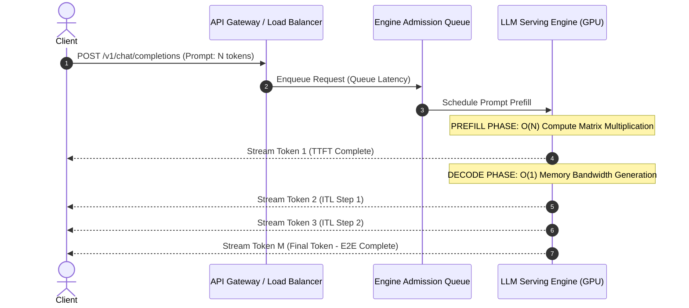

# Performance Metrics and Benchmarking

Benchmarking traditional microservices relies on measuring HTTP Request Throughput (Requests Per Second - RPS) and end-to-end response latency percentiles (p50, p95, p99). In Generative AI and Large Language Model (LLM) serving, however, these traditional metrics are fundamentally insufficient. 

An LLM request does not complete in a single execution step. It progresses through two distinct operational phases: a **compute-bound prefill phase** (processing the input prompt) followed by a **memory-bandwidth-bound decode phase** (generating output tokens autoregressively). A single request generating 500 tokens requires 501 forward passes through the neural network.

Evaluating LLM serving infrastructure requires decomposing request latency into discrete token phase metrics, simulating non-deterministic context distributions, and executing open-loop stress testing. This chapter details the technical definitions, measurement methodologies, tooling implementations (`vllm benchmark_serving`, `genai-perf`), and diagnostic playbooks for LLM benchmarking.

---

## Learning Objectives

By completing this chapter, you will be able to:
- Deconstruct LLM execution into Time to First Token (TTFT), Inter-Token Latency (ITL), Time Per Output Token (TPOT), and End-to-End (E2E) Latency.
- Quantify token throughput metrics: Input Tokens/sec, Output Tokens/sec (Generated Tokens Per Second - GTPS), and Total Token Throughput.
- Execute reproducible benchmark suites using vLLM `benchmark_serving.py` and NVIDIA `genai-perf`.
- Contrast Open-Loop Poisson arrival rate benchmarking with Closed-Loop benchmarking to expose production admission queue collapse.
- Diagnose synthetic benchmark artifacts and optimize engine configurations (`--max-num-batched-tokens`, `--max-num-seqs`, block size).

---

## Deconstructing GenAI Performance Metrics



### Core Latency Breakdown

#### 1. Time to First Token (TTFT)
TTFT measures the time elapsed from when a client dispatches an HTTP request to when the first generated token is received.
```text
TTFT = t_queue + t_preprocess + t_prefill_compute
```
- **Operational Nature:** **Compute-Bound** (Matrix Multiplication on Tensor Cores). Scaling prompt length from 512 to 8,192 tokens increases prefill compute quadrically `O(N^2)` unless FlashAttention or PagedAttention optimizations are present.
- **Production Target (SLO):** `< 200 ms` (p95) for real-time chat; `< 1,000 ms` for long-context RAG.

#### 2. Inter-Token Latency (ITL) / Time Per Output Token (TPOT)
ITL (also referred to as TPOT) measures the latency between generating consecutive output tokens during the autoregressive decode phase:
```text
ITL_i = t_token_i - t_token_{i-1}
```
- **Operational Nature:** **Memory-Bandwidth-Bound**. Each decode step reads the entire model weight tensor (`W`) and KV cache from High-Bandwidth Memory (HBM) into SRAM to generate a single token.
- **Production Target (SLO):** `< 25 ms` per token (p95) implying `> 40 tokens/sec`, exceeding human reading speed.

#### 3. End-to-End (E2E) Latency
```text
E2E Latency = TTFT + (Generated Tokens - 1) × ITL + t_network
```

---

### Token Throughput Metrics

| Throughput Metric | Formula | Engineering Significance |
|---|---|---|
| **Request Throughput (RPS)** | `Completed Requests / Time Window (sec)` | Macro capacity metric for API load balancers |
| **Input Token Throughput (Input TPS)** | `Sum of Prompt Tokens / Time Window (sec)` | Quantifies prefill compute pipeline utilization |
| **Output Token Throughput (GTPS)** | `Sum of Generated Tokens / Time Window (sec)` | Direct measure of GPU memory bandwidth utilization |
| **Total Token Throughput** | `Sum of (Prompt + Generated Tokens) / Time Window` | Aggregate cluster billing & utilization metric |

---

## Benchmarking Methodology: Open-Loop vs Closed-Loop

Choosing the correct load generation pattern determines whether a benchmark reveals real production capacity or masks system flaws.

```
CLOSED-LOOP BENCHMARKING (Concurrency = 4)
Client 1: [Req 1] -------------> [Response 1] -> [Req 5] -------------> [Response 5]
Client 2: [Req 2] -----------------> [Response 2] -> [Req 6] -----------> [Response 6]
(System Queue Depth is ARTIFICIALLY CAPPED at Concurrency count. Queue Latency hidden!)

OPEN-LOOP BENCHMARKING (Poisson Arrival Rate = 10 RPS)
t=0.0s:  [Req 1] Dispatched --->
t=0.1s:  [Req 2] Dispatched -------> [ Engine Queue Accumulates ] ---> Real Tail Latency!
t=0.12s: [Req 3] Dispatched ------->
```

### Closed-Loop Benchmarks (Anti-Pattern for Capacity Sizing)
In a closed-loop test, `N` virtual client threads issue requests continuously: a thread waits until it receives a complete response before sending the next request.
- **Defect:** If the engine becomes overloaded and latency increases, the client threads automatically slow down their request dispatch rate. 
- **Result:** Admission queues never accumulate, hiding tail latency spikes (p99 TTFT) and painting an overly optimistic picture of system stability.

### Open-Loop Benchmarks (Production Standard)
In an open-loop test, requests are dispatched according to a **Poisson Arrival Process** at a specified arrival rate `λ` (e.g., 25 requests/sec), regardless of when the server completes prior requests.
- **Advantage:** If server throughput falls below `λ`, incoming requests stack up in the admission queue.
- **Result:** Open-loop tests accurately expose the exact knee-of-the-curve where queue delay explodes, revealing true system breakdown thresholds.

---

## GenAI Benchmarking Tooling Guide

### 1. vLLM Benchmark Suite (`benchmark_serving.py`)

The native vLLM benchmark suite evaluates API server endpoints using standard datasets (e.g., ShareGPT) with realistic variable prompt/output length distributions.

```bash
# Execute Open-Loop Poisson Traffic Benchmark on local vLLM endpoint
python3 vllm/benchmarks/benchmark_serving.py \
    --backend vllm \
    --host 127.0.0.1 \
    --port 8000 \
    --model meta-llama/Meta-Llama-3-70B-Instruct \
    --dataset-name sharegpt \
    --dataset-path ./ShareGPT_V3_unfiltered_cleaned_split.json \
    --num-prompts 1000 \
    --request-rate 15.0 \        # Poisson arrival rate (15 req/sec)
    --seed 42 \
    --trust-remote-code
```

**Representative Output Analysis:**
```text
============ Serving Benchmark Result ============
Successful requests:             1000
Benchmark duration (s):          71.24
Total input tokens:              241,042
Total generated tokens:          189,410
Request throughput (req/s):      14.04
Output token throughput (tok/s): 2658.76
Total token throughput (tok/s):  6042.27
--------------- Time to First Token (TTFT) ---------------
Mean TTFT (ms):                  142.18
Median TTFT (ms):                112.40
P95 TTFT (ms):                   284.10
P99 TTFT (ms):                   492.50
--------------- Inter-Token Latency (ITL) ----------------
Mean ITL (ms):                   16.42
Median ITL (ms):                 15.80
P95 ITL (ms):                    21.10
P99 ITL (ms):                    28.40
==================================================
```

### 2. NVIDIA GenAI-Perf (`genai-perf`)

NVIDIA `genai-perf` (part of Triton Perf Analyzer) provides advanced load generation for Triton, vLLM, and TensorRT-LLM endpoints, generating artifact plots and exportable JSON reports.

```bash
# Execute Concurrency Sweep with GenAI-Perf
genai-perf \
    -m meta-llama/Meta-Llama-3-8B-Instruct \
    --service-type vllm \
    --url 127.0.0.1:8000 \
    --endpoint-type chat \
    --concurrency 32 \
    --synthetic-input-tokens-mean 1024 \
    --synthetic-input-tokens-stddev 128 \
    --output-tokens-mean 256 \
    --output-tokens-stddev 32 \
    --measurement-interval 10000 \
    --generate-plots
```

---

## Worked Failure Scenarios

### Worked Failure Scenario 1: Synthetic Benchmarking Artifact Hiding Prefill Bottlenecks

#### Production Incident Context
Prior to launching a new enterprise RAG platform, an engineering team benchmarked their Llama-3-70B 4x H100 cluster using a simple script that sent fixed 64-token prompt requests. The benchmark reported outstanding performance: 3,400 output tokens/sec and a p99 TTFT of 45ms. However, upon releasing to production, users experienced multi-second delays (over 6,000ms TTFT), triggering widespread timeout errors.

#### Symptoms & Initial Metrics
- Client-facing API Gateway returned HTTP 504 Gateway Timeout on 24% of requests.
- Production Grafana dashboard showed `vllm:time_to_first_token_seconds` p99 spiking to 6.4 seconds.
- GPU Compute Utilization (`dcgm_gpu_utilization`) hovered at 99%, while Output Token Throughput dropped sharply.

#### Evidence Gathering
The engineer executed a comparative benchmark contrasting the synthetic test against a trace replay of actual production RAG prompts using `genai-perf`:

```bash
# Command 1: Synthetic Fixed Benchmark (Misleading)
genai-perf -m llama-3-70b --service-type vllm --synthetic-input-tokens-mean 64 --output-tokens-mean 128

# Command 2: Production Real Distribution Benchmark
genai-perf -m llama-3-70b --service-type vllm --synthetic-input-tokens-mean 4096 --output-tokens-mean 256
```

**Benchmark Results Comparison Table:**

| Metric | Synthetic Test (64 Prompt Tokens) | Production Test (4096 Prompt Tokens) | Variance |
|---|---|---|---|
| **Request Rate** | 45 req/sec | 6.2 req/sec | `-86%` |
| **p95 TTFT** | 38 ms | 4,820 ms | `+12,584%` |
| **p95 ITL** | 16.2 ms | 28.4 ms | `+75%` |
| **GPU Memory Usage** | 42 GB | 78.4 GB | `+86%` |

#### Root Cause Analysis
The synthetic benchmark used short 64-token prompts, which took negligible compute time to execute in prefill. In real production usage, RAG document contexts averaged 4,096 tokens per prompt. Computing self-attention over 4,096 tokens requires **64x more prefill FLOPs per request**. Without **Chunked Prefill**, long prompt prefills monopolized GPU compute units, locking out incoming requests and causing massive queue build-up.

#### Resolution & Mitigation

1. Update vLLM startup configuration to enable **Chunked Prefill** and optimize batch sizes:

```bash
vllm serve meta-llama/Meta-Llama-3-70B-Instruct \
    --tensor-parallel-size 4 \
    --enable-chunked-prefill \
    --max-num-batched-tokens 2048 \    # Cap max prefill tokens per iteration
    --max-num-seqs 128 \
    --gpu-memory-utilization 0.90
```

2. Mandate that all staging benchmark suites use open-loop trace replays reflecting real prompt token length distributions.

#### Verification
Re-running the production trace benchmark with Chunked Prefill enabled restored p95 TTFT from 4,820ms down to 290ms under identical 15 req/sec traffic:

```text
vllm:time_to_first_token_seconds{quantile="0.95"} 0.290
vllm:time_per_output_token_seconds{quantile="0.95"} 0.0182
```

#### Prevention
- Never sign off on production capacity using fixed short-prompt synthetic tests. Always benchmark using realistic prompt distributions (e.g., ShareGPT or recorded production payloads).

---

### Worked Failure Scenario 2: Systemic Concurrency Collapse under Open-Loop Request Spikes

#### Production Incident Context
During a high-concurrency open-loop benchmark designed to locate cluster capacity limits, increasing request arrival rate from 20 req/sec to 30 req/sec caused an immediate collapse in system responsiveness. TTFT degraded exponentially while Output Token Throughput completely stalled.

#### Symptoms & Initial Metrics
- `vllm:num_requests_waiting` surged from 2 to 340 requests in 15 seconds.
- TTFT p99 exploded from 180ms to 18,200ms.
- Prometheus alert firing: `LLMAdmissionQueueBacklogHigh`.

#### Evidence Gathering
The engineer inspected the breakdown of engine execution time during the load surge:

```prometheus
# Prometheus queries
vllm:num_requests_waiting
vllm:gpu_cache_usage_perc
rate(vllm:prompt_tokens_total[1m])
```

**Telemetry Observations:**
- `vllm:gpu_cache_usage_perc` reached `0.99`.
- The engine was constantly preempting active sequences to make room for incoming prompt prefills, creating a classic **preemption loop**.

#### Root Cause Analysis
The engine was configured with `--max-num-seqs 512` but without a corresponding limit on `--max-num-batched-tokens`. As open-loop arrival rates surged, the scheduler admitted too many concurrent requests into the active execution batch. Once GPU VRAM blocks filled up, the engine was forced to **preempt running decode sequences**, discarding their KV blocks to process incoming prefill requests. When those preempted requests resumed, their prompts had to be recomputed from scratch, causing total system collapse.

#### Resolution & Mitigation

1. Restrict active sequence concurrency and enforce chunked prefill caps:

```bash
vllm serve meta-llama/Meta-Llama-3-70B-Instruct \
    --tensor-parallel-size 4 \
    --max-num-seqs 64 \                # Cap max active sequence concurrency
    --max-num-batched-tokens 2048 \     # Restrict batched token budget
    --enable-chunked-prefill \
    --gpu-memory-utilization 0.90
```

2. Configure an external queueing and rate-limiting policy at ingress (e.g., NGINX / Envoy) to return HTTP 429 Too Many Requests when admission queues exceed 50 depth.

#### Verification
Re-testing at 35 req/sec with the tuned configuration showed stable queueing behavior without request preemptions:

```text
vllm:num_requests_waiting 8
vllm:num_preempted_requests_total 0
vllm:time_to_first_token_seconds{quantile="0.99"} 0.340
```

#### Prevention
- Conduct step-stress concurrency sweeps to pinpoint the exact saturation point (`λ_max`) and configure ingress rate limits below that threshold.

---

## Prometheus Metrics and Alerting Rules

### Performance Telemetry Reference Table

| Prometheus Metric | Metric Type | Operational Target | Description |
|---|---|---|---|
| `vllm:time_to_first_token_seconds_bucket` | Histogram | `< 0.200 s` (p95) | Latency to emit first response token |
| `vllm:time_per_output_token_seconds_bucket` | Histogram | `< 0.020 s` (p95) | Inter-token generation latency |
| `vllm:generation_tokens_total` | Counter | Monotonic increase | Total output tokens generated |
| `vllm:prompt_tokens_total` | Counter | Monotonic increase | Total prompt tokens processed |
| `vllm:request_success_total` | Counter | `> 99.9%` ratio | Total successful requests completed |

### Prometheus Alerting Rules Configuration

```yaml
groups:
  - name: vllm_performance_alerts
    rules:
      - alert: LLMTime-To-First-TokenSLOViolation
        expr: histogram_quantile(0.95, sum(rate(vllm:time_to_first_token_seconds_bucket[5m])) by (le)) > 1.0
        for: 2m
        labels:
          severity: critical
        annotations:
          summary: "vLLM p95 Time to First Token > 1.0s"
          description: "Prefill phase tail latency on {{ $labels.instance }} has exceeded 1 second. Check prompt length distribution and admission queue depth."

      - alert: LLMInterTokenLatencyDegraded
        expr: histogram_quantile(0.95, sum(rate(vllm:time_per_output_token_seconds_bucket[5m])) by (le)) > 0.040
        for: 2m
        labels:
          severity: warning
        annotations:
          summary: "vLLM p95 Inter-Token Latency > 40ms"
          description: "Decode phase generation speed has degraded below 25 tokens/sec. Check GPU memory bandwidth or PCIe swapping."
```

---

## Senior Interview Questions & Model Answers

### Question 1: Explain the difference between Time to First Token (TTFT) and Inter-Token Latency (ITL). How do hardware bottlenecks differ between the prefill phase and the decode phase?

**Model Answer:**
- **Time to First Token (TTFT)** measures the delay from request dispatch to receiving the initial streamed token. It encompasses network transmission, admission queue delay, and prompt prefill computation. The prefill phase processes all prompt tokens in parallel and is **compute-bound**, constrained by GPU Tensor Core FLOPs (`O(N^2)` self-attention complexity).
- **Inter-Token Latency (ITL)** measures the time between consecutive tokens during generation. The decode phase generates tokens one by one and is **memory-bandwidth-bound**. Each decode step must load all model weights and KV cache tensors from High-Bandwidth Memory (HBM) to SRAM to compute a single forward pass.

Therefore, optimizing TTFT requires increasing compute capacity (FlashAttention, Tensor Cores, FP8 execution) or reducing prompt tokens (prefix caching), whereas optimizing ITL requires maximizing HBM memory bandwidth (H100/H200 vs A100), quantizing weights (FP8/INT4), or increasing batch sizes.

---

### Question 2: Why is open-loop load testing essential for benchmarking LLM serving infrastructure, and why does closed-loop testing provide misleading conclusions?

**Model Answer:**
Closed-loop testing caps the total number of outstanding requests equal to the number of virtual client threads. If the server becomes overloaded and latency increases, closed-loop clients wait for responses before issuing new requests, artificially reducing the arrival rate. As a result, closed-loop testing **hides admission queue depth and under-reports tail latency (p99 TTFT)**.

Open-loop testing dispatches requests according to a Poisson arrival process independent of server completion rates. If server processing capacity drops below the arrival rate, requests build up in the admission queue. Open-loop testing accurately simulates real multi-tenant production traffic, exposing preemption loops, queue backlog explosion, and true cluster breakdown limits.

---

### Question 3: If a cluster demonstrates high Output Token Throughput (Tokens/sec) but end-user satisfaction is poor, what metrics are likely missing from the evaluation?

**Model Answer:**
High total token throughput simply indicates high GPU memory bandwidth utilization, which can be achieved by running massive batch sizes. However, large batches increase **Inter-Token Latency (ITL)** and prolong **Time to First Token (TTFT)** due to scheduling queues. 

If users report poor experience despite high throughput, the evaluation is likely missing:
1. **p95 / p99 TTFT:** Users perceive long delays before text streams as system unresponsiveness.
2. **p95 / p99 ITL:** Irregular or slow token streaming (`< 15 tokens/sec`) feels jarring during interactive read-along.
3. **Queue Latency (`t_queue`):** Requests sitting in proxy queues prior to engine entry.
4. **Context Distribution Metrics:** Benchmarking may have used short prompts, masking severe prefill degradation experienced by users with large context prompts.

---

## Summary & Authoritative References

### Chapter Summary
- Deconstructing LLM latency into TTFT (compute-bound) and ITL (memory-bandwidth-bound) is mandatory for effective performance engineering.
- Open-loop Poisson benchmarking is the gold standard for exposing production admission queue collapse and tail latency percentiles.
- Tools like `vllm benchmark_serving` and NVIDIA `genai-perf` enable reproducible performance sweeps using realistic prompt distributions (e.g., ShareGPT).
- Enabling Chunked Prefill (`--enable-chunked-prefill`) prevents long prompts from causing multi-second TTFT spikes for co-batched decode requests.
- Monitoring histogram quantiles for TTFT and ITL in Prometheus provides early warning before SLO breaches impact end users.

### Authoritative References
- **NVIDIA Triton Performance Analyzer Documentation:** *GenAI-Perf User Guide*. [NVIDIA Developer](https://developer.nvidia.com/triton-inference-server)
- **vLLM Benchmarking Suite:** *Performance Evaluation Scripts*. [vllm.ai GitHub](https://github.com/vllm-project/vllm/tree/main/benchmarks)
- **Agrawal et al. (2024):** *Taming Throughput-Latency Trade-offs in LLM Inference with Chunked Prefills*. [arXiv:2402.15627](https://arxiv.org/abs/2402.15627)
- **Patel et al. (2023):** *Splitwise: Efficient Generative LLM Serving by Separating Phase Execution*. [ISCA 2024](https://arxiv.org/abs/2311.18677)
