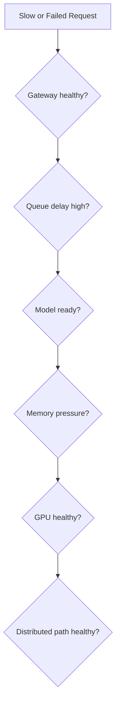

# Production Reliability and Troubleshooting

Inference failures are often partial. The process is alive, but the model is not loaded; the GPU is healthy, but the queue is saturated; replicas exist, but all share one failure domain.

## Reliability Controls

- separate liveness, readiness, and model readiness;
- use admission control and load shedding;
- maintain warm spare capacity;
- canary model and runtime changes;
- preserve rollback artifacts;
- scale on queue and service metrics, not GPU utilization alone;
- define retry and timeout budgets.

## Troubleshooting Tree

## Incident Method

Decompose latency, compare healthy and unhealthy replicas, preserve traces, verify model version, inspect memory and cache, then inspect hardware and network paths.

## Common Root Causes

- unbounded queue;
- incompatible engine artifact;
- cache exhaustion;
- cold model load;
- noisy neighbor;
- autoscaling delay;
- failing distributed rank;
- downstream network or client backpressure.
