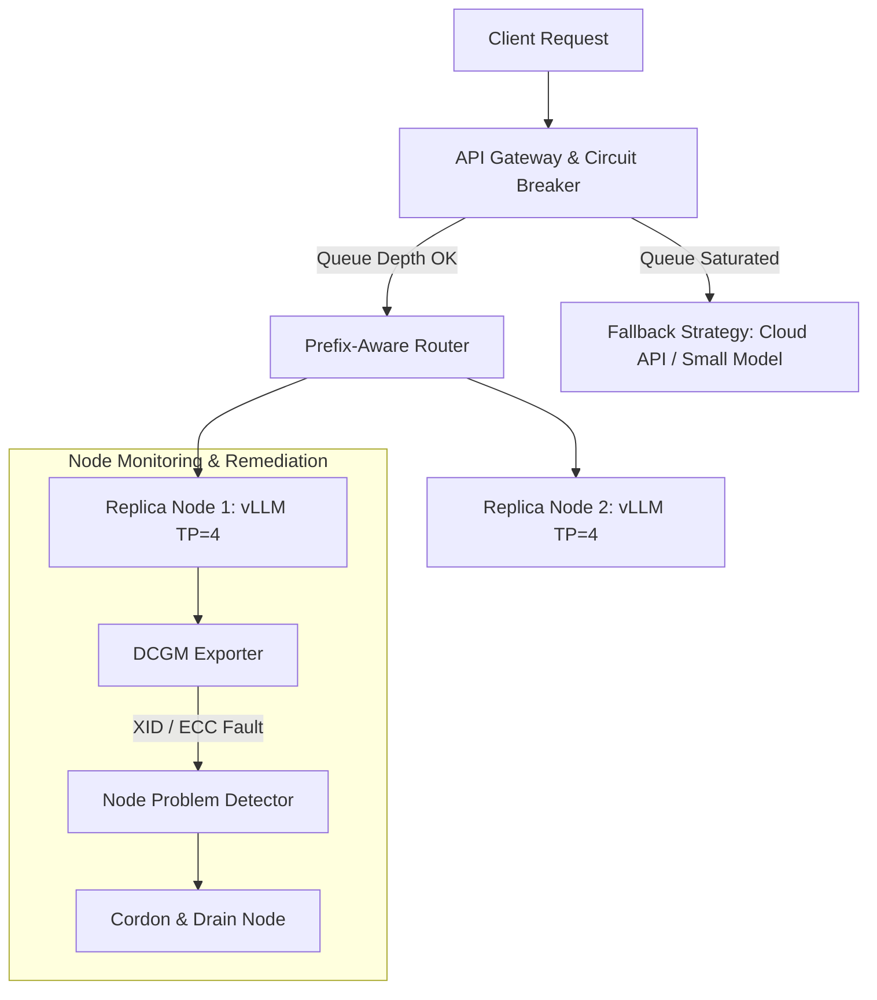
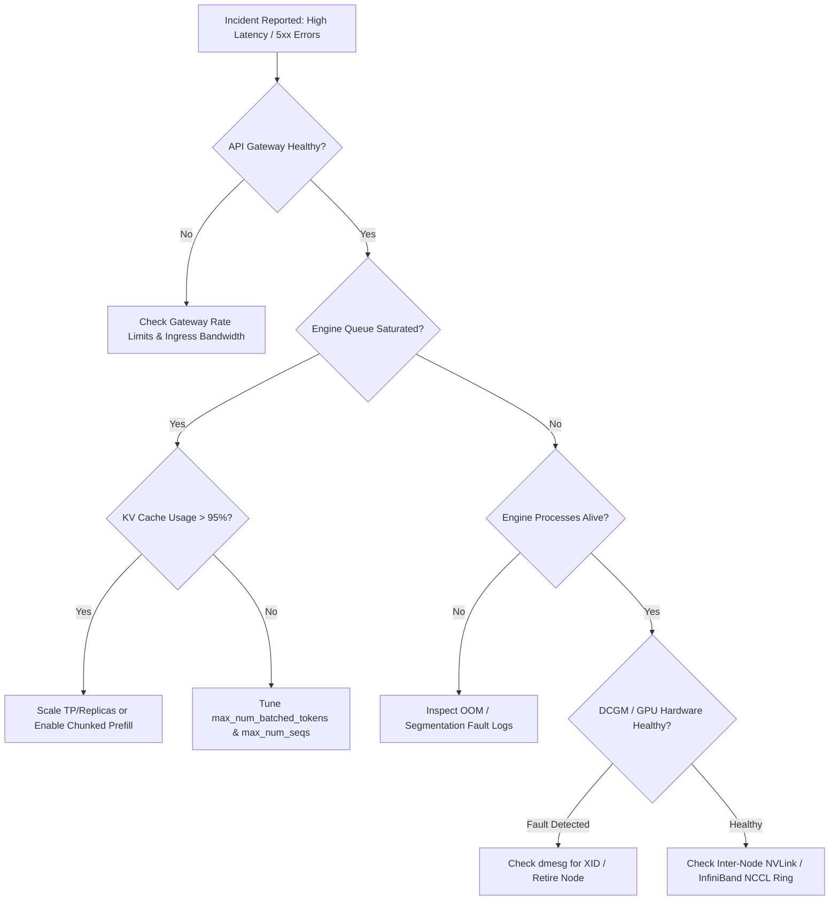

# Production Reliability and Troubleshooting

Deploying Large Language Models (LLMs) in production demands an evolved perspective on system reliability. Unlike traditional stateless microservices that fail deterministically (e.g., throwing a stack trace or crashing immediately), LLM serving engines can fail partially and subtly. 

A container process may remain alive and return HTTP 200 responses while its CUDA kernels are deadlocked; an engine may accept incoming requests while its KV cache memory pool is 100% saturated; or a multi-GPU rank may experience an uncorrectable Double-Bit ECC memory error (XID fault), causing requests to hang indefinitely in a traffic black hole.

Operating production LLM infrastructure requires robust admission control, circuit breaking, zero-downtime rollout strategies, specialized Kubernetes health probes, and comprehensive incident playbooks. This chapter details the reliability patterns, diagnostic workflows, and failure remediations required to maintain 99.99% availability for GenAI platforms.

---

## Learning Objectives

By completing this chapter, you will be able to:
- Architect production reliability controls including admission rate limiting, circuit breaking, fallback routing, and warm spare management.
- Design Kubernetes Startup, Readiness, and Liveness Probes tailored for large model engines to eliminate probe-induced cascading outages.
- Execute diagnostic workflows across API Gateways, inference queues, KV cache memory pools, CUDA drivers, and NCCL inter-node fabrics.
- Implement incident playbooks for GPU memory leaks, silent FP8 numerical instability (NaN outputs), and hardware XID events.
- Deploy automated node remediation pipelines utilizing DCGM Exporter and Kubernetes Node Problem Detector.

---

## Production Reliability Architecture



### 1. Admission Control and Circuit Breaking
When arrival rates exceed cluster capacity, admitting additional requests causes queue buildup, KV cache preemption storms, and SLO violations across *all* active users.
- **Circuit Breakers:** Track active queue depth (`vllm:num_requests_waiting`) and KV cache saturation (`vllm:gpu_cache_usage_perc`).
- **Load Shedding:** If queue depth exceeds predefined thresholds (e.g., `> 50` requests queued for `> 5` seconds), the gateway immediately sheds load by returning HTTP 429 Too Many Requests or HTTP 503 Service Unavailable, preserving performance for already-admitted requests.

### 2. Fallback Execution Strategies
When local inference clusters saturate or suffer hardware faults, the platform should execute graceful fallback policies:
- **Model Fallback:** Route non-critical prompts from a 70B parameter model to a smaller, faster 8B parameter model hosted on reserved capacity.
- **Cloud API Fallback:** Route overflow traffic to external managed endpoints (e.g., NVIDIA NIM, cloud endpoints) via API gateway rules.

### 3. Zero-Downtime Rolling Upgrades
Updating model weights or inference engine binaries must never interrupt live traffic:
- **Pre-warming Engine Weights:** New pods must complete model weight loading and TRT engine compilation *before* being added to API load balancer target groups.
- **Blue/Green Traffic Shift:** Traffic is shifted incrementally (1% -> 10% -> 100%) while monitoring latency metrics (TTFT, ITL) and error rates.

---

## Kubernetes Health Probes Strategy for LLM Containers

Standard Kubernetes probe configurations cause catastrophic cascading outages when applied to LLM serving containers. Model weight loading (downloading 70GB–140GB over network storage) and TensorRT engine compilation take 2 to 8 minutes. If a standard readiness probe tests the pod after 30 seconds, it will fail, causing Kubernetes to kill and restart the pod in an infinite loop.

Furthermore, if a readiness probe executes an actual inference request against a fully saturated engine, the probe request will queue behind hundreds of user requests, time out, and cause Kubernetes to evict healthy, running pods under heavy load.

```
POD LIFECYCLE & PROBE PHASES
+-----------------------------------------------------------------------------------+
| STARTUP PROBE PHASE (Up to 10 minutes)                                            |
| [ Download Weights -> Allocate CUDA Context -> Warm up Engine & KV Cache Pool ]   |
+-----------------------------------------------------------------------------------+
                                        |
                                        v (Startup Probe Succeeds)
+-----------------------------------------------------------------------------------+
| READINESS & LIVENESS PROBE PHASE (Production Operation)                           |
| Readiness: Checks GET /health (Verifies Engine Status & Free KV Cache Blocks)     |
| Liveness:  Checks GET /ping   (Verifies HTTP Server Process Alive, No Inference)  |
+-----------------------------------------------------------------------------------+
```

### Production Kubernetes Manifest Template

```yaml
apiVersion: apps/v1
kind: Deployment
metadata:
  name: vllm-llama-3-70b
  namespace: ai-inference
spec:
  replicas: 4
  template:
    spec:
      containers:
        - name: vllm-engine
          image: vllm/vllm-openai:v0.5.4
          ports:
            - containerPort: 8000
          resources:
            limits:
              nvidia.com/gpu: "4"
          # 1. STARTUP PROBE: Protects slow model loading & engine warmup
          startupProbe:
            httpGet:
              path: /health
              port: 8000
            initialDelaySeconds: 30
            periodSeconds: 10
            failureThreshold: 60       # Allows up to 600 seconds (10 mins) for initialization
          # 2. READINESS PROBE: Checks if engine is ready to accept traffic
          readinessProbe:
            httpGet:
              path: /health
              port: 8000
            periodSeconds: 5
            timeoutSeconds: 3
            successThreshold: 1
            failureThreshold: 3
          # 3. LIVENESS PROBE: Checks process health ONLY (Never execute model forward pass!)
          livenessProbe:
            httpGet:
              path: /ping              # Light-weight endpoint returning 200 OK
              port: 8000
            periodSeconds: 15
            timeoutSeconds: 3
            failureThreshold: 5
```

---

## Troubleshooting Hierarchy & Diagnostic Flowchart

When an incident occurs in an LLM inference service, follow this systematic diagnostic hierarchy:



---

## Comprehensive Incident Playbooks

### Playbook 1: GPU Memory Leak / KV Cache Fragmentation

- **Severity:** Critical (P1)
- **Symptom:** Gradually increasing baseline GPU memory usage over 24–48 hours until sudden container crash with `torch.cuda.OutOfMemoryError`.
- **Detection Query:** `increase(vllm:gpu_cache_usage_perc[6h]) > 0.30` while active request count remains constant.

#### Triage Steps:
1. Inspect PyTorch allocator status: `nvidia-smi --query-gpu=memory.used,memory.free --format=csv -l 2`.
2. Check for unreleased CUDA tensors in custom C++ / Python engine extensions or tokenizers.
3. Verify whether memory is locked in PyTorch caching allocator pools rather than PagedAttention block tables.

#### Remediation:
1. Trigger a graceful pod rotation (`kubectl rollout restart deployment/vllm-deployment`) to flush PyTorch allocator caches.
2. Set PyTorch environment variable `PYTORCH_CUDA_ALLOC_CONF=expandable_segments:True` in container deployment to allow PyTorch to release fragmented memory segments back to the driver.

---

### Playbook 2: Silent Accuracy Degradation / FP8 NaN Output Spikes

- **Severity:** High (P2)
- **Symptom:** Users report that model responses suddenly consist of repeated garbage text (e.g., `"NaN NaN NaN"` or infinite loops of exclamation marks), while HTTP response codes remain `200 OK`.
- **Detection Query:** Rate of responses containing non-printable characters or `NaN` tokens `> 0.01%`.

#### Triage Steps:
1. Inspect model log outputs for floating-point underflow/overflow warnings.
2. Check if FP8 / INT4 quantized weight scaling factors (`scale_inv`) are out of valid range for specific activation layers.
3. Validate GPU driver and CUDA toolkit version compatibility with custom FP8 GEMM kernels.

#### Remediation:
1. Isolate the impacted model replica from the load balancer target group.
2. Roll back to BF16/FP16 precision weights or update engine launch arguments to disable specific problematic FP8 kernel optimizations (`--disable-custom-all-reduce`).

---

## Worked Failure Scenarios

### Worked Failure Scenario 1: Readiness Probe Cascading Outage during Scaling Event

#### Production Incident Context
During a scheduled traffic promotion, Kubernetes Horizontal Pod Autoscaler (HPA) detected high CPU usage and scaled the LLM serving deployment from 4 to 12 replicas. Within 90 seconds of scaling starting, the entire cluster crashed. All 4 original healthy pods were removed from the load balancer, resulting in a global 503 Service Unavailable for all users.

#### Symptoms & Initial Metrics
- Cluster HTTP 503 error rate reached 100%.
- Kubernetes pod status showed all pods failing readiness checks (`0/1 Ready`).
- Ingress controller reported `no healthy endpoints available`.

#### Evidence Gathering
The on-call SRE inspected Kubernetes events and pod descriptions:

```bash
kubectl describe pod vllm-replica-7f9b8-x2z9k
kubectl get events --sort-by='.metadata.creationTimestamp'
```

**Broken Log & Event Output:**
```text
Events:
  Type     Reason     Age                 From               Message
  ----     ------     ----                ----               -------
  Normal   Scheduled  4m                  default-scheduler  Successfully assigned ai-inference/vllm-replica-7f9b8-x2z9k
  Warning  Unhealthy  2m (x5 over 3m)     kubelet            Readiness probe failed: HTTP probe failed with statuscode: 504 (Gateway Timeout)
  Warning  Unhealthy  10s (x12 over 2m)   kubelet            Readiness probe failed: Get "http://10.244.3.14:8000/v1/models": context deadline exceeded
```

#### Root Cause Analysis
1. The deployment manifest used an aggressive readiness probe (`httpGet: /v1/models`) with a short 1-second timeout (`timeoutSeconds: 1`).
2. When the 8 new pods started downloading model weights over shared NFS storage, storage I/O bandwidth saturated completely.
3. The temporary network storage slowdown caused the existing 4 healthy pods to take 1.2 seconds to process incoming requests.
4. Because the readiness probe endpoint checked the main engine thread with a 1-second timeout, the probe timed out on the healthy pods.
5. Kubelet marked all 4 healthy pods **Unready** and removed them from the load balancer, leaving zero available endpoints in the cluster.

#### Resolution & Mitigation

1. Replace the readiness probe configuration with an isolated `/health` endpoint that checks engine initialization status without executing heavy inferencing logic, and increase timeouts:

```yaml
# Corrected Kubernetes Readiness Probe
readinessProbe:
  httpGet:
    path: /health              # Fast engine status endpoint
    port: 8000
  initialDelaySeconds: 15
  periodSeconds: 10
  timeoutSeconds: 5            # Tolerates transient IO slowdowns
  failureThreshold: 3
```

2. Migrate model weight storage from shared network NFS to local host NVMe drives pre-populated via Kubernetes DaemonSet image caching.

#### Verification
Simulating an HPA scaling event under load verified that existing running pods remained `1/1 Ready` while new pods completed initialization independently:

```text
NAME                            READY   STATUS    RESTARTS   AGE
vllm-replica-7f9b8-abc12        1/1     Running   0          45m
vllm-replica-7f9b8-def34        1/1     Running   0          45m
vllm-replica-7f9b8-new01        0/1     Running   0          45s (Startup probe active)
```

#### Prevention
- Never configure Kubernetes readiness probes with `< 3s` timeouts on LLM serving workloads.
- Decouple readiness probes from inferencing queues, and isolate model weight storage from shared network bottlenecks.

---

### Worked Failure Scenario 2: GPU Silent Corruption (XID 62 Error) and Traffic Blackhole

#### Production Incident Context
An automated code assistant platform running a TP=8 Llama-3-70B engine across an 8-GPU HGX node began experiencing sporadic request timeouts. Approximately 12.5% of incoming user requests hung indefinitely until client connection timeouts occurred.

#### Symptoms & Initial Metrics
- Client-reported HTTP timeout rate at exactly 12.5% (1 in 8 requests).
- Engine container process showed `Running` status with 0 restarts.
- `nvidia-smi` showed GPU 3 utilization at 100%, while GPUs 0, 1, 2, 4, 5, 6, 7 showed 0% utilization.

#### Evidence Gathering
The engineer inspected kernel system logs (`dmesg`) and NVIDIA driver logs on the host node:

```bash
# Check system kernel log for NVIDIA driver errors
dmesg -T | grep -i NVRM
```

**Broken Log Output:**
```text
[Thu Aug 6 15:30:12 2026] NVRM: GPU at PCI:0000:0f:00.0 has encountered an uncorrectable ECC error!
[Thu Aug 6 15:30:12 2026] NVRM: Xid (PCI:0000:0f:00.0): 62, DB-ECC error detected on GPU 3 memory page 0x0001f4a0.
[Thu Aug 6 15:30:12 2026] NVRM: GSP Engine reset failed on GPU 3. CUDA context deadlocked.
```

#### Root Cause Analysis
1. GPU 3 suffered an uncorrectable Double-Bit Memory Error (ECC Error - NVIDIA **XID 62**).
2. The hardware error deadlocked the CUDA kernel execution context on GPU 3.
3. Because the engine operated in Tensor Parallelism (TP=8), all 8 GPUs executed synchronous AllReduce operations. When GPU 3 deadlocked, the remaining 7 GPUs entered an infinite wait loop inside the NCCL collective call.
4. The container HTTP server process remained running, continuing to accept incoming requests from the Kubernetes load balancer and dropping them into a black hole.

#### Resolution & Mitigation

1. Deploy the **NVIDIA Node Problem Detector (NPD)** and **DCGM Exporter** to automatically detect hardware XID errors and cordon affected nodes:

```yaml
# NVIDIA Node Problem Detector Rule for XID Errors
config:
  pluginCustomName: "gpu-xid-detector"
  metrics:
    - name: "DCGM_FI_DEV_XID_ERRORS"
      rules:
        - pattern: "Xid 62|Xid 79|Xid 92"
          action: "CordonAndDrainNode"
```

2. Execute emergency node remediation:
```bash
# Cordon node to prevent new pods from scheduling
kubectl cordon node-hgx-04

# Drain existing workloads
kubectl drain node-hgx-04 --ignore-daemonsets --delete-emptydir-data

# Execute GPU reset
nvidia-smi --gpu-reset -i 3
```

#### Verification
Monitoring `dcgm_xid_error` confirmed that the node was successfully cordoned and drained, and traffic was re-routed to healthy HGX nodes without user impact.

#### Prevention
- Automate XID error detection via DCGM Exporter and Kubernetes Node Problem Detector to cordon faulted GPU nodes within seconds of hardware errors.

---

## Prometheus Metrics and Alerting Rules

### Reliability Telemetry Reference Table

| Metric | Type | Source | Target Operational State |
|---|---|---|---|
| `dcgm_xid_error` | Counter | DCGM Exporter | Must strictly be `0` |
| `vllm:num_requests_waiting` | Gauge | vLLM Engine | Alert if `> 20` for `> 2m` |
| `kube_pod_status_ready` | Gauge | Kube-State-Metrics | Must be `1` for all active endpoints |
| `vllm:gpu_cache_usage_perc` | Gauge | vLLM Engine | Alert if `> 95%` |

### Prometheus Alerting Rules Configuration

```yaml
groups:
  - name: vllm_reliability_alerts
    rules:
      - alert: GPUHardwareXIDErrorDetected
        expr: increase(dcgm_xid_error[1m]) > 0
        for: 0s
        labels:
          severity: critical
        annotations:
          summary: "Hardware GPU XID Fault Detected on {{ $labels.node }}"
          description: "GPU {{ $labels.gpu }} on host {{ $labels.node }} reported XID error {{ $labels.xid }}. Node must be cordoned and drained immediately."

      - alert: LLMReadinessProbeFailureCascade
        expr: sum(kube_pod_status_ready{condition="true", pod=~"vllm.*"}) / sum(kube_pod_container_info{pod=~"vllm.*"}) < 0.50
        for: 1m
        labels:
          severity: critical
        annotations:
          summary: "Cascading Readiness Probe Failure Detected"
          description: "Over 50% of vLLM serving pods are unready. Check model weight storage I/O and readiness probe timeouts."
```

---

## Senior Interview Questions & Model Answers

### Question 1: How do you design Kubernetes Startup, Readiness, and Liveness probes for a 70B LLM container to avoid probe-induced cascading outages?

**Model Answer:**
Designing probes for LLM workloads requires decoupling model initialization and heavy GPU compute from process liveness:
1. **Startup Probe:** Must account for slow model weight loading (70GB over network) and TensorRT engine compilation. Use a generous `failureThreshold` (e.g., 60 attempts with 10s intervals = 10 minutes) against a `/health` endpoint to give the pod ample time to initialize without premature termination.
2. **Readiness Probe:** Evaluates whether the engine has free KV cache memory blocks and is ready to process traffic. Point it to a dedicated `/health` status endpoint (with a `>= 5s` timeout) that inspects engine state *without submitting a dummy inference request*, preventing probe timeouts when queues are full.
3. **Liveness Probe:** Evaluates container process health only. Use a lightweight `/ping` endpoint or TCP socket check. **Never** invoke model execution inside a liveness probe; if the GPU is busy processing a heavy prefill, a timing out liveness probe would kill a perfectly healthy container, triggering a cascading crash loop across the cluster.

---

### Question 2: What is an NVIDIA XID error, and how should an inference platform automatically handle GPU hardware faults like XID 62 without impacting user availability?

**Model Answer:**
An NVIDIA XID error is an error report logged by the NVIDIA GPU driver (`NVRM`) to the system kernel log (`dmesg`) indicating a hardware, driver, or memory fault. **XID 62** represents an uncorrectable Double-Bit Memory Error (DB-ECC). In a Tensor Parallel (TP=8) setup, an XID 62 error deadlocks CUDA execution on the affected GPU, causing all 8 GPUs in the NCCL AllReduce group to hang.

To handle this automatically:
1. Run **NVIDIA DCGM Exporter** alongside **Kubernetes Node Problem Detector (NPD)** on every GPU node.
2. NPD monitors `dcgm_xid_error` metrics. Upon detecting an XID 62 fault, NPD automatically cordons the node (`kubectl cordon`), preventing the ingress controller from sending new traffic to pods on that node.
3. NPD triggers node drain (`kubectl drain`), gracefully terminating worker pods and re-spawning replicas on healthy nodes in the cluster.
4. The faulted node enters an automated maintenance pipeline for GPU reset (`nvidia-smi --gpu-reset`) or field replacement.

---

### Question 3: How do admission control and circuit breaking work together to preserve SLOs during unexpected LLM traffic spikes?

**Model Answer:**
Admission control and circuit breaking prevent total cluster breakdown by enforcing hard bounds on active work:
- **Admission Control:** Sits at the API Gateway level (e.g., Envoy or NGINX) and tracks cluster-wide queue depth (`vllm:num_requests_waiting`) and KV cache saturation (`vllm:gpu_cache_usage_perc`).
- **Circuit Breaking:** When queue depth or KV cache utilization exceeds safety limits (e.g., `> 95%` cache usage or `> 50` queued requests for `> 5` seconds), the circuit breaker trips into an **Open** state.
- Instead of forwarding requests to overloaded GPUs (which would trigger preemption loops and degrade TTFT for everyone), the API gateway immediately sheds load by returning **HTTP 429 / 503** or invoking a fallback mechanism (e.g., routing traffic to a smaller 8B model or external cloud API).
- Once KV cache usage drops below 80%, the circuit breaker resets to **Closed**, resuming normal traffic flow.

---

## Summary & Authoritative References

### Chapter Summary
- LLM inference engines can fail partially (e.g., deadlocked CUDA kernels with healthy HTTP servers), necessitating specialized observability beyond standard container health checks.
- Kubernetes probe design must separate slow startup weight loading (Startup Probe) from light engine status checks (Readiness Probe) and lightweight process checks (Liveness Probe).
- Automated node remediation using DCGM Exporter and Node Problem Detector is required to handle hardware XID faults (e.g., XID 62 DB-ECC errors) before deadlocks impact users.
- Circuit breaking and admission control shed overflow traffic to prevent KV cache saturation and preemption storms under bursty load.
- Zero-downtime model rollouts require pre-warming engine weights and using Blue/Green traffic shifts with strict TTFT/ITL canary monitoring.

### Authoritative References
- **NVIDIA DCGM Documentation:** *GPU Diagnostics and XID Error Reference Guide*. [NVIDIA Developer](https://docs.nvidia.com/datacenter/dcgm/latest/)
- **Kubernetes Documentation:** *Configure Liveness, Readiness and Startup Probes*. [kubernetes.io](https://kubernetes.io/docs/tasks/configure-pod-container/configure-liveness-readiness-startup-probes/)
- **NVIDIA GPU Operator Documentation:** *Node Problem Detector Integration*. [NVIDIA Docs](https://docs.nvidia.com/datacenter/cloud-native/gpu-operator/latest/)
- **Site Reliability Engineering (SRE) Handbook:** *Handling Overload and Circuit Breaking*. [Google SRE Books](https://sre.google/sre-book/handling-overload/)
