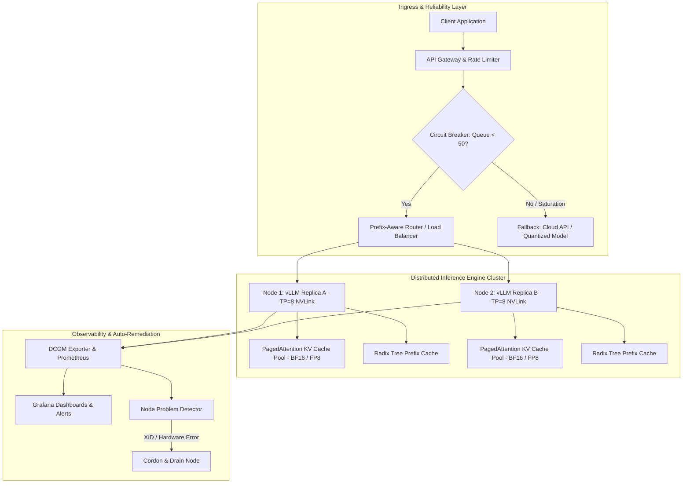

# Volume 12 Summary — AI Inference Infrastructure

Designing, deploying, and operating high-performance AI inference infrastructure requires bridging deep hardware mechanics (NVIDIA GPU architectures, NVLink, Tensor Cores, High-Bandwidth Memory) with distributed systems engineering (dynamic batching, memory allocation, multi-node scaling, and production reliability). 

Inference is not merely training in reverse; it is an interactive, low-latency service system governed by bursty arrival rates, non-deterministic sequence lengths, strict latency SLOs, and memory capacity constraints. This summary consolidates the architectural principles, master telemetry reference, unified system blueprint, production readiness checklist, and senior interview cheat sheet across Volume 12.

---

## Executive Synthesis across Volume 12

Volume 12 establishes the complete engineering spectrum required for enterprise AI inference serving:

1. **Foundations & Architecture (Chapters 01–03):** Why inference infrastructure prioritizes tail latency, TTFT/ITL metrics, and queueing over training raw throughput; the end-to-end request lifecycle; and Triton Inference Server architecture (model repositories, dynamic batching schedulers, C++ backend APIs).
2. **Engine Optimization & Acceleration (Chapters 04–06):** TensorRT graph compilation, INT8/FP8 quantization calibration, TensorRT-LLM execution loops, and modern engine features across vLLM, SGLang, TGI, and LMDeploy.
3. **Dynamic Batching & Memory Systems (Chapters 07–08):** Continuous and iteration-level batching mechanics; mathematical foundations of KV cache memory (`2 × L × H_kv × D_head × S × P`); PagedAttention block table allocation; prefix caching via Radix Trees; and chunked prefill latency stabilization.
4. **Multi-GPU Scaling & Observability (Chapters 09–10):** Tensor Parallelism (TP) vs. Pipeline Parallelism (PP) vs. Data Parallelism (DP) topologies; NVLink and InfiniBand NDR communications; GenAI benchmarking frameworks (`benchmark_serving.py`, `genai-perf`); and open-loop Poisson arrival load testing.
5. **Reliability & Operations (Chapters 11–12):** Kubernetes health probe design (Startup, Readiness, Liveness); incident response playbooks for memory leaks, silent FP8 NaN errors, and hardware XID 62 page retirements; and cluster-wide automated remediation.

---

## Unified Production System Blueprint

The diagram below synthesizes the complete end-to-end architecture of a production-grade, fault-tolerant GenAI inference platform:

---

## Master Metrics & Engine Parameter Reference

| Operational Metric / Parameter | Type / Target | Engineering Purpose | Remediation / Optimizing Parameter |
|---|---|---|---|
| `vllm:time_to_first_token_seconds` | Metric (Histogram) Target: `&lt; 200 ms` (p95) | Quantifies prefill phase latency & admission queue delay | Enable `--enable-chunked-prefill`, tune `--max-num-batched-tokens 2048` |
| `vllm:time_per_output_token_seconds` | Metric (Histogram) Target: `&lt; 20 ms` (p95) | Quantifies autoregressive decode phase generation speed | Increase HBM memory bandwidth, apply FP8/INT4 weight quantization |
| `vllm:gpu_cache_usage_perc` | Metric (Gauge) Target: `&lt; 85%` nominal | Monitors active PagedAttention KV cache block pool | Adjust `--gpu-memory-utilization 0.90`, bound `--max-num-seqs` |
| `vllm:num_requests_waiting` | Metric (Gauge) Target: `&lt; 5` nominal | Tracks queued requests awaiting engine admission | Scale DP replicas, enforce ingress rate limiting |
| `vllm:num_preempted_requests_total` | Metric (Counter) Target: Must be `0` | Detects memory thrashing and request preemptions | Set `--swap-space 0`, enable prefix caching |
| `dcgm_xid_error` | Metric (Counter) Target: Must be `0` | Detects hardware GPU faults (e.g., XID 62 ECC errors) | Trigger automated node cordon, drain, and GPU reset |

---

## Multi-GPU Parallelism Strategy Selection Matrix

| Model Size & Workload Target | Recommended Sharding Strategy | Interconnect Hardware Requirement | Operational Advantage |
|---|---|---|---|
| **7B - 14B Models (Single GPU Fits)** | Data Parallel Replicas (DP=1) | Standard PCIe / Ethernet | Maximum failure isolation; zero inter-GPU communication. |
| **70B Model (Low Latency SLO)** | Tensor Parallelism (TP=4 or TP=8) | 8-GPU NVLink / NVSwitch (`900` GB/s) | Lowest Inter-Token Latency; maximum compute parallelization. |
| **70B - 140B Model (High Throughput)** | Data Parallel Replicas of TP=4/8 | NVLink Intra-Node + 400G IB Inter-Node | Scalable cluster concurrency with prefix-aware prompt routing. |
| **405B Model (Massive Context)** | TP=8 Intra-Node + PP=2/4 Inter-Node | NVLink Mesh + InfiniBand NDR GPUDirect | Fits 405B weights across 16+ GPUs while minimizing pipeline bubbles. |

---

## Production Readiness Audit Checklist

Before launching an LLM inference deployment to production, audit your infrastructure against these critical operational requirements:

### 1. Hardware & Interconnect Topology
- [ ] Tensor Parallelism (TP) size is strictly bounded within intra-node NVLink/NVSwitch boundaries (e.g., `TP &lt;= 8`).
- [ ] Multi-node Pipeline Parallelism (PP) or Data Parallelism (DP) communicates over dedicated 400G InfiniBand NDR or RoCEv2 with GPUDirect RDMA enabled (`NCCL_NET_GDR_LEVEL=5`).
- [ ] Topology verification command (`nvidia-smi topo -m`) confirms direct NVLink interconnects across all TP ranks.

### 2. Engine & Memory Optimization
- [ ] PagedAttention block size is tuned (16 or 32 tokens) with zero host CPU swapping (`--swap-space 0`).
- [ ] Prefix Caching (`--enable-prefix-caching`) is enabled for system prompt reuse.
- [ ] Chunked Prefill (`--enable-chunked-prefill`) is configured to stabilize Inter-Token Latency under heavy prompt traffic.
- [ ] GPU Memory Utilization target (`--gpu-memory-utilization`) is set to `&lt;= 0.90` to preserve CUDA/PyTorch workspace headroom.

### 3. Observability & Reliability
- [ ] Kubernetes Startup Probe allows up to 10 minutes for slow model weight loading (`initialDelaySeconds: 30`, `failureThreshold: 60`).
- [ ] Kubernetes Readiness Probe evaluates engine `/health` status without executing dummy inference calls.
- [ ] DCGM Exporter and Node Problem Detector are deployed to automatically cordon nodes on XID hardware errors.
- [ ] Ingress Circuit Breakers shed load with HTTP 429/503 when queue depth or KV cache saturation exceeds safety thresholds.

---

## Senior Solutions Architect Interview Cheat Sheet

### 1. Training vs. Inference Trade-offs
- **Core Principle:** Training optimizes for aggregate token throughput over days/weeks; inference optimizes for latency SLOs (TTFT, ITL), concurrency, and availability under bursty arrival rates.

### 2. KV Cache Memory Math
- **Formula:** `M_kv = 2 × L × H_kv × D_head × S × P`.
- **Key Insight:** Grouped-Query Attention (GQA) reduces KV cache memory by 8x compared to Multi-Head Attention (MHA) by sharing KV heads across query groups.

### 3. PagedAttention Mechanics
- **Core Mechanism:** Virtual block tables map logical sequence tokens to non-contiguous physical memory blocks (16/32 tokens). Eliminates external fragmentation and reduces memory waste from `> 60%` to `&lt; 4%`.

### 4. Prefill vs. Decode Disaggregation
- **Prefill Phase:** Compute-bound (`O(N^2)` matrix multiplication on Tensor Cores). Determines Time to First Token (TTFT).
- **Decode Phase:** Memory-bandwidth-bound (`O(1)` transfer of weights and KV cache from HBM). Determines Inter-Token Latency (ITL).

### 5. Tensor Parallelism (TP) vs. Pipeline Parallelism (PP)
- **TP:** Splits layer weight matrices. Requires 2 AllReduce calls per layer per token. Must run over NVLink (`900` GB/s).
- **PP:** Splits sequential layers across nodes. Communicates only at stage boundaries via Point-to-Point transfers over InfiniBand.

### 6. Continuous Batching
- **Mechanism:** Schedules requests at the iteration level rather than the sequence level. Newly arrived prompts join the execution batch immediately without waiting for existing sequences to complete generation.

### 7. Open-Loop vs. Closed-Loop Load Testing
- **Closed-Loop:** Client thread waits for response before sending next request. Artificially caps queue depth, hiding tail latency.
- **Open-Loop:** Dispatches requests following a Poisson arrival process. Accurately exposes admission queue collapse and true system capacity limits.

### 8. Kubernetes Health Probes for LLMs
- **Rule:** Never test model execution in liveness or readiness probes. Use a Startup Probe with generous timeouts for weight downloads, a lightweight status Readiness Probe (`/health`), and a process-only Liveness Probe (`/ping`).

### 9. GPU Hardware Fault Handling (XID Errors)
- **Mechanism:** XID 62 (Double-Bit ECC error) deadlocks CUDA contexts and halts TP NCCL rings. Automated remediation requires DCGM Exporter + Node Problem Detector to cordon and drain the affected node immediately.

### 10. Prefix-Aware Routing
- **Mechanism:** Hashes incoming system prompts and routes requests with matching prefixes to the same engine replica, maximizing Radix Tree cache hit rates (`> 85%`) and skipping redundant prefill compute.

---

## Conclusion & Path Forward

Mastering AI inference infrastructure is the foundation of deploying production-ready, scalable, and resilient Generative AI applications. By aligning mathematical capacity planning, high-speed interconnect hardware topologies, modern serving engine architectures, and rigorous site reliability engineering, platform engineers ensure that AI systems meet tight customer SLOs with high cost-efficiency and 99.99% operational uptime.
