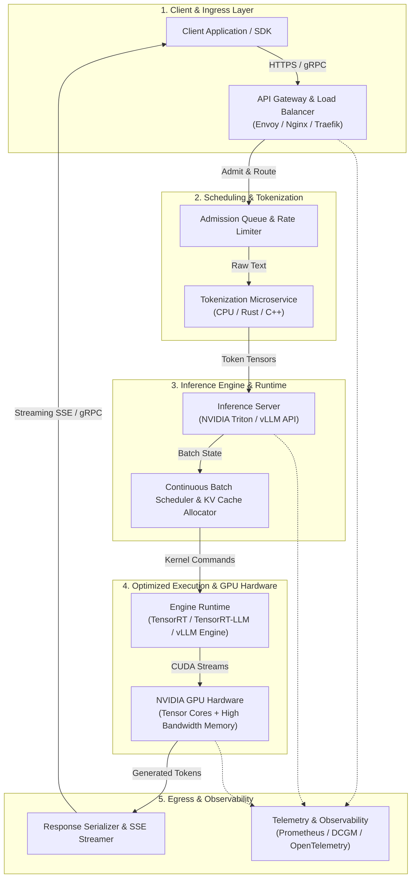

# Volume 12 — AI Inference

Training produces a model. Inference turns that model into a high-availability, low-latency production service. Once a model transitions from offline training to live deployment, the infrastructure problem changes fundamentally: from maximizing aggregate training FLOPs over days to serving unpredictable, bursty user requests within strict millisecond-level Service Level Objectives (SLOs), tight memory budgets, and high availability targets.

This volume provides a comprehensive engineering guide to AI inference infrastructure. It traces an inference request through every layer of the modern inference stack—from client API gateways, tokenizers, queueing schedulers, and inference servers (such as NVIDIA Triton, vLLM, and TensorRT-LLM) to GPU hardware kernels, high-bandwidth memory (HBM), and real-time streaming response protocols.

| Volume Field | Value |
|---|---|
| **Difficulty** | Advanced |
| **Estimated Reading Time** | 20–26 hours |
| **Prerequisites** | Volumes 01–11 (CUDA Architecture, GPU Hardware, Kubernetes, Telemetry) |
| **Primary Focus** | Production AI serving platforms, LLM engine internals, latency optimization |
| **Outcome** | Design, deploy, benchmark, scale, and troubleshoot enterprise inference systems |

---

## Big Picture Architecture

**Figure 12.0.1 — The End-to-End AI Inference Pipeline.** Total request latency is the cumulative sum of delays across network ingress, admission queueing, host CPU tokenization, engine batch scheduling, CUDA kernel execution, and response serialization.

---

## Key Performance Indicators (KPIs) Matrix

Inference engineering requires tracking metrics across multiple operational dimensions to balance user experience, compute efficiency, and infrastructure cost.

| Metric | Target / Unit | Mathematical Definition / Scope | Operational Impact |
|---|---|---|---|
| **Time To First Token (TTFT)** | $< 200\text{ ms}$ | Latency from request submission to first token delivery | Primary user responsiveness metric for interactive AI applications |
| **Inter-Token Latency (ITL)** | $< 25\text{ ms/token}$ | Delta time between consecutive output token arrivals | Determines reading smoothness and user-perceived streaming speed |
| **Time Per Output Token (TPOT)** | $< 30\text{ ms/token}$ | Total decode phase duration divided by generated output token count | Reflects memory-bandwidth-bound GPU kernel execution efficiency |
| **P99 Queue Latency** | $< 50\text{ ms}$ | Time spent waiting in admission buffers prior to GPU execution | Early indicator of cluster capacity saturation and SLA breach risk |
| **KV Cache Utilization** | $70\% - 85\%$ | Percentage of GPU HBM allocated to dynamic key-value blocks | Controls maximum concurrent sequence capacity before backpressure |
| **Model Load Time** | $< 30\text{ sec}$ | Duration to load engine weights from storage into GPU HBM | Dictates pod autoscaling responsiveness and dynamic model swapping |

---

## Volume 12 Chapter Roadmap

This volume is structured into four sequential modules:

### Module 1: Foundations & Core Request Lifecycle
- **Chapter 01 — Why Inference Infrastructure Is Different:** Contrast training vs. inference execution models, memory footprints, FLOP-to-byte arithmetic intensity, prefill vs. decode phases, and latency percentiles.
- **Chapter 02 — The End-to-End Inference Request Path:** Deep dive into every network hop, host memory allocation, tokenizer thread pool, dynamic scheduler iteration, and streaming socket write.
- **Chapter 03 — Triton Inference Server Architecture:** Master NVIDIA Triton's C++ core, model repository schemas, backend ecosystem, dynamic batching, instance groups, and Business Logic Scripting (BLS).

### Module 2: Optimization Engines & Runtimes
- **Chapter 04 — TensorRT Optimization and Engine Lifecycle:** Explore graph compilation, kernel auto-tuning, precision calibration (FP16, INT8, FP8), dynamic shapes, and plan file serialization.
- **Chapter 05 — TensorRT-LLM and LLM Execution:** Master TensorRT-LLM architecture, multi-GPU tensor parallelism, KV cache management, and optimized attention kernels (FlashAttention, FlashDecoding).
- **Chapter 06 — vLLM, TGI, SGLang, and LMDeploy:** Compare open-source serving runtimes, memory management architectures, and state-of-the-art serving paradigms.

### Module 3: Advanced Batching, Memory & Scalability
- **Chapter 07 — Continuous and Dynamic Batching:** Deep dive into static, dynamic, iteration-level continuous batching, and chunked prefill to eliminate tail latency stalls.
- **Chapter 08 — KV Cache, Memory, and Concurrency:** Master PagedAttention, vLLM block allocators, prefix caching, memory fragmentation, and OOM prevention strategies.
- **Chapter 09 — Scaling Multi-GPU and Multi-Node Inference:** Architect tensor-parallel, pipeline-parallel, and expert-parallel inference serving across multi-GPU nodes.

### Module 4: Operations, Telemetry & Reliability
- **Chapter 10 — Performance Metrics and Benchmarking:** Master load testing with `perf_analyzer`, `vllm benchmark`, PromQL metrics analysis, and automated SLA regression testing.
- **Chapter 11 — Production Reliability and Troubleshooting:** Debug real-world production incidents including KV cache OOM crashes, tokenization CPU bottlenecks, CUDA stream deadlocks, and dynamic batching tail latency spikes.
- **Chapter 12 — Volume 12 Summary:** Synthesis of core principles, production readiness checklists, architectural decision frameworks, and career interview preparation.

---

## Production Hands-On Labs

Volume 12 includes four production-grade hands-on laboratories designed to build practical mastery:

1. **[Lab 01 — Deploy and Validate Triton](./labs/lab-01-deploy-and-validate-triton):** Build and deploy a multi-model Triton server instance with custom dynamic batching policies and health check integration.
2. **[Lab 02 — Benchmark Dynamic Batching](./labs/lab-02-benchmark-dynamic-batching):** Use `perf_analyzer` to sweep queue delay parameters and generate empirical throughput-versus-latency Pareto curves.
3. **[Lab 03 — Deploy an LLM with vLLM](./labs/lab-03-deploy-an-llm-with-vllm):** Deploy a 70B parameter model across multiple GPUs with PagedAttention, prefix caching, and OpenAI-compatible streaming endpoints.
4. **[Lab 04 — Troubleshoot a Slow Inference Pipeline](./labs/lab-04-troubleshoot-a-slow-inference-pipeline):** Diagnose and remediate a simulated production incident involving CPU tokenization bottlenecks and streaming TCP buffer bloat.

---

## Authoritative References

- **NVIDIA Triton Inference Server Documentation:** [https://github.com/triton-inference-server/server](https://github.com/triton-inference-server/server)
- **NVIDIA TensorRT Documentation:** [https://developer.nvidia.com/tensorrt](https://developer.nvidia.com/tensorrt)
- **TensorRT-LLM Architecture Guide:** [https://github.com/NVIDIA/TensorRT-LLM](https://github.com/NVIDIA/TensorRT-LLM)
- **vLLM: Efficient Memory Management for Large Language Model Serving (Kwon et al., SOSP 2023):** [https://arxiv.org/abs/2309.06180](https://arxiv.org/abs/2309.06180)
- **KServe v2 Data Plane Protocol Specification:** [https://kserve.github.io/website/](https://kserve.github.io/website/)
