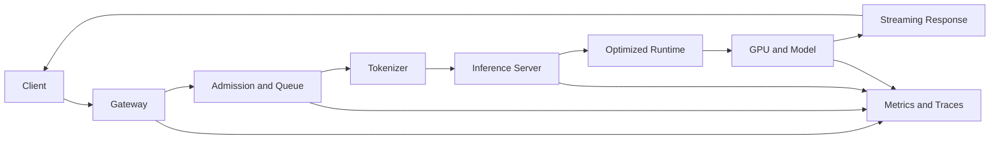

# Volume 12 — AI Inference

Training produces a model. Inference turns that model into a service. The infrastructure problem changes from maximizing long-running throughput to serving unpredictable requests within latency, availability, memory, and cost constraints.

This volume follows an inference request from client to tokenizer, scheduler, runtime, GPU, and streaming response. It then explores Triton, TensorRT, TensorRT-LLM, vLLM, alternative serving engines, batching, KV cache, scaling, observability, benchmarking, and incident response.

| Volume field | Value |
|---|---|
| Difficulty | Advanced |
| Estimated reading time | 20–26 hours |
| Prerequisites | Volumes 01–11 |
| Primary focus | Production model serving architecture |
| Outcome | Design, deploy, benchmark, and troubleshoot inference platforms |

## Big Picture

**Figure 12.0.1 — Inference latency is the sum of every stage.** A fast GPU cannot compensate for queueing, tokenization, memory pressure, or network delay.

## Chapters

1. [Why Inference Infrastructure Is Different](./chapter-01-why-inference-infrastructure-is-different)
2. [The End-to-End Inference Request Path](./chapter-02-the-end-to-end-inference-request-path)
3. [Triton Inference Server Architecture](./chapter-03-triton-inference-server-architecture)
4. [TensorRT Optimization and Engine Lifecycle](./chapter-04-tensorrt-optimization-and-engine-lifecycle)
5. [TensorRT-LLM and LLM Execution](./chapter-05-tensorrt-llm-and-llm-execution)
6. [vLLM, TGI, SGLang, and LMDeploy](./chapter-06-vllm-tgi-sglang-and-lmdeploy)
7. [Continuous and Dynamic Batching](./chapter-07-continuous-and-dynamic-batching)
8. [KV Cache, Memory, and Concurrency](./chapter-08-kv-cache-memory-and-concurrency)
9. [Scaling Multi-GPU and Multi-Node Inference](./chapter-09-scaling-multi-gpu-and-multi-node-inference)
10. [Performance Metrics and Benchmarking](./chapter-10-performance-metrics-and-benchmarking)
11. [Production Reliability and Troubleshooting](./chapter-11-production-reliability-and-troubleshooting)
12. [Volume 12 Summary](./chapter-12-volume-12-summary)

## Labs

- [Deploy and Validate Triton](./labs/lab-01-deploy-and-validate-triton)
- [Benchmark Dynamic Batching](./labs/lab-02-benchmark-dynamic-batching)
- [Deploy an LLM with vLLM](./labs/lab-03-deploy-an-llm-with-vllm)
- [Troubleshoot a Slow Inference Pipeline](./labs/lab-04-troubleshoot-a-slow-inference-pipeline)
