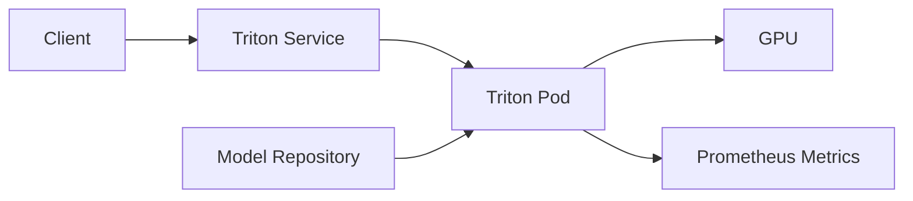

# Lab 01 — Deploy and Validate Triton

## Objective

Deploy Triton in a controlled environment, load a simple model, validate liveness, readiness, inference, GPU visibility, and metrics.

## Architecture



## Prerequisites

Kubernetes GPU node or Docker host, NVIDIA runtime, model repository, pinned Triton image, and permission to expose test ports.

## Deployment

Create a versioned model repository and start Triton with explicit model-control and repository settings. Record the image digest and configuration.

## Validation

```bash
curl -s http://<endpoint>/v2/health/live
curl -s http://<endpoint>/v2/health/ready
curl -s http://<endpoint>/v2/models/<model>/ready
curl -s http://<metrics-endpoint>/metrics | head
```

Expected responses show server and model readiness.

## Verification

Send a known input, compare output with the expected value, and confirm GPU activity and model metrics.

## Failure Injection

Rename or corrupt a test model version. Observe the difference between server health and model readiness.

## Troubleshooting

Inspect model repository paths, backend logs, configuration parsing, GPU memory, runtime compatibility, and readiness endpoints.

## Cleanup

Delete the test deployment, service, and model artifacts. Preserve logs and configuration for comparison.
