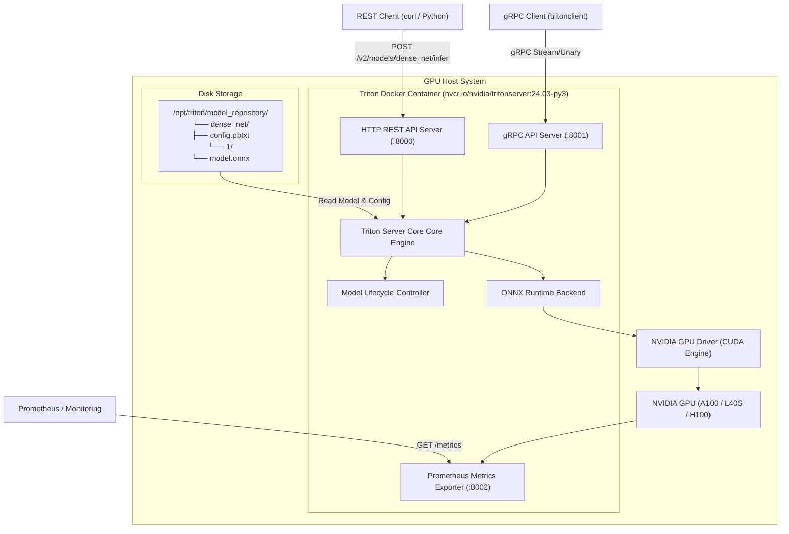
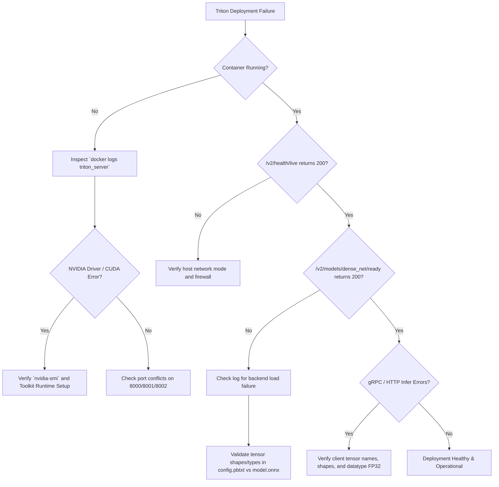

# Lab 01 — Deploy and Validate Triton Inference Server

## 1. Title and Metadata

```yaml
Title: Deploy and Validate Triton Inference Server
Volume: 12
Chapter: 02
Difficulty: Intermediate
Estimated Time: 45 Minutes
Prerequisites: Linux CLI, Docker / NVIDIA Container Toolkit, basic Python, GPU host access
Target Platform: NVIDIA Ampere/Ada/Hopper/Blackwell GPUs, Ubuntu 22.04 LTS / Rocky Linux 9
Target Audience: Machine Learning Engineers, Platform Engineers, SREs, MLOps Architects
Lab Type: Hands-on Operational Lab
```

This lab provides hands-on experience deploying NVIDIA Triton Inference Server in a production-grade containerized environment. You will construct a versioned model repository, configure backend specs, validate health and inference endpoints over REST and gRPC protocols, inspect hardware metric instrumentation, and manage model lifecycles without server downtime.

---

## 2. Objective

By completing this lab, you will:
1. Construct an explicit, versioned Triton model repository conforming to the standard directory layout.
2. Formulate a complete `config.pbtxt` defining model backends, tensor dimensions, precision data types, and execution settings.
3. Deploy NVIDIA Triton Server using Docker and the NVIDIA Container Toolkit with host GPU Passthrough.
4. Validate operational status using Triton's HTTP REST (v2 API) and gRPC interfaces.
5. Scrape and interpret Prometheus metrics exposed by Triton for GPU memory, infer request throughput, and execution latency.
6. Perform dynamic model loading and unloading via Triton's Model Control API.
7. Inject safe, scoped failure modes (corrupted configurations, missing model artifacts) to differentiate between Server Liveness and Model Readiness.

---

## 3. Prerequisites

Before starting this lab, ensure you have:
- An NVIDIA GPU node with driver version >= 535.104.05 installed.
- Docker Engine installed with `nvidia-container-toolkit` configured as the default container runtime.
- Host system utilities: `curl`, `jq`, `python3`, `pip`, `tar`, `wget`.
- Basic understanding of neural network tensor inputs and outputs.
- Port availability on the host system: `8000` (HTTP REST), `8001` (gRPC), `8002` (Prometheus Metrics).

---

## 4. Architecture and Lab Topology

The following diagram illustrates the deployment topology for Triton Inference Server and its interaction with clients and host hardware:



---

## 5. Required Tools and Software

| Tool / Component | Version Requirement | Purpose |
|---|---|---|
| NVIDIA Driver | >= 535.104.05 | GPU hardware control and CUDA runtime support |
| Docker Engine | >= 24.0.0 | Container isolation and runtime execution |
| NVIDIA Container Toolkit | >= 1.14.0 | Exposing host GPU resources into container |
| Triton Inference Server | 24.03-py3 | AI model serving engine |
| Triton Python Client | >= 2.43.0 | Issuing gRPC/HTTP inference requests |
| `curl` / `jq` | Any modern version | Querying HTTP endpoints and parsing JSON |
| `perf_analyzer` | Matches Triton release | High-performance load benchmarking tool |

---

## 6. Environment Setup

Establish the local workspace directory structure and set necessary shell environment variables:

```bash
# Define environment variables
export TRITON_LAB_DIR="${HOME}/triton_lab"
export MODEL_REPO="${TRITON_LAB_DIR}/model_repository"
export TRITON_IMAGE="nvcr.io/nvidia/tritonserver:24.03-py3"

# Create workspace and model repository directories
mkdir -p "${MODEL_REPO}/dense_net/1"
cd "${TRITON_LAB_DIR}"

# Download a pre-trained ONNX model (DenseNet-121) for validation
wget -O "${MODEL_REPO}/dense_net/1/model.onnx" \
  https://github.com/onnx/models/raw/main/validated/vision/classification/densenet-121/model/densenet-3.onnx
```

Verify that the model file exists and has non-zero size:

```bash
ls -lh "${MODEL_REPO}/dense_net/1/model.onnx"
```

Next, write the Triton model configuration file (`config.pbtxt`):

```bash
cat <<'EOF' > "${MODEL_REPO}/dense_net/config.pbtxt"
name: "dense_net"
platform: "onnxruntime_onnx"
max_batch_size: 8

input [
  {
    name: "data_0"
    data_type: TYPE_FP32
    dims: [ 3, 224, 224 ]
  }
]

output [
  {
    name: "fc6_1"
    data_type: TYPE_FP32
    dims: [ 1000, 1, 1 ]
  }
]

instance_group [
  {
    count: 1
    kind: KIND_GPU
    gpus: [ 0 ]
  }
]
EOF
```

---

## 7. Estimated Duration

- Total Time: **45 Minutes**
  - Environment Setup & Model Repo Setup: 10 mins
  - Triton Container Deployment: 10 mins
  - REST & gRPC Verification: 10 mins
  - Metrics Inspection & Dynamic Model Control: 10 mins
  - Failure Injection & Teardown: 5 mins

---

## 8. Safety and Safeguards

- **Isolated Container Ports**: Ensure ports `8000`, `8001`, and `8002` are not exposed to untrusted external networks without authentication.
- **Resource Constraints**: Limit Triton container memory and GPU visibility using `--gpus '"device=0"'` to prevent accidental resource contention on multi-GPU hosts.
- **Model Control Protection**: Operate model control under `--model-control-mode=explicit` during production maintenance to avoid unauthorized auto-reloading of damaged model files.

---

## 9. Baseline Verification

Before launching Triton Server, verify that the host GPU environment and container runtime are operating correctly:

```bash
# 1. Check NVIDIA Driver status
nvidia-smi

# 2. Check NVIDIA Container Toolkit capability
docker run --rm --gpus all nvidia/cuda:12.3.2-base-ubuntu22.04 nvidia-smi

# 3. Check TCP ports availability
netstat -tulpn | grep -E '8000|8001|8002' || echo "Ports 8000, 8001, 8002 are free."
```

If `nvidia-smi` fails or ports are bound by another service, resolve host drivers or terminate conflicting services before proceeding.

---

## 10. Step-by-Step Task Instructions

### Task 1: Deploy Triton Inference Server Container

Launch the Triton container in detached mode with explicit model control, verbose logging, and host volume mounts for the model repository.

```bash
docker run -d --name triton_server \
  --gpus '"device=0"' \
  --shm-size=1g \
  --net=host \
  -v "${MODEL_REPO}:/models" \
  ${TRITON_IMAGE} \
  tritonserver \
  --model-repository=/models \
  --model-control-mode=explicit \
  --load-model=dense_net \
  --log-verbose=1
```

Confirm the container is running and inspect startup logs:

```bash
docker logs triton_server | tail -n 25
```

### Task 2: Validate Server Health Endpoints (REST API)

Triton exposes HTTP REST endpoints based on the KServe v2 Data Plane Protocol.

1. **Verify Server Liveness**:
   ```bash
   curl -i -s http://localhost:8000/v2/health/live
   ```
2. **Verify Server Readiness**:
   ```bash
   curl -i -s http://localhost:8000/v2/health/ready
   ```
3. **Verify Model Readiness**:
   ```bash
   curl -i -s http://localhost:8000/v2/models/dense_net/ready
   ```
4. **Query Model Metadata**:
   ```bash
   curl -s http://localhost:8000/v2/models/dense_net | jq .
   ```

### Task 3: Perform Inference Validation via gRPC

Install the official Python Triton client library and execute a test inference script.

```bash
# Install Triton Python client and numpy
pip install tritonclient[all] numpy

# Create a test client script
cat <<'EOF' > "${TRITON_LAB_DIR}/test_infer.py"
import numpy as np
import tritonclient.grpc as grpcclient

# Create client connected to gRPC port 8001
client = grpcclient.InferenceServerClient(url="localhost:8001")

# Construct synthetic dummy tensor matching [batch_size=1, channels=3, height=224, width=224]
input_data = np.random.randn(1, 3, 224, 224).astype(np.float32)

inputs = [grpcclient.InferInput("data_0", input_data.shape, "FP32")]
inputs[0].set_data_from_numpy(input_data)

outputs = [grpcclient.InferRequestedOutput("fc6_1")]

# Query Triton gRPC infer endpoint
response = client.infer(model_name="dense_net", inputs=inputs, outputs=outputs)
output_array = response.as_numpy("fc6_1")

print("Inference successful!")
print(f"Output tensor shape: {output_array.shape}")
print(f"Top 5 prediction scores: {output_array.flatten()[:5]}")
EOF

python3 "${TRITON_LAB_DIR}/test_infer.py"
```

### Task 4: Scrape Prometheus Observability Metrics

Query Triton's metric port (`8002`) to inspect real-time server statistics:

```bash
curl -s http://localhost:8002/metrics | grep -E 'nv_inference_request_success|nv_gpu_memory_used_bytes|nv_inference_exec_count'
```

### Task 5: Execute Dynamic Model Lifecycle Management

Using Model Control API (`--model-control-mode=explicit`), dynamically unload and reload models without restarting the Triton daemon.

1. **Unload `dense_net`**:
   ```bash
   curl -i -X POST http://localhost:8000/v2/repository/models/dense_net/unload
   ```
2. **Verify model is unready**:
   ```bash
   curl -i -s http://localhost:8000/v2/models/dense_net/ready
   ```
3. **Reload `dense_net`**:
   ```bash
   curl -i -X POST http://localhost:8000/v2/repository/models/dense_net/load
   ```
4. **Verify model is ready again**:
   ```bash
   curl -i -s http://localhost:8000/v2/models/dense_net/ready
   ```

---

## 11. Command Execution Standards

Every operational command must be understood through its objective, expected evidence, internal mechanics, and failure interpretation.

### Command 1: Launch Triton Container
- **Purpose**: Run Triton Inference Server with host GPU access and explicit model loading.
- **Command**:
  ```bash
  docker run -d --name triton_server --gpus '"device=0"' --shm-size=1g --net=host -v "${MODEL_REPO}:/models" ${TRITON_IMAGE} tritonserver --model-repository=/models --model-control-mode=explicit --load-model=dense_net --log-verbose=1
  ```
- **Expected Evidence**: Docker prints a 64-character container ID string, and `docker ps` shows status `Up`.
- **Explanation**: Mounts the host model repository into `/models` inside the container. Configures Triton to operate in explicit control mode so models are loaded only upon explicit command or startup flag `--load-model`.
- **Common Failure Interpretation**: If the container exits immediately, check `docker logs triton_server`. Typical causes include missing NVIDIA container drivers, invalid volume paths, or port standard conflicts.

### Command 2: Query Model Readiness
- **Purpose**: Check if a specific model (`dense_net`) is fully loaded in GPU memory and ready to service requests.
- **Command**:
  ```bash
  curl -i -s http://localhost:8000/v2/models/dense_net/ready
  ```
- **Expected Evidence**: `HTTP/1.1 200 OK` header response with empty body.
- **Explanation**: Queries the KServe v2 health API. The server verifies that model backends are initialized and CUDA kernels compiled.
- **Common Failure Interpretation**: Returning `HTTP/1.1 404 Not Found` indicates the model failed to load, has syntax errors in `config.pbtxt`, or was never requested to load.

### Command 3: Execute gRPC Inference Test
- **Purpose**: Validate data pipeline end-to-end over high-performance gRPC.
- **Command**:
  ```bash
  python3 "${TRITON_LAB_DIR}/test_infer.py"
  ```
- **Expected Evidence**: Console prints `Inference successful!` along with output tensor shape `(1, 1000, 1, 1)`.
- **Explanation**: Serializes input NumPy array into Protobuf binary format, transmits over gRPC channel on port 8001, Triton executes ONNX runtime engine on GPU 0, and returns binary tensor response.
- **Common Failure Interpretation**: `grpc._channel._InactiveRpcError: &lt;_InactiveRpcError of RPC that terminated with status StatusCode.UNAVAILABLE>` indicates Triton is not running, gRPC port 8001 is unreachable, or host firewall is blocking connections.

### Command 4: Inspect Prometheus Metrics
- **Purpose**: Verify hardware metric instrumentation and request count tracking.
- **Command**:
  ```bash
  curl -s http://localhost:8002/metrics | grep 'nv_inference_request_success'
  ```
- **Expected Evidence**: Lines containing `nv_inference_request_success{gpu_uuid="...",model="dense_net",version="1"} 1`.
- **Explanation**: Reads Triton internal telemetry counters exported in standard OpenMetrics text format for Prometheus collection.
- **Common Failure Interpretation**: If no metrics are returned or metric output is blank, check if `--metrics-port=8002` was modified or disabled.

### Command 5: Dynamically Unload Model
- **Purpose**: Free GPU memory resources by unloading a model instance at runtime.
- **Command**:
  ```bash
  curl -i -X POST http://localhost:8000/v2/repository/models/dense_net/unload
  ```
- **Expected Evidence**: `HTTP/1.1 200 OK` header response.
- **Explanation**: Signals the Triton model controller to flush CUDA memory context and unload the ONNX runtime engine instance while keeping the server running.
- **Common Failure Interpretation**: `HTTP/1.1 400 Bad Request` occurs if `--model-control-mode` is set to `none` (default auto-poll mode) instead of `explicit`.

---

## 12. Illustrative Output

### Triton Container Startup Log Snippet (`docker logs triton_server`)
```text
I0806 14:10:05.123456 1 main.cc:494] Starting Triton Inference Server '2.44.0'
I0806 14:10:05.125678 1 server.cc:604] Initializing Triton Inference Server
I0806 14:10:05.189012 1 model_lifecycle.cc:460] loading: dense_net:1
I0806 14:10:05.345678 1 onnxruntime.cc:2560] TRITONBACKEND_ModelInstanceInitialize: dense_net_0 (GPU device 0)
I0806 14:10:05.512345 1 model_lifecycle.cc:821] successfully loaded 'dense_net' version 1
I0806 14:10:05.514567 1 grpc_server.cc:2513] Started gRPCService at 0.0.0.0:8001
I0806 14:10:05.515678 1 http_server.cc:4497] Started HTTPService at 0.0.0.0:8000
I0806 14:10:05.556789 1 metrics.cc:785] Started Metrics Service at 0.0.0.0:8002
```

### Prometheus Metrics Endpoint Output Snippet (`curl http://localhost:8002/metrics`)
```text
# HELP nv_inference_request_success Number of successful inference requests, all versions.
# TYPE nv_inference_request_success counter
nv_inference_request_success{gpu_uuid="GPU-a1b2c3d4-e5f6-7890-1234-56789abcdef0",model="dense_net",version="1"} 1.000000

# HELP nv_inference_exec_count Number of inference execution batches performed.
# TYPE nv_inference_exec_count counter
nv_inference_exec_count{gpu_uuid="GPU-a1b2c3d4-e5f6-7890-1234-56789abcdef0",model="dense_net",version="1"} 1.000000

# HELP nv_gpu_memory_used_bytes GPU memory used in bytes.
# TYPE nv_gpu_memory_used_bytes gauge
nv_gpu_memory_used_bytes{gpu_uuid="GPU-a1b2c3d4-e5f6-7890-1234-56789abcdef0"} 1485832192
```

---

## 13. Failure Injection

In this exercise, you will inject a configuration corruption failure to observe the critical operational difference between **Server Liveness** (`/v2/health/live`) and **Model Readiness** (`/v2/models/&lt;model&gt;/ready`).

### Failure Scenario: Corrupting `config.pbtxt` Input Data Type

1. Modify `config.pbtxt` to introduce an unsupported data type (`TYPE_STRING` instead of `TYPE_FP32` for image floating-point tensors):
   ```bash
   cp "${MODEL_REPO}/dense_net/config.pbtxt" "${MODEL_REPO}/dense_net/config.pbtxt.bak"
   sed -i 's/TYPE_FP32/TYPE_STRING/g' "${MODEL_REPO}/dense_net/config.pbtxt"
   ```

2. Issue a dynamic reload command to trigger Triton model validation:
   ```bash
   curl -i -X POST http://localhost:8000/v2/repository/models/dense_net/load
   ```

3. **Observe the Failure Response**:
   - The reload command returns `HTTP/1.1 400 Bad Request`.
   - Inspect Server Liveness:
     ```bash
     curl -i -s http://localhost:8000/v2/health/live
     ```
     *Output*: `HTTP/1.1 200 OK` (Server core is alive and running).
   - Inspect Model Readiness:
     ```bash
     curl -i -s http://localhost:8000/v2/models/dense_net/ready
     ```
     *Output*: `HTTP/1.1 404 Not Found` (Model failed validation and is NOT ready).

4. **Inspect Container Logs**:
   ```bash
   docker logs triton_server | tail -n 15
   ```
   *Log Evidence*: `error: loading 'dense_net' version 1 failed: ONNX runtime backend does not support data type TYPE_STRING`.

5. **Recovery**: Restore the valid configuration and reload model:
   ```bash
   cp "${MODEL_REPO}/dense_net/config.pbtxt.bak" "${MODEL_REPO}/dense_net/config.pbtxt"
   curl -i -X POST http://localhost:8000/v2/repository/models/dense_net/load
   curl -i -s http://localhost:8000/v2/models/dense_net/ready
   ```

---

## 14. Troubleshooting and Recovery

### Decision Tree for Triton Deployment Diagnostics



### Quick Diagnostic Cheat Sheet

| Symptom | Primary Cause | Resolution Command |
|---|---|---|
| Container exit code 139 | Shared memory limits exhausted | Pass `--shm-size=1g` or higher in `docker run` |
| `HTTP 404` on Model Ready | Model directory missing or load failed | `docker logs triton_server \| grep -E 'error\|failed'` |
| `gRPC StatusCode.UNAVAILABLE` | Port 8001 bound or network firewall | `netstat -tulpn \| grep 8001` |
| `CUDA out of memory` | GPU VRAM overcommitted | Reduce `count` in `instance_group` or model batch size |

---

## 15. Validation and Verification Checklist

| Verification Item | Pass Condition | Status |
|---|---|---|
| GPU Driver & Docker Toolkit | `docker run --gpus all nvidia/cuda...` succeeds | [ ] |
| Model Repository Structure | Directories `/models/&lt;model_name&gt;/&lt;version&gt;/model.onnx` exist | [ ] |
| Server Liveness Endpoint | `GET /v2/health/live` returns HTTP 200 | [ ] |
| Server Readiness Endpoint | `GET /v2/health/ready` returns HTTP 200 | [ ] |
| Model Readiness Endpoint | `GET /v2/models/dense_net/ready` returns HTTP 200 | [ ] |
| gRPC Inference Validation | Python script prints tensor output shape `(1, 1000, 1, 1)` | [ ] |
| Prometheus Instrumentation | `GET :8002/metrics` outputs `nv_inference_request_success` | [ ] |
| Dynamic Unload / Reload | `POST /v2/repository/models/.../unload` toggles 200 / 404 | [ ] |

---

## 16. Cleanup and Teardown

Execute the following commands to safely terminate containers, remove generated model artifacts, and reset environment settings:

```bash
# 1. Stop and remove Triton Docker container
docker stop triton_server && docker rm triton_server

# 2. Remove lab workspace directory and model files
rm -rf "${TRITON_LAB_DIR}"

# 3. Unset environment variables
unset TRITON_LAB_DIR MODEL_REPO TRITON_IMAGE

# 4. Confirm ports are freed
netstat -tulpn | grep -E '8000|8001|8002' || echo "Cleanup complete. Ports freed."
```

---

## 17. Production Considerations

When transitioning Triton Inference Server from lab environments to production Kubernetes clusters:

1. **Kubernetes Probe Design**:
   - **Liveness Probe**: Point to `http://localhost:8000/v2/health/live`. Restarting the container if a single model fails can cause cascade outages.
   - **Readiness Probe**: Point to `http://localhost:8000/v2/health/ready`. Removes the pod from Kubernetes Service endpoints if loaded models are not ready.
2. **Model Control Mode**:
   - Use `--model-control-mode=explicit` or `--model-control-mode=poll` with explicit model version policies. Never allow unvalidated auto-reloading in multi-tenant environments.
3. **Model Repository Storage**:
   - For cloud-native deployments, mount model repositories directly from Object Storage (S3, GCS, Azure Blob) via Triton native cloud storage connectors (`--model-repository=s3://my-bucket/models`).
4. **Shared Memory (`/dev/shm`) Configuration**:
   - Triton IPC backends rely heavily on POSIX shared memory. Ensure Kubernetes Pod specifications configure an `emptyDir` with `medium: Memory` mounted at `/dev/shm` (e.g. 2Gi-8Gi).

---

## 18. Summary and Next Steps

In this lab, you successfully deployed NVIDIA Triton Inference Server, built a structured model repository, configured model metadata, and verified inference execution over REST and gRPC. You also gained practical insight into observability metrics, dynamic model lifecycle management, and failure isolation between server liveness and model readiness.

**Next Lab**: In **Lab 02 — Benchmark Dynamic Batching**, you will configure Triton's dynamic batching engine (`dynamic_batching` block in `config.pbtxt`) and use `perf_analyzer` to evaluate queue delay, preferred batch sizes, request throughput (RPS), and tail latency (p95/p99 SLOs).
