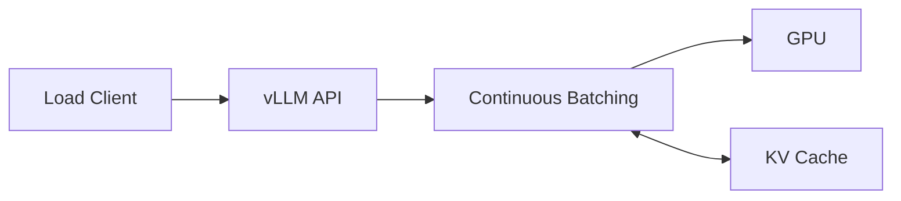

# Lab 03 — Deploy an LLM with vLLM

## Objective

Deploy a model that fits the available GPU, expose an OpenAI-compatible test endpoint, validate streaming, and measure time to first token and token throughput.

## Prerequisites

Approved model access, pinned vLLM image, sufficient GPU memory, persistent model cache or registry access, and an isolated namespace.

## Architecture

## Validation

Send deterministic prompts, verify response shape, streaming, model identity, and health. Record cold-start and warm-start behavior.

## Performance

Measure time to first token, inter-token latency, tokens per second, active sequences, and cache occupancy at increasing concurrency.

## Failure Injection

Submit requests with context or output lengths above the approved service limit. Verify rejection or controlled failure rather than node instability.

## Cleanup

Delete the deployment and temporary model cache if required by policy.
