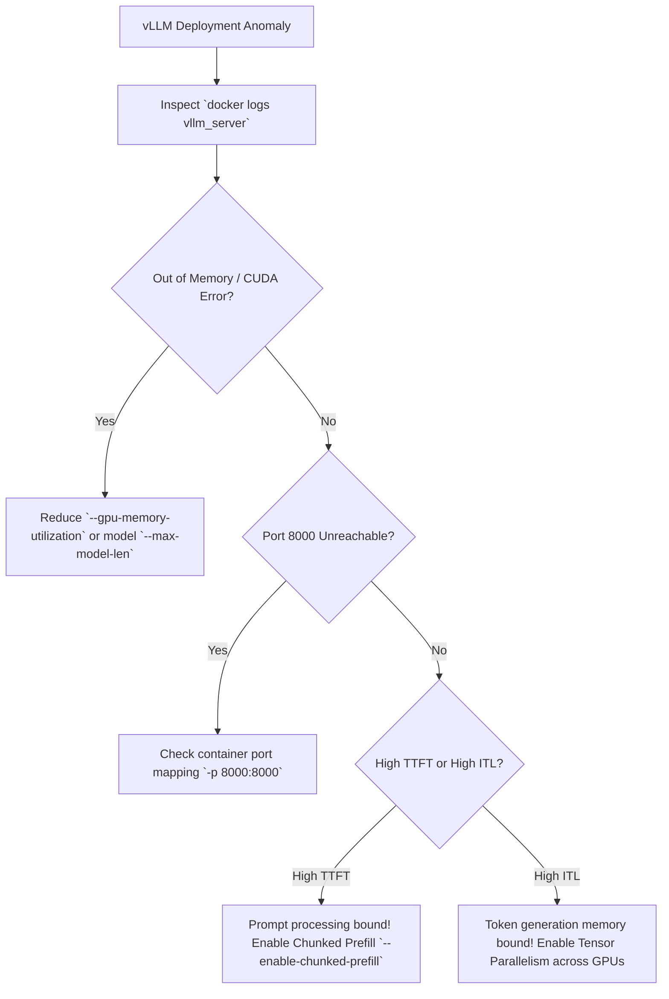

# Lab 03 — Deploy an LLM with vLLM

## 1. Title and Metadata

```yaml
Title: Deploy an LLM with vLLM
Volume: 12
Chapter: 04
Difficulty: Advanced
Estimated Time: 60 Minutes
Prerequisites: Completion of Labs 01 & 02, Linux CLI, Docker / NVIDIA Container Toolkit, Hugging Face Token (if applicable)
Target Platform: NVIDIA Ampere/Ada/Hopper/Blackwell GPUs (>= 16 GB VRAM), Ubuntu 22.04 LTS
Target Audience: LLM Platform Engineers, AI Infrastructure SREs, MLOps Engineers
Lab Type: Hands-on Serving Architecture Lab
```

This lab delivers an enterprise operational walkthrough for deploying Large Language Models (LLMs) using vLLM. You will deploy a vLLM container exposing an OpenAI-compatible HTTP interface, configure PagedAttention memory management, tune KV cache allocation parameters (`--gpu-memory-utilization`), benchmark streaming token delivery performance (Time To First Token and Inter-Token Latency), scrape real-time engine telemetry, and manage context-length oversubscription failure modes.

---

## 2. Objective

By completing this lab, you will:
1. Deploy an open-weights LLM using vLLM with PagedAttention and continuous batching enabled.
2. Configure GPU memory utilization (`--gpu-memory-utilization`) and maximum sequence length (`--max-model-len`) to optimize KV cache allocation.
3. Validate endpoint functionality against OpenAI-compatible REST endpoints (`/v1/models`, `/v1/chat/completions`).
4. Construct a Python async benchmarking client to quantify Time To First Token (TTFT) and Inter-Token Latency (ITL) under concurrent load.
5. Inspect Prometheus metrics (`vllm:gpu_cache_usage_perc`, `vllm:num_requests_waiting`, `vllm:num_preemptions_total`) to diagnose KV cache pressure.
6. Inject context length and KV cache over-subscription failures to observe token preemption and admission control behaviors.

---

## 3. Prerequisites

Before starting this lab, ensure you have:
- Host GPU with at least 16 GB VRAM (e.g. NVIDIA A10G, A30, L40S, A100, or H100).
- NVIDIA driver >= 535.104.05 and Docker with `nvidia-container-toolkit` enabled.
- Python 3.10+ with `openai`, `aiohttp`, `prometheus_client`, and `numpy` installed.
- Hugging Face account and user access token (`HF_TOKEN`) if accessing gated model weights.
- Port `8000` available on the host system.

---

## 4. Architecture and Lab Topology

The following diagram illustrates vLLM's internal components, including PagedAttention, block memory management, continuous batching scheduler, and client streaming interfaces:

```mermaid
flowchart TD
    subgraph ClientHost["Client / Load Generator"]
        HttpClient["Async Python Client (OpenAI SDK / curl)"]
    end

    subgraph ServerHost["vLLM Serving Instance"]
        subgraph Container["vLLM Container (vllm/vllm-openai:latest)"]
            OpenAIAPI["OpenAI Protocol Server (/v1/chat/completions)"]
            Scheduler["Continuous Batching Scheduler
            (Iteration-level Scheduling)"]

            subgraph MemoryManager["PagedAttention Block Manager"]
                KVCache["KV Cache Memory Pool
                Physical GPU Blocks (Page Size 16)"]
            end

            Engine["PyTorch / CUDA Model Execution
            (Tensor Parallel = 1)"]
            MetricsExporter["Prometheus Exporter (:8000/metrics)"]
        end

        NVIDIAGPU["Physical GPU (>= 16GB VRAM)"]
    end

    HttpClient -->|POST /v1/chat/completions (stream=true)| OpenAIAPI
    OpenAIAPI --> Scheduler
    Scheduler <--> MemoryManager
    MemoryManager --> KVCache --> Engine --> NVIDIAGPU
    Engine -->|Streaming SSE Tokens| OpenAIAPI
    OpenAIAPI -->|Server-Sent Events (data: {...})| HttpClient
    Scheduler --> MetricsExporter
```

---

## 5. Required Tools and Software

| Tool / Component | Version Requirement | Purpose |
|---|---|---|
| vLLM Container Image | `vllm/vllm-openai:latest` | High-throughput LLM serving engine |
| Target Model | `Qwen/Qwen2.5-Coder-1.5B-Instruct` | Compact instruction-tuned LLM for testing |
| OpenAI Python SDK | `>= 1.14.0` | Client interaction with OpenAI-compatible API |
| `curl`, `jq` | Any modern version | Querying HTTP endpoints and parsing streaming JSON |
| Prometheus Client | Any modern version | Telemetry metrics extraction |

---

## 6. Environment Setup

Create the working directory, export necessary environment variables, and verify Hugging Face access:

```bash
export VLLM_LAB_DIR="${HOME}/vllm_lab"
export MODEL_NAME="Qwen/Qwen2.5-Coder-1.5B-Instruct"
export HF_HOME="${VLLM_LAB_DIR}/hf_cache"

mkdir -p "${VLLM_LAB_DIR}" "${HF_HOME}"
cd "${VLLM_LAB_DIR}"

# Set Hugging Face Token if accessing gated models (optional for open models)
# export HF_TOKEN="hf_xxxxxxxxxxxxxxxxxxxxxxxx"
```

Verify GPU VRAM availability before starting the engine:

```bash
nvidia-smi --query-gpu=name,memory.total,memory.free --format=csv
```

---

## 7. Estimated Duration

- Total Time: **60 Minutes**
  - Workspace Setup & Container Launch: 15 mins
  - Basic Endpoint & Streaming Verification: 10 mins
  - TTFT & ITL Benchmarking Script Execution: 15 mins
  - Prometheus Telemetry & KV Cache Analysis: 10 mins
  - Failure Injection & Teardown: 10 mins

---

## 8. Safety and Safeguards

- **VRAM Reservation Controls**: Set `--gpu-memory-utilization 0.85` to leave 15% GPU memory available for PyTorch context execution and CUDA driver overhead.
- **Context Length Bounding**: Enforce `--max-model-len 4096` to prevent runaway sequence allocation during load tests.
- **Port Exposure**: Bind vLLM server to `0.0.0.0:8000` inside container, but secure host interface firewall access in shared network environments.

---

## 9. Baseline Verification

Confirm container image availability and NVIDIA Container Toolkit operation:

```bash
# Pull the pinned vLLM container image
docker pull vllm/vllm-openai:latest

# Verify CUDA visibility inside container
docker run --rm --gpus all vllm/vllm-openai:latest python3 -c "import torch; print('CUDA Available:', torch.cuda.is_available()); print('Device Name:', torch.cuda.get_device_name(0))"
```

Output must indicate `CUDA Available: True`.

---

## 10. Step-by-Step Task Instructions

### Task 1: Deploy vLLM Engine Container

Launch vLLM with PagedAttention and explicitly tuned KV cache parameters:

```bash
docker run -d --name vllm_server \
  --gpus '"device=0"' \
  --shm-size=4g \
  -p 8000:8000 \
  -v "${HF_HOME}:/root/.cache/huggingface" \
  vllm/vllm-openai:latest \
  --model "${MODEL_NAME}" \
  --port 8000 \
  --gpu-memory-utilization 0.85 \
  --max-model-len 4096 \
  --dtype float16 \
  --enforce-eager
```

Inspect initialization logs until model weight loading and KV cache memory pre-allocation complete:

```bash
docker logs -f vllm_server
```

Look for log entry: `INFO: Application startup complete.`

### Task 2: Validate OpenAI-Compatible REST Endpoints

1. **Query Model List**:
   ```bash
   curl -s http://localhost:8000/v1/models | jq .
   ```
2. **Execute Non-Streaming Completion**:
   ```bash
   curl -s http://localhost:8000/v1/chat/completions \
     -H "Content-Type: application/json" \
     -d '{
       "model": "Qwen/Qwen2.5-Coder-1.5B-Instruct",
       "messages": [{"role": "user", "content": "Write a Python function to check for prime numbers."}],
       "max_tokens": 128,
       "temperature": 0.2
     }' | jq .
   ```
3. **Execute Streaming Completion**:
   ```bash
   curl -s -N http://localhost:8000/v1/chat/completions \
     -H "Content-Type: application/json" \
     -d '{
       "model": "Qwen/Qwen2.5-Coder-1.5B-Instruct",
       "messages": [{"role": "user", "content": "Count from 1 to 10."}],
       "max_tokens": 64,
       "stream": true
     }'
   ```

### Task 3: Measure TTFT and ITL Streaming Metrics

Construct and execute a Python benchmark script to calculate Time To First Token (TTFT) and Inter-Token Latency (ITL):

```bash
cat <<'EOF' > "${VLLM_LAB_DIR}/benchmark_streaming.py"
import asyncio
import time
import json
import aiohttp
import numpy as np

URL = "http://localhost:8000/v1/chat/completions"
MODEL = "Qwen/Qwen2.5-Coder-1.5B-Instruct"
CONCURRENCY = 5

payload = {
    "model": MODEL,
    "messages": [{"role": "user", "content": "Explain Kubernetes GPU Operator in 200 words."}],
    "max_tokens": 200,
    "stream": True,
    "temperature": 0.0
}

async def send_request(session, req_id):
    start_time = time.perf_counter()
    first_token_time = None
    token_timestamps = []

    async with session.post(URL, json=payload) as response:
        async for line in response.content:
            line = line.decode('utf-8').strip()
            if line.startswith("data: ") and not line.endswith("[DONE]"):
                now = time.perf_counter()
                if first_token_time is None:
                    first_token_time = now
                token_timestamps.append(now)

    ttft = (first_token_time - start_time) * 1000 if first_token_time else 0
    itls = [ (token_timestamps[i] - token_timestamps[i-1]) * 1000 for i in range(1, len(token_timestamps)) ]
    avg_itl = np.mean(itls) if itls else 0
    total_tokens = len(token_timestamps)
    
    print(f"Req {req_id}: TTFT={ttft:.2f} ms | Avg ITL={avg_itl:.2f} ms | Tokens={total_tokens}")
    return ttft, avg_itl, total_tokens

async def main():
    async with aiohttp.ClientSession() as session:
        tasks = [send_request(session, i) for i in range(CONCURRENCY)]
        results = await asyncio.gather(*tasks)

    ttfts = [r[0] for r in results]
    itls = [r[1] for r in results]
    print("\n--- Summary Benchmark Results ---")
    print(f"Mean TTFT: {np.mean(ttfts):.2f} ms (p95: {np.percentile(ttfts, 95):.2f} ms)")
    print(f"Mean ITL:  {np.mean(itls):.2f} ms (p95: {np.percentile(itls, 95):.2f} ms)")

if __name__ == "__main__":
    asyncio.run(main())
EOF

python3 "${VLLM_LAB_DIR}/benchmark_streaming.py"
```

### Task 4: Monitor Prometheus Telemetry & KV Cache Usage

Scrape vLLM's internal metrics endpoint to inspect memory block allocation and queue stats:

```bash
curl -s http://localhost:8000/metrics | grep -E 'vllm:num_requests_waiting|vllm:gpu_cache_usage_perc|vllm:num_preemptions_total'
```

---

## 11. Command Execution Standards

Command execution details for key deployment operations:

### Command 1: Launch vLLM Server Engine
- **Purpose**: Run vLLM with PagedAttention and specified VRAM reservation bounds.
- **Command**:
  ```bash
  docker run -d --name vllm_server --gpus '"device=0"' --shm-size=4g -p 8000:8000 -v "${HF_HOME}:/root/.cache/huggingface" vllm/vllm-openai:latest --model "Qwen/Qwen2.5-Coder-1.5B-Instruct" --port 8000 --gpu-memory-utilization 0.85 --max-model-len 4096 --dtype float16 --enforce-eager
  ```
- **Expected Evidence**: Container starts successfully and output log displays `# GPU blocks: <N>, # CPU blocks: <M>`.
- **Explanation**: Pre-allocates 85% of total GPU memory. vLLM divides available memory into physical 16-token KV cache blocks managed by PagedAttention.
- **Common Failure Interpretation**: `ValueError: No available memory for the cache blocks` indicates `--gpu-memory-utilization` is set too low or another process is occupying GPU VRAM.

### Command 2: Query OpenAI Chat Completions Endpoint
- **Purpose**: Validate OpenAI-compatible JSON schema and inferencing functionality.
- **Command**:
  ```bash
  curl -s http://localhost:8000/v1/chat/completions -H "Content-Type: application/json" -d '{"model":"Qwen/Qwen2.5-Coder-1.5B-Instruct","messages":[{"role":"user","content":"Hi"}],"max_tokens":10}'
  ```
- **Expected Evidence**: JSON object containing `"choices": [{"message": {"role": "assistant", "content": "..."}}]`.
- **Explanation**: HTTP POST request processed by FastAPI routing layer inside vLLM, formatted into token IDs, scheduled via continuous batcher, and executed on GPU.
- **Common Failure Interpretation**: HTTP 404 indicates invalid URL path; HTTP 400 indicates model name mismatch or invalid JSON payload formatting.

### Command 3: Monitor KV Cache Prometheus Telemetry
- **Purpose**: Track GPU KV cache percentage occupancy under active load.
- **Command**:
  ```bash
  curl -s http://localhost:8000/metrics | grep 'vllm:gpu_cache_usage_perc'
  ```
- **Expected Evidence**: Metric line `vllm:gpu_cache_usage_perc{model="..."} 0.05` (5% allocated).
- **Explanation**: Returns gauge tracking physical PagedAttention blocks currently allocated to active requests.
- **Common Failure Interpretation**: If gauge reaches `1.0` (100%), vLLM will begin queuing incoming requests or preempting active sequences to CPU.

---

## 12. Illustrative Output

### vLLM Server Startup Log Snippet (`docker logs vllm_server`)

```text
INFO 08-06 14:30:10 api_server.py:145] vLLM API server version 0.4.2
INFO 08-06 14:30:10 config.py:610] Loading model weights from Qwen/Qwen2.5-Coder-1.5B-Instruct
INFO 08-06 14:30:14 llm_engine.py:320] # GPU blocks: 14258, # CPU blocks: 2048
INFO 08-06 14:30:14 llm_engine.py:324] Maximum concurrency for 4096 tokens per request: 55.69x
INFO 08-06 14:30:15 model_runner.py:710] Capturing the CUDA graph for memory efficiency...
INFO 08-06 14:30:18 launcher.py:22] Started HTTP server at http://0.0.0.0:8000
```

### Async Streaming Benchmark Output (`python3 benchmark_streaming.py`)

```text
Req 0: TTFT=42.15 ms | Avg ITL=12.40 ms | Tokens=200
Req 1: TTFT=45.80 ms | Avg ITL=12.85 ms | Tokens=200
Req 2: TTFT=43.10 ms | Avg ITL=12.55 ms | Tokens=200
Req 3: TTFT=48.20 ms | Avg ITL=13.10 ms | Tokens=200
Req 4: TTFT=44.90 ms | Avg ITL=12.70 ms | Tokens=200

--- Summary Benchmark Results ---
Mean TTFT: 44.83 ms (p95: 47.72 ms)
Mean ITL:  12.72 ms (p95: 13.05 ms)
```

---

## 13. Failure Injection

In this exercise, you will inject a KV cache memory exhaustion failure by submitting requests exceeding maximum context length and restricting available VRAM cache allocation.

### Failure Scenario: Context Length & KV Cache Oversubscription

1. Stop current server and restart vLLM with severely artificially restricted VRAM allocation (`--gpu-memory-utilization 0.25`):
   ```bash
   docker stop vllm_server && docker rm vllm_server

   docker run -d --name vllm_constrained \
     --gpus '"device=0"' \
     --shm-size=4g \
     -p 8000:8000 \
     -v "${HF_HOME}:/root/.cache/huggingface" \
     vllm/vllm-openai:latest \
     --model "${MODEL_NAME}" \
     --port 8000 \
     --gpu-memory-utilization 0.25 \
     --max-model-len 4096 \
     --enforce-eager
   ```

2. Inspect startup logs to confirm reduced GPU block allocation:
   ```bash
   docker logs vllm_constrained | grep 'GPU blocks'
   ```
   *Evidence*: `# GPU blocks: 120` (Severely constrained KV cache capacity!).

3. Submit a long context request exceeding the restricted KV block capacity:
   ```bash
   curl -s http://localhost:8000/v1/chat/completions \
     -H "Content-Type: application/json" \
     -d '{
       "model": "Qwen/Qwen2.5-Coder-1.5B-Instruct",
       "messages": [{"role": "user", "content": "'$(printf 'repeat this text %s ' {1..1500})'"}],
       "max_tokens": 2048
     }'
   ```

4. **Observe Response Failure & Telemetry**:
   - The API returns HTTP 400 or HTTP 500 error:
     `{"error": {"message": "The request's prompt length ... exceeds the maximum available KV cache capacity.", "type": "BadRequestError"}}`
   - Inspect Prometheus telemetry:
     ```bash
     curl -s http://localhost:8000/metrics | grep -E 'vllm:num_requests_waiting|vllm:num_preemptions_total'
     ```
     *Metric Evidence*: `vllm:num_preemptions_total` increments, demonstrating engine admission control intervention.

5. **Recovery**:
   - Stop constrained container and relaunch with proper `--gpu-memory-utilization 0.85`.

---

## 14. Troubleshooting and Recovery

### Diagnostic Flowchart for vLLM Issues



---

## 15. Validation and Verification Checklist

| Verification Item | Pass Condition | Status |
|---|---|---|
| vLLM Container Launch | Process running with `# GPU blocks` initialized | [ ] |
| `/v1/models` Query | Returns active model ID string | [ ] |
| Non-Streaming Completion | HTTP 200 JSON payload with complete generated text | [ ] |
| Streaming SSE Output | `curl -N` displays streaming `data: {...}` lines | [ ] |
| TTFT Benchmark Verified | Mean TTFT measured < 100ms for short prompts | [ ] |
| ITL Benchmark Verified | Mean ITL measured < 25ms per generated token | [ ] |
| Telemetry Scraped | `vllm:gpu_cache_usage_perc` metric actively exported | [ ] |
| Failure Injection Handled | Oversubscription triggers controlled error without host crash | [ ] |

---

## 16. Cleanup and Teardown

Execute the following cleanup commands to stop vLLM and remove temporary files:

```bash
# 1. Stop and remove vLLM container
docker stop vllm_constrained vllm_server 2>/dev/null || true
docker rm vllm_constrained vllm_server 2>/dev/null || true

# 2. Remove workspace directory
rm -rf "${VLLM_LAB_DIR}"

# 3. Unset environment variables
unset VLLM_LAB_DIR MODEL_NAME HF_HOME

# 4. Verify no remaining vLLM processes
docker ps | grep vllm
```

---

## 17. Production Considerations

When scaling vLLM in production Kubernetes deployments:

1. **Chunked Prefill Activation**:
   - Pass `--enable-chunked-prefill` to chunk long prompt prefill tasks into smaller batches. This prevents large input prompts from stalling active token generation streams (reducing ITL spikes).
2. **Tensor Parallelism Scaling**:
   - For models larger than single GPU capacity (e.g., Llama-3-70B), set `--tensor-parallel-size 4` or `8`. Ensure host nodes have high-speed NVLink interconnects between GPUs.
3. **Prefix Caching**:
   - Enable `--enable-prefix-caching` for multi-turn conversational agents or system prompt reuse. This avoids recomputing KV caches for static prefix tokens, cutting TTFT by up to 80%.

---

## 18. Summary and Next Steps

In this lab, you deployed vLLM, configured PagedAttention block memory management, validated OpenAI-compatible streaming API endpoints, and profiled Time To First Token (TTFT) and Inter-Token Latency (ITL). You also analyzed Prometheus telemetry counters for KV cache usage and preemption events under memory oversubscription.

**Next Lab**: In **Lab 04 — Troubleshoot a Slow Inference Pipeline**, you will apply end-to-end latency decomposition techniques to diagnose multi-stage inference bottlenecks across CPU tokenization, queue delays, and GPU compute stages.
