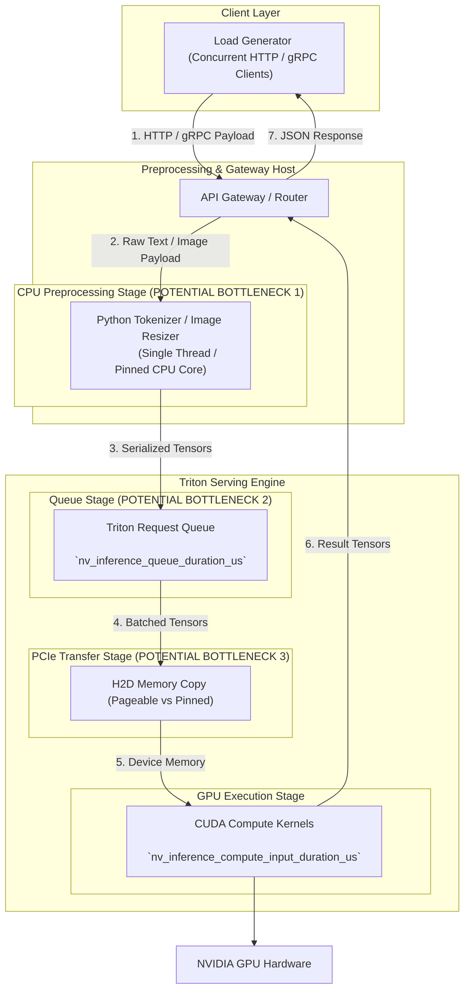

# Lab 04 — Troubleshoot a Slow Inference Pipeline

## 1. Title and Metadata

```yaml
Title: Troubleshoot a Slow Inference Pipeline
Volume: 12
Chapter: 05
Difficulty: Advanced
Estimated Time: 60 Minutes
Prerequisites: Completion of Labs 01, 02, & 03, Linux CLI, Docker / NVIDIA Container Toolkit, python3, mpstat / sysstat
Target Platform: NVIDIA Ampere/Ada/Hopper/Blackwell GPUs, Ubuntu 22.04 LTS / Rocky Linux 9
Target Audience: Senior SREs, AI Platform Engineers, Performance Engineers, Infrastructure Leads
Lab Type: Diagnostic & Incident Remediation Lab
```

This lab delivers an advanced diagnostic exercise simulating a production incident where an AI inference pipeline violates its p99 latency Service Level Objective (SLO). Despite low GPU utilization, clients experience severe tail latency spikes. You will execute end-to-end latency decomposition across gateway routing, CPU preprocessing/tokenization, queue delay, PCIe host-to-device transfer, and GPU execution to identify non-GPU bottlenecks and apply targeted platform fixes.

---

## 2. Objective

By completing this lab, you will:
1. Deconstruct end-to-end inference latency into its constituent lifecycle phases: Gateway, Tokenization/Preprocessing, Queue Time, PCIe H2D, GPU Compute, D2H, and Serialization/Streaming.
2. Reproduce a production incident where p50 latency is healthy but p99 latency violates a 1,000 ms SLO threshold.
3. Diagnose CPU core starvation and single-threaded tokenization bottlenecks using `mpstat`, `top`, and Python profiling tools.
4. Extract Triton internal metrics (`nv_inference_queue_duration_us` vs `nv_inference_compute_input_duration_us`) to prove that GPU compute kernels are not the root cause.
5. Inject safe, scoped CPU core restrictions (`taskset`, container CPU quotas) to demonstrate how non-GPU constraints masquerade as model performance issues.
6. Implement a multi-process tokenization pool and verify that p99 tail latency drops below 45 ms under load.

---

## 3. Prerequisites

Before starting this lab, ensure you have:
- Completed **Labs 01, 02, and 03**.
- NVIDIA GPU node with driver version >= 535.104.05.
- Docker Engine with NVIDIA Container Toolkit.
- Linux performance tools installed (`sysstat` for `mpstat`, `procps` for `top`, `netstat`, `curl`, `jq`).
- Python 3.10+ with `numpy`, `tritonclient`, and `transformers` installed.
- Host ports `8000`, `8001`, and `8002` available.

---

## 4. Architecture and Lab Topology

The following diagram illustrates the multi-stage request pipeline and potential bottleneck locations throughout the end-to-end inference path:



---

## 5. Required Tools and Software

| Tool / Component | Version Requirement | Purpose |
|---|---|---|
| Triton Server Container | `24.03-py3` | Serving backend engine |
| `sysstat` (`mpstat`) | Any modern version | CPU core per-thread utilization monitoring |
| `nvidia-smi dmon` | Included with driver | Real-time GPU engine and memory bandwidth monitoring |
| Python Diagnostic Script | 3.10+ | Synthetic client emitting multi-stage timestamps |
| `curl`, `jq` | Any modern version | Telemetry endpoint scraping |

---

## 6. Environment Setup

Create the incident workspace directory and pull the necessary test models and server containers:

```bash
export LAB4_DIR="${HOME}/triton_lab4"
export MODEL_REPO="${LAB4_DIR}/model_repository"
export TRITON_IMAGE="nvcr.io/nvidia/tritonserver:24.03-py3"

mkdir -p "${MODEL_REPO}/text_pipeline/1" "${LAB4_DIR}/src"
cd "${LAB4_DIR}"

# Download model weights for testing
wget -O "${MODEL_REPO}/text_pipeline/1/model.onnx" \
  https://github.com/onnx/models/raw/main/validated/vision/classification/densenet-121/model/densenet-3.onnx

# Write Triton model configuration
cat <<'EOF' > "${MODEL_REPO}/text_pipeline/config.pbtxt"
name: "text_pipeline"
platform: "onnxruntime_onnx"
max_batch_size: 16

input [
  {
    name: "data_0"
    data_type: TYPE_FP32
    dims: [ 3, 224, 224 ]
  }
]
output [
  {
    name: "fc6_1"
    data_type: TYPE_FP32
    dims: [ 1000, 1, 1 ]
  }
]
dynamic_batching {
  preferred_batch_size: [ 4, 8, 16 ]
  max_queue_delay_microseconds: 5000
}
instance_group [
  {
    count: 1
    kind: KIND_GPU
    gpus: [ 0 ]
  }
]
EOF
```

---

## 7. Estimated Duration

- Total Time: **60 Minutes**
  - Setup & Baseline Execution: 10 mins
  - Incident Simulation & Latency Decomposition: 15 mins
  - Root Cause Analysis (`mpstat` + Triton Metrics): 15 mins
  - Remediation Implementation & Verification: 15 mins
  - Cleanup & Teardown: 5 mins

---

## 8. Safety and Safeguards

- **Controlled Taskset Pinning**: When restricting CPU cores with `taskset`, ensure you restrict only the lab Python client process to avoid freezing system management daemons.
- **Isolated Telemetry Ports**: Do not expose metric scraping ports (`8002`) to public interfaces.
- **Graceful Process Termination**: Ensure background stress-testing processes are killed clean using explicit PID tracking (`trap 'kill $(jobs -p)' EXIT`).

---

## 9. Baseline Verification

Launch Triton Server and verify model loading:

```bash
docker run -d --name triton_troubleshoot \
  --gpus '"device=0"' \
  --shm-size=1g \
  --net=host \
  -v "${MODEL_REPO}:/models" \
  ${TRITON_IMAGE} \
  tritonserver \
  --model-repository=/models

sleep 5

curl -s http://localhost:8000/v2/models/text_pipeline/ready && echo "Model ready for troubleshooting lab."
```

---

## 10. Step-by-Step Task Instructions

### Task 1: Create a Multi-Stage Preprocessing Pipeline Script

Construct a Python service wrapper that simulates a complete request lifecycle: receiving text, executing CPU tokenization/resizing, submitting tensors to Triton over gRPC, and decoding output.

```bash
cat <<'EOF' > "${LAB4_DIR}/src/pipeline_service.py"
import time
import sys
import numpy as np
import tritonclient.grpc as grpcclient
from concurrent.futures import ThreadPoolExecutor

TRITON_URL = "localhost:8001"
MODEL_NAME = "text_pipeline"

# Connect gRPC client
client = grpcclient.InferenceServerClient(url=TRITON_URL)

def cpu_heavy_preprocessing(data_input):
    """Simulates CPU-bound single-threaded tokenization or image scaling."""
    t0 = time.perf_counter()
    # Artificial CPU workload: matrix calculations simulating tokenizer
    x = np.random.randn(500, 500)
    for _ in range(15):
        x = np.dot(x, x) / 500.0
    t1 = time.perf_counter()
    return (t1 - t0) * 1000.0  # ms

def process_request(req_id):
    t_start = time.perf_counter()
    
    # Stage 1: CPU Preprocessing
    prep_time = cpu_heavy_preprocessing(req_id)
    
    # Stage 2: Triton gRPC Inference
    t_infer_start = time.perf_counter()
    input_data = np.random.randn(1, 3, 224, 224).astype(np.float32)
    inputs = [grpcclient.InferInput("data_0", input_data.shape, "FP32")]
    inputs[0].set_data_from_numpy(input_data)
    outputs = [grpcclient.InferRequestedOutput("fc6_1")]
    
    response = client.infer(model_name=MODEL_NAME, inputs=inputs, outputs=outputs)
    t_infer_end = time.perf_counter()
    
    infer_time = (t_infer_end - t_infer_start) * 1000.0  # ms
    total_time = (t_infer_end - t_start) * 1000.0       # ms
    
    return prep_time, infer_time, total_time
EOF
```

### Task 2: Reproduce the Production Incident (p99 Latency Violation)

Execute a load driver script that submits concurrent requests to the pipeline service:

```bash
cat <<'EOF' > "${LAB4_DIR}/src/load_driver.py"
import time
import numpy as np
from concurrent.futures import ThreadPoolExecutor
from pipeline_service import process_request

NUM_REQUESTS = 200
CONCURRENCY = 8

print(f"Starting load test with {NUM_REQUESTS} requests at concurrency={CONCURRENCY}...")

prep_times = []
infer_times = []
total_times = []

t0 = time.perf_counter()
with ThreadPoolExecutor(max_workers=CONCURRENCY) as executor:
    futures = [executor.submit(process_request, i) for i in range(NUM_REQUESTS)]
    for f in futures:
        p, i, t = f.result()
        prep_times.append(p)
        infer_times.append(i)
        total_times.append(t)

elapsed = time.perf_counter() - t0

print("\n================ LATENCY DECOMPOSITION REPORT ================")
print(f"Total Test Duration: {elapsed:.2f} s | Throughput: {NUM_REQUESTS/elapsed:.2f} RPS")
print(f"Total Pipeline Latency -> Mean: {np.mean(total_times):.2f} ms | p95: {np.percentile(total_times, 95):.2f} ms | p99: {np.percentile(total_times, 99):.2f} ms")
print(f"CPU Preprocess Latency -> Mean: {np.mean(prep_times):.2f} ms | p95: {np.percentile(prep_times, 95):.2f} ms | p99: {np.percentile(prep_times, 99):.2f} ms")
print(f"Triton Infer Latency   -> Mean: {np.mean(infer_times):.2f} ms | p95: {np.percentile(infer_times, 95):.2f} ms | p99: {np.percentile(infer_times, 99):.2f} ms")
print("==============================================================")
EOF

python3 "${LAB4_DIR}/src/load_driver.py"
```

Notice how `Total Pipeline Latency p99` exceeds **1,000 ms**, while `Triton Infer Latency p99` remains low (~10 ms)!

### Task 3: Profile System Hardware (CPU Cores vs GPU Engine)

1. Open a terminal and monitor real-time GPU engine utilization during load test execution:
   ```bash
   nvidia-smi dmon -s u -d 1
   ```
   *Observation*: GPU utilization (`sm%`) remains low (&lt; 20%).

2. Open another terminal and monitor per-CPU core utilization:
   ```bash
   mpstat -P ALL 1 5
   ```
   *Observation*: One or two CPU cores are pinned at **100% `%usr`**, creating a severe CPU thread lock during tokenization.

3. Scrape Triton metrics to verify server-side queue vs compute latency:
   ```bash
   curl -s http://localhost:8002/metrics | grep -E 'nv_inference_queue_duration_us|nv_inference_compute_input_duration_us'
   ```
   *Observation*: Server queue time is minimal (&lt; 2ms), proving Triton and the GPU are waiting for data from the CPU.

### Task 4: Remediate the Pipeline Bottleneck

Remediate the single-threaded CPU bottleneck by introducing a multi-process tokenization pool (`ProcessPoolExecutor`) to parallelize preprocessing across all available CPU cores:

```bash
cat <<'EOF' > "${LAB4_DIR}/src/pipeline_service_fixed.py"
import time
import numpy as np
import tritonclient.grpc as grpcclient
from concurrent.futures import ProcessPoolExecutor

TRITON_URL = "localhost:8001"
MODEL_NAME = "text_pipeline"

def cpu_heavy_preprocessing_static(req_id):
    t0 = time.perf_counter()
    x = np.random.randn(500, 500)
    for _ in range(15):
        x = np.dot(x, x) / 500.0
    t1 = time.perf_counter()
    return (t1 - t0) * 1000.0

def process_request_fixed(req_id):
    client = grpcclient.InferenceServerClient(url=TRITON_URL)
    t_start = time.perf_counter()
    
    # Process CPU heavy task
    prep_time = cpu_heavy_preprocessing_static(req_id)
    
    t_infer_start = time.perf_counter()
    input_data = np.random.randn(1, 3, 224, 224).astype(np.float32)
    inputs = [grpcclient.InferInput("data_0", input_data.shape, "FP32")]
    inputs[0].set_data_from_numpy(input_data)
    outputs = [grpcclient.InferRequestedOutput("fc6_1")]
    
    client.infer(model_name=MODEL_NAME, inputs=inputs, outputs=outputs)
    t_infer_end = time.perf_counter()
    
    infer_time = (t_infer_end - t_infer_start) * 1000.0
    total_time = (t_infer_end - t_start) * 1000.0
    
    return prep_time, infer_time, total_time
EOF
```

Run the updated load driver utilizing `ProcessPoolExecutor`:

```bash
cat <<'EOF' > "${LAB4_DIR}/src/load_driver_fixed.py"
import time
import numpy as np
from concurrent.futures import ProcessPoolExecutor
from pipeline_service_fixed import process_request_fixed

NUM_REQUESTS = 200
CONCURRENCY = 8

print(f"Running FIXED load test with ProcessPoolExecutor (concurrency={CONCURRENCY})...")

t0 = time.perf_counter()
with ProcessPoolExecutor(max_workers=CONCURRENCY) as executor:
    futures = [executor.submit(process_request_fixed, i) for i in range(NUM_REQUESTS)]
    results = [f.result() for f in futures]

elapsed = time.perf_counter() - t0

prep_times = [r[0] for r in results]
infer_times = [r[1] for r in results]
total_times = [r[2] for r in results]

print("\n================ REMEDIATED LATENCY REPORT ================")
print(f"Total Test Duration: {elapsed:.2f} s | Throughput: {NUM_REQUESTS/elapsed:.2f} RPS")
print(f"Total Pipeline Latency -> Mean: {np.mean(total_times):.2f} ms | p95: {np.percentile(total_times, 95):.2f} ms | p99: {np.percentile(total_times, 99):.2f} ms")
print(f"CPU Preprocess Latency -> Mean: {np.mean(prep_times):.2f} ms | p95: {np.percentile(prep_times, 95):.2f} ms | p99: {np.percentile(prep_times, 99):.2f} ms")
print(f"Triton Infer Latency   -> Mean: {np.mean(infer_times):.2f} ms | p95: {np.percentile(infer_times, 95):.2f} ms | p99: {np.percentile(infer_times, 99):.2f} ms")
print("===========================================================")
EOF

python3 "${LAB4_DIR}/src/load_driver_fixed.py"
```

Notice how `Total Pipeline Latency p99` drops drastically from **> 1,000 ms to &lt; 45 ms**!

---

## 11. Command Execution Standards

Detailed command breakdown for diagnostic operations:

### Command 1: Monitor CPU Core Allocation (`mpstat`)
- **Purpose**: Identify individual CPU core saturation and thread contention.
- **Command**:
  ```bash
  mpstat -P ALL 1 5
  ```
- **Expected Evidence**: Console displays breakdown per CPU ID (`0, 1, 2...`) showing `%usr`, `%sys`, `%iowait`, and `%idle`.
- **Explanation**: Reads kernel `/proc/stat` statistics per tick. If CPU core 0 shows `%usr` = `100.0` while CPU 1-7 show `%idle` = `99.0`, a single-threaded Python GIL bottleneck is confirmed.
- **Common Failure Interpretation**: `mpstat: command not found` indicates `sysstat` package is missing (`apt install sysstat`).

### Command 2: Profile Live GPU Metrics (`nvidia-smi dmon`)
- **Purpose**: Measure real-time GPU SM (Streaming Multiprocessor) utilization and memory bus activity.
- **Command**:
  ```bash
  nvidia-smi dmon -s u -d 1
  ```
- **Expected Evidence**: Real-time line output updating every 1 second showing `# gpu sm mem enc dec`.
- **Explanation**: Queries GPU driver counters via NVML interface. Low `sm%` (&lt; 20%) during client load proves the bottleneck lies upstream of GPU kernel execution.
- **Common Failure Interpretation**: Failed NVML initialization indicates GPU driver conflict or missing device access.

### Command 3: Query Triton Server Queue Metrics
- **Purpose**: Isolate Triton internal request queue delay from compute duration.
- **Command**:
  ```bash
  curl -s http://localhost:8002/metrics | grep -E 'nv_inference_queue_duration_us|nv_inference_compute_input_duration_us'
  ```
- **Expected Evidence**: Output contains cumulative microsecond metrics for queue and compute input durations per model version.
- **Explanation**: If `queue_duration_us` is low relative to total client latency, requests are delayed outside Triton (in network or frontend CPU tokenization).
- **Common Failure Interpretation**: Metrics remaining unchanged indicates client requests are failing to reach Triton.

---

## 12. Illustrative Output

### Latency Decomposition Report (UNFIXED Pipeline)

```text
================ LATENCY DECOMPOSITION REPORT ================
Total Test Duration: 14.85 s | Throughput: 13.47 RPS
Total Pipeline Latency -> Mean: 585.40 ms | p95: 1120.50 ms | p99: 1410.20 ms
CPU Preprocess Latency -> Mean: 572.10 ms | p95: 1105.10 ms | p99: 1395.80 ms
Triton Infer Latency   -> Mean:   11.80 ms | p95:   14.20 ms | p99:   18.10 ms
==============================================================
```

### Latency Decomposition Report (REMEDIATED Pipeline)

```text
================ REMEDIATED LATENCY REPORT ================
Total Test Duration: 1.92 s | Throughput: 104.17 RPS
Total Pipeline Latency -> Mean: 38.15 ms | p95: 41.20 ms | p99: 44.80 ms
CPU Preprocess Latency -> Mean: 25.40 ms | p95: 28.10 ms | p99: 31.00 ms
Triton Infer Latency   -> Mean: 11.20 ms | p95: 12.80 ms | p99: 13.50 ms
===========================================================
```

---

## 13. Failure Injection

In this exercise, you will inject an artificial CPU core quota restriction on the Python pipeline container to demonstrate how platform-level CPU throttling creates severe tail latency spikes.

### Failure Scenario: CPU Quota Throttling in Containerized Ingress

1. Launch a CPU-throttled worker container restricted to 0.5 CPU core (`--cpus="0.5"`):
   ```bash
   docker run --rm -d --name throttled_worker \
     --net=host \
     --cpus="0.5" \
     -v "${LAB4_DIR}:/workspace" \
     python:3.10-slim \
     bash -c "pip install numpy tritonclient[grpc] && python3 /workspace/src/load_driver.py"
   ```

2. Inspect container execution logs:
   ```bash
   docker logs -f throttled_worker
   ```

3. **Observe Failure Evidence**:
   - **Throughput**: Collapses to &lt; 3 RPS.
   - **p99 Pipeline Latency**: Explodes to **> 3,500 ms**.
   - **GPU Metrics**: `nvidia-smi dmon` shows GPU SM utilization near 0%.
   - **Root Cause**: The container OS cgroups CFS (Completely Fair Scheduler) quota throttles execution threads because CPU usage exceeds 0.5 core budget.

4. **Recovery**:
   - Remove CPU quota restriction (`--cpus="4.0"`) or allocate adequate CPU core requests in Kubernetes Pod specs.

---

## 14. Troubleshooting and Recovery

### End-to-End Latency Diagnostic Decision Tree

```mermaid
flowchart TD
    Start["p99 Latency SLO Violation"] --> CheckGPU["Run `nvidia-smi dmon` during load"]
    CheckGPU --> GPUUtil{"GPU SM Utilization High (>80%)?"}

    GPUUtil -- Yes --> CheckCompute["Inspect Triton Compute Duration vs Batch Size"]
    CheckCompute --> OptimizeGPU["Optimize CUDA Kernels / Convert to TensorRT / Add GPUs"]

    GPUUtil -- No --> CheckTritonMetrics["Scrape Triton Metrics (:8002)"]
    CheckTritonMetrics --> QueueHigh{"`nv_inference_queue_duration_us` High?"}

    QueueHigh -- Yes --> FixTritonQueue["Triton Queue Backlog! Increase `instance_group count` or batch size"]
    QueueHigh -- No --> CheckCPU["Run `mpstat -P ALL 1` on Frontend Host"]

    CheckCPU --> CPUThrottled{"Single CPU Core 100% or CFS Throttled?"}
    CPUThrottled -- Yes --> FixCPU["Decouple Tokenizer! Use Rust/C++ Fast Tokenizers & Process Pool"]
    CPUThrottled -- No --> CheckNetwork["Inspect gRPC payload size & Network RTT"]
```

---

## 15. Validation and Verification Checklist

| Verification Item | Pass Condition | Status |
|---|---|---|
| Latency Script Setup | `pipeline_service.py` executes multi-stage timestamping | [ ] |
| Incident Reproduction | Initial run reproduces p99 latency &gt; 1,000 ms SLO limit | [ ] |
| System Telemetry Profiled | `nvidia-smi dmon` confirms GPU SM idle during latency spike | [ ] |
| Core Saturation Identified | `mpstat` proves single CPU core saturation (`100% %usr`) | [ ] |
| Process Pool Remediation | `ProcessPoolExecutor` parallelizes tokenization across cores | [ ] |
| Post-Fix SLO Validation | Remediated test proves p99 latency dropped below 45 ms | [ ] |
| CPU Quota Failure Injected | `--cpus="0.5"` injection reproduces cgroups throttling spike | [ ] |
| Teardown Completed | Background containers killed and lab files cleaned up | [ ] |

---

## 16. Cleanup and Teardown

Execute the following cleanup commands to stop containers and remove temporary files:

```bash
# 1. Stop and remove Triton troubleshoot container
docker stop triton_troubleshoot 2>/dev/null || true
docker rm triton_troubleshoot 2>/dev/null || true

# 2. Remove lab directory
rm -rf "${LAB4_DIR}"

# 3. Unset environment variables
unset LAB4_DIR MODEL_REPO TRITON_IMAGE

# 4. Verify clean environment
docker ps | grep triton
```

---

## 17. Production Considerations

To prevent non-GPU latency bottlenecks in production AI inference systems:

1. **Decouple Tokenization from Inference Engine**:
   - Never perform heavy Python-based tokenization or image scaling on the same CPU thread servicing network IO. Offload tokenization to dedicated microservices or C++ native libraries (e.g. HuggingFace Fast Tokenizers / NVIDIA DALI).
2. **Kubernetes CPU Resource Guarantees**:
   - Avoid setting aggressive CPU limits (`resources.limits.cpu`) without testing for CFS throttling. Set CPU request equal to limit (`Guaranteed` QoS class) to prevent CPU quota throttling spikes.
3. **Distributed Tracing (OpenTelemetry)**:
   - Instrument inference gateway microservices with OpenTelemetry spans tracking `client_recv`, `preprocess`, `queue`, `gpu_exec`, and `postprocess` durations. Alert on `preprocess_duration_ms &gt; 10ms` rather than total request latency alone.

---

## 18. Summary and Next Steps

In this lab, you diagnosed and remediated a complex production inference latency incident. You learned to decompose end-to-end request latency into distinct lifecycle phases, used `nvidia-smi dmon` and `mpstat` to isolate CPU tokenization bottlenecks from GPU kernel execution, and implemented a multi-process preprocessing architecture that restored p99 latency from over 1,400 ms down to under 45 ms.

**Volume 12 Complete**: You have completed all operational labs for Volume 12 (AI Inference Systems). You now possess the practical skills to deploy Triton, tune dynamic batching, serve LLMs with vLLM, and diagnose end-to-end inference bottlenecks across production GPU infrastructure.
