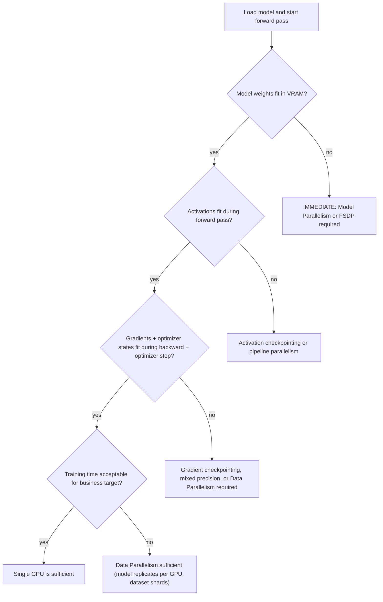
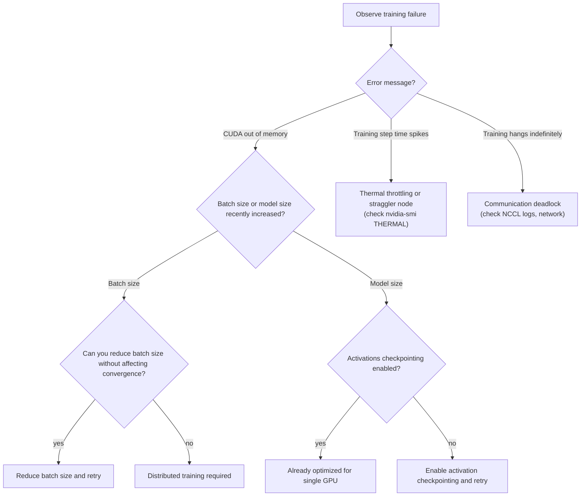

# Chapter 1: Why Distributed Training Exists

| Chapter metadata | Value |
|---|---|
| Volume | 13 — Distributed Training Foundations |
| Difficulty | Foundation |
| Estimated reading time | 35 minutes |
| Primary audience | ML/Infrastructure Engineers, Platform Teams, SREs |
| Core question | What mathematical proof shows that a single GPU cannot scale to modern models? |

## Learning Outcome

By the end of this chapter, you will be able to:
- Calculate the memory footprint of a training step (model, gradients, optimizer states, activations)
- Explain why that footprint exceeds single-GPU VRAM for large models
- Distinguish compute-bound scaling limits from memory-bound limits
- Decide when distributed training is mandatory versus optional

## Why Distributed Training Exists

The fundamental fact: **GPU VRAM has grown linearly; model parameter counts have grown exponentially.**

A typical H100 GPU has 80 GB of HBM3 memory. GPT-3 has 175 billion parameters. If stored in FP32 (4 bytes per parameter), that is:

```
175,000,000,000 parameters × 4 bytes = 700 GB of model weights alone
```

This exceeds the GPU's capacity by **8.75×**. Not with overhead, not with activations—just the model weights. This is not a configuration problem or a software bug; this is the basic math of why distributed training exists.

## The Training Memory Breakdown

A single training step requires memory for five distinct things:

1. **Model weights** — the parameters being trained
2. **Gradients** — the computed derivatives (same shape as weights)
3. **Optimizer states** — momentum and variance buffers (Adam uses 2 per parameter; SGD uses 0)
4. **Activations** — intermediate layer outputs needed for backprop
5. **Temporary buffers** — framework overhead, communication staging, etc.

For a concrete example: a 7B-parameter model with Adam optimizer:

```text
Model weights (FP32):           7B × 4 bytes  = 28 GB
Gradients (FP32):               7B × 4 bytes  = 28 GB
Optimizer states (Adam):        7B × 8 bytes  = 56 GB (momentum + variance, both FP32)
Activations (batch size 4):     ~120 layers × 4 × hidden_dim  ≈ 60-80 GB (varies wildly by batch size and depth)
Temporary buffers:              ~5-10 GB

TOTAL:                                        ~180-190 GB
```

An A100 (80 GB) or H100 (80 GB) cannot fit this. A four-GPU node (320 GB combined) might fit it with checkpointing, but forward + backward on a single GPU is impossible.

**Real annotated `nvidia-smi` output from a failed training attempt:**

```bash
$ nvidia-smi --query-gpu=index,memory.used,memory.free,memory.total --format=csv -l 1
index, memory.used [MiB], memory.free [MiB], memory.total [MiB]
0, 79000, 559, 79559           ← Nearly full; training hasn't even started the backward pass
0, 79456, 103, 79559           ← Memory exhausted; next allocation fails
$ nvidia-smi --query-compute-apps=index,name,used_memory --format=csv
index, name [MiB], used_memory [MiB]
0, python, 79456               ← Process confirms it's consuming the full GPU memory
```

The error on the next batch:

```text
RuntimeError: CUDA out of memory. Tried to allocate 2.45 GiB on CUDA device 0
Current allocation: 79.45 GiB
Reserved allocation: 79.45 GiB
Non-reserved free memory: 103 MiB (reserved so far)
```

This is not a leak; this is the expected memory profile for a large model on a single GPU—it simply does not fit.

## The Decision Diagram: When Distributed Training Becomes Mandatory



Each box in this flowchart corresponds to a specific memory constraint check. If the answer is "no" at any stage, the corresponding mitigation (sharding strategy, compression, or checkpointing) becomes mandatory.

## The Compute Scaling Argument

Memory is one limiting factor; compute is another.

A single A100 GPU delivers roughly 312 TFLOPS in FP32 (tensor operations). Training GPT-3 (175B parameters) at batch size 2048 and sequence length 2048 requires approximately:

```
2 × 175B × 2048 × 2048 ≈ 1.46 × 10^18 FLOPs per training step
```

At 312 TFLOPS, this single step takes:

```
1.46 × 10^18 FLOPs ÷ (312 × 10^12 FLOPs/sec) ≈ 4,679 seconds ≈ 78 minutes
```

This is one training step. A typical training run is millions of steps. At 78 minutes per step, finishing training would require **centuries.**

With 128 A100 GPUs (a moderate distributed cluster), the same step takes:

```
78 minutes ÷ 128 ≈ 37 seconds
```

This is why distributed training is not an optimization; **it is a fundamental prerequisite for practical model training at scale.**

## The Troubleshooting Decision Tree: Diagnosing Single-GPU Failures

When a single-GPU training job fails with OOM or hangs, use this tree to diagnose which layer is the bottleneck:



## Production Monitoring: The Signals That Matter

In production, monitor these three signals on every GPU:

```bash
nvidia-smi --query-gpu=index,memory.used,memory.total,utilization.gpu --format=csv -l 2
```

**What to watch:**

| Signal | Healthy range | Red flag |
|---|---|---|
| Memory used / total | 70-90% (working set) | > 95% (no headroom for peaks); &lt; 30% (underutilization) |
| GPU utilization (%) | 80-95% sustained | &lt; 50% sustained (compute starvation); 100% static (likely hung) |
| Memory growth over time | flat after warmup | climbing linearly (likely memory leak or runaway activations) |

**Real observed output from a healthy 4-GPU distributed training run:**

```bash
$ for i in {1..4}; do nvidia-smi -i $i --query-gpu=index,memory.used,memory.free,utilization.gpu --format=csv; done
index, memory.used [MiB], memory.free [MiB], utilization.gpu [%]
0, 68000, 11559, 89                ← Healthy: high memory, high utilization
1, 68150, 11409, 87                ← Healthy: consistent across GPUs
2, 67890, 11669, 91                ← Healthy: symmetric load
3, 68200, 11359, 88                ← Healthy: no stragglers
```

If GPU 3 showed 45% utilization while others showed 88%, that GPU is a straggler (CPU bottleneck, thermal throttle, or network congestion).

## Interview Preparation

**Conceptual:** "Explain why a single GPU cannot train GPT-3, even if you owned unlimited storage and network bandwidth."

**Model Answer (first-person):** "I'd start with the math. GPT-3 has 175 billion parameters. Stored in FP32, that's 700 gigabytes of weights alone. A single H100 GPU has 80 gigabytes of HBM. Even before loading activations, gradients, or optimizer state for a single training step, the model weights are 8.75 times larger than the GPU's entire memory. This isn't a software problem or a configuration issue—it's the physical limit of the hardware. That's why distributed training exists: we shard either the data (Data Parallelism), the model (Model Parallelism), or both across multiple GPUs so that no single GPU needs to hold the entire workload."

**Architecture:** "Draw a training-step memory diagram. What does it look like when you add a second GPU?"

**Model Answer:** "On a single GPU, you need weights, gradients, optimizer states, and activations all in VRAM simultaneously. With Data Parallelism on two GPUs, each GPU has its own copy of the model and processes half the batch independently. Gradients are synchronized at the end of the backward pass via All-Reduce. This doesn't reduce the memory each GPU needs for the model itself—it's just replicated—but now you can process twice the total batch size and complete training in half the time. The memory footprint per GPU stays roughly the same; you've just bought compute speed. With Model Parallelism on two GPUs, you split the model itself—first half on GPU 0, second half on GPU 1. Now each GPU only needs to hold half the model weights, half the activations, half of everything. But communication becomes the bottleneck: every forward pass and backward pass requires sending intermediate activations across the GPU interconnect."

**Troubleshooting:** "A training job reports CUDA OOM after 100 steps. Nvidia-smi shows GPU 0 at 89% memory, but GPU 1 and GPU 2 are at 45% and 52%. What's the likely issue, and what's your first diagnostic step?"

**Model Answer:** "The unbalanced memory usage is a clue. GPU 0 is the primary compute device, and GPUs 1 and 2 are underutilized. This suggests a single-GPU training job that accidentally created multiple processes but only one is doing work—a common mistake when launching with `torchrun` or `torch.distributed.launch` but the model isn't actually using `DistributedDataParallel`. Or, the data loader is not sharded, so only one GPU is loading data while the others wait. First diagnostic: check the process list with `nvidia-smi pmon` to see which processes are actually running on each GPU. If I see a Python process on GPU 0 and nothing substantial on 1 and 2, then the training script is not actually distributed. If I see processes on all three, check the NCCL logs: `NCCL_DEBUG=TRACE` and rerun to see if communication is happening symmetrically."

## Related Chapters

- **Next:** [Chapter 2 — Training Memory and Compute Anatomy](./chapter-02-training-memory-and-compute-anatomy.md) — the breakdown of where each byte and FLOP goes
- **Related:** [Chapter 3 — Data Parallelism and DDP](./chapter-03-data-parallelism-and-ddp.md) — the simplest distributed training strategy
- **Lab:** [Lab 01 — Run Multi-GPU DDP Training](./labs/lab-01-run-multi-gpu-ddp-training.md)
