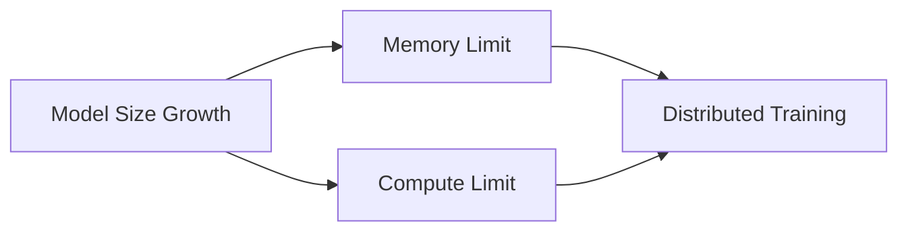

# Chapter 1: Why Distributed Training Exists

## WHY
The insatiable appetite of deep learning models for compute and memory has vastly outpaced the growth of single GPU capabilities.

## WHAT
We explore the physical and software limits of single accelerators and how distributed training bridges this gap.

## HOW
By understanding the memory footprint (parameters, gradients, optimizer states, activations), we can mathematically prove why distribution is mandatory.

## WHEN
Transition to distributed training when:
1. Model size > VRAM
2. Target time-to-train > acceptable business threshold

## TRADEOFFS
| Setup | Cost | Complexity | Speed |
|---|---|---|---|
| Single GPU | Low | Low | Baseline |
| Multi-GPU (1 Node) | Medium | Medium | High |
| Multi-Node | High | High | Very High |

## PRODUCTION
Monitoring GPU utilization, memory usage, and interconnect bandwidth using `nvidia-smi` and `dcgm-exporter`.

## TROUBLESHOOTING
**Failure Scenario 1: Straggler Node**
- **Log:** Step time sporadically spikes.
- **Fix:** Profile with Nsight Systems to identify CPU bottlenecks or thermal throttling.
  ```bash
  nsys profile -t cuda,nvtx,cudnn,cublas -s none -o my_profile python train.py
  nvidia-smi -q -d THERMAL
  ```

**Failure Scenario 2: InfiniBand Flapping**
- **Log:** `IBV_WC_RETRY_EXC_ERR`
- **Fix:** Restart subnet manager or check cable physical integrity.
  ```bash
  ibstat
  ibv_devinfo
  sudo /etc/init.d/opensmd restart
  ```

## Senior Interview Questions
**Q:** Explain the memory breakdown of a training step for an Adam optimizer.
**A:** Model parameters (FP16/FP32), Gradients (FP16/FP32), Optimizer States (FP32 momentum and variance), and Activations.


